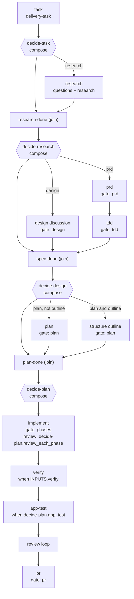
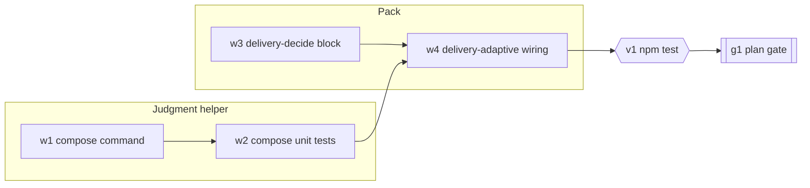

### Summary of change request

Replace the one-time pack choice at the start of a delivery run with a JEV judgment re-asked at every phase boundary, and give the engineer a drawn DAG of the chain that judgment composed and of the engineering work it plans.

### Current State

- A delivery run's shape is fixed before any work exists. The user's request text alone picks one of six packs, and that pack's phase list runs to the end whatever the research or design later shows.
- A run that turns out simpler than it looked still pays for every phase in the chosen pack; a run that turns out harder has no way to add the phase it needs. The only recovery is cancelling and starting a second run with a different pack.
- The human gates are the one thing that adapts, and only to the request's own wording: `autonomy` reads how much involvement the request asks for, and the gate set is then fixed for the run.
- Nobody reading a design discussion or a TDD can see what happens after it. The phases ahead, which of them pause for a human, and what runs unattended are known to the pack and stated nowhere the engineer reads. A TDD states the target design and leaves the order of the work, what can run beside what, and what proves each piece done to the plan phase alone.
- A judgment can currently override the deterministic rule in either direction. Run `bac80b17` is the cost: every plan phase was finished and `plan-remaining` still answered `remaining` at 0.92, so the loop ran sixteen no-op sessions and failed.

### Desired End State

- Each phase boundary re-decides what comes next from what the task directory now holds, not from the request text alone. A request that reads small but researches into a cross-cutting change gains a design discussion; a request that reads large but resolves in the first artifact drops the phases it no longer needs.
- A phase is dropped only when the judgment is confident it is unnecessary. An unclear answer runs the phase, because a wrong skip yields a bad plan and a wrong run costs one session.
- Every JEV decision in the delivery packs has a deterministic floor and exactly one direction it may move from it. No judgment prolongs a loop past its deterministic exit.
- The engineer opening the design discussion or the TDD sees the whole chain: which phases run, which were dropped and why, which pause for approval, what runs unattended, and what verification and review follow. The TDD also states the work items, their dependencies, the critical path, and the proof each item is done.
- The judgment is optional. With no key, no `node`, or any failure, the run proceeds on the canonical full chain and says so.

### What we're not doing

- Not reordering phases. Canonical order (research, design or prd+tdd, plan or outline, implement, verify, app-test, review, pr) is a dependency order, and Archon cannot reorder a static DAG or nest loops. The judgment decides inclusion only.
- Not folding `bugfix` or `epic` into the adaptive pack. Both stay separate packs with their own chains.
- Not changing what a gate is or how gates are chosen. `autonomy` still picks the gate set, and `--input gates=` still overrides it.
- Not changing the phase skills themselves beyond the template sections this task adds and the one `create-plan` step that reads the new tdd section. `create-research`, `implement-plan` and the rest are untouched.
- Not making `verify` or the final `review` optional. `verify` keeps its existing `$INPUTS.verify` switch and the final review stays unconditional.
- Not retrofitting the execution-plan artifact into `delivery-full`, `delivery-lean`, `delivery-prd`, or `delivery-oneshot`. Those packs keep their fixed chains; `delivery-start` stops routing to them for `auto` runs but `--input workflow=full` still names one.
- Not re-auditing the other twelve judgments in the table beyond giving each one a stated direction. Only `plan-remaining` changes behavior, and PR #21 already makes that change.

### Proposed End State Architecture

Four pieces: one rule that bounds every judgment, a new `compose` command in the judgment helper, a new pack whose optional nodes read it, and two new required template sections with the artifact one of them embeds.

#### Every JEV decision has a deterministic floor and one direction it may move

The rule, stated once and applied to every row of the judgments table:

1. Each decision has a deterministic rule that decides alone when the helper is unavailable. That rule is the floor.
2. The judgment may move the decision in one direction from that floor, never both. The permitted direction is the one whose wrong answer costs a session; the forbidden direction is the one whose wrong answer ships a defect or burns a loop.
3. No judgment may prolong a loop past its deterministic exit.

`compose` under the rule: the floor is the canonical full chain, every optional phase runs. The judgment may only remove a phase, and only at `p <= T.no`. Unclear runs the phase, unavailable runs the whole chain. There is no probability at which `compose` adds a phase the canonical chain does not have, so a wrong judgment costs one extra session and never an incomplete chain.

The rule's reason is run `bac80b17`. It finished all five plan phases, ticked every box, and wrote five receipts; `judge.mjs plan-remaining` then answered `remaining` at 0.92 on the finished plan, `until_bash` kept the unattended loop going for sixteen no-op implementer sessions, and the run failed before verification and review. The deterministic box rule had said done from the first check. PR #21 makes the box count the floor for that decision: every phase box ticked exits the loop without asking the helper, and with boxes open only the helper's `done` ends it early.

Recorded in two places. `workflows/delivery.md`, "Typed judgments", gains the three-point rule above the table and a `Direction` column beside the existing `Fallback` column, one entry per row naming the one move that judgment may make (`plan-remaining`: may only end the loop early; `review-status`, `verification-status`, `reproduction-status`: may only move a claim toward the worse status, which is already how they are documented; `compose`: may only remove a phase). And the execution-plan artifact records every probability, the threshold each was compared against, and the resulting verdict, so a wrong decision is auditable after the run rather than reconstructed from the run log.

#### `judge.mjs compose` answers one yes/no plus one reason per optional phase

State is `task.md`'s text plus the frontmatter `summary` of every artifact already in the directory, so the same command answers differently at each boundary as artifacts accumulate. Questions follow the existing `noul`/`choice` builders and go out in one `systemOne` call.

```js
// One noul per optional phase, phrased "necessary", so a skip needs a confidently low probability.
const PHASES = {
  research: "The task needs the repository researched before a design or a plan can be written: the current behavior, the affected files, or the local conventions are not yet established.",
  design: "The task needs a design discussion: several approaches compete, the shape is unsettled, or a decision must be recorded before planning.",
  prd: "The task needs a product requirements document: what it should do, for whom, and how it behaves are open.",
  tdd: "The task needs a technical design document: types, interfaces, error handling, or configuration must be fixed before planning.",
  plan: "The task needs a written plan or structure outline before implementation.",
  outline: "A structure outline fits this task better than a plan: the shape is known and only the file-by-file ordering is missing.",
  review_each_phase: "The implementation needs reviewing after every phase, not only at the end: the change is risky, cross-cutting, or touches a trust boundary.",
  app_test: "The change needs driving through the running application by hand to be believed.",
};
// Each noul is paired with a choice that supplies the artifact's one-line reason, the shape `sizeChildren`
// already uses for "verdict plus why" (judge.mjs:355-383). One call, 17 questions at the widest boundary.
const REASONS = {
  stated: "The `task` already states what this phase would establish",
  covered: "An artifact already in `artifacts` establishes it",
  small: "The change is too small and too bounded for this phase to change the outcome",
  open: "What this phase establishes is still open",
};
const questions = {};
for (const [phase, instructions] of Object.entries(PHASES)) {
  questions[phase] = noul(instructions);
  questions[`why_${phase}`] = choice(`Why is the \`${phase}\` phase unnecessary or necessary for this task`, REASONS);
}
questions.autonomy = choice("How much human involvement does the `task` ask for", AUTONOMY);

const answers = await systemOne({ task, artifacts }, questions);  // artifacts: [{file, type, summary}]
```

Each phase's verdict is `run` unless `p <= T.no` (0.2, the file's existing "confidently no" bar, shared with `coverage`, `cite`, and `gradeSteps`). The autonomy answer keeps the existing `autonomy` command's thresholds and fallback word. `--json` returns per-phase probability, threshold, verdict, and reason; plain text returns one TSV line per phase (`phase\trun-or-skip\tprobability`), matching `route-question` and `neutral`. The reason for a phase that runs is computed and discarded, which is what buys the single round trip.

Measured, not illustrative. Both states below were sent to `jev-1.13.0` in this session with an empty `artifacts` list, through `judge.mjs ask` with the question set above:

| Phase | One-line copy change | This task's own request | Verdict at `T.no` |
|---|---|---|---|
| research | 0.43 | 0.83 | both run |
| design | 0.05 | 0.50 | skip / run |
| prd | 0.05 | 0.37 | skip / run |
| tdd | 0.06 | 0.54 | skip / run |
| plan | 0.13 | 0.69 | skip / run |
| outline | 0.51 | 0.50 | moot / run |
| review_each_phase | 0.10 | 0.83 | skip / run |
| app_test | 0.12 | 0.56 | skip / run |

Two consequences the plan phase inherits. Research at 0.43 on a one-line copy change means acceptance criterion (d) holds for design, prd, tdd, and plan but not for research at the first boundary; the second boundary is where a finished research artifact makes the rest collapse. And `design` and `prd` are not mutually exclusive under a per-phase floor, so a request where neither is confidently unnecessary runs the design discussion and the prd and the tdd. The floor rule makes that the intended direction, a longer chain rather than a stall, and the `spec-done` join already tolerates all four combinations.

#### `delivery-adaptive` re-asks at four boundaries and gates each optional phase on the nearest preceding answer



| Boundary | Node | Decides (read by `when:`) |
|---|---|---|
| after task | `decide-task` | `research` |
| after research | `decide-research` | `design`, `prd`, `tdd` |
| after design or prd+tdd | `decide-design` | `plan`, `outline` |
| before implementation | `decide-plan` | `app_test`, `review_each_phase` (an include input, not a `when:`) |

`decide-design` answers two questions, so all three planning states are reachable: `plan && !outline` runs the plan node, `plan && outline` runs the outline node, `!plan` runs neither and `implement` reads `task.md`. Without the `plan` question, `delivery-adaptive` could not cover the `oneshot` shape `delivery-start` is about to route into it, and the measured 0.13 above is that case.

Every join after an optional node carries `trigger_rule: none_failed_min_one_success` and depends on both the preceding decide node and the optional node, so it fires whichever way the branch went. This is the shape `delivery-full` already uses for `verify-done` and `app-test-done` (`delivery-full.yaml:171-179,193-201`). `plan-done` depends on `decide-design`, `plan`, and `outline`; `spec-done` on `decide-research`, `design`, and `tdd`.

The four decide nodes are one composable block, `.archon/workflows/delivery/decide/delivery-decide.yaml`, included four times with a `boundary:` input and a `tiers:` input. One bash node calls `compose`, falls back, emits the flat JSON, renders the Mermaid flowchart and the table, and writes the execution-plan artifact; `returns:` on that node is what makes `$decide-task.output.research` resolve the way `$task.output.task_dir` does. `build-packs.mjs` discovers the new directory by walk with no code change (`scripts/build-packs.mjs:37-43`). The model tier per phase comes in through `tiers:` from `delivery-adaptive.yaml`, the file where the `model:` words are declared, so the artifact's tier column cannot drift from what actually runs:

```yaml
  - id: decide-task
    include: delivery-decide
    inputs:
      boundary: task
      tiers: "research=medium,design=large,prd=medium,tdd=large,plan=large,outline=large,implement=large,app_test=large"
```

When the helper is unavailable the node prints the canonical full chain and nothing fails:

```json
{"research":"true","design":"true","prd":"false","tdd":"false","plan":"true","outline":"false","app_test":"false","review_each_phase":"false","autonomy":"all","available":"false"}
```

`delivery-start` changes in two places: `resolve` maps a judged pack of `oneshot`, `lean`, `full`, or `prd` to the single `adaptive` child node, and its autonomy-to-gate table gains an `adaptive` row over the union gate set `design prd tdd plan phases pr`. `task.md` frontmatter still records the judged pack (`workflow: oneshot` and the rest), so `CONVENTIONS.md`'s `workflow` value set is unchanged and the existing `routed_by`/`route_confidence` keys still mean what they meant. The routed pack reaches `compose` only as that frontmatter line inside `task.md`'s text, with no extra weight, so a low-confidence opening route cannot make itself sticky.

#### `### Execution DAG` is the chain as composed; the execution-plan artifact is its source

One artifact per task, `NN-execution-plan-<slug>.md`, type `execution-plan`. The first decide node allocates `NN` and writes it; each later decide node rewrites the same file, per the conventions' iteration rule. It holds the Mermaid flowchart of the chain as composed, with skipped phases dimmed, and a table under it recording every probability and the threshold it was compared against:

| Phase | Runs | Gate | p | Bar | Why | Model tier |
|---|---|---|---|---|---|---|
| research | yes | - | 0.43 | <= 0.20 | what this phase establishes is still open | medium |
| design discussion | no | design | 0.05 | <= 0.20 | the task already states what this phase would establish | large |
| prd | no | prd | 0.05 | <= 0.20 | the change is too small and too bounded for this phase to change the outcome | medium |
| plan | no | plan | 0.13 | <= 0.20 | the task already states what this phase would establish | large |

`create-tdd` and `create-design-discussion` gain a required `### Execution DAG` section, placed as the last content section before `## Human Review` in all four template files. The section embeds the newest execution-plan artifact's flowchart and states the phases ahead, which are gated, what runs unattended, and what verification and review follow. When no execution-plan artifact exists, which is every by-hand run and every `--input workflow=full` run, the section describes the fixed chain of `task.md`'s `workflow` value from the documented phases and gate set in `workflows/delivery.md`, with no flowchart and no probabilities; the section always answers "how will this be executed" and never reads as an empty box.

#### `### Engineering Work Breakdown` is the work as planned, and `create-plan` reads it

A second required section, in the `create-tdd` and `iterate-tdd` templates only. It is separate from `### Execution DAG` because it models engineering work rather than orchestration: the DAG section says which delivery phases run, this section says what gets built, in what order, beside what, and what proves it done. It holds:

- A Mermaid flowchart whose nodes are stable work items with stable ids, edges are dependencies, independent tracks are side-by-side `subgraph`s, and verification points and human gates are nodes of their own.
- One explicit `Critical path:` line naming the item ids in order.
- A table with exactly these headers, one row per node, whose proof names an observable command, request, state, or review decision, never "code written":

The section body, as the template ships it:

````markdown


Critical path: w1 -> w2 -> w4 -> v1 -> g1

| Item | Depends on | Can run in parallel with | Proof it is done |
|---|---|---|---|
| w1 compose command | - | w3 | `node judge.mjs compose --json .agents/tasks/<slug>` prints eight phases with probabilities |
| w2 compose unit tests | w1 | w3 | `npm test` passes the new `compose` cases with the stub and with no key |
| w3 delivery-decide block | - | w1 | the extracted bash body runs under real bash and prints the fallback JSON |
| w4 delivery-adaptive wiring | w2, w3 | - | `node scripts/build-packs.mjs --check` is clean and the four fixtures reach their expected node lists |
| v1 npm test | w4 | - | the full suite passes on the branch |
| g1 plan gate | v1 | - | the reviewer approves the plan gate |
````

`create-plan`, when its primary input is a TDD, maps every `## Phase N` to one or more work-item ids from that table and states in `## Execution Strategy` why any dependency was reordered. The mapping line sits under each phase heading (`**Work items**: w1, w2`); a plan that reorders or merges items relative to the breakdown says which edge it crossed and why, so a reader comparing the two documents sees the deviation rather than inferring it.

`scripts/validate.mjs` gains one list and one loop. The existing `HUMAN_REVIEW_TEMPLATES` loop cannot carry these checks, because its four headings are shared verbatim by all 20 entries while these two sections belong to a two-file and a four-file subset:

```js
const WORK_BREAKDOWN_TEMPLATES = [
  "create-tdd/references/tdd_template.md",
  "iterate-tdd/references/tdd_template.md",
];

for (const file of WORK_BREAKDOWN_TEMPLATES) {
  const content = read(skillFile(file));
  const parts = content.split("\n### Engineering Work Breakdown\n");
  if (parts.length - 1 !== 1) { fail(rel(skillFile(file)), 0, `must contain exactly one "### Engineering Work Breakdown" heading (found ${parts.length - 1})`); continue; }
  const section = parts[1].split("\n#")[0];
  if (!section.includes("```mermaid")) fail(rel(skillFile(file)), 0, "Engineering Work Breakdown must draw the work items as a Mermaid flowchart");
  if (!/^Critical path:/m.test(section)) fail(rel(skillFile(file)), 0, "Engineering Work Breakdown must state one `Critical path:` line");
  if (!section.includes("| Item | Depends on | Can run in parallel with | Proof it is done |")) fail(rel(skillFile(file)), 0, "Engineering Work Breakdown must carry the four-column work-item table");
}
```

A parallel list checks `### Execution DAG` across the four `create-`/`iterate-` design-discussion and tdd templates with the same exactly-once split count the human-review loop already uses. The answer templates for the affected skills gain one `Check:` bullet each naming the new section.

### Design Questions

None. The seven questions this artifact opened are decided below.

### Resolved Design Questions

#### Each phase's reason comes from a `choice` paired with its `noul` in the same call

Option A. A `noul` answer carries only a probability (`{type:"noul", noul: p}`, `tests/lib/typesafe-stub.mjs:6`), so the artifact's reason has to come from somewhere; pairing each phase with a `choice` over a fixed reason set keeps one round trip per boundary and grounds the reason in the actual request and artifacts. `sizeChildren` already pairs four `noul` answers with a `split_${i}` `choice` in one call (`judge.mjs:355-383`), and every command in the file makes exactly one call.

Rejected: canned text per phase and direction, which says nothing the phase name does not already say; and a second call asking reasons only for skipped phases, which adds a round trip and a second failure point on the unavailable path. The waste in Option A is the discarded reason for a phase that runs, measured at 136 output tokens for the whole set.

#### The skip bar is `T.no` at 0.2

Option A. Skip when `p <= T.no`, run otherwise. The asymmetry the task states, a wrong skip costs a bad plan and a wrong run costs a session, is what `T.no` already encodes against `T.yes`, and a per-command literal is the exception in this file rather than the rule (`route-question`'s `0.5` and `neutral`'s `0.6`/`0.4` band are the only two). It is also the only bar consistent with the floor rule above: a strict bar keeps the judgment's one permitted direction expensive to exercise.

Rejected: a looser named `T.skip` at 0.3, which drops more phases and gives more runs a phase they needed; and per-phase bars, which multiply the tuning surface before any run has produced evidence to tune against.

The measured probabilities above are the cost: at 0.2, a one-line copy change still researches (0.43). The plan phase's acceptance check names that number rather than assuming the chain collapses at the first boundary; if it should collapse there, the lever is the `research` question's wording, not the bar.

#### The decide logic and the artifact writer live in one composable block

Option A: `.archon/workflows/delivery/decide/delivery-decide.yaml` with `returns:` on its bash node, included four times. One copy of roughly 60 lines, one standalone bash test, and `$decide-task.output.research` reads the way `$task.output.task_dir` does. It matches how `delivery-task`, `delivery-research`, `delivery-gate-phase`, and `delivery-implement` are already factored, and `tests/packs.test.mjs`'s `runTaskNode`/`runGateCheck` harness tests exactly one bash body per block (`tests/packs.test.mjs:160-169,373-379`).

Rejected: inlining the bash four times in `delivery-adaptive.yaml`, which leaves four copies to keep in step and four regex targets for the harness. A separate rendering script beside `judge.mjs` stays the fallback if the rendering bash outgrows one readable block scalar; it costs a second installed script and a second unavailable path.

#### `plan` itself is skippable, as an eighth question

Option B. `decide-design` asks a `plan` `noul` alongside `outline` and gates both planning nodes on it, so plan, outline, and neither are all reachable. It is one more question inside a call the design already makes, the same skip bar protects it, and it is the only thing that lets `delivery-adaptive` cover the `oneshot` shape `delivery-start` will route into it: `delivery-oneshot` has no plan node at all and implements straight from `task.md` (`delivery-oneshot.yaml:77`). The measured 0.13 for a one-line copy change is that path working.

Rejected: keeping the specified list, which gives a one-line copy change a planning session and reads against acceptance criterion (d); and pushing the branch into `implement-plan` so it reads `task.md` when no plan artifact exists, which changes a skill this task is not touching.

#### `### Execution DAG` describes the fixed chain when no execution-plan artifact exists

Option A. The phases, gates, and verification of a fixed pack are documented facts in `workflows/delivery.md`, and `task.md` records which pack the run is on, so the section can always answer its question from what exists. The section's purpose is what happens next, not what JEV decided.

Rejected: `None.`, which is honest and tells the reader nothing at the moment the reader most needs the chain; and having the skill render the canonical chain itself as a flowchart, which encodes the canonical chain in a second place that can drift from the packs.

#### The model-tier column is passed into the decide block from the pack

Option B. `delivery-adaptive.yaml` declares each phase's `model:` on its prompt nodes, so passing the same words in as a `tiers:` input keeps one source per pack. A static table inside the decide block's bash would mirror YAML it cannot read and drift silently; dropping the column and printing `judge.mjs tier`'s single answer for the task loses the per-phase detail the task asks for. The cost is a longer input list on the block, paid once per include.

#### `compose` gets no explicit prior from the up-front route

Option A. `compose`'s state is `task.md` plus artifact summaries, which is what the task's own definition of the state says; the routed pack reaches the model only as the `workflow:` frontmatter line inside that text. Passing the route and its confidence as an explicit field would make a low-confidence route sticky, which is the behavior this task exists to remove. Stripping the `workflow:` line before sending hides a fact the model would reasonably use and buys nothing the first option does not already have.

#### Phase order stays canonical and the judgment decides inclusion only

Fixed by the request. Order is a dependency order (a plan reads the design; a design reads the research), and Archon cannot reorder a static DAG or nest loops inside a doubly-nested include (`delivery-full.yaml:40-45`, `delivery-start.yaml:41-48`).

#### `bugfix` and `epic` stay separate packs

Fixed by the request. Both chains differ in kind rather than in which optional phases they include: `delivery-bugfix` reproduces before it fixes, and `delivery-epic` fans out into child tasks with their own runs.

#### Gates keep their current mechanism

Fixed by the request. `autonomy` still chooses the gate set, `delivery-start`'s `resolve` still validates it against a fixed name list, and `--input gates=` still overrides it. A gate on a phase the judgment skipped is inert, which needs no handling.

#### An unavailable helper runs the canonical full chain

Fixed by the request and by the conventions' typed-judgment rule: on no key, no `node`, or any nonzero exit the caller applies its own rule and never fails the step (`CONVENTIONS.md:112`). Failing the run, or falling back to the shortest chain, were both rejected; the longer chain is the safe direction, matching `route-workflow`'s own fallback to `full`.

### Patterns to follow

#### A judgment command builds questions, makes one call, thresholds, and names its own fallback

`compose` follows the same skeleton as every other command in the file - `skills/delivery/typed-judgment/judge.mjs:302-317` (`routeWorkflow`), `:467-481` (`autonomy`), `:338-390` (`sizeChildren`, the multi-question precedent).

```js
const answers = await systemOne({ request }, { workflow: choice("Which delivery workflow fits the `request`", WORKFLOWS) });
const a = answers.workflow;
const workflow = a.confidence >= T.confident ? a.choice : "full";
return { text: workflow, json: { workflow, suggested: a.choice, confidence: a.confidence, probabilities: a.probabilities } };
```

The header comment block at `judge.mjs:9-27` lists one usage line per command; `compose` adds one there too.

#### A decide bash node emits flat `"true"`/`"false"` strings with a declared `output_format`

`delivery-full`'s `gates` node is the shape to copy, including the string-not-boolean values that `when:` compares against - `.archon/workflows/delivery/full/delivery-full.yaml:54-85`.

```yaml
    output_format:
      type: object
      properties:
        design: { type: string }
      required: [design]
```

#### An optional phase carries `when:` and its join tolerates the skip

`.archon/workflows/delivery/full/delivery-full.yaml:163-179`.

```yaml
  - id: verify
    include: delivery-verify
    depends_on: [implement-done]
    when: "$INPUTS.verify != 'false'"

  - id: verify-done
    depends_on: [implement-done, verify]
    trigger_rule: none_failed_min_one_success
```

#### A composable block declares the node whose output the caller reads

`.archon/workflows/delivery/research/delivery-research.yaml:14` (`returns: research`), `.archon/workflows/delivery/verify/delivery-verify.yaml:18`. Without it, `$decide-task.output.research` has nothing to resolve.

#### A bash node is tested by extracting its body from the YAML and running it under real bash

`tests/packs.test.mjs:160-169` and `:373-379`; the with-stub and no-key pair at `:381-402` is the closest existing test for a node that calls `judge.mjs` and branches on the answer.

```js
const body = /bash: \|\n((?: {6}.*\n|\n)+?) {4}output_format:/.exec(yaml)[1].replace(/^ {6}/gm, "");
```

The no-key case needs no special setup: `judge.mjs` exits 3 with empty stdout, so the body's own `|| fallback` fires (`docs/testing.md:83`).

#### A pack's fixtures stub every reached node and assert the reached list

`.archon/workflows/delivery/full/fixtures/gated.stubs.yaml`; format contract at `docs/testing.md:29-77`. The four fixtures this task names map onto `fixture.reached` differences, with `exec-code: false` and `inputs:` where a fixture needs one.

#### The validator's template checks are one loop over a fixed list

`scripts/validate.mjs:405-417`, over `HUMAN_REVIEW_TEMPLATES` at `:151-172`. The two new lists follow it; the work-breakdown loop adds a section slice (`split("\n### <heading>\n")[1].split("\n#")[0]`) because its three inner checks apply to the section body rather than to the whole file.

```js
const count = content.split(`\n${heading}\n`).length - 1;
if (count !== 1) fail(rel(skillFile(file)), 0, `must contain exactly one "${heading}" heading (found ${count})`);
```

#### A new pack directory needs one generator run before `npm test` passes

`scripts/build-packs.mjs:37-43` discovers packs by directory walk with no manifest, so `adaptive/` and `decide/` are picked up with no code change, but their `-omp` counterparts do not exist on disk yet and read as stale. `node scripts/build-packs.mjs` (no `--check`) writes them; `npm test` runs the `--check` mode and fails until then (`package.json:20`).

## Human Review

### Review targets

- The floor-and-direction rule and the `Direction` column it adds to `workflows/delivery.md`'s judgments table. The rule is stated for all thirteen judgments while only `plan-remaining` changes behavior, in PR #21.
- The measured probabilities. Research at 0.43 on a one-line copy change means the chain does not collapse at the first boundary, and `design` 0.50 with `prd` 0.37 on this task's own request means a full-shaped run takes the design discussion and the prd and the tdd. Both are the floor rule working as designed; whether either should be tuned by rewording the question is a plan-phase decision.
- The `### Engineering Work Breakdown` contract: stable ids, subgraphs for independent tracks, verification and gate nodes, one `Critical path:` line, and a proof column that names an observable rather than a completed edit.
- The `create-plan` mapping. A plan whose primary input is a TDD now carries a `**Work items**:` line per phase and justifies reordering in `## Execution Strategy`; nothing enforces that beyond the skill's own step.
- The union gate set `design prd tdd plan phases pr` for `delivery-adaptive`, and that `task.md` keeps recording the judged pack (`oneshot`, `lean`, `full`, `prd`) rather than `adaptive`.

### Verify

- [ ] Run the recorded probe again at the second boundary, with a research artifact's summary in `artifacts`, and confirm the remaining phases collapse for a oneshot-shaped request (acceptance criterion (d)).
- [ ] Confirm the `Direction` entry for each of the thirteen judgment rows, and that no other row needs a behavior change beyond PR #21's.
- [ ] Confirm the `### Engineering Work Breakdown` header row is byte-exact in both tdd templates, since the validator compares the literal string.
- [ ] Confirm `$decide-task.output.<field>` resolves for an `include` whose `returns:` node declares an `output_format` object, before the decide block is built as one include.

### Known limits

- The key is available at `~/.config/typesafe/api_key`, and the probes in this session were run by exporting it. The key-file read is not in this branch: both this worktree's `judge.mjs` and the installed copy at `~/.agents/skills/typed-judgment/judge.mjs` read `TYPESAFE_API_KEY` alone (`judge.mjs:81-82`), and the `apiKey()` fallback lives on PR #19's branch `herdr-plugin-delivery-flow`, open as of this writing. If #19 has not merged by the plan phase, this branch adds the key-file read itself; otherwise merge `origin/main` first and inherit it.
- The probes used `judge.mjs ask` with a hand-written question file against `jev-1.13.0`, two states with an empty `artifacts` list. No probe has been run at a later boundary, so the per-boundary collapse is measured only at the first.
- The task's acceptance criteria require a live probe on a scratch repository, whose runs and detached children must be abandoned before the phase ends. No such run was started in this phase.
- Whether Archon resolves `$decide-task.output.<field>` for an `include` whose `returns:` node declares an `output_format` object was read from the `$task.output.task_dir` and `$gates.output.design` precedents, not exercised. If it does not, the decide logic inlines into `delivery-adaptive.yaml` with no change to the rest of the design.
- The effect of a fixture's `fail-node` field is documented in `docs/testing.md:47` and demonstrated by no fixture in the tree, so the helper-unavailable fixture's exact shape is not yet settled.
- This artifact has no `### Execution DAG` section: the section is added to the template by this task and did not exist at the commit this artifact was written against.
