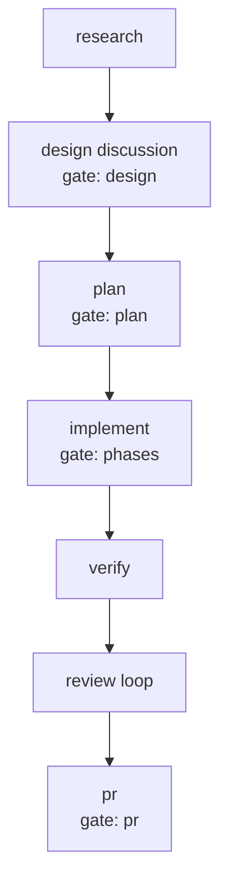

# Compose the delivery chain with JEV Implementation Plan

## Overview

Replace the one-time pack choice at the start of a delivery run with a judgment re-asked at four phase boundaries, and draw the chain that judgment composed into an artifact the design discussion and the TDD embed. Two deliverables, six phases: the judgment command and the sample set its questions are measured against, the decide block, the pack and its routing, the template sections and their validator, the documentation, and the acceptance probes.

## Current State Analysis

### Key Discoveries:

- `judge.mjs` has nineteen commands sharing one skeleton: build questions, one `systemOne` call, threshold, return `{text, json}` (`skills/delivery/typed-judgment/judge.mjs:302-317`, `:467-481`). `sizeChildren` is the multi-question precedent, pairing four `noul` answers with a `split_${i}` `choice` in one call (`:338-390`). Thresholds live in one object, `T = { yes: 0.8, no: 0.2, safe: 0.5, confident: 0.8, decisive: 0.9, triage: 0.7 }` (`:41`).
- The helper is optional by contract: no key, no `node`, or any nonzero exit means the caller applies its own rule and never fails the step (`shared/CONVENTIONS.md:112`). `judge.mjs` exits 3 with empty stdout when `TYPESAFE_API_KEY` is unset (`:81-82`, `:632-636`).
- `delivery-full` is a linear chain of includes separated by plain `bash:` commit joins; two optional phases (`verify`, `app-test`) carry `when:` and their joins carry `trigger_rule: none_failed_min_one_success` (`.archon/workflows/delivery/full/delivery-full.yaml:163-201`). The `gates` node turns one `INPUTS_GATES` string into flat `"true"`/`"false"` strings that `when:` and `with:` read (`:54-85`).
- Archon note 1 (`workflows/delivery.md:276`): a `loop_group` that is the entry node of an include whose `depends_on` names another include never runs its body. `delivery-gate-phase` `cycle` and `delivery-implement` `phases` are exactly that, so a plain `bash:` node must sit between any decide include and any gate-phase include that follows it.
- A composable block declares `returns:` on the node whose output the caller reads (`.archon/workflows/delivery/research/delivery-research.yaml:14`); that is what makes `$decide-task.output.research` resolve the way `$task.output.task_dir` does.
- `scripts/validate.mjs` check 11 enforces per-pack rules that `delivery-adaptive` and `delivery-decide` must satisfy: `name: delivery-<directory>`, exactly one YAML per workflow directory, at least one `fixtures/*.stubs.yaml`, the `gates` input with `default: all` plus a `gates` node for any pack including `delivery-gate-phase` or `delivery-implement`, `trigger_rule: none_failed_min_one_success` on every unconditional join that depends on a gated or `when:`-guarded node, and every `$id.output` naming a node the file declares (`scripts/validate.mjs:540-563`).
- The twin rule in the same check only fires on `when:` expressions whose reference contains the literal `gate` (`scripts/validate.mjs:558-563`), so `when: "$decide-task.output.research == 'true'"` needs no twin.
- `scripts/build-packs.mjs` discovers packs by directory walk with no manifest (`scripts/build-packs.mjs:37-43`), and `scripts/install.mjs` copies the workflow tree wholesale; neither needs a code change for a new pack, but `node scripts/build-packs.mjs` must be run so the `-omp` flavor is not stale (`package.json:20`).
- `scripts/validate.mjs:406-417` checks four headings across twenty templates in one loop; that loop cannot carry the new sections, which belong to a four-file and a two-file subset.
- A bash node's body is tested by extracting it from the YAML with a regex and running it under real bash (`tests/packs.test.mjs:160-169`, `:373-379`); the with-stub and no-key pair at `:381-402` is the closest existing model.
- `delivery-start` `route` validates the judged gates against the judged pack's gate names, and `lean` with autonomy `plan` produces `gates=outline` (`.archon/workflows/delivery/start/delivery-start.yaml:103-111`). `delivery-adaptive` has no `outline` gate; its outline node is gated by `plan`.
- PR #19 (`herdr-plugin-delivery-flow`) and PR #21 (`plan-remaining-floor`) are both open as of this writing; neither is on `origin/main`. `judge.mjs` on this branch reads `TYPESAFE_API_KEY` alone and has no `~/.config/typesafe/api_key` fallback.
- There are 49 native fixtures in `.archon/workflows/delivery/**/fixtures/`; `docs/testing.md:57,59` says 29 and is already stale.

## Desired End State

- `node judge.mjs compose --json <task dir|text|@file|->` prints, for each of the eight optional phases, a probability, the bar it was compared against, a `run`/`skip` verdict, and a one-line reason, plus the autonomy level; it exits 3 printing nothing when the helper is unavailable.
- `tests/fixtures/compose-samples.json` holds the eight requests the phase questions are measured against, and `node evals/compose-probe.mjs` prints what a live model scored each one, so a later wording change is checked rather than argued.
- `delivery-adaptive` runs `compose` at four boundaries; each optional phase node carries `when:` on the nearest preceding decide node's field, every join after one tolerates the skip, and the canonical order is unchanged.
- Each decide node writes or rewrites one `NN-execution-plan-<slug>.md` in the task directory holding a Mermaid flowchart with skipped phases dimmed and a table of every probability, bar, reason, and model tier.
- `create-tdd` and `create-design-discussion` (and their iterate twins) require a `### Execution DAG` section; the two tdd templates also require `### Engineering Work Breakdown`; `scripts/validate.mjs` fails a template missing either.
- `npm test`, `node scripts/build-packs.mjs --check`, and `archon workflow test delivery-adaptive` pass.

## What We're NOT Doing

- Not reordering phases; the judgment decides inclusion only.
- Not folding `bugfix` or `epic` into the adaptive pack, and not retrofitting the execution-plan artifact into the four fixed packs.
- Not changing what a gate is or how gates are chosen.
- Not changing `create-research`, `implement-plan`, or any other phase skill beyond the template sections this task adds and the one `create-plan` step that reads the new tdd section.
- Not making `verify` or the final `review` optional.
- Not adding the `~/.config/typesafe/api_key` read; see the decision below.
- Not re-auditing the thirteen judgments beyond giving each a `Direction` entry.

## Execution Strategy

Phases 1 through 3 are a dependency chain (command, block, pack). Phases 4 and 5 depend on nothing in 1 through 3 and can be implemented in any order relative to them. Phase 6 is last because it exercises the finished pack.

The primary input is a design discussion, not a TDD, so this plan carries no `**Work items**:` lines; the `### Engineering Work Breakdown` contract this task adds applies to plans written from a TDD.

Three plan-level decisions extend or deviate from the design. Each is listed under Human Review so the reviewer can overrule it.

**1. The decide block collapses paired judgments into single-valued `when:` fields.** The design has `plan` and `outline` as two `noul` answers and `app_test` as a boolean beside the pack's `app_test` surface input. Both would need a `when:` conjunction (`plan && !outline`, `$INPUTS.app_test != 'none' && app_test == 'true'`), and no pack in the tree uses one; Archon's support for `&&` in a `when:` expression is unverified. The decide node therefore computes three derived fields from the raw judgments and the pack's inputs, and every `when:` stays a single equality:

- `planning`: `none` when `plan <= T.no`; `outline` when the plan runs and `outline > T.no`; otherwise `plan`.
- `implement_skill`: `implement-outline` when `planning == outline`, else `implement-plan` (a `with:` value, not a `when:`).
- `app_test`: the pack's `app_test` surface when it is not `none` and the `app_test` judgment is not a confident no; otherwise `none`. The judgment can only turn a named surface off, never name one, which keeps it inside the floor rule.

The raw probabilities for `plan`, `outline`, and `app_test` still reach the artifact table.

**2. `delivery-start` gains a `pack` field distinct from `workflow`.** `resolve` must keep emitting the judged pack for `task.md` (`workflow: oneshot` and the rest, per the design and `shared/CONVENTIONS.md:13`) while routing the child run to `delivery-adaptive`. One field cannot do both, so `resolve` emits `workflow` (judged, written to `task.md`, used to pick the gate-name set) and `pack` (the workflow node to run). `pack` is `adaptive` only when the route was judged and landed on `oneshot`, `lean`, `full`, or `prd`; an explicit `--input workflow=` and a reject text naming a pack both set `pack` to that pack. The `outline` gate name, which `route` produces for a judged `lean` at autonomy `plan`, is rewritten to `plan` when `pack` is `adaptive`, because that is the gate the adaptive outline node carries.

**3. The `~/.config/typesafe/api_key` read is left to PR #19.** The design's known limit offers to add it here if #19 has not merged. It has not, but adding the same change on this branch guarantees a conflict with an open pull request, and acceptance criterion (d) needs only that the key be present in the environment, which `TYPESAFE_API_KEY=$(cat ~/.config/typesafe/api_key)` supplies for the probe. Phase 6 names that command.

---

## Phase 1: `judge.mjs compose`

### Goal

`node judge.mjs compose [--json] <task dir|text|@file|->` answers one `noul` and one reason `choice` per optional phase plus the autonomy question in a single `systemOne` call, thresholds each phase at `T.no`, and exits 3 printing nothing when the helper is unavailable. Each phase question is a necessity test, and the wording is measured against a committed sample set until a oneshot-shaped request skips `research` and `design` and a full-shaped one keeps both.

### Required Edits:

#### 1.1 The command

**File**: `skills/delivery/typed-judgment/judge.mjs`
**Changes**: Add `PHASES`, `REASONS`, a `composeState` reader, and `compose()` beside `autonomy()` (after `:481`), following the `sizeChildren` shape. The state is `task.md`'s text plus one entry per artifact already in the directory; a directory argument is scanned, anything else is read as the task text with an empty `artifacts` list, so both the acceptance-criterion (`printf ... | node judge.mjs compose --json -`) and the task-directory form work.

```diff
+// One noul per optional phase, phrased "necessary", so a skip needs a confidently low probability: the
+// floor is the canonical full chain and the judgment may only remove a phase. Each noul is paired with a
+// choice that supplies the artifact's one-line reason, the shape `sizeChildren` already uses; the reason
+// for a phase that runs is computed and discarded, which is what buys the single round trip.
+// Each instruction is a necessity test, not a description of the phase: it names the condition that makes
+// the phase necessary and the evidence in the `task` and `artifacts` that shows it, so a request that
+// already carries that evidence scores low instead of landing mid-band. 1.4 measures the wording.
+const PHASES = {
+  research: "The change cannot be specified without first investigating the repository: the `task` does not name the files or the exact behavior to change, or what to change depends on how existing code works.",
+  design: "More than one reasonable approach exists and the `task` does not pick one, or the change crosses module boundaries, or it changes an interface other code depends on.",
+  prd: "Who this is for, what they must be able to do, or how it should behave in cases the `task` leaves open is still undecided: the `task` states a goal or an outcome rather than a change.",
+  tdd: "A contract must be fixed before anyone can plan: the change adds or reshapes types, an interface, a stored shape, an error path, or configuration that other code or another team calls.",
+  plan: "Implementation needs an ordered written plan first: the change spans several files or steps that must land in a set order and be verified separately.",
+  outline: "A structure outline fits better than a plan: the approach is already settled and what is missing is only which files to add or change, in what order.",
+  review_each_phase: "The implementation needs reviewing after every phase rather than once at the end: it touches a trust boundary, data that can be lost, or code many callers depend on.",
+  app_test: "The change must be driven through the running application by hand to be believed: it alters what a person sees or does, and no automated check covers that.",
+};
+const REASONS = {
+  stated: "The `task` already states what this phase would establish",
+  covered: "An artifact already in `artifacts` establishes it",
+  small: "The change is too small and too bounded for this phase to change the outcome",
+  open: "What this phase establishes is still open",
+};
+
+// `task.md` plus one `{file, type, summary}` per artifact already in the directory, so the same command
+// answers differently at each boundary. A path that is not a directory, `@file`, `-`, or plain text is
+// read as the task text with no artifacts.
+export function composeState(argument) {
+  const dir = argument && !argument.startsWith("@") && argument !== "-" && fs.existsSync(argument) && fs.statSync(argument).isDirectory() ? argument : null;
+  if (!dir) return { task: textArg(argument ?? "-"), artifacts: [] };
+  const task = fs.existsSync(path.join(dir, "task.md")) ? fs.readFileSync(path.join(dir, "task.md"), "utf8") : "";
+  const artifacts = fs.readdirSync(dir).filter((name) => /^\d{2}-.*\.md$/.test(name)).sort().map((file) => {
+    const front = /^---\n([\s\S]*?)\n---/.exec(fs.readFileSync(path.join(dir, file), "utf8"))?.[1] ?? "";
+    return { file, type: /^type: *(.+)$/m.exec(front)?.[1]?.trim() ?? "", summary: /^summary: *"?([\s\S]*?)"?$/m.exec(front)?.[1]?.trim() ?? "" };
+  });
+  return { task, artifacts };
+}
+
+async function compose(argument) {
+  const state = composeState(argument);
+  const questions = {};
+  for (const [phase, instructions] of Object.entries(PHASES)) {
+    questions[phase] = noul(instructions);
+    questions[`why_${phase}`] = choice(`Why is the \`${phase}\` phase unnecessary or necessary for this task`, REASONS);
+  }
+  questions.autonomy = choice("How much does the `task` want a person involved while the work is done", INVOLVEMENT);
+  const answers = await systemOne(state, questions);
+  const phases = Object.keys(PHASES).map((phase) => {
+    const p = answers[phase].noul;
+    const why = answers[`why_${phase}`];
+    return { phase, verdict: p <= T.no ? "skip" : "run", probability: Number(p.toFixed(2)), bar: T.no, reason: REASONS[why.choice], reason_confidence: why.confidence };
+  });
+  const a = answers.autonomy;
+  const level = a.choice === "none" ? (a.confidence >= T.decisive ? "none" : "all") : a.choice === "pr" || a.choice === "plan" ? (a.confidence >= T.confident ? a.choice : "all") : "all";
+  return {
+    text: [...phases.map((row) => `${row.phase}\t${row.verdict}\t${row.probability}`), `autonomy\t${level}\t${a.confidence}`].join("\n"),
+    json: { phases, autonomy: level, autonomy_suggested: a.choice, autonomy_confidence: a.confidence, artifacts: state.artifacts.map((entry) => entry.file) },
+  };
+}
```

`INVOLVEMENT` is the criteria object currently written inline in `autonomy()` (`judge.mjs:470-476`); lift it to a module constant so both commands use one copy, and leave `autonomy()`'s thresholds and fallback word unchanged.

#### 1.2 Dispatch and the header

**File**: `skills/delivery/typed-judgment/judge.mjs`
**Changes**: one `case` in `main`'s switch (`:602-623`) and one usage line in the header block (`:9-28`).

```diff
     case "autonomy": result = await autonomy(rest[0] ?? "-"); break;
+    case "compose": result = await compose(rest[0] ?? "-"); break;
```

```diff
 //   autonomy [text|@file|-]                      none | pr | plan | all (how much the request wants a human involved)
+//   compose [task-dir|text|@file|-]              run | skip per optional delivery phase, with the reason and the autonomy level
```

#### 1.3 Tests

**File**: `tests/judge.test.mjs`
**Changes**: one `test(...)` block after the `autonomy` test, using the existing `judge()` helper and `startStub`.

```js
test("judge compose: a phase is skipped only at the confident-no bar, the reason comes from the paired choice, and the state carries task.md plus the artifact summaries", async () => {
  let p = 0.05; let why = "small";
  const stub = await startStub((id, question) => (id.startsWith("why_") ? choice(why, question.criteria) : id === "autonomy" ? choice("unspecified", question.criteria) : noul(id === "research" ? 0.9 : p)));
  try {
    const dir = fs.mkdtempSync(path.join(os.tmpdir(), "skills-compose-"));
    fs.writeFileSync(path.join(dir, "task.md"), "---\nslug: x\nworkflow: full\n---\nAdd a --verbose flag\n");
    fs.writeFileSync(path.join(dir, "01-research-x.md"), '---\ntype: research\nsummary: "The flag lives in src/cli.mjs."\n---\nbody\n');
    const out = JSON.parse((await judge(["compose", dir, "--json"], stub.env)).out);
    assert.deepEqual(out.phases.map((row) => `${row.phase}:${row.verdict}`), ["research:run", "design:skip", "prd:skip", "tdd:skip", "plan:skip", "outline:skip", "review_each_phase:skip", "app_test:skip"]);
    assert.equal(out.phases[1].bar, 0.2);
    assert.equal(out.phases[1].reason, "The change is too small and too bounded for this phase to change the outcome");
    assert.equal(out.autonomy, "all", "an unspecified involvement is the packs' default");
    const state = stub.requests.at(-1).state;
    assert.match(state.task, /Add a --verbose flag/);
    assert.deepEqual(state.artifacts, [{ file: "01-research-x.md", type: "research", summary: "The flag lives in src/cli.mjs." }]);
    p = 0.21;
    assert.ok(JSON.parse((await judge(["compose", dir, "--json"], stub.env)).out).phases.every((row) => row.verdict === "run"), "just above the bar runs the phase");
    const text = (await judge(["compose", "-"], stub.env, "Add a --verbose flag\n")).out;
    assert.match(text, /^research\trun\t/m, "stdin is read as the task text");
    assert.equal(stub.requests.at(-1).state.artifacts.length, 0);
    fs.rmSync(dir, { recursive: true, force: true });
  } finally { stub.close(); }
});
```

Add one assertion to the existing no-key test (`tests/judge.test.mjs:26`): `assert.deepEqual(await judge(["compose", "-"], {}, "text"), { code: 3, out: "", err: "judge: unavailable: TYPESAFE_API_KEY is not set" });`

#### 1.4 The sample set, its unit test, and the live probe

The wording in 1.1 is a claim about how a real model scores real requests, and nothing above measures it. This step commits the samples the claim is made against, checks the threshold mapping without a key, and prints the measured probabilities with one.

**File**: `tests/fixtures/compose-samples.json` (new)
**Changes**: eight samples, four oneshot-shaped and four full-shaped, each with the phases it is expected to skip. The four oneshot shapes are the ones the acceptance criterion is about: a copy change, a flag whose behavior is stated, a config edit, and a one-function fix.

```json
{
  "bar": "oneshot-shaped samples must score research and design at or below T.no; full-shaped samples must keep both",
  "samples": [
    { "id": "copy-change", "shape": "oneshot",
      "task": "Change the empty-state text on the projects list from \"No projects\" to \"Nothing here yet - create your first project.\"",
      "skip": ["research", "design", "prd", "tdd", "plan", "outline", "review_each_phase", "app_test"] },
    { "id": "flag-stated-behavior", "shape": "oneshot",
      "task": "Add a --verbose flag to the CLI that prints each command before running it.",
      "skip": ["research", "design", "prd", "tdd", "plan", "outline", "review_each_phase", "app_test"] },
    { "id": "config-edit", "shape": "oneshot",
      "task": "Set the request timeout in config/http.json from 5s to 30s.",
      "skip": ["research", "design", "prd", "tdd", "plan", "outline", "review_each_phase", "app_test"] },
    { "id": "one-function-fix", "shape": "oneshot",
      "task": "Fix the off-by-one in paginate() in src/paginate.mjs: the last page is dropped when the total is an exact multiple of the page size.",
      "skip": ["research", "design", "prd", "tdd", "plan", "outline", "review_each_phase", "app_test"] },
    { "id": "new-subsystem", "shape": "full",
      "task": "Add multi-tenant support: every record is scoped to an organization, and a person can belong to several.",
      "skip": ["outline"] },
    { "id": "open-product-goal", "shape": "full",
      "task": "Make onboarding better for new teams.",
      "skip": ["outline"] },
    { "id": "cross-module-refactor", "shape": "full",
      "task": "Replace the ad-hoc auth checks scattered through the route handlers with one authorization layer, keeping every permission the app grants today.",
      "skip": ["prd", "outline"] },
    { "id": "risky-migration", "shape": "full",
      "task": "Move billing from Stripe Checkout to the Payment Intents API without dropping any in-flight subscription.",
      "skip": ["outline"] }
  ]
}
```

**File**: `tests/judge.test.mjs`
**Changes**: one more `test(...)` after the compose test. It is the threshold check, not a model check: the stub answers each phase from the sample's own `skip` list, so a failure means the bar, the verdict mapping, or the fixture is wrong.

```js
test("judge compose: every committed sample maps its probabilities to the skip set it declares, and the sample set covers both shapes", async () => {
  const samples = JSON.parse(fs.readFileSync(path.join(REPO, "tests", "fixtures", "compose-samples.json"), "utf8")).samples;
  const byShape = (shape) => samples.filter((s) => s.shape === shape);
  assert.ok(byShape("oneshot").length >= 4 && byShape("full").length >= 4, "at least four samples of each shape");
  assert.deepEqual(byShape("oneshot").map((s) => s.id).slice(0, 4), ["copy-change", "flag-stated-behavior", "config-edit", "one-function-fix"]);
  for (const s of byShape("oneshot")) assert.ok(s.skip.includes("research") && s.skip.includes("design"), `${s.id} must expect research and design skipped`);
  for (const s of byShape("full")) assert.ok(!s.skip.includes("research") && !s.skip.includes("design"), `${s.id} must expect research and design kept`);
  let sample = samples[0];
  // 0.05 is a confident no, 0.9 a confident yes; only the bar decides which becomes a skip.
  const stub = await startStub((id, question) => (id.startsWith("why_") ? choice("small", question.criteria) : id === "autonomy" ? choice("unspecified", question.criteria) : noul(sample.skip.includes(id) ? 0.05 : 0.9)));
  try {
    for (sample of samples) {
      const out = JSON.parse((await judge(["compose", "--json", "-"], stub.env, sample.task)).out);
      assert.deepEqual(out.phases.filter((row) => row.verdict === "skip").map((row) => row.phase), sample.skip, sample.id);
      assert.equal(stub.requests.at(-1).state.task, sample.task, `${sample.id} sends the sample text as the task`);
    }
  } finally { stub.close(); }
});
```

**File**: `evals/compose-probe.mjs` (new) — live, so it sits beside `evals/run.mjs`, which is `npm run evals` and not `npm test` for the same reason (`evals/run.mjs:1-5`). It is not added to `package.json`; Phase 6.1 names the command.

```js
#!/usr/bin/env node
// One live `judge.mjs compose` call per sample in tests/fixtures/compose-samples.json, printing the
// probability the model gave each phase against the bar it was compared to. This is how the PHASES wording
// is tuned: change a question, rerun, read the two columns that matter. Costs model time and needs a key,
// so it is never part of `npm test`.
//
// Usage: TYPESAFE_API_KEY=$(cat ~/.config/typesafe/api_key) node evals/compose-probe.mjs [sample-id ...]
// Exit 1 when a oneshot-shaped sample scores research or design above the bar, or a full-shaped one at or
// below it; exit 3 when the helper is unavailable, the same word the helper uses.
```

Body: read the fixture, filter by any ids given, spawn `node skills/delivery/typed-judgment/judge.mjs compose --json -` with the sample text on stdin, and print one row per sample — `<id> <shape> research=0.07 design=0.04 ... -> pass` — followed by a line per mismatch naming the phase, the probability, and the bar. The full `phases` array is printed under `--json` so a receipt can quote it.

**Tuning loop**: run the probe, and rewrite the failing question in `PHASES` (sharpen the evidence clause; never lower `T.no`) until every oneshot sample scores `research` and `design` at or below the bar and every full sample keeps both. A wording that cannot get there after a few rewrites is recorded, not worked around: paste the measured numbers into the phase's implementation receipt, add that sample to the plan's `### Known limits` with its probability, and leave the bar alone.

### Success Criteria:

#### Automated Verification:

- [x] `node --test tests/judge.test.mjs` passes (both compose tests, including the sample-set mapping)
- [x] `node scripts/validate.mjs` passes
- [x] `printf 'Add a --verbose flag' | node skills/delivery/typed-judgment/judge.mjs compose --json -; test $? -eq 3` (no key: nothing printed, exit 3)
- [x] `node evals/compose-probe.mjs --json >/dev/null; test $? -eq 3` (no key: the probe reports unavailable rather than passing vacuously)

#### Deferred human evidence (recorded, not a gate):

- The probe's final table for the wording that ships, pasted into the phase's implementation receipt, with any sample that never reached the bar named there and added to `### Known limits` with its measured probability.

human-gated: false

---

## Phase 2: The `delivery-decide` block

### Goal

`.archon/workflows/delivery/decide/delivery-decide.yaml` holds one `bash:` node that calls `compose`, falls back to the canonical full chain, prints the flat single-valued fields the pack's `when:` expressions read, and writes or rewrites the execution-plan artifact.

### Required Edits:

#### 2.1 The block

**File**: `.archon/workflows/delivery/decide/delivery-decide.yaml` (new)
**Changes**: `name: delivery-decide`, a description with the `NOT for: running on its own.` line every block carries, `returns: decide`, and one node.

Inputs: `skills_dir`, `task_dir` (required), `boundary` (`task`, `research`, `design`, or `plan`; recorded in the artifact), `tiers` (`research=medium,design=large,...`), `gates` (the pack's raw `gates` input, printed once above the table), `app_test` (the pack's surface input, downgraded to `none` by a confident-no judgment).

```yaml
returns: decide

nodes:
  # `compose` over task.md and the artifact summaries, thresholded in the helper; this node only reads its
  # JSON, derives the single-valued fields `when:` compares against, and draws the chain. The floor is the
  # canonical full chain: without a key, without `node`, or on any nonzero exit the fallback below runs
  # every optional phase, so a wrong judgment costs one session and never an incomplete chain.
  - id: decide
    bash: |
      set -eu
      dir=$INPUTS.task_dir
      skills="${INPUTS_SKILLS_DIR:-$INPUTS.skills_dir}"
      judge="${skills%/}/typed-judgment/judge.mjs"
      judged=""
      if [ -f "$judge" ] && command -v node >/dev/null 2>&1; then
        judged=$(node "$judge" compose --json "$dir" 2>/dev/null) || judged=""
      fi
      ...
    output_format:
      type: object
      properties:
        research: { type: string }
        design: { type: string }
        prd: { type: string }
        tdd: { type: string }
        planning: { type: string }
        implement_skill: { type: string }
        app_test: { type: string }
        review_each_phase: { type: string }
        autonomy: { type: string }
        available: { type: string }
      required: [research, design, prd, tdd, planning, implement_skill, app_test, review_each_phase, autonomy, available]
```

The body, in order:

1. Read `judged`. Empty means unavailable: set every phase to `run`, `planning=plan`, `implement_skill=implement-plan`, `available=false`, `autonomy=all`, and each probability and reason to `-`.
2. When `judged` is non-empty, extract per phase with one `sed` helper over the compact JSON, the way `delivery-start` `route` already extracts its fields (`delivery-start.yaml:75-77`):

```bash
field() { printf '%s' "$judged" | sed -n "s/.*\"phase\":\"$1\",\"verdict\":\"\([a-z]*\)\".*/\1/p"; }
prob()  { printf '%s' "$judged" | sed -n "s/.*\"phase\":\"$1\",\"verdict\":\"[a-z]*\",\"probability\":\([0-9.]*\).*/\1/p"; }
why()   { printf '%s' "$judged" | sed -n "s/.*\"phase\":\"$1\",[^}]*\"reason\":\"\([^\"]*\)\".*/\1/p"; }
```

   A field that comes back empty falls back to `run`, so a shape change in the helper's output cannot silently skip a phase.
3. Derive `planning`, `implement_skill`, and `app_test` per the Execution Strategy rules.
4. Write the artifact (2.2), then `printf` the flat object.

Keep `"true"`/`"false"` strings, not booleans: `when:` compares against strings (`delivery-full.yaml:78-85`).

#### 2.2 The execution-plan artifact

**File**: same node, second half of the body
**Changes**: locate `$dir/??-execution-plan-*.md`; when none exists, take the highest `NN` in the directory plus one (`01` when the directory has none) and name the file `NN-execution-plan-<slug>.md` with `<slug>` from `$(basename "$dir")`. Rewrite the same file on every later boundary, per the conventions' iteration rule.

The file holds frontmatter (`task`, `type: execution-plan`, `summary`, `repo`, `branch`, `sha`, `boundary`), a Mermaid flowchart, a one-line `Gates requested: <value>`, and the table. Phases are emitted from one fixed list in canonical order, so the flowchart and the table cannot disagree:

```text
research|research|design
design|design discussion|design
prd|prd|prd
tdd|tdd|tdd
plan|plan|plan
outline|structure outline|plan
implement|implementation|phases
verify|verification|-
app_test|app test|-
review|review loop|-
pr|pull request|pr
```

A skipped phase gets `class <id> skipped` and a `classDef skipped fill:#eee,stroke:#bbb,color:#999` line; `verify` and `review` are always drawn. The table is one row per phase:

```markdown
| Phase | Runs | Gate | p | Bar | Why | Model tier |
|---|---|---|---|---|---|---|
| research | yes | - | 0.43 | <= 0.20 | what this phase establishes is still open | medium |
| design discussion | no | design | 0.05 | <= 0.20 | the task already states what this phase would establish | large |
```

The model tier comes from the `tiers` input, parsed with `tr ',' '\n' | sed -n "s/^$id=//p"`, so the column cannot drift from the `model:` words declared in the pack.

#### 2.3 Fixture and tests

**File**: `.archon/workflows/delivery/decide/fixtures/run.stubs.yaml` (new) — the validator requires at least one fixture per workflow directory (`scripts/validate.mjs:554`).

```yaml
# The block on its own: the decide node stubbed, nothing else to reach.
decide: '{"research":"true","design":"false","prd":"false","tdd":"false","planning":"plan","implement_skill":"implement-plan","app_test":"none","review_each_phase":"false","autonomy":"all","available":"true"}'
fixture:
  expect: completed
  inputs: { task_dir: .agents/tasks/fixture }
  reached: [decide]
exec-code: false
```

**File**: `tests/packs.test.mjs`
**Changes**: a `runDecideNode(cwd, env)` helper beside `runTaskNode` (`:161-169`) using the same body-extraction regex against `decide/delivery-decide.yaml`, and one test covering three cases in a temporary task directory:

```js
test("decide node: the TypeSafe stub skips a confident-no phase and writes the execution plan; without a key the canonical full chain runs", async () => {
  // 1. stub answering 0.05 for design/prd/tdd/app_test and 0.9 for the rest:
  //    stdout has design/prd/tdd "false", research "true", planning "plan", available "true";
  //    01-execution-plan-fixture.md exists, its flowchart carries `class design skipped`,
  //    and its table row for design reads `| design discussion | no | design | 0.05 | <= 0.20 |`.
  // 2. same directory, second run with a research artifact present: the file is rewritten, not renumbered.
  // 3. no key: stdout is the canonical object with `"available":"false"` and every phase "true",
  //    and the artifact's table shows `-` for every probability.
});
```

### Success Criteria:

#### Automated Verification:

- [x] `node --test tests/packs.test.mjs` passes
- [x] `node scripts/validate.mjs` passes
- [x] `node scripts/build-packs.mjs && node scripts/build-packs.mjs --check` is clean
- [x] `archon workflow test delivery-decide` passes
- [x] `archon workflow run delivery-decide --dry-run --exec-code --json --input task_dir=.agents/tasks/fixture` prints node `decide` with the declared object, confirming `returns:` resolves for a bash node with an `output_format` object (design `### Verify` item 4). If it does not, inline the same body four times in `delivery-adaptive.yaml` and drop this block; nothing else in the plan changes. (`--exec-code` added during implementation: without it a bare `--dry-run` never executes a bash node and archon fails with `Missing reachable stub for node 'decide'`, so only the `--exec-code` form can prove the claim.)

human-gated: false

---

## Phase 3: The `delivery-adaptive` pack and the `delivery-start` route

### Goal

One pack whose optional phases carry `when:` on the nearest preceding decide node, four fixtures proving the branches, and `delivery-start` routing judged `oneshot`, `lean`, `full`, and `prd` runs to it.

### Required Edits:

#### 3.1 The pack

**File**: `.archon/workflows/delivery/adaptive/delivery-adaptive.yaml` (new)
**Changes**: inputs `skills_dir`, `task_dir`, `gates` (`default: all`, names `design prd tdd plan phases pr`), `app_test`, `app_target`, `verify`; `interactive: true`. `review_each_phase` is not an input: the judgment owns it. Run directly with no `task_dir`, the task node writes `workflow: full`, the canonical floor, because `adaptive` is not a value `shared/CONVENTIONS.md` allows.

Node order, with a plain `bash:` commit join after every decide include (Archon note 1) and `trigger_rule: none_failed_min_one_success` on every join that follows a `when:`-guarded or gated node:

| id | kind | depends_on | when |
|---|---|---|---|
| `task` | include `delivery-task` | - | - |
| `gates` | bash | `[task]` | - |
| `decide-task` | include `delivery-decide` | `[task, gates]` | - |
| `decide-task-done` | bash join (commit) | `[decide-task]` | - |
| `research` | include `delivery-research` | `[decide-task-done]` | `$decide-task.output.research == 'true'` |
| `research-done` | bash join | `[decide-task-done, research]` | - |
| `decide-research` | include `delivery-decide` | `[research-done]` | - |
| `decide-research-done` | bash join (commit) | `[decide-research]` | - |
| `design` | include `delivery-gate-phase` | `[decide-research-done]` | `$decide-research.output.design == 'true'` |
| `design-done` | bash join | `[decide-research-done, design]` | - |
| `prd` | include `delivery-gate-phase` | `[design-done]` | `$decide-research.output.prd == 'true'` |
| `prd-done` | bash join | `[design-done, prd]` | - |
| `tdd` | include `delivery-gate-phase` | `[prd-done]` | `$decide-research.output.tdd == 'true'` |
| `spec-done` | bash join | `[prd-done, tdd]` | - |
| `decide-design` | include `delivery-decide` | `[spec-done]` | - |
| `decide-design-done` | bash join (commit) | `[decide-design]` | - |
| `plan` | include `delivery-gate-phase` | `[decide-design-done]` | `$decide-design.output.planning == 'plan'` |
| `outline` | include `delivery-gate-phase` | `[decide-design-done]` | `$decide-design.output.planning == 'outline'` |
| `plan-done` | bash join | `[decide-design-done, plan, outline]` | - |
| `decide-plan` | include `delivery-decide` | `[plan-done]` | - |
| `decide-plan-done` | bash join (commit) | `[decide-plan]` | - |
| `implement` | include `delivery-implement` | `[decide-plan-done]` | - |
| `implement-done` | bash join | `[implement]` | - |
| `verify` | include `delivery-verify` | `[implement-done]` | `$INPUTS.verify != 'false'` |
| `verify-done` | bash join | `[implement-done, verify]` | - |
| `app-test` | include `delivery-app-test` | `[verify-done]` | `$decide-plan.output.app_test != 'none'` |
| `app-test-done` | bash join | `[verify-done, app-test]` | - |
| `review` | include `delivery-review` | `[app-test-done]` | - |
| `review-done` | bash join | `[review]` | - |
| `pr` | include `delivery-gate-phase` | `[review-done]` | - |
| `pr-done` | bash join + push | `[pr]` | - |

Every join copies the commit body of the matching `delivery-full` node; the four `decide-*-done` joins commit as `docs(task): decide artifacts`. The include wiring that differs from `delivery-full`:

```yaml
  - id: decide-task
    include: delivery-decide
    depends_on: [task, gates]
    with:
      skills_dir: $task.output.skills_dir
      task_dir: $task.output.task_dir
      boundary: task
      gates: $INPUTS.gates
      app_test: $INPUTS.app_test
      tiers: "research=medium,design=large,prd=large,tdd=large,plan=large,outline=large,implement=large,verify=medium,app_test=large,review=large,pr=large"

  - id: outline
    include: delivery-gate-phase
    depends_on: [decide-design-done]
    when: "$decide-design.output.planning == 'outline'"
    with:
      skills_dir: $task.output.skills_dir
      task_dir: $task.output.task_dir
      skill: create-structure-outline
      iterate: iterate-structure-outline
      label: the structure outline
      gate: $gates.output.plan

  - id: implement
    include: delivery-implement
    depends_on: [decide-plan-done]
    with:
      skills_dir: $task.output.skills_dir
      task_dir: $task.output.task_dir
      skill: $decide-design.output.implement_skill
      review: $decide-plan.output.review_each_phase
      gate: $gates.output.phases

  - id: app-test
    include: delivery-app-test
    depends_on: [verify-done]
    when: "$decide-plan.output.app_test != 'none'"
    with:
      skills_dir: $task.output.skills_dir
      task_dir: $task.output.task_dir
      kind: $decide-plan.output.app_test
      target: $INPUTS.app_target
```

`implement` has no `when:`: with `planning == none` no plan artifact exists and `implement-plan` reads `task.md`, which is what `delivery-oneshot` already does (`delivery-oneshot.yaml:77`).

#### 3.2 Fixtures

**Files** (new), under `.archon/workflows/delivery/adaptive/fixtures/`, each stubbing the four decide nodes by their namespaced ids (`decide-task__decide`, `decide-research__decide`, `decide-design__decide`, `decide-plan__decide`) plus the node stubs `delivery-full`'s fixtures already declare:

| Fixture | Decide answers | `fixture.reached` must include | `expect` |
|---|---|---|---|
| `all-phases.stubs.yaml` | every phase `true`, `planning: plan`, `app_test: web`, `review_each_phase: true` | `research__questions`, `design__cycle`, `prd__cycle`, `tdd__cycle`, `plan__cycle`, `implement__phases`, `app-test__test`, `pr__cycle` | `completed` |
| `skipped.stubs.yaml` | `research`/`design`/`prd`/`tdd` `false`, `planning: plan`, `inputs: { gates: none }` | `decide-task-done`, `research-done`, `decide-research-done`, `spec-done`, `plan__once`, `implement__phases-auto` | `completed` |
| `prd-path.stubs.yaml` | `design: false`, `prd`/`tdd` `true`, `planning: outline` | `prd__cycle`, `tdd__cycle`, `outline__cycle`, `plan-done` | `completed` |
| `helper-unavailable.stubs.yaml` | the canonical object with `"available":"false"` and every phase `true` | every optional phase node | `completed` |

`skipped` and `prd-path` must also assert the *absence* of the skipped work by not listing it in `reached`; `archon workflow test` reports an unused stub, so a skipped node gets no stub entry at all.

#### 3.3 `delivery-start`

**File**: `.archon/workflows/delivery/start/delivery-start.yaml`
**Changes**: three edits, all in the two bash bodies and the node list.

```diff
       confirm=false
       if [ "$confident" = false ]; then confirm=true; fi
-      printf '{"workflow":"%s","gates":"%s","suggested":"%s","confidence":"%s","confirm":"%s"}\n' "$workflow" "$gates" "$suggested" "$confidence" "$confirm"
+      explicit=false
+      if [ "$(printf '%s' "${INPUTS_WORKFLOW:-auto}" | tr -d ' ')" != auto ]; then explicit=true; fi
+      printf '{"workflow":"%s","gates":"%s","suggested":"%s","confidence":"%s","confirm":"%s","explicit":"%s"}\n' "$workflow" "$gates" "$suggested" "$confidence" "$confirm" "$explicit"
```

In `resolve`, after the reject text is parsed and before the gate-name validation:

```bash
# A person naming the pack (--input workflow=, or a reject text) gets that fixed pack; a judged
# oneshot, lean, full, or prd run gets the adaptive chain, which re-decides at every boundary.
explicit=$route.output.explicit
[ -z "$words" ] || explicit=true
pack=$workflow
if [ "$explicit" != true ]; then
  case "$workflow" in oneshot|lean|full|prd) pack=adaptive ;; esac
fi
# `route` names the judged pack's gates; the adaptive pack gates its outline node with `plan`.
if [ "$pack" = adaptive ]; then
  gates=$(printf '%s' "$gates" | sed -e 's/\boutline\b/plan/g')
  names="design prd tdd plan phases pr"
fi
```

and `pack` joins the printed object and `output_format` (`required: [workflow, gates, pack]`). Every existing pack node's `when:` changes from `$resolve.output.workflow` to `$resolve.output.pack`, one `adaptive` node is added beside them, and `done` depends on it:

```yaml
  - id: adaptive
    workflow: delivery-adaptive
    depends_on: [task]
    when: "$resolve.output.pack == 'adaptive'"
    with:
      skills_dir: $task.output.skills_dir
      task_dir: $task.output.task_dir
      gates: $resolve.output.gates
      app_test: $INPUTS.app_test
      app_target: $INPUTS.app_target
```

`task` still receives `workflow: $resolve.output.workflow`, so `task.md` records the judged pack. Update the pack description's routing sentence and the `workflow` input description in the same file.

**File**: `.archon/workflows/delivery/start/fixtures/*.stubs.yaml`
**Changes**: `unattended-oneshot.stubs.yaml` and `confirm-lean.stubs.yaml` now reach `adaptive` instead of `oneshot`/`lean`; `explicit-bugfix.stubs.yaml` is unchanged (bugfix is never adaptive). Add `pack` and `explicit` to the stubbed `route`/`resolve` outputs.

**File**: `tests/dispatch.test.mjs`
**Changes**: extend the resolve-body test with three cases: a judged `full` resolves `pack=adaptive` with `workflow=full`; `--input workflow=full` resolves `pack=full`; a judged `lean` at autonomy `plan` resolves `gates=plan` (not `outline`) with `pack=adaptive`; and a reject text naming `lean` resolves `pack=lean`.

### Success Criteria:

#### Automated Verification:

- [x] `node scripts/build-packs.mjs` then `node scripts/build-packs.mjs --check` is clean
- [x] `node scripts/validate.mjs` passes (pack rules, joins, fixtures, archon load with no `parseWarnings`)
- [x] `archon workflow test delivery-adaptive` passes its four fixtures
- [ ] `archon workflow test delivery` passes, every fixture used, none missing — 53 of 54 pass, no stub missing or unused; the one failure is `delivery/bugfix/fixtures/reproduced.stubs.yaml` (`expected completed, dry-run reported failed`). Stays open and is not reachable from this phase: the same fixture fails identically in a detached worktree at the branch point `3fafa25` (`3 passed, 1 failed`), `git diff --name-only 3fafa25..HEAD -- .archon/` lists only the new `adaptive`/`decide` directories and `start`, and the `bugfix` pack with every block it includes is untouched. Fixing it would mean editing the `bugfix` pack, which `## What We're NOT Doing` excludes. Acceptance (a) is `npm test`, which does not run this command and is green; Phase 6 owns it.
- [x] `node --test tests/` passes — 67 of 67 during Phase 4, after `npm install` supplied `@clack/prompts`, which `package.json` declared but `node_modules` lacked. No repository file changed for it; the earlier 56-of-57 result was an uninstalled-dependency gap in the environment, not in the tree.
- [x] `archon workflow run delivery-adaptive --dry-run --json --stubs <fixture without its `fixture:` key> --input task_dir=.agents/tasks/fixture --input gates=none` shows `research` skipped when the decide stub says `false`. The plan's literal `--default-stubs` form cannot reach `decide-task`: the default stub for `task__create` is unstructured text, so `$task__create.output.task_dir` fails first (Archon 0.10.1).

human-gated: false

---

## Phase 4: The template sections and the validator

### Goal

`### Execution DAG` is required in the four design-discussion and tdd templates, `### Engineering Work Breakdown` in the two tdd templates, `scripts/validate.mjs` fails a template missing either, and the skills that write and read them say so.

### Required Edits:

#### 4.1 `### Execution DAG`

**Files**: `skills/delivery/create-design-discussion/references/design_discussion_template.md`, `skills/delivery/iterate-design-discussion/references/design_discussion_template.md`, `skills/delivery/create-tdd/references/tdd_template.md`, `skills/delivery/iterate-tdd/references/tdd_template.md`
**Changes**: one section, placed as the last content section before `## Human Review` (after `### Patterns to follow` in the design-discussion templates, after `### Local Patterns` in the tdd templates).

````markdown
### Execution DAG

[How this work will be executed: the phases ahead, which pause for approval, what runs unattended, and what verification and review follow. When the task directory holds an execution-plan artifact (`NN-execution-plan-<slug>.md`), embed its Mermaid flowchart here and name the phases it dropped with their probabilities. When it does not, describe the fixed chain of `task.md`'s `workflow` value from the phases and gate set in workflows/delivery.md, with no flowchart and no probabilities.]


````

#### 4.2 `### Engineering Work Breakdown`

**Files**: `skills/delivery/create-tdd/references/tdd_template.md`, `skills/delivery/iterate-tdd/references/tdd_template.md`
**Changes**: one section directly before `### Execution DAG`, carrying the body the design fixes: a Mermaid flowchart with stable ids and a `subgraph` per independent track, one `Critical path:` line, and the four-column table with the header row byte-exact as `| Item | Depends on | Can run in parallel with | Proof it is done |`. Copy the block from `03-design-discussion-compose-delivery-chain.md:190-214` verbatim.

#### 4.3 The validator

**File**: `scripts/validate.mjs`
**Changes**: two lists beside `HUMAN_REVIEW_TEMPLATES` (`:151-172`) and one loop beside check 6 (`:405-417`).

```diff
+const EXECUTION_DAG_TEMPLATES = [
+  "create-design-discussion/references/design_discussion_template.md",
+  "iterate-design-discussion/references/design_discussion_template.md",
+  "create-tdd/references/tdd_template.md",
+  "iterate-tdd/references/tdd_template.md",
+];
+
+const WORK_BREAKDOWN_TEMPLATES = [
+  "create-tdd/references/tdd_template.md",
+  "iterate-tdd/references/tdd_template.md",
+];
```

```diff
+// 6b. The execution-DAG and work-breakdown sections. Separate from the human-review loop above: its four
+// headings are shared by all 20 templates, while these belong to a four-file and a two-file subset.
+const sectionOf = (content, heading) => {
+  const parts = content.split(`\n${heading}\n`);
+  return { count: parts.length - 1, body: parts[1]?.split("\n#")[0] ?? "" };
+};
+for (const file of EXECUTION_DAG_TEMPLATES) {
+  const full = skillFile(file);
+  if (!fs.existsSync(full)) { fail(rel(full), 0, "execution-DAG template missing"); continue; }
+  const { count, body } = sectionOf(read(full), "### Execution DAG");
+  if (count !== 1) { fail(rel(full), 0, `must contain exactly one "### Execution DAG" heading (found ${count})`); continue; }
+  if (!body.includes("```mermaid")) fail(rel(full), 0, "Execution DAG must draw the composed chain as a Mermaid flowchart");
+}
+for (const file of WORK_BREAKDOWN_TEMPLATES) {
+  const full = skillFile(file);
+  if (!fs.existsSync(full)) { fail(rel(full), 0, "work-breakdown template missing"); continue; }
+  const { count, body } = sectionOf(read(full), "### Engineering Work Breakdown");
+  if (count !== 1) { fail(rel(full), 0, `must contain exactly one "### Engineering Work Breakdown" heading (found ${count})`); continue; }
+  if (!body.includes("```mermaid")) fail(rel(full), 0, "Engineering Work Breakdown must draw the work items as a Mermaid flowchart");
+  if (!/^Critical path:/m.test(body)) fail(rel(full), 0, "Engineering Work Breakdown must state one `Critical path:` line");
+  if (!body.includes("| Item | Depends on | Can run in parallel with | Proof it is done |")) fail(rel(full), 0, "Engineering Work Breakdown must carry the four-column work-item table");
+}
```

Add the two counts to the summary line at `scripts/validate.mjs:635`.

#### 4.4 The answer templates

**Files**: `create-tdd/references/tdd_final_answer.md`, `iterate-tdd/references/tdd_review_answer.md`, `iterate-tdd/references/tdd_final_answer.md`, `create-design-discussion/references/design_discussion_review_answer.md`, `create-design-discussion/references/design_discussion_final_answer.md`, `iterate-design-discussion/references/design_discussion_review_answer.md`, `iterate-design-discussion/references/design_discussion_final_answer.md`
**Changes**: one bullet under `Check:`, above the `Known limits:` line.

```diff
 Check:
 - {review_check}
+- The `### Execution DAG` section names the phases ahead, which are gated, and what runs unattended
 - Known limits: {known_limits}
```

`create-tdd`'s `tdd_system_review_answer.md` and `tdd_program_review_answer.md` are left alone: both print mid-interview, before Step 7 writes the section, so they would point at a section that does not exist yet.

#### 4.5 The skills

**File**: `skills/delivery/create-design-discussion/SKILL.md`
**Changes**: in step 5's section list, add the Execution DAG section and where its content comes from: "Write `### Execution DAG` from the newest `execution-plan` artifact in the task directory when one exists (embed its flowchart, name each dropped phase with its probability and reason); when none exists, describe the fixed chain of `task.md`'s `workflow` value from [workflows/delivery.md](...)."

**File**: `skills/delivery/create-tdd/SKILL.md`
**Changes**: the same sentence in Step 7 (wrap up), plus one sentence for `### Engineering Work Breakdown`: stable work-item ids, a `subgraph` per independent track, verification and gate nodes, one `Critical path:` line, and a proof column naming an observable command, request, state, or review decision rather than "code written".

**Files**: `skills/delivery/iterate-design-discussion/SKILL.md`, `skills/delivery/iterate-tdd/SKILL.md`
**Changes**: one sentence each: the section is rewritten from the newest execution-plan artifact on every revision, because a later decide node may have changed the chain.

**File**: `skills/delivery/create-plan/SKILL.md`
**Changes**: one bullet in Plan Guidelines: "When the primary input is a TDD, map each `## Phase N` to work-item ids from its `### Engineering Work Breakdown` table with a `**Work items**: w1, w2` line under the phase heading, and state in `## Execution Strategy` which dependency edge any reordering or merge crossed." The plan template is not changed: a plan written from a design discussion or an outline has no table to map onto.

### Success Criteria:

#### Automated Verification:

- [x] `node scripts/validate.mjs` passes — `4 execution-DAG templates, 2 work-breakdown templates` in the summary line. Run with the untracked `.backups/` tree moved aside: the banned-token scan reads every file in the repository, so a backup copy of `scripts/validate.mjs` matches its own regex literals. `.backups/` is untracked and local, so no CI run sees it.
- [x] `node --test tests/` passes — 67 of 67, after `npm install` supplied the declared-but-uninstalled `@clack/prompts`
- [x] The validator fails on a deliberately broken copy: `cp skills/delivery/create-tdd/references/tdd_template.md /tmp/t.bak && sed -i '' 's/^### Engineering Work Breakdown$/### Work/' skills/delivery/create-tdd/references/tdd_template.md && ! node scripts/validate.mjs; cp /tmp/t.bak skills/delivery/create-tdd/references/tdd_template.md`

human-gated: false

---

## Phase 5: Documentation

### Goal

The artifact type, the pack, the block, and the floor-and-direction rule are written where a reader looks for them.

### Required Edits:

#### 5.1 `shared/CONVENTIONS.md`

**Changes**: two edits.

- In "Artifacts", after the numbering rule: one paragraph naming `NN-execution-plan-<slug>.md` (`type: execution-plan`), written by a delivery pack's decide node rather than by a skill, rewritten in place at every later boundary, and holding the chain as composed for this task; the `### Execution DAG` section of a design discussion or TDD embeds it.
- In "Commits", add `decide` to the list of `<phase>` values a join node may use (`shared/CONVENTIONS.md:136`).

#### 5.2 `workflows/delivery.md`

**Changes**: five edits.

- "Packs" table: one `delivery-adaptive` row (chain, gates `design`, `prd`, `tdd`, `plan`, `phases`, `pr`, use-when), and the `delivery-start` row's Chain updated to say a judged `oneshot`, `lean`, `full`, or `prd` runs `delivery-adaptive`.
- "Blocks" table: one `delivery-decide` row (one `bash:` node, returns the flat decision object, inputs `boundary`, `tiers`, `gates`, `app_test`, writes the execution-plan artifact) and "Packs compose eight blocks" becomes nine.
- "Typed judgments": the three-point floor-and-direction rule above the table, a `Direction` column beside `Fallback` with one entry per row (`plan-remaining`: may only end the loop early; `review-status`, `verification-status`, `reproduction-status`: may only move a claim toward the worse status; `compose`: may only remove a phase; the rest: no direction, the fallback is the floor), and one new row for `compose` / `delivery-adaptive` `decide-*` / fallback "the canonical full chain".
- "Phase table": no new skill row; add one sentence under it saying the execution-plan artifact is written by a pack node, not a skill, so it has no row.
- "Archon notes": one sentence in note 1 recording that the decide includes need the same plain-bash join before any gate-phase include.

#### 5.3 `docs/cheatsheet.md`

**Changes**: one row in "Pick a pack" for `delivery-adaptive`, and one sentence in "One command" saying an `auto` route to `oneshot`, `lean`, `full`, or `prd` runs the adaptive chain, which re-decides at every boundary, while `--input workflow=<pack>` still runs that fixed pack.

#### 5.4 `docs/testing.md`

**Changes**: two rows in the fixtures table (`delivery-adaptive`: `all-phases`, `skipped`, `prd-path`, `helper-unavailable`; `delivery-decide`: `run`) and the fixture count corrected from the stale `29` to the real number (`node -e 'console.log(require("fs").readdirSync(".archon/workflows/delivery",{recursive:true}).filter(f=>f.endsWith(".stubs.yaml")).length)'`). One bullet under `tests/packs.test.mjs` for the decide node's body test, and two sentences naming `tests/fixtures/compose-samples.json` as the sample set the compose questions are measured against and `node evals/compose-probe.mjs` as the live probe that scores it — with a key, never in `npm test`, and the thing to run after any edit to `PHASES`.

### Success Criteria:

#### Automated Verification:

- [ ] `node scripts/validate.mjs` passes (check 10 requires every delivery skill named in `workflows/delivery.md`)
- [ ] `npm test` passes
- [ ] `grep -c 'delivery-adaptive' workflows/delivery.md docs/cheatsheet.md` is non-zero for both

human-gated: false

---

## Phase 6: Acceptance

### Goal

The four acceptance criteria are exercised and recorded, and every live run this phase starts is abandoned.

### Required Edits:

#### 6.1 The live probe

**Changes**: none to files. Run, with the key exported for the shell only:

```sh
export TYPESAFE_API_KEY=$(cat ~/.config/typesafe/api_key)
node evals/compose-probe.mjs --json
node skills/delivery/typed-judgment/judge.mjs compose --json .agents/tasks/compose-delivery-chain-jev
```

The probe is criterion (d): it runs the eight committed samples against the wording that shipped from Phase 1 and passes when every oneshot-shaped one skips `research` and `design` and every full-shaped one keeps both. Paste its table into the implementation receipt whatever it says — a sample that still misses the bar is recorded there and in `### Known limits` with its measured probability, and the bar is not moved.

The second command is the other half: with this task's four artifact summaries in the state, it is the only measurement at a boundary later than the first, and it should collapse the phases a finished research and design make unnecessary.

#### 6.2 The dry run with stubs

**Changes**: none to files. In a scratch repository, never in this checkout:

```sh
scratch=$(mktemp -d); git -C "$scratch" init -q; cp -R .archon "$scratch"/
git -C "$scratch" -c commit.gpgsign=false commit -q --allow-empty -m init
mkdir -p "$scratch/.agents/tasks/fixture" && printf -- '---\nslug: fixture\nworkflow: full\n---\nA request\n' > "$scratch/.agents/tasks/fixture/task.md"
archon workflow run delivery-adaptive --cwd "$scratch" --dry-run --exec-code --json \
  --stubs .archon/workflows/delivery/adaptive/fixtures/skipped.stubs.yaml --input task_dir=.agents/tasks/fixture
```

Criterion (c) is met when the trace shows `research`, `design`, `prd`, and `tdd` skipped and `$scratch/.agents/tasks/fixture/01-execution-plan-fixture.md` exists with those four rows reading `no`.

#### 6.3 Abandon every run this phase started

**Changes**: none to files. Before the phase ends:

```sh
archon workflow status --json          # every running or paused run
archon workflow abandon <run-id>       # each one, parents and detached children alike
archon workflow status --json          # must list none of them
rm -rf "$scratch"
```

### Success Criteria:

#### Automated Verification:

- [ ] `npm test` passes
- [ ] `node scripts/build-packs.mjs --check` is clean
- [ ] `archon workflow test delivery-adaptive` passes
- [ ] `archon workflow status --json` lists no run started by this phase

#### Deferred human evidence (recorded, not a gate):

- The probe table from 6.1 and the task-directory answer beside it, pasted into the phase's implementation receipt with the model version `judge.mjs` printed on stderr.
- The dry-run trace's skipped-node list and the rendered `01-execution-plan-fixture.md` from 6.2, quoted in the same receipt.

human-gated: false

---

## Human Review

### Review targets

- The three plan-level decisions in `## Execution Strategy`: the derived single-valued decide fields (`planning`, `implement_skill`, `app_test`) in place of the design's paired judgments; the `pack` field added to `delivery-start` `resolve` so `task.md` keeps the judged pack; and leaving the `~/.config/typesafe/api_key` read to PR #19.
- The adaptive node table in Phase 3.1, in particular the four `decide-*-done` joins. They exist because Archon note 1 forbids a gate-phase include from depending directly on another include, and they carry a new commit phase word, `decide`.
- The `app_test` rule: a judgment can only turn a named surface off, never name one. A run with `--input app_test=web` whose judgment is a confident no does no app testing and the artifact records why.
- `delivery-adaptive` run directly with no `task_dir` writes `workflow: full` into `task.md`, because `adaptive` is not a value `shared/CONVENTIONS.md` allows.
- The fixture set: four for the pack, one for the block. `skipped` and `prd-path` prove a skip by the absence of a stub, which `archon workflow test` enforces as an unused-stub error.

### Verify

- [ ] Phase 2's dry run confirms `$decide-task.output.<field>` resolves for an include whose `returns:` node is a bash node with an `output_format` object; if not, the decide body inlines four times and the rest of the plan is unchanged.
- [ ] The eight samples in `tests/fixtures/compose-samples.json` are the right eight: the four oneshot shapes really are oneshot-shaped, and each full-shaped one really needs research and design.
- [ ] Phase 1's tuning ended with the probe passing, or with the failing sample and its measured probability recorded in the receipt and in `### Known limits` rather than the bar moved.
- [ ] Phase 6.1's task-directory probe, with this task's artifact summaries in the state, collapses the phases a finished research and design make unnecessary (acceptance criterion (d) at the later boundary).
- [ ] The `### Engineering Work Breakdown` header row is byte-exact in both tdd templates, since the validator compares the literal string.
- [ ] The `Direction` entry for each of the thirteen judgment rows in `workflows/delivery.md`, and that no row other than `plan-remaining` needs a behavior change beyond PR #21's.
- [ ] Every live run started by Phase 6, parents and detached children, is abandoned before the phase ends.

### Known limits

- Two of the four oneshot-shaped samples never reached the bar under the wording Phase 1 ships, measured live against `jev-1.13.0` after five rewrite rounds; recorded per 1.4 rather than worked around, and `T.no` was left at 0.2. `flag-stated-behavior` ("Add a --verbose flag to the CLI that prints each command before running it.") scores `research` 0.41 and `design` 0.60, both runs. `one-function-fix` ("Fix the off-by-one in `paginate()`...") scores `research` 0.70, a run; its `design` lands on 0.20, exactly the bar, so it skips only because the comparison is `<=` and it is unsettled under the borderline rule below. `copy-change` (0.07 / 0.08) and `config-edit` (0.07 / 0.08) pass cleanly, and all four full-shaped samples keep both phases (`research` 0.66-0.86, `design` 0.88-0.94). Acceptance criterion (d) is therefore met by a copy-change- or config-edit-shaped request, not by every oneshot shape; Phase 6 should pick its probe text accordingly, and a later wording round targeting bug-fix-shaped and flag-shaped requests is the open follow-up.
- No probe has been run at a boundary later than the first; the per-boundary collapse is measured only with an empty `artifacts` list. Phase 6.1 is the first measurement with artifacts present.
- The sample set is eight requests written by hand, not a corpus. Passing it means the wording separates these eight, not that no request lands mid-band; the design measured `research` at 0.43 for a one-line change under the earlier wording, which is what the necessity-test phrasing is meant to fix, and Phase 1's probe is the first evidence either way.
- The probe scores one call per sample, and a `noul` answer is not deterministic; a borderline sample can pass one run and fail the next. Treat a probability within about 0.05 of the bar as unsettled and record it rather than declaring it fixed.
- Whether Archon evaluates `when:` on an `include:` node against another include's `returns:` output is read from the `$gates.output.design` and `$task.output.task_dir` precedents, not exercised. Phase 2's dry run is the first exercise of it.
- `docs/testing.md`'s fixture count is already stale at 29 against 49 native fixtures; Phase 5.4 corrects it, which is a larger diff than this task strictly needs.
- The decide node renders the flowchart and table in POSIX shell with `sed` field extraction. If that body outgrows one readable block scalar, the fallback named in the design is a rendering script installed beside `judge.mjs`, at the cost of a second installed file and a second unavailable path.
- `delivery-adaptive` has no `review_each_phase` input: the judgment owns that decision, so a person who wants to force it runs `delivery-full --input review_each_phase=true` instead.
</content>
</invoke>
