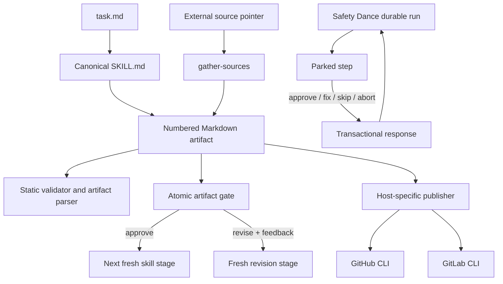

# Research: Agent communication, control, and integration patterns

**Date**: 2026-09-21T14:55:43Z
**Git Commit**: 8f2db6328db7c3c98f0079aac06bbe61de25f7ff
**Branch**: i-want-new-skill
**Repository**: MarkTripoli/skills

## Research Question

1. How are skills, templates, typed schemas, and validation structured today to shape agent-authored communication deterministically?
2. How do workflows and agents represent work start, lifecycle status, periodic signals, transitions, and completion?
3. What mechanisms let an owner ask questions, provide feedback, steer work, pause or resume execution, or answer a waiting agent?
4. What external-system linking and publication patterns exist for GitHub, GitLab, Jira, and future transports?
5. What installation, runtime-adaptation, and testing contracts govern a new portable capability?

## Research Methodology

This document records current behavior only. It does not recommend implementation work, refactors, optimizations, or future changes.

Three locator workers mapped skill/schema, workflow/control, and integration surfaces. Three analyzer workers traced the highest-ranked candidates. TypeSafe reranking ordered each locator's candidates; the final claims were checked against repository source and tests. Exhaustive searches covered Slack APIs and identifiers, chat transports, inbound handlers, timers, ticket-system names, and Safety Dance event producers. No external web sources were needed.

### Known limits

- Atomic runtime internals are outside this repository. The repository documents and invokes native status, connect, pause, quit, resume, and UI gates, but this pass cannot inspect their runtime implementation.
- Safety Dance declares subscription event types and a client-facing event envelope, but repository search found no registered subscribe handler or event producer. Findings therefore treat that surface as a static schema, not an active publication path.
- No live Slack, GitHub, GitLab, Jira, Atomic, or TypeSafe integration was executed. Tests and source establish local contracts, not hosted-service behavior.

## Summary

Agent communication in this repository is artifact-first. Canonical `SKILL.md` instructions and `references/` templates define the authored shape; numbered Markdown artifacts carry state between fresh sessions; JavaScript validators enforce selected structural properties; typed judgments turn prose into closed-set outputs with code-owned thresholds. Most message content remains prose-directed rather than validated against a compiled message schema.

Lifecycle and owner control exist in two separate systems. Atomic sequences artifact-backed skill stages and asks for approve, revise, or stop decisions between fresh sessions. Safety Dance persists run and step states and accepts a finite action set against an exact parked prompt. Neither path sends periodic human-readable status reports, accepts arbitrary owner questions through a chat thread, or injects live steering into an already-running agent.

External publication is platform-specific. GitHub child issues, GitHub/GitLab pull requests, and GitHub/GitLab review replies use host CLIs and committed local artifacts. Jira appears only as a source-fetch option. Exhaustive repository search found no Slack integration, general message transport, Linear integration, shipping webhook adapter, or run-to-chat-thread mapping.

## Detailed Findings

### 1. Determinism is concentrated in artifact shells, handoffs, and typed decisions

Every skill remains independently runnable across supported coding-agent runtimes; runtime adapters change invocation and worker mechanics, while optional Atomic orchestration consumes the same canonical skills (`shared/CONVENTIONS.md:5-9`). A task is rooted in `task.md`, whose required metadata is `slug`, `title`, `workflow`, and `created`; the optional `issue` field is specifically a GitHub issue number (`shared/CONVENTIONS.md:13-19`). Numbered artifacts use `NN-<type>-<slug>.md`, keep template frontmatter including `summary`, and are selected by highest number for a matching type (`shared/CONVENTIONS.md:55-67`).

The static validator requires exact skill frontmatter keys, directory/name agreement, kebab-case names, the shared guide sentence on line 6, one link to each shared guide, and existence of referenced template files (`scripts/validate.mjs:295-331`). It also inventories answer templates and enforces terminal versus forward replies, one `text` command fence, a known next skill, the artifact-argument policy, and fixed fence placement (`scripts/validate.mjs:353-418`).

Atomic's artifact reader rejects malformed or duplicate-key YAML, non-mapping frontmatter, symlink artifacts, missing `type`, `summary`, or body, and invalid statuses for known artifact types. It also checks selected evidence contradictions and returns each accepted artifact with a SHA-256 hash (`atomic/lib/artifacts.mjs:7-56`). Artifact observation sorts numbered files, records hashes, and keeps the latest artifact by type; a stage is not accepted unless it creates or changes its owned artifact (`atomic/lib/artifacts.mjs:59-68`; `atomic/lib/artifacts.mjs:102-105`).

Typed judgments use three question constructors, `noul`, `choice`, and `score`, send `{state, model, questions}`, require an `answers` object, and apply centralized thresholds after model interpretation (`skills/delivery/typed-judgment/judge.mjs:40-43`; `skills/delivery/typed-judgment/judge.mjs:98-138`). PR-review triage is the closest current typed communication example: unresolved threads become typed disposition, change-request, and addressed questions, then return rows with `id`, disposition, confidence, and probabilities (`skills/delivery/typed-judgment/judge.mjs:410-428`).

The PR-review skill still authors outbound replies as prose. It fetches GitHub/GitLab review threads, asks the agent for a complete evidence-based reply per thread, shows exact proposed replies, and waits for confirmation before posting or resolving (`skills/delivery/resolve-pr-reviews/SKILL.md:20-34`). Its persisted receipt has fixed platform, pull-request, SHA, status, thread, evidence, reply, resolution, verification, and remaining-gate fields (`skills/delivery/resolve-pr-reviews/references/pr_review_template.md:1-58`). The parser enforces only the artifact's common fields and `pr-review` status enum, not every template field (`atomic/lib/artifacts.mjs:18-22`; `atomic/lib/artifacts.mjs:38-56`).

No `Message`, `Channel`, `Thread`, `Transport`, Slack payload, or general communication-envelope type exists in the searched source. The only shipping use of “Slack” is an illustrative narration example for a hypothetical connector flow, not integration code (`skills/delivery/record-evidence/references/narration_guide.md:31-34`).

#### Testing patterns

The offline suite runs collection validation, generated-plugin drift checks, Node unit tests, JEV UI acceptance tests, and Safety Dance checks (`package.json:18-25`). Typed-judgment tests pin conservative routing defaults and exact review-thread triage shapes, including the undecided threshold (`tests/judge.test.mjs:212-266`). Repository testing guidance distinguishes static/import/helper proof from a live Atomic run and requires runtime proof for claims about native stage execution or gates (`docs/testing.md:30-41`). No test executes a Slack payload or a general communication schema because neither exists.

### 2. Atomic reports stage outcomes; Safety Dance persists run and step state

Atomic's `delivery` workflow accepts workflow mode, gate policy, models, application-test mode, verification policy, step bound, branch, and base. It returns `status`, `summary`, `task_dir`, `branch`, `steps`, and `children`; no transport or reporting-cadence input exists (`atomic/workflows/delivery.ts:10-35`). Its bounded loop refreshes artifacts at every boundary, selects one eligible transition, and returns explicit `completed` or `blocked` results with persisted summaries (`atomic/workflows/delivery.ts:71-136`).

Safety Dance has a separate state vocabulary. Runs are `pending`, `running`, `completed`, `failed`, `cancelled`, or `ci_monitor_interrupted`, with the last four terminal. Steps are `pending`, `running`, `awaiting_approval`, `fixing`, `fix_review`, `completed`, `skipped`, or `failed` (`tools/safety-dance/internal/types/types.go:10-46`; `tools/safety-dance/internal/types/types.go:256-268`). Its IPC snapshot exposes run status, error, PR URL, parked timestamps, monotonic state revision, step status, findings counts, timestamps, last activity, and agent PID (`tools/safety-dance/internal/ipc/protocol.go:361-442`).

Safety Dance's process lifecycle callback vocabulary is `start`, `exit`, `retry`, `fallback`, and `activity`. Activity is triggered by observed subprocess output and coalesced for five seconds; the code describes it as a liveness signal rather than a log (`tools/safety-dance/internal/agent/lifecycle.go:9-35`; `tools/safety-dance/internal/agent/lifecycle.go:59-85`). It is not a wall-clock report and carries no decisions, blockers, current work, completed work, or next work.

The IPC package declares run-created, run-updated, run-completed, CI-readiness, step-started, step-completed, log-chunk, and stream-gap event types, with optional run, step, status, branch, findings, duration, PR URL, and state-revision fields (`tools/safety-dance/internal/ipc/protocol.go:444-495`). Repository search found only these declarations, not a registered subscription handler or producer. No current timer or workflow stage publishes start notices, hourly summaries, transition summaries, or completion messages to a user-facing channel.

#### Testing patterns

Safety Dance runner tests prove fixed order, stop-on-failure, persisted completed-step reuse, checkpoint persistence, and invalidation when trusted inputs change (`tools/safety-dance/internal/pipeline/runner_test.go:13-117`; `tools/safety-dance/internal/pipeline/runner_test.go:119-186`). Manager tests prove persisted active-run discovery and restart resumption (`tools/safety-dance/internal/daemon/manager_test.go:81-113`). No focused test covers lifecycle-to-status publication, subscription event production, scheduled reporting, or chat delivery.

### 3. Owner control is gate-bound and successor-stage oriented

Atomic launches each skill with `context: 'fresh'`, observes the resulting artifact, and rejects success without a fresh owned artifact (`atomic/lib/controller.mjs:214-251`). After a stage returns, an artifact gate offers exactly `approve`, `revise`, or `stop`; revision requires nonempty free text and maps to that artifact type's revision skill (`atomic/lib/controller.mjs:256-274`). The feedback is inserted into the next phase prompt as human feedback, so it steers a successor invocation rather than mutating the agent that produced the artifact (`atomic/lib/controller.mjs:176-210`).

Manual replies do not approve Atomic runs. Native Atomic UI owns approvals, and `/workflow status`, `/workflow connect`, `/workflow pause`, `/workflow quit`, and `/workflow resume` own run inspection and resumable control; the collection explicitly has no gate watcher or response-command loop (`shared/CONVENTIONS.md:98-104`).

Safety Dance accepts only `approve`, `fix`, `skip`, or `abort`, with allowed actions varying by step (`tools/safety-dance/internal/types/types.go:270-292`). A response must name the exact run, step, step-result ID, positive prompt generation, and allowed action while the prompt is parked; stale or non-parked responses are rejected before persistence (`tools/safety-dance/internal/db/responses.go:21-47`). Applying a response is transactional: fix returns the step to fixing, skip marks it skipped, approve completes it, and abort is consumed for runner-owned cancellation (`tools/safety-dance/internal/db/responses.go:82-138`).

The durable runner polls only while a step is parked, branches on the finite action, and reruns the same step for `fix` (`tools/safety-dance/internal/pipeline/runner.go:174-210`; `tools/safety-dance/internal/pipeline/runner.go:237-286`). `RespondParams` includes per-finding instructions and added findings, but it is still a parked-step action envelope, not an arbitrary question, answer, or live-steering message (`tools/safety-dance/internal/ipc/protocol.go:193-210`).

No repository path routes an owner's free-form Slack-thread question into an active Atomic `ctx.task` or Safety Dance subprocess. No running agent can emit a correlated owner question through a repository-owned channel and consume a reply in the same invocation. Existing feedback either waits at a gate or starts a fresh successor stage.

#### Testing patterns

The Safety Dance TUI test requires an explicit action and rejects implicit approval (`tools/safety-dance/internal/tui/app_test.go:12-31`). Atomic controller tests pin ordered PRD preparation and blocking when implementation evidence is absent, and they preserve a restricted recovery state until authoritative source evidence changes (`tests/atomic-controller.test.mjs:15-31`; `tests/atomic-controller.test.mjs:62-109`). Focused tests for action payload delivery into a fix prompt, Atomic UI gate interaction, and live mid-step steering were not found.

### 4. External links are persisted locally, then published through host-specific paths

Epic delivery creates one GitHub issue per child only when `gh` is authenticated and `origin` is GitHub, then records the returned number in child task metadata and the epic receipt. Issue creation failure is a recorded nonfatal limit (`skills/delivery/start-epic-delivery/SKILL.md:24-32`; `skills/delivery/start-epic-delivery/SKILL.md:36-42`). The shared task schema defines `issue` as the GitHub number that the child's pull request closes (`shared/CONVENTIONS.md:15-19`).

PR publication uses a committed local `pr-description.md` as the body source. GitHub uses `gh pr edit/create`, GitLab uses `glab mr update/create`, and the fallback prints the branch, base, and local description path for manual publication (`skills/delivery/describe-pr/SKILL.md:71-81`). A tracked artifact may be linked by branch-relative repository path, and `Closes #N` remains only when `task.md` has an issue number (`skills/delivery/describe-pr/SKILL.md:56-67`). The PR template already has `Ticket`, `Task`, and `Walkthrough` link slots, but their general resolution is not defined by the template (`skills/delivery/describe-pr/references/pr_description_template.md:1-22`).

PR-review resolution prefers `ticketing.tool` or `vcs.platform` from `ai-utilities.json`, then falls back to GitHub/GitLab remote detection (`skills/delivery/resolve-pr-reviews/SKILL.md:18-24`). No repository-owned `ai-utilities.json` schema or generic provider interface was found. Review replies remain host-specific `gh`/`glab` actions guarded by confirmation.

Source gathering is the broadest external-pointer pattern. It preserves URLs, page links, issue or ticket keys, repository names, paths, and package names exactly, then chooses runtime read/fetch, product MCP including Jira, credentialed `curl`, or an authenticated browser (`skills/delivery/gather-sources/SKILL.md:18-26`). Its artifact records location, kind, authority, version/date, fetch mechanism/date, digest, excerpts, conflicts, unreachable sources, and limits (`skills/delivery/gather-sources/references/sources_template.md:14-56`). This is inbound source capture; it does not create, update, comment on, or link back from a Jira ticket.

Current integration status:

| System | Current repository behavior |
|---|---|
| GitHub | Child issue creation, issue-number persistence, PR publication, review fetch/reply/resolve |
| GitLab | MR publication and review fetch/reply/resolve; no epic-child issue flow |
| Jira | Source retrieval option through runtime MCP only |
| Linear | No shipping integration found |
| Slack | No client, OAuth/config, payload schema, channel/thread mapping, sender, receiver, or event handler found |
| Webhooks | No shipping communication adapter found |

#### Testing patterns

Installer tests cover exact skill selection, runtime destinations, Atomic opt-in, independent uninstall, canonical Atomic installation, dependency closure, and preservation of unrelated files (`tests/install.test.mjs:38-115`; `tests/install.test.mjs:149-187`; `tests/install.test.mjs:247-320`). Static validation covers templates and handoffs, but repository testing guidance states that local checks do not prove live provider behavior (`docs/testing.md:5-29`). No direct test executes `gh issue create`, PR/MR publication, hosted review replies, Jira mutation, Slack, Linear, or webhook delivery.

### 5. Portability adapts coding-agent runtimes, not communication transports

The installer targets Claude Code, Codex, Oh My Pi, Pi, or portable output; it auto-detects installed harnesses, falls back to portable, supports selected skills plus a small dependency closure, and requires the full collection for `--atomic` (`scripts/install.mjs:24-40`; `scripts/install.mjs:77-95`; `scripts/install.mjs:180-216`). Destination planning separates skills, generated workers, runtime configuration, and the optional Atomic workflow (`scripts/install.mjs:146-177`; `scripts/install.mjs:180-216`).

The runtime builder copies canonical skills, injects runtime notes, and emits worker definitions as Markdown for Claude Code and Oh My Pi or TOML for Codex; Pi has no generated worker format (`scripts/lib/build.mjs:15-35`; `scripts/lib/build.mjs:70-120`). These adapters change how a coding agent invokes skills and workers. They do not define external chat transport behavior.

Adding a workflow skill currently requires a canonical `SKILL.md`, owned `references/` template, workflow-table row, independent artifact-first invocation, a fixed handoff or terminal reply, controller integration only when orchestration calls it, focused regression coverage, and the repository test gate (`docs/testing.md:142-149`).

#### Testing patterns

`tests/install.test.mjs` exercises every supported install target and verifies that ordinary selected-skill installs do not create Atomic state or remove unrelated resources (`tests/install.test.mjs:83-115`). Runtime-build tests verify generated markers and non-worker handling across all four runtimes (`tests/install.test.mjs:285-320`). The repository has no transport-adapter test contract because no transport-adapter interface exists.

## Code References

The groups below are exhaustive for the communication-relevant source families identified by repository search, except where marked representative.

### Canonical skill and artifact contracts

- `shared/CONVENTIONS.md:5-124` - Portable skills, task/artifact identity, human gates, handoffs, Atomic control, and typed judgments.
- `scripts/validate.mjs:19-25,35-153,290-423` - Skill and answer-template inventories plus structural validation.
- `atomic/lib/artifacts.mjs:7-68,102-126` - Artifact parsing, status checks, hashing, freshness, and epic-child validation.
- `skills/delivery/typed-judgment/judge.mjs:40-43,98-138,410-428` - Typed questions, thresholds, request envelope, and review-thread triage.

### Workflow and owner control

- `atomic/workflows/delivery.ts:10-35,71-173` - Artifact-backed delivery inputs, outputs, transition loop, and terminal results.
- `atomic/lib/controller.mjs:31-43,65-132,176-275` - Preparation chains, eligibility, fresh-stage prompts, proof identity, and artifact gates.
- `tools/safety-dance/internal/types/types.go:10-46,256-292` - Run, step, and operator-action states.
- `tools/safety-dance/internal/db/responses.go:21-47,82-138` - Parked-prompt identity checks and transactional response application.
- `tools/safety-dance/internal/pipeline/runner.go:138-210,215-325` - Durable reuse, parked-step polling, fix reruns, and checkpoints.
- `tools/safety-dance/internal/ipc/protocol.go:188-215,361-495` - Response, status snapshot, and static event schemas.

### External-system publication and links

- `skills/delivery/start-epic-delivery/SKILL.md:20-42` - GitHub child-issue creation and task metadata.
- `skills/delivery/describe-pr/SKILL.md:29-44,56-85` - GitHub/GitLab PR/MR discovery, committed body publication, and issue closing.
- `skills/delivery/resolve-pr-reviews/SKILL.md:18-45` - GitHub/GitLab review ingestion and confirmed replies.
- `skills/delivery/gather-sources/SKILL.md:18-37` - Runtime-mediated external source retrieval, including Jira.

### Installation and validation

- `scripts/install.mjs:24-40,77-95,146-216` - Runtime selection, dependency closure, destinations, and Atomic opt-in.
- `scripts/lib/build.mjs:15-35,70-120` - Canonical-to-runtime instruction and worker generation.
- `docs/testing.md:5-41,142-149` - Offline/live proof boundaries and the new-skill checklist.
- `tests/install.test.mjs:38-115,149-187,247-320` - Representative installer and runtime adaptation coverage.

## Architecture Documentation

The current communication-relevant paths are separate rather than joined by a shared transport:

Atomic treats artifacts and hashes as cross-stage authority. Safety Dance treats persisted run, step, prompt generation, and finite action as control authority. GitHub/GitLab publication and external-source retrieval are independent skill procedures. No current component maps these authorities to a Slack channel or thread, and no shared message transport connects the two control systems.

## Open Questions

None.
