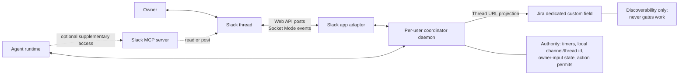
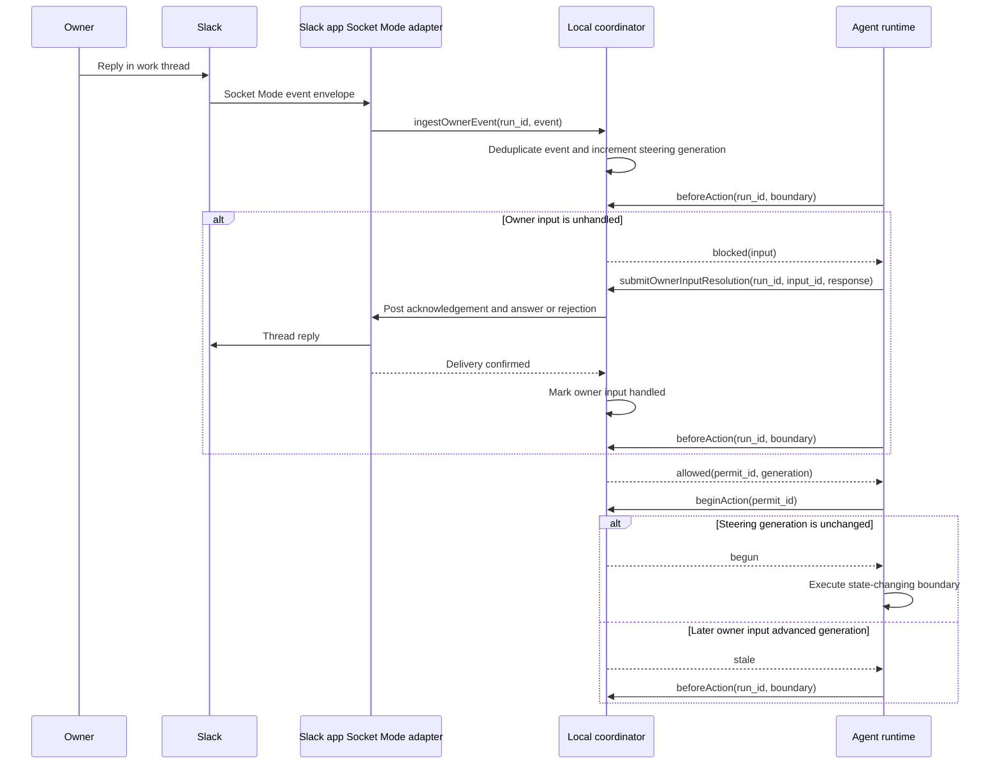
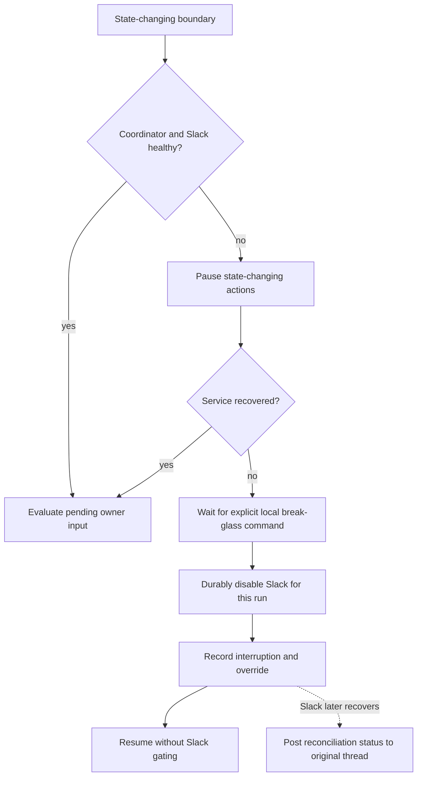
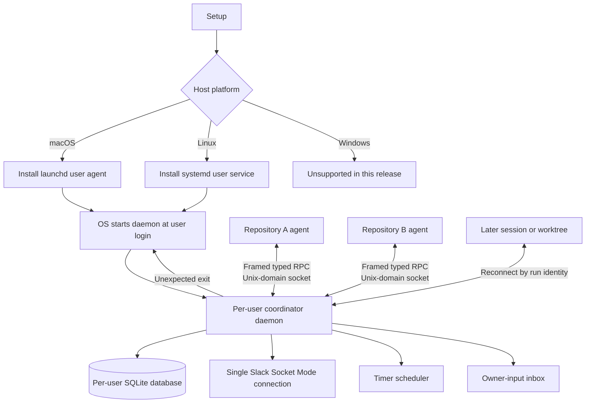
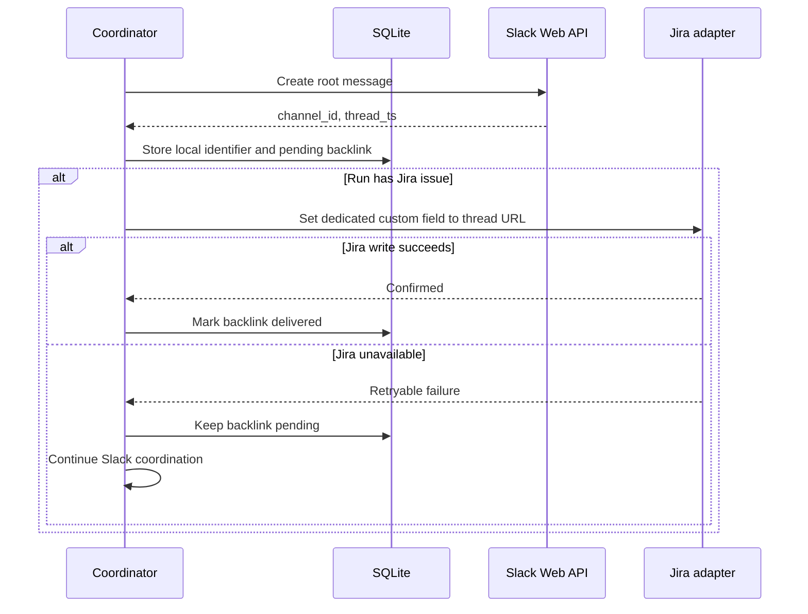

# Slack Agent Work Communication

Inputs: [task request](task.md), [current-state research](01-research-agent-communication.md), and [product requirements](02-prd-slack-agent-communication.md).

### System Design

#### The local coordinator is authoritative across every Slack access path

The repository currently has no Slack transport, scheduled status publisher, run-to-thread mapping, or live owner-steering channel. The target adds a repo-owned coordinator that remains authoritative even when an agent also has a Slack MCP server.



The Slack app is the primary integration. Its adapter creates the root message, posts canonical status and completion messages through the Slack Web API, and receives owner thread events through one daemon-owned Socket Mode connection. The design has no inbound Slack HTTP event endpoint.

Slack MCP access is supplementary. An MCP read or post cannot create or change the run-to-thread mapping, advance or clear a status deadline, mark owner input handled, or authorize the agent's next work action. An agent that learns about owner input through MCP must still submit that input to the coordinator and receive a coordinator action permit.

| Concern | Authority | Other paths |
|---|---|---|
| `run_id` to local Slack channel/thread identifier | Per-user SQLite database | Slack app and MCP may read the resolved identifier |
| Jira-linked thread discovery | Dedicated Jira custom field containing the Slack thread URL | SQLite retains the local identifier and pending projection while Jira is unavailable; Jira never grants permits |
| One-hour quiet-status deadline | Local coordinator clock and timer state | Agent activity may reset the deadline only through a coordinator work event |
| Owner identity and unhandled input | Local coordinator | Slack app supplies primary events; MCP observations must carry the same Slack message identity for deduplication |
| Permission to begin the next work action | Local coordinator | Neither the Slack app nor MCP grants permission |
| Slack API access | Slack app adapter through Socket Mode for inbound events and the Web API for outbound messages | MCP is optional and non-authoritative |

The coordinator gates every state-changing boundary rather than relying on best-effort polling inside the agent:



`beforeAction` and `beginAction` jointly define the gate. `beforeAction` checks Slack health and pending owner input, then creates a one-shot permit bound to the run, boundary type, and current steering generation. Immediately before execution, `beginAction` atomically rechecks Slack health and required delivery state, then consumes the permit only when it is still issued and the run generation is unchanged. An unavailable dependency leaves the permit unconsumed. A newly deduplicated owner event increments the generation and invalidates every older unconsumed permit. Owner input committed after consumption applies before the following action. Pure local reads and local reasoning require no permit.

#### Slack-enabled runs fail closed until recovery or local break-glass

A Slack-enabled run pauses state-changing actions when the coordinator is unreachable, Socket Mode is disconnected, or a required Slack message has not been delivered. Recovery restores the gate only after the coordinator can receive owner input and required outbound delivery succeeds.



The supported break-glass path is the local operator CLI. It requires explicit interactive confirmation, then asks the daemon to atomically disable Slack, record the interruption, and persist an audit receipt before work resumes. The receipt identifies the run, interruption, OS user, confirmation time, and disable time. If the transaction fails, the run remains paused. This release trusts the operating-system user: the agent adapter omits break-glass, but a same-user agent process can construct the RPC and bypass the CLI prompt. The prompt is a safety rail, not a security boundary. The original thread mapping remains available for later reconciliation through the existing status schema.

#### Native per-user supervisors keep the daemon alive across sessions

Setup installs one operating-system-native per-user service for the coordinator. macOS uses a launchd user agent; Linux uses a systemd user service. The supervisor starts the daemon when the user logs in and restarts it after an unexpected process exit. The service is neither system-wide nor tied to a repository, worktree, terminal, or agent session.

The canonical daemon source, service definitions, and installation logic remain repository-owned. Runtime state stays user-scoped. The daemon owns the Slack app's Socket Mode connection, quiet-hour timers, owner-input inbox, and run-to-thread mapping after an agent process exits or becomes idle. A later agent session reconnects through user-local IPC and resumes the same run state.

Rerunning setup stages and validates the replacement executable and native service definition without modifying SQLite or user configuration. It atomically replaces each staged file, then immediately asks the native supervisor to restart the daemon. During the restart, coordinator IPC is unavailable, so active Slack-enabled runs pause every state-changing boundary under the existing fail-closed gate. The new daemon completes migrations, restores durable run state, re-establishes Socket Mode and required delivery health, then accepts IPC; agents resume only after those health conditions pass. If health does not recover, setup reports failure, leaves the new executable and service definition installed, and keeps runs paused for operator repair or durable break-glass. It never starts old code against potentially migrated state.



Run IDs must be globally unique within the per-user SQLite database and namespaced with repository and task identity. Database location and Socket Mode reconnect and replay policy remain open.

#### SQLite persists coordinator authority across restarts

One per-user SQLite database is the canonical durable state. The daemon is its only writer; agent adapters and the operator CLI mutate state through local RPC. Write-ahead logging, foreign-key enforcement, a busy timeout, and explicit transactions protect concurrent run activity. A schema migration must complete before the daemon accepts IPC or Socket Mode events.

| Table | Key constraints | State owned |
|---|---|---|
| `runs` | `run_id` primary key; unique `(channel_id, thread_ts)` | Run locator, owner, lifecycle, Slack mode, steering generation, and next quiet-status deadline |
| `owner_inputs` | `input_id` primary key; unique `(channel_id, thread_ts, message_ts)` | Owner message payload, handling state, and resolution |
| `message_deliveries` | `delivery_id` primary key; unique idempotency key per run | Required outbound message, attempts, confirmation, and Slack message identity |
| `action_permits` | `permit_id` primary key | Run, boundary kind, issued generation, one-shot state, issue time, and consumption time |
| `interruptions` | `interruption_id` primary key | Availability cause, break-glass transition, local resumption, and reconciliation |
| `break_glass_receipts` | `receipt_id` primary key; unique `interruption_id` | Run, interruption, OS user, confirmation time, and Slack-disable time |
| `schema_migrations` | Migration version primary key | Applied schema version and checksum |
| `jira_backlinks` | `run_id` primary key | Optional Jira issue locator, derived thread URL, custom-field delivery state, attempts, and last error |

The coordinator commits related facts atomically: Slack thread identity with a pending Jira backlink, owner-event deduplication with a steering-generation increment and pending-input state, permit issuance with the gate decision, permit consumption with generation validation, timer advancement with a queued status delivery, and break-glass mode with its interruption and audit receipt. Process exit between those writes cannot expose a partially applied transition.

#### Jira stores a discoverable backlink, not coordinator authority

After Slack creates the root message, the coordinator stores its channel and thread timestamp in SQLite. For a Jira-linked run, it derives the canonical Slack thread URL, records a pending `jira_backlinks` row in the same transaction, and asks the Jira adapter to write that URL to the configured dedicated custom field.



Jira failure never changes the quiet-status deadline, owner-input state, permit decision, or Slack health. Retrying the same thread URL is idempotent. Runs without a Jira issue do not create a `jira_backlinks` row or call Jira. Each Jira site configuration names an administrator-created field by stable ID. Setup validates that the field exists, is writable for the intended issue scope, and accepts the canonical Slack thread URL; runtime neither creates fields nor requires Jira admin privileges.

### Program Design

#### Coordinator capabilities stay transport-independent

The per-user daemon owns orchestration state and exposes a narrow local API to every supported agent runtime. Slack payloads remain behind the Slack app adapter; Jira custom-field updates remain behind a backlink adapter. The optional MCP client is not injected as daemon state, timer, supervision, or Jira authority.

```text
agent runtime integration
├── startSlackRun(input) ──────────────────────▶ coordinator.startRun
├── recordWorkEvent(event) ────────────────────▶ coordinator.recordWorkEvent
├── executeStateChangingBoundary(runId, action)
│   ├── beforeAction(runId, action.boundary) ──▶ issue one-shot permit
│   ├── beginAction(permitId) ─────────────────▶ consume if generation matches
│   ├── begun ─────────────────────────────────▶ action.execute
│   └── blocked, stale, or unavailable ────────▶ pause or recheck
├── submitOwnerInputResolution(result) ────────▶ coordinator.resolveOwnerInput
└── finishSlackRun(outcome) ───────────────────▶ coordinator.finishRun

per-user coordinator daemon
├── SQLite operational state
├── quiet-status scheduler
├── owner-event inbox and deduplication
├── action-permit gate
├── SlackPort
│   └── SlackAppAdapter ────────────────▶ Socket Mode events and Slack Web API
└── JiraBacklinkPort
    └── JiraCustomFieldAdapter ─────────▶ Dedicated Jira custom field

optional agent capability
└── SlackMcpClient ─────────────────────▶ supplementary Slack reads or posts
```

The logical boundary is:

```ts
interface SlackWorkCoordinator {
  startRun(input: StartRunInput): Promise<SlackRunRef>;
  recordWorkEvent(event: WorkEvent): Promise<void>;
  ingestOwnerEvent(event: OwnerThreadEvent): Promise<IngestResult>;
  beforeAction(runId: RunId, boundary: ActionBoundaryKind): Promise<ActionPermit>;
  beginAction(permitId: PermitId): Promise<BeginActionResult>;
  resolveOwnerInput(result: OwnerInputResolution): Promise<void>;
  finishRun(input: FinishRunInput): Promise<void>;
}

interface JiraBacklinkPort {
  writeThreadUrl(backlink: JiraThreadBacklink): Promise<void>;
}

interface LocalOperatorControl {
  disableSlackWithBreakGlass(runId: RunId): Promise<BreakGlassReceipt>;
}

interface BreakGlassReceipt {
  receiptId: string;
  runId: RunId;
  interruptionId: string;
  invokedByUid: string;
  confirmedAt: string;
  disabledAt: string;
}

type ActionBoundaryKind =
  | "write"
  | "edit"
  | "command"
  | "subagent_dispatch"
  | "external_request"
  | "final_response";

type ActionPermit =
  | { kind: "allowed"; permitId: PermitId; generation: number; boundary: ActionBoundaryKind }
  | { kind: "blocked"; pending: OwnerInput[] }
  | { kind: "unavailable"; cause: SlackUnavailableCause };

type BeginActionResult =
  | { kind: "begun"; permitId: PermitId }
  | { kind: "stale"; permitId: PermitId; currentGeneration: number }
  | { kind: "unavailable"; cause: SlackUnavailableCause };
```

All runtime adapters must route the six `ActionBoundaryKind` operations through one boundary hook and must not execute when `beginAction` returns `stale` or `unavailable`. Local file reads and in-process reasoning bypass that hook. A coordinator IPC failure is treated as `unavailable` even though no response can arrive. `LocalOperatorControl` is intentionally absent from the agent runtime interface. SQLite is injected behind the coordinator's state-store boundary.

#### Setup dispatches to native user-service install and update adapters

The setup entrypoint detects the host platform and delegates service-manager operations to one platform adapter. The macOS adapter installs and loads a launchd user-agent definition with restart-on-crash behavior. The Linux adapter installs a systemd user unit, reloads the user manager, and enables the unit so it starts at login and restarts after a crash. An unsupported Windows host returns an explicit setup error without installing a partial service.

```text
setupCoordinatorService(input)
├── detect host platform
├── fresh install
│   ├── darwin ──▶ install and load launchd user agent
│   ├── linux ───▶ install, reload, and enable systemd user service
│   └── win32 ───▶ return unsupported_platform
└── update existing install
    ├── stage and validate executable and native service definition
    ├── atomically replace executable and service definition
    ├── preserve SQLite database and user configuration
    ├── restart native user service immediately
    └── await coordinator health
        ├── healthy ──▶ report success and release fail-closed pause
        └── unhealthy ──▶ report failure, retain new version, keep runs paused
```

The adapters own service-manager commands and definitions. The coordinator process receives the same executable path, user-local configuration, database path, and socket path on both supported platforms; it contains no launchd or systemd branches. Setup reports update success only after the restarted daemon accepts IPC with its durable state loaded and Slack health restored. A failed health check leaves the new executable and service definition in place; setup does not automatically roll back potentially incompatible code after migrations may have run. Agent adapters remain fail-closed until an operator repairs the installation or uses the existing durable break-glass path.

#### A filesystem-protected Unix-domain socket carries typed local RPC

The daemon listens on one Unix-domain socket inside a per-user runtime directory. The directory is mode `0700` and the socket is mode `0600`; the daemon exposes no loopback TCP or HTTP listener. The filesystem boundary authenticates the operating-system user, not an individual process.

Each frame is a four-byte big-endian payload length followed by one UTF-8 JSON request or response. The discriminated method union supplies message types; `protocolVersion` supports explicit compatibility checks and `requestId` correlates exactly one response. Malformed frames, unsupported versions, unknown methods, and invalid payloads return typed errors without invoking coordinator logic.

```ts
interface RpcRequest<M extends string, P> {
  protocolVersion: 1;
  requestId: string;
  method: M;
  params: P;
}

interface BeforeActionInput {
  runId: RunId;
  boundary: ActionBoundaryKind;
}

interface BeginActionInput {
  permitId: PermitId;
}

type CoordinatorRpcRequest =
  | RpcRequest<"start_run", StartRunInput>
  | RpcRequest<"record_work_event", WorkEvent>
  | RpcRequest<"before_action", BeforeActionInput>
  | RpcRequest<"begin_action", BeginActionInput>
  | RpcRequest<"resolve_owner_input", OwnerInputResolution>
  | RpcRequest<"finish_run", FinishRunInput>
  | RpcRequest<"disable_slack_with_break_glass", { runId: RunId }>;

type RpcResponse<T> =
  | { protocolVersion: 1; requestId: string; ok: true; result: T }
  | { protocolVersion: 1; requestId: string; ok: false; error: RpcError };

interface RpcError {
  code:
    | "invalid_frame"
    | "unsupported_version"
    | "unknown_method"
    | "invalid_params"
    | "not_found"
    | "conflict"
    | "unavailable";
  message: string;
}
```

The agent adapter omits `disable_slack_with_break_glass`; the local operator CLI requires explicit interactive confirmation before presenting that request. The daemon commits the mode change, interruption, and audit receipt in one SQLite transaction and returns the persisted receipt. Because the filesystem boundary trusts the OS user, any same-user process can manually construct the RPC; the confirmation cannot be treated as authorization. The CLI first starts or recovers the daemon through its supervisor. If the daemon cannot commit the transaction, the run remains paused.

### Type Definitions

The SQLite schema exposes this logical state to the coordinator:

```ts
interface RunLocator {
  runId: RunId;
  repositoryRoot: string;
  worktreeRoot: string;
  taskDirectory: string;
}

interface JiraIssueRef {
  siteId: string;
  issueKey: string;
}

interface JiraSiteConfig {
  siteId: string;
  baseUrl: string;
  slackThreadFieldId: string;
}

interface JiraThreadBacklink {
  issue: JiraIssueRef;
  threadUrl: string;
}

interface SlackRunState {
  run: RunLocator;
  ownerSlackUserId: string;
  channelId: string;
  threadTs: string;
  lifecycle: "active" | "completed" | "failed" | "cancelled";
  steeringGeneration: number;
  slackMode: "enabled" | "paused_unavailable" | "disabled_break_glass";
  nextQuietStatusDueAt: string;
  pendingOwnerInputIds: string[];
  interruptions: SlackInterruption[];
  jiraIssue: JiraIssueRef | null;
}

interface SlackInterruption {
  interruptionId: string;
  startedAt: string;
  cause: SlackUnavailableCause;
  breakGlassAt: string | null;
  resumedWithoutSlackAt: string | null;
  reconciledMessageTs: string | null;
}

type SlackUnavailableCause =
  | "coordinator_unreachable"
  | "socket_mode_disconnected"
  | "required_delivery_unconfirmed";
```

The Slack message identity `(channelId, threadTs, messageTs)` is the owner-input idempotency key. Delivery through both the Slack app and MCP converges on one owner-input record. The Jira custom field stores the canonical thread URL only as a discoverability projection; SQLite retains the channel/thread identifier and pending write state required for live coordination and outage recovery.

### Configuration

- Install a launchd user agent on macOS and a systemd user service on Linux. Configure each to start the coordinator at user login and restart it after an unexpected exit.
- Keep the service per-user. Setup must not require or install a system-wide daemon.
- On update, preserve the SQLite database and user configuration, atomically replace the executable and native service definition, restart the daemon immediately, and wait for coordinator and Slack health before reporting success. Failed health leaves the new version installed and Slack-enabled runs paused; setup must not roll back automatically.
- Store exactly one SQLite database in the operating-system user's application-state directory, never in a repository or worktree. The exact platform path remains open.
- Enable write-ahead logging, foreign keys, and a bounded busy timeout on every connection.
- Run ordered, transactional schema migrations before opening Socket Mode or local IPC.
- Place the Unix-domain socket in the per-user runtime directory with a mode-`0700` parent and mode-`0600` socket; open no TCP listener.
- Keep Slack credentials outside SQLite; the authorization and secret-storage mechanism remains open.
- Configure each Jira site with the stable field ID of an administrator-created dedicated Slack-thread field. Setup must validate existence, writability for the intended issue scope, and acceptance of the canonical Slack thread URL.
- Keep Jira credentials outside SQLite. Runtime may edit the configured issue field but must not require Jira administration privileges, create fields, or discover them by name.
- Treat the Unix-socket owner as trusted for this release. The CLI confirmation is mandatory in the supported path, but the daemon does not require stronger caller authentication.

### Local Patterns

- Preserve independent skill use across Claude Code, Codex, Oh My Pi, Pi, and portable installations; optional Atomic integration consumes the same canonical resources (`shared/CONVENTIONS.md:5-9`; `scripts/install.mjs:24-40,146-216`).
- Keep canonical instructions and templates under `skills/delivery/<name>/`, then let runtime generation adapt worker mechanics rather than product behavior (`scripts/lib/build.mjs:15-35,70-120`).
- Treat static/import checks as local contract evidence and require a live Slack trial before claiming hosted delivery or inbound steering works (`docs/testing.md:5-41`).

### What We're Not Doing

- Non-owner comments or steering.
- Jira issue mutations other than writing the Slack thread URL to the dedicated custom field.
- Jira labels and GitHub, Linear, or other ticket-system backlinks.
- Windows daemon supervision and named-pipe IPC.
- Runtime Jira custom-field creation or name-based field discovery.
- Chat transports other than Slack.
- Automatic Slack enablement for every work run.

### Execution DAG

No execution-plan artifact exists. The task's fixed `prd` workflow continues from the approved TDD through `create-structure-outline`, `create-plan`, `implement-plan`, `verify-implementation`, the review loop, and `describe-pr`.

## Human Review

### Review targets

- System ownership, state flow, and Slack boundary.
- Program module boundaries and dependency seams.

### Verify

- [ ] Confirm the design preserves the PRD's fixed message fields and timing rules.
- [ ] Confirm inbound Slack events use Socket Mode only and no HTTP event endpoint is introduced.
- [ ] Confirm owner steering takes effect before every write, edit, command, subagent dispatch, external request, and final response.
- [ ] Confirm an unavailable coordinator, Socket Mode connection, or required Slack delivery pauses state-changing actions until recovery or durable local break-glass.
- [ ] Confirm one per-user SQLite database durably owns coordinator-only timers, owner input, permits, deduplication, interruptions, and the local channel/thread identifier.
- [ ] Confirm setup installs a launchd user agent on macOS or a systemd user service on Linux, and each starts at login and restarts crashes without a system-wide daemon.
- [ ] Confirm an update preserves SQLite and configuration, atomically replaces the executable and native service definition, restarts immediately, pauses active Slack-enabled runs fail-closed, and resumes them from durable state only after health is restored.
- [ ] Confirm failed post-update health reports setup failure, retains the new executable and service definition, and leaves Slack-enabled runs fail-closed for operator repair or break-glass without automatic rollback.
- [ ] Confirm a Jira-linked run projects its Slack thread URL to a dedicated custom field without giving Jira authority over timers, steering, or permits.
- [ ] Confirm Jira outages leave the backlink pending without pausing Slack coordination and non-Jira runs stay local-only.
- [ ] Confirm agent adapters and the operator CLI use framed typed request/response RPC over a filesystem-protected Unix-domain socket with no TCP listener.
- [ ] Confirm Jira setup validates an administrator-created field by stable per-site ID and runtime requires no Jira admin privileges.
- [ ] Confirm break-glass requires interactive CLI confirmation and a durable audit receipt while explicitly treating same-user RPC callers as trusted.
- [ ] Confirm `beforeAction` issues a one-shot permit and `beginAction` consumes it only when the steering generation is unchanged.
- [ ] Confirm Slack-disabled runs retain existing workflow behavior.

### Known limits
- SQLite file location, driver packaging, migrations, and backup policy.
- Slack app installation, authorization, and Socket Mode reconnect, acknowledgement, and replay behavior.
- Same-user agent processes can construct the break-glass RPC and bypass the CLI confirmation; this is an accepted release limitation.
- A crash after permit consumption but before an external effect is observed requires action-specific idempotency or reconciliation.
- Jira credential authorization, validation scope, existing-value conflicts, and retry guarantees.
- Slack retry schedule, replay ordering, and reconciliation delivery guarantees.
