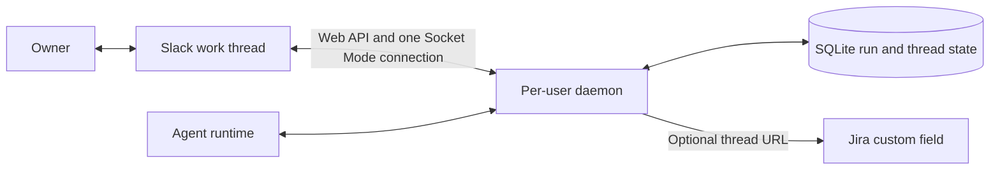

# Slack Agent Work Communication

Inputs: [task request](task.md), [current-state research](01-research-agent-communication.md), and [product requirements](02-prd-slack-agent-communication.md).

### System Design

#### One local daemon owns Slack coordination

The first release adds one repository-owned daemon per operating-system user. That daemon owns one Slack app Socket Mode connection, one user-scoped SQLite database, outbound Slack Web API calls, owner replies, and quiet-status timers. Agent runtimes use a local coordinator client; they do not connect to Slack directly.



The components have narrow ownership:

| Component | Responsibility |
|---|---|
| Agent runtime adapter | Enable Slack for a run, choose its channel, report work events, check before state-changing work, handle owner input, and finish the run |
| Per-user daemon | Own Slack connectivity, run state, message scheduling, owner-input state, break-glass state, and Jira backlink attempts |
| Slack adapter | Create and reply in threads through the Web API; receive invited-channel events through Socket Mode |
| SQLite store | Persist run/thread mapping, lifecycle, pending owner input, Slack mode, status deadline, and optional Jira backlink state |
| Jira adapter | Write the canonical Slack thread URL to one configured custom field; never authorize or block work |
| Local operator CLI | Confirm and request break-glass for one run |

Slack MCP access, if independently available to an agent, is supplementary and never changes coordinator state.

#### One enabled run maps to one thread

Starting a Slack-enabled run creates one root message, stores `(run_id, channel_id, thread_ts)`, and schedules the quiet-status deadline. The daemon posts status messages on phase changes, blocker changes, and one hour of silence. Finishing, failing, or cancelling the run posts one completion message and closes the active lifecycle.

The root, status, and completion fields are the fixed fields defined by the PRD. Missing values render as `None`. Slack-disabled runs bypass the coordinator integration and retain existing behavior.

#### Channel selection has two sources

Each repository root `AGENTS.md` must contain exactly one standalone, case-sensitive line:

```text
Slack default channel: <#name-or-ID>
```

The controlling person's current run instruction may override that value when it unambiguously requests one `#channel-name` or Slack channel ID. Quoted material, ticket text, and incidental mentions do not count. Multiple or ambiguous requested channels stop before thread creation for clarification.

The runtime adapter selects the override or default, resolves it once through Slack, requires an invited non-archived public or private channel, and passes the resulting channel ID to the daemon. The daemon persists only that ID for the run. There is no workspace default, mapping table, cache, or routing service.

#### Owner steering gates state-changing work

The daemon records replies from the run owner as pending input. Before each state-changing action, the runtime adapter asks the daemon whether the run may proceed:

- `ready`: Slack coordination is healthy and no owner input is pending.
- `owner_input`: the agent must acknowledge and handle the input, then check again.
- `unavailable`: the daemon, Socket Mode connection, or required Slack delivery is unavailable; the action remains paused.
- `slack_disabled`: break-glass has disabled Slack for this run, so its existing non-Slack workflow may continue.

This is a v1 coordination gate, not a distributed transaction around external side effects. The adapter performs the check immediately before starting state-changing work. No generation counters, one-shot permits, or multi-step reservation protocol are introduced.

#### Break-glass is explicit and scoped to one run

The local operator CLI identifies one run, displays the consequence, and requires confirmation. The daemon persists that run's `slack_disabled` mode before returning success. The run may then continue without Slack gating. Other runs remain unchanged, and the original channel/thread mapping stays available for operator reference.

#### Native user services keep the daemon available

macOS setup installs a launchd user agent. Linux setup installs a systemd user service. Each starts at user login and restarts the daemon after an unexpected exit. The service is per-user, not system-wide or repository-specific. Windows supervision is deferred.

There is one active Socket Mode connection for the configured Slack app. Standard reconnect behavior belongs to the selected Slack SDK; v1 defines no multi-connection handoff or acknowledgement protocol.

### Program Design

#### Modules

```text
agent runtime
└── SlackRunClient
    ├── resolveChannel
    ├── startRun
    ├── recordWorkEvent
    ├── checkBeforeWrite
    ├── resolveOwnerInput
    └── finishRun

per-user daemon
├── RunCoordinator
├── SQLiteRunStore
├── SlackAdapter
│   ├── one Socket Mode connection
│   └── Web API client
├── StatusScheduler
├── JiraBacklinkAdapter
└── LocalOperatorControl
```

`RunCoordinator` contains the use cases. Transport and storage details stay behind the four adapters. The agent runtime has no direct database access. The operator CLI is the only supported caller of break-glass.

#### Coordinator interface

```ts
interface SlackRunCoordinator {
  startRun(input: StartRunInput): Promise<SlackRunRef>;
  recordWorkEvent(event: WorkEvent): Promise<void>;
  checkBeforeWrite(runId: RunId): Promise<WriteGate>;
  resolveOwnerInput(input: OwnerInputResolution): Promise<void>;
  finishRun(input: FinishRunInput): Promise<void>;
}

interface LocalOperatorControl {
  disableSlackForRun(runId: RunId): Promise<void>;
}

type WriteGate =
  | { kind: "ready" }
  | { kind: "owner_input"; input: OwnerInput }
  | { kind: "unavailable"; reason: string }
  | { kind: "slack_disabled" };
```

The runtime adapter calls `checkBeforeWrite` immediately before state-changing work. It does not start that work for `owner_input` or `unavailable`. After it acknowledges and applies or rejects owner input through `resolveOwnerInput`, it checks again.

#### Durable state

SQLite is stored in the operating-system user's application-state directory and written only by the daemon.

| Table | Minimum state |
|---|---|
| `runs` | Run ID, owner Slack user ID, channel ID, thread timestamp, lifecycle, Slack mode, and next quiet-status deadline |
| `owner_inputs` | Run ID, Slack message identity, message text, received time, and handled time |
| `jira_backlinks` | Run ID, Jira issue reference, thread URL, and pending or delivered state |

The Slack message identity is unique within `owner_inputs`, so a retried event does not create a second owner instruction. SQLite transactions cover each individual state transition. v1 does not add action-permit, interruption, delivery-attempt, or connection-handoff tables.

#### Run lifecycle

```text
start Slack-enabled run
├── resolve channel from run override or root AGENTS.md
├── create root Slack message
├── persist run and thread identity
└── if Jira-linked, record and attempt backlink

active run
├── record phase or blocker changes
├── post status after changes or one quiet hour
├── receive owner replies as pending input
└── check coordinator before state-changing work

finish run
├── post completion message
└── persist terminal lifecycle
```

If the daemon or Slack connection is unavailable, or a required post fails, `checkBeforeWrite` returns `unavailable`. Recovery returns the run to normal checks. A confirmed break-glass changes only the selected run to `slack_disabled`.

#### Slack and Jira adapters

The repository ships a Slack app manifest for invited public and private channels. It uses bot scopes `chat:write`, `channels:history`, `channels:read`, `groups:history`, `groups:read`, and `users:read`; bot events are `message.channels` and `message.groups`; the app token has `connections:write`.

Setup takes a complete bot/app token pair from setup-time environment variables or protected per-user configuration, stores credentials outside repositories and SQLite, and never reads a repository-local `.env`. It validates that the configured app and workspace can open Socket Mode before enabling the user service. Browser OAuth and automatic app provisioning are out of scope.

For a Jira-linked run, the Jira adapter writes the canonical thread URL to the configured dedicated custom field by stable field ID. A failed write remains pending in SQLite and does not affect the Slack write gate. Runs without Jira do not call the adapter.

### Type Definitions

```ts
type SlackMode = "enabled" | "slack_disabled";
type RunLifecycle = "active" | "completed" | "failed" | "cancelled";

interface StartRunInput {
  runId: string;
  ownerSlackUserId: string;
  channelId: string;
  work: string;
  goal: string;
  scope: string;
  links: string[];
  jiraIssue?: { siteId: string; issueKey: string };
}

interface SlackRunRef {
  runId: string;
  channelId: string;
  threadTs: string;
}

interface OwnerInput {
  runId: string;
  channelId: string;
  threadTs: string;
  messageTs: string;
  text: string;
}
```

### Configuration

- One Slack app and one bot/app token pair per daemon installation.
- One user-scoped SQLite database outside repositories and worktrees.
- One launchd user agent on macOS or systemd user service on Linux.
- One root `AGENTS.md` directive per repository: `Slack default channel: <#name-or-ID>`.
- Optional Jira site configuration with a dedicated custom-field ID.
- No inbound HTTP endpoint, repository-local credential file, or system-wide daemon.

### Local Patterns

- Keep canonical skills and templates under `skills/delivery/<name>/`; runtime generation adapts mechanics without changing product behavior (`scripts/lib/build.mjs:15-35,70-120`).
- Preserve independent use across Claude Code, Codex, Oh My Pi, Pi, and portable installations (`scripts/install.mjs:24-40,146-216`).
- Require a live Slack acceptance trial before claiming outbound delivery or inbound steering works (`docs/testing.md:5-41`).

### What We're Not Doing

- Non-owner steering, direct messages, or multi-person direct messages.
- Chat systems other than Slack.
- Multiple daemons sharing one Slack app or multiple simultaneous Socket Mode connections.
- Socket handoff, custom acknowledgement, replay, or updater/rollback protocols.
- Generation-fenced permits or distributed side-effect transactions.
- Hosted Slack ingress, browser OAuth, or automatic app provisioning.
- Workspace channel defaults, channel mapping tables, caches, or routing services.
- Jira mutations other than the dedicated thread backlink.
- Windows service support.

### Execution DAG

No execution-plan artifact exists. The task's fixed `prd` workflow continues from the approved TDD through `create-structure-outline`, `create-plan`, `implement-plan`, `verify-implementation`, the review loop, and `describe-pr`.

## Human Review

### Review Targets

- System ownership and the one-daemon, one-connection boundary.
- One-thread-per-run state and channel selection.
- Owner steering, fail-closed writes, and per-run break-glass.
- Small module and storage boundaries.

### Verify

- [ ] Confirm one per-user daemon owns one Socket Mode connection and one SQLite database.
- [ ] Confirm every Slack-enabled run persists exactly one channel/thread mapping.
- [ ] Confirm the runtime override takes precedence over exactly one root `AGENTS.md` default channel directive.
- [ ] Confirm owner input is handled before the next state-changing action.
- [ ] Confirm unavailable Slack coordination blocks state-changing work until recovery or explicit per-run break-glass.
- [ ] Confirm break-glass persists `slack_disabled` only for the selected run.
- [ ] Confirm optional Jira backlink failure does not block Slack coordination.
- [ ] Confirm launchd and systemd supervise the per-user daemon on macOS and Linux.
- [ ] Confirm the design contains no multi-connection handoff, custom ACK policy, updater/rollback protocol, or generation-fenced permit machinery.
- [ ] Confirm Slack-disabled runs retain existing behavior.

### Known Limits

- The v1 write gate cannot make an external side effect atomic with a late-arriving Slack message.
- Windows supervision, non-owner participation, additional chat systems, and shared Slack app ownership are deferred.
