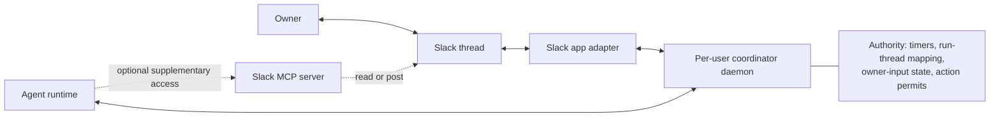
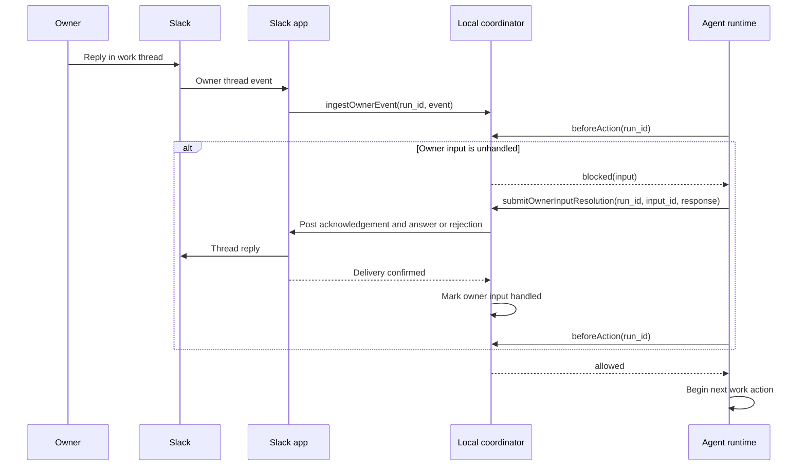
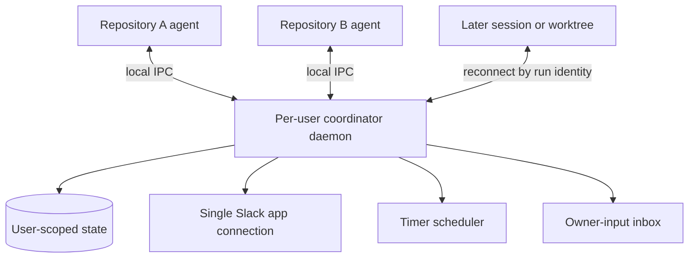

# Slack Agent Work Communication

Inputs: [task request](task.md), [current-state research](01-research-agent-communication.md), and [product requirements](02-prd-slack-agent-communication.md).

### System Design

#### The local coordinator is authoritative across every Slack access path

The repository currently has no Slack transport, scheduled status publisher, run-to-thread mapping, or live owner-steering channel. The target adds a repo-owned coordinator that remains authoritative even when an agent also has a Slack MCP server.



The Slack app is the primary integration. Its adapter creates the root message, posts canonical status and completion messages, and delivers owner thread events to the coordinator. Whether inbound events use Slack HTTP events or Socket Mode remains open.

Slack MCP access is supplementary. An MCP read or post cannot create or change the run-to-thread mapping, advance or clear a status deadline, mark owner input handled, or authorize the agent's next work action. An agent that learns about owner input through MCP must still submit that input to the coordinator and receive a coordinator action permit.

| Concern | Authority | Other paths |
|---|---|---|
| `run_id` to Slack thread mapping | Local coordinator | Slack app and MCP may read the resolved mapping |
| One-hour quiet-status deadline | Local coordinator clock and timer state | Agent activity may reset the deadline only through a coordinator work event |
| Owner identity and unhandled input | Local coordinator | Slack app supplies primary events; MCP observations must carry the same Slack message identity for deduplication |
| Permission to begin the next work action | Local coordinator | Neither the Slack app nor MCP grants permission |
| Slack API access | Slack app adapter | MCP is optional and non-authoritative |

The coordinator gates each work action rather than relying on best-effort polling inside the agent:



`beforeAction` is the only authority for this gate. The exact boundary of a work action and the failure behavior when the coordinator or Slack is unavailable remain open decisions.

#### One per-user daemon outlives agent sessions and worktrees

One supervised daemon runs for the operating-system user and manages Slack-enabled runs from every local repository. The canonical daemon source and installation logic remain repository-owned; its runtime process and state are user-scoped rather than copied into each task worktree.

The daemon owns the Slack app connection, quiet-hour timers, owner-input inbox, and run-to-thread mapping after an agent process exits or becomes idle. A later agent session reconnects through user-local IPC and resumes the same run state. A repository or worktree path identifies where work belongs but does not define the daemon's lifetime.



Run IDs must be globally unique within the user's daemon state and namespaced with repository and task identity. The supervisor, startup/update mechanism, state location and format, and local IPC transport remain open.

### Program Design

#### Coordinator capabilities stay transport-independent

The per-user daemon owns orchestration state and exposes a narrow local API to every supported agent runtime. Slack-specific payloads remain behind the Slack app adapter; the optional MCP client is not injected as daemon state, timer, or supervision.

```text
agent runtime integration
├── startSlackRun(input) ───────────────▶ coordinator.startRun
├── recordWorkEvent(event) ─────────────▶ coordinator.recordWorkEvent
├── beforeAction(runId) ────────────────▶ coordinator.beforeAction
├── submitOwnerInputResolution(result) ─▶ coordinator.resolveOwnerInput
└── finishSlackRun(outcome) ────────────▶ coordinator.finishRun

per-user coordinator daemon
├── run state and thread mapping
├── quiet-status scheduler
├── owner-event inbox and deduplication
├── action-permit gate
└── SlackPort
    └── SlackAppAdapter ────────────────▶ Slack Web API and inbound events

optional agent capability
└── SlackMcpClient ─────────────────────▶ supplementary Slack reads or posts
```

The logical boundary is:

```ts
interface SlackWorkCoordinator {
  startRun(input: StartRunInput): Promise<SlackRunRef>;
  recordWorkEvent(event: WorkEvent): Promise<void>;
  ingestOwnerEvent(event: OwnerThreadEvent): Promise<IngestResult>;
  beforeAction(runId: RunId): Promise<ActionPermit>;
  resolveOwnerInput(result: OwnerInputResolution): Promise<void>;
  finishRun(input: FinishRunInput): Promise<void>;
}

type ActionPermit =
  | { kind: "allowed" }
  | { kind: "blocked"; pending: OwnerInput[] };
```

The state store, user-local IPC transport, and permit fencing remain undecided.

### Type Definitions

The coordinator must hold this logical state regardless of the selected persistence mechanism:

```ts
interface RunLocator {
  runId: RunId;
  repositoryRoot: string;
  worktreeRoot: string;
  taskDirectory: string;
}

interface SlackRunState {
  run: RunLocator;
  ownerSlackUserId: string;
  channelId: string;
  threadTs: string;
  lifecycle: "active" | "completed" | "failed" | "cancelled";
  nextQuietStatusDueAt: string;
  pendingOwnerInputIds: string[];
}
```

The Slack message identity `(channelId, threadTs, messageTs)` is the owner-input idempotency key. Delivery through both the Slack app and MCP must converge on one owner-input record rather than producing two steering actions.

### Local Patterns

- Preserve independent skill use across Claude Code, Codex, Oh My Pi, Pi, and portable installations; optional Atomic integration consumes the same canonical resources (`shared/CONVENTIONS.md:5-9`; `scripts/install.mjs:24-40,146-216`).
- Keep canonical instructions and templates under `skills/delivery/<name>/`, then let runtime generation adapt worker mechanics rather than product behavior (`scripts/lib/build.mjs:15-35,70-120`).
- Treat static/import checks as local contract evidence and require a live Slack trial before claiming hosted delivery or inbound steering works (`docs/testing.md:5-41`).

### What We're Not Doing

- Non-owner comments or steering.
- Jira, GitHub, Linear, or other ticket mutation and Slack-thread link backfill.
- Chat transports other than Slack.
- Automatic Slack enablement for every work run.

### Execution DAG

No execution-plan artifact exists. The task's fixed `prd` workflow continues from the approved TDD through `create-structure-outline`, `create-plan`, `implement-plan`, `verify-implementation`, the review loop, and `describe-pr`.

## Human Review

### Review targets

- System ownership, state flow, and Slack boundary.
- Program module boundaries and dependency seams.

### Verify

- [ ] Confirm the design preserves the PRD's fixed message fields and timing rules.
- [ ] Confirm owner steering takes effect before the next work action.
- [ ] Confirm Slack-disabled runs retain existing workflow behavior.

### Known limits
- Per-user daemon supervision, startup/update mechanism, state location and persistence across restarts.
- Slack app authorization and inbound delivery through HTTP events or Socket Mode.
- The exact work-action boundary, permit lifetime, and fail-open versus fail-closed behavior.
- Slack delivery retry and reconciliation guarantees.
