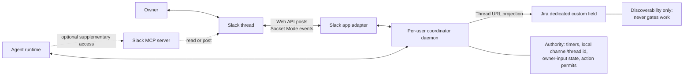
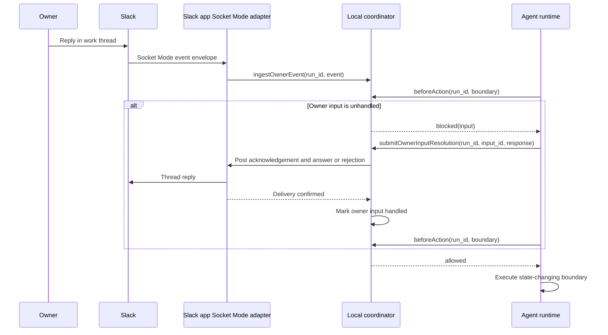
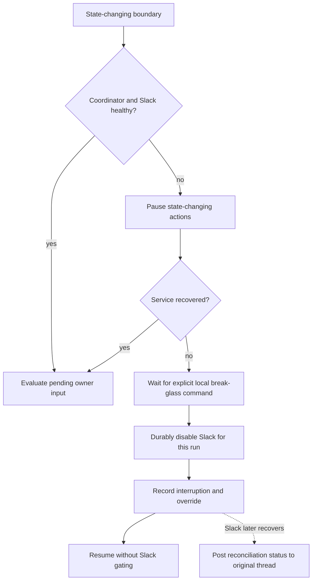
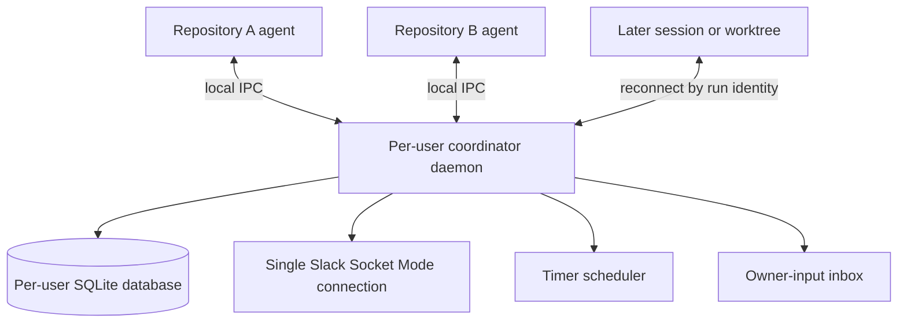
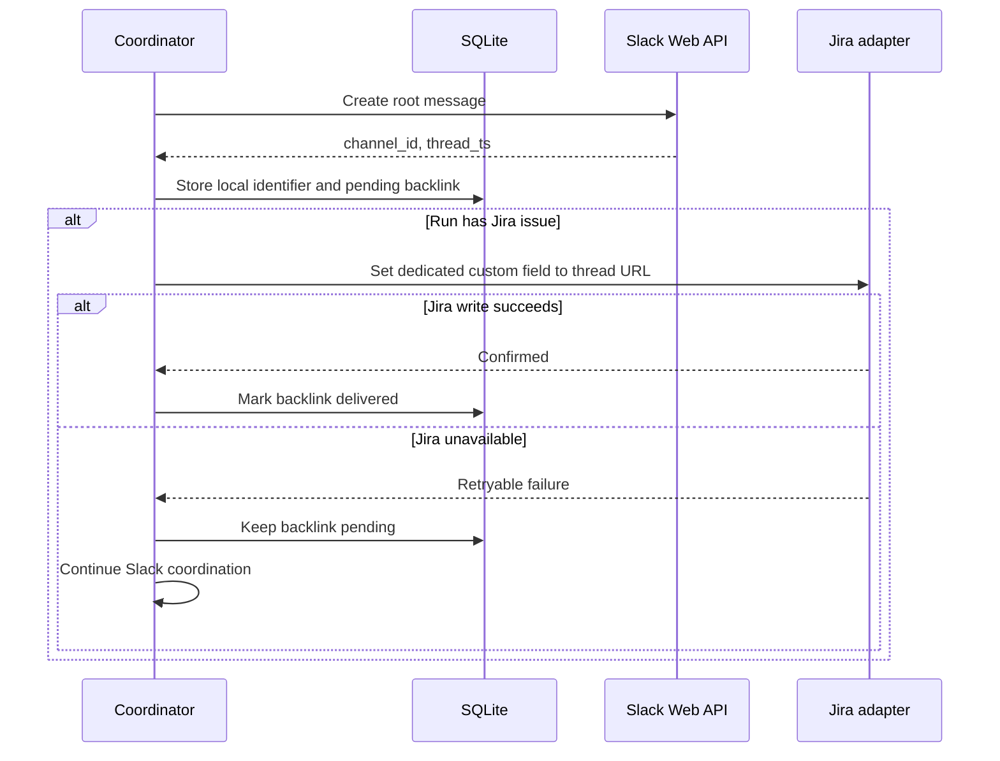

# Slack Agent Work Communication

Inputs: [task request](task.md), [current-state research](01-research-agent-communication.md), and [product requirements](02-prd-slack-agent-communication.md).

### System Design

#### The local coordinator is authoritative across every Slack access path

The repository currently has no Slack transport, scheduled status publisher, run-to-thread mapping, or live owner-steering channel. The target adds a repo-owned coordinator that remains authoritative even when an agent also has a Slack MCP server.



The Slack app is the primary integration. Its adapter creates the root message, posts canonical status and completion messages through the Slack Web API, and receives owner thread events through one daemon-owned Socket Mode connection. The design has no inbound Slack HTTP event endpoint.

Slack MCP access is supplementary. An MCP read or post cannot create or change the run-to-thread mapping, advance or clear a status deadline, mark owner input handled, or authorize the agent's next work action. An agent that learns about owner input through MCP must still submit that input to the coordinator and receive a coordinator action permit.

| Concern | Authority | Other paths |
|---|---|---|
| `run_id` to local Slack channel/thread identifier | Per-user SQLite database | Slack app and MCP may read the resolved identifier |
| Jira-linked thread discovery | Dedicated Jira custom field containing the Slack thread URL | SQLite retains the local identifier and pending projection while Jira is unavailable; Jira never grants permits |
| One-hour quiet-status deadline | Local coordinator clock and timer state | Agent activity may reset the deadline only through a coordinator work event |
| Owner identity and unhandled input | Local coordinator | Slack app supplies primary events; MCP observations must carry the same Slack message identity for deduplication |
| Permission to begin the next work action | Local coordinator | Neither the Slack app nor MCP grants permission |
| Slack API access | Slack app adapter through Socket Mode for inbound events and the Web API for outbound messages | MCP is optional and non-authoritative |

The coordinator gates every state-changing boundary rather than relying on best-effort polling inside the agent:



`beforeAction` is the only authority for this gate. The runtime calls it immediately before every write, edit, command, subagent dispatch, external request, and final response. Pure local reads and local reasoning do not require a permit. Preparing a write or response may proceed locally, but execution waits for `allowed`.

#### Slack-enabled runs fail closed until recovery or local break-glass

A Slack-enabled run pauses state-changing actions when the coordinator is unreachable, Socket Mode is disconnected, or a required Slack message has not been delivered. Recovery restores the gate only after the coordinator can receive owner input and required outbound delivery succeeds.



The break-glass command is a local operator control, not an agent, Slack app, or MCP capability. It must durably record the run, outage cause and start time, override time, and resumed-without-Slack state before work continues. If that record cannot be committed, the run remains paused. The original thread mapping remains available so a later reconciliation status can record the interruption using the existing status message schema. Before break-glass, required delivery includes start, status, completion, owner-response, and reconciliation messages when each becomes due.

#### One per-user daemon outlives agent sessions and worktrees

One supervised daemon runs for the operating-system user and manages Slack-enabled runs from every local repository. The canonical daemon source and installation logic remain repository-owned; its runtime process and state are user-scoped rather than copied into each task worktree.

The daemon owns the Slack app's Socket Mode connection, quiet-hour timers, owner-input inbox, and run-to-thread mapping after an agent process exits or becomes idle. A later agent session reconnects through user-local IPC and resumes the same run state. A repository or worktree path identifies where work belongs but does not define the daemon's lifetime.



Run IDs must be globally unique within the per-user SQLite database and namespaced with repository and task identity. The supervisor, startup/update mechanism, database location, local IPC transport, and Socket Mode reconnect and replay policy remain open.

#### SQLite persists coordinator authority across restarts

One per-user SQLite database is the canonical durable state. The daemon owns normal database access; the local operator control path is the only other authorized writer. Write-ahead logging, foreign-key enforcement, a busy timeout, and explicit transactions protect daemon and break-glass coordination. A schema migration must complete before the daemon accepts IPC or Socket Mode events.

| Table | Key constraints | State owned |
|---|---|---|
| `runs` | `run_id` primary key; unique `(channel_id, thread_ts)` | Run locator, owner, lifecycle, Slack mode, and next quiet-status deadline |
| `owner_inputs` | `input_id` primary key; unique `(channel_id, thread_ts, message_ts)` | Owner message payload, handling state, and resolution |
| `message_deliveries` | `delivery_id` primary key; unique idempotency key per run | Required outbound message, attempts, confirmation, and Slack message identity |
| `action_permits` | `permit_id` primary key | Boundary kind, permit state, fencing data, issue time, and consumption time |
| `interruptions` | `interruption_id` primary key | Availability cause, break-glass transition, local resumption, and reconciliation |
| `schema_migrations` | Migration version primary key | Applied schema version and checksum |
| `jira_backlinks` | `run_id` primary key | Optional Jira issue locator, derived thread URL, custom-field delivery state, attempts, and last error |

The coordinator commits related facts atomically: Slack thread identity with a pending Jira backlink for Jira-linked runs, owner-event deduplication with pending-input state, permit creation with the gate decision, timer advancement with a queued status delivery, and break-glass mode with its interruption record. Process exit between those writes cannot expose a partially applied transition.

#### Jira stores a discoverable backlink, not coordinator authority

After Slack creates the root message, the coordinator stores its channel and thread timestamp in SQLite. For a Jira-linked run, it derives the canonical Slack thread URL, records a pending `jira_backlinks` row in the same transaction, and asks the Jira adapter to write that URL to the configured dedicated custom field.



Jira failure never changes the quiet-status deadline, owner-input state, permit decision, or Slack health. Retrying the same thread URL is idempotent. Runs without a Jira issue do not create a `jira_backlinks` row or call Jira.

### Program Design

#### Coordinator capabilities stay transport-independent

The per-user daemon owns orchestration state and exposes a narrow local API to every supported agent runtime. Slack payloads remain behind the Slack app adapter; Jira custom-field updates remain behind a backlink adapter. The optional MCP client is not injected as daemon state, timer, supervision, or Jira authority.

```text
agent runtime integration
├── startSlackRun(input) ──────────────────────▶ coordinator.startRun
├── recordWorkEvent(event) ────────────────────▶ coordinator.recordWorkEvent
├── executeStateChangingBoundary(runId, action)
│   ├── beforeAction(runId, action.boundary) ──▶ coordinator.beforeAction
│   ├── allowed ───────────────────────────────▶ action.execute
│   └── blocked or unavailable ────────────────▶ pause
├── submitOwnerInputResolution(result) ────────▶ coordinator.resolveOwnerInput
└── finishSlackRun(outcome) ───────────────────▶ coordinator.finishRun

per-user coordinator daemon
├── SQLite operational state
├── quiet-status scheduler
├── owner-event inbox and deduplication
├── action-permit gate
├── SlackPort
│   └── SlackAppAdapter ────────────────▶ Socket Mode events and Slack Web API
└── JiraBacklinkPort
    └── JiraCustomFieldAdapter ─────────▶ Dedicated Jira custom field

optional agent capability
└── SlackMcpClient ─────────────────────▶ supplementary Slack reads or posts
```

The logical boundary is:

```ts
interface SlackWorkCoordinator {
  startRun(input: StartRunInput): Promise<SlackRunRef>;
  recordWorkEvent(event: WorkEvent): Promise<void>;
  ingestOwnerEvent(event: OwnerThreadEvent): Promise<IngestResult>;
  beforeAction(runId: RunId, boundary: ActionBoundaryKind): Promise<ActionPermit>;
  resolveOwnerInput(result: OwnerInputResolution): Promise<void>;
  finishRun(input: FinishRunInput): Promise<void>;
}

interface JiraBacklinkPort {
  writeThreadUrl(backlink: JiraThreadBacklink): Promise<void>;
}

interface LocalOperatorControl {
  disableSlackWithBreakGlass(runId: RunId): Promise<BreakGlassReceipt>;
}

interface BreakGlassReceipt {
  runId: RunId;
  interruptionId: string;
  disabledAt: string;
}

type ActionBoundaryKind =
  | "write"
  | "edit"
  | "command"
  | "subagent_dispatch"
  | "external_request"
  | "final_response";

type ActionPermit =
  | { kind: "allowed" }
  | { kind: "blocked"; pending: OwnerInput[] }
  | { kind: "unavailable"; cause: SlackUnavailableCause };
```

All runtime adapters must route the six `ActionBoundaryKind` operations through one boundary hook. Local file reads and in-process reasoning bypass that hook. A coordinator IPC failure is treated as `unavailable` even though no permit response can arrive. `LocalOperatorControl` is intentionally absent from the agent runtime interface. SQLite is injected behind the coordinator's state-store boundary; user-local IPC and permit fencing remain undecided.

### Type Definitions

The SQLite schema exposes this logical state to the coordinator:

```ts
interface RunLocator {
  runId: RunId;
  repositoryRoot: string;
  worktreeRoot: string;
  taskDirectory: string;
}

interface JiraIssueRef {
  siteId: string;
  issueKey: string;
}

interface JiraThreadBacklink {
  issue: JiraIssueRef;
  threadUrl: string;
}

interface SlackRunState {
  run: RunLocator;
  ownerSlackUserId: string;
  channelId: string;
  threadTs: string;
  lifecycle: "active" | "completed" | "failed" | "cancelled";
  slackMode: "enabled" | "paused_unavailable" | "disabled_break_glass";
  nextQuietStatusDueAt: string;
  pendingOwnerInputIds: string[];
  interruptions: SlackInterruption[];
  jiraIssue: JiraIssueRef | null;
}

interface SlackInterruption {
  interruptionId: string;
  startedAt: string;
  cause: SlackUnavailableCause;
  breakGlassAt: string | null;
  resumedWithoutSlackAt: string | null;
  reconciledMessageTs: string | null;
}

type SlackUnavailableCause =
  | "coordinator_unreachable"
  | "socket_mode_disconnected"
  | "required_delivery_unconfirmed";
```

The Slack message identity `(channelId, threadTs, messageTs)` is the owner-input idempotency key. Delivery through both the Slack app and MCP converges on one owner-input record. The Jira custom field stores the canonical thread URL only as a discoverability projection; SQLite retains the channel/thread identifier and pending write state required for live coordination and outage recovery.

### Configuration

- Store exactly one SQLite database in the operating-system user's application-state directory, never in a repository or worktree. The exact platform path remains open.
- Enable write-ahead logging, foreign keys, and a bounded busy timeout on every connection.
- Run ordered, transactional schema migrations before opening Socket Mode or local IPC.
- Keep Slack credentials outside SQLite; the authorization and secret-storage mechanism remains open.
- Configure one dedicated Jira custom-field identifier for each supported Jira site; never use a label as fallback.
- Keep Jira credentials outside SQLite. Jira authorization, field provisioning, and secret storage remain open.

### Local Patterns

- Preserve independent skill use across Claude Code, Codex, Oh My Pi, Pi, and portable installations; optional Atomic integration consumes the same canonical resources (`shared/CONVENTIONS.md:5-9`; `scripts/install.mjs:24-40,146-216`).
- Keep canonical instructions and templates under `skills/delivery/<name>/`, then let runtime generation adapt worker mechanics rather than product behavior (`scripts/lib/build.mjs:15-35,70-120`).
- Treat static/import checks as local contract evidence and require a live Slack trial before claiming hosted delivery or inbound steering works (`docs/testing.md:5-41`).

### What We're Not Doing

- Non-owner comments or steering.
- Jira issue mutations other than writing the Slack thread URL to the dedicated custom field.
- Jira labels and GitHub, Linear, or other ticket-system backlinks.
- Chat transports other than Slack.
- Automatic Slack enablement for every work run.

### Execution DAG

No execution-plan artifact exists. The task's fixed `prd` workflow continues from the approved TDD through `create-structure-outline`, `create-plan`, `implement-plan`, `verify-implementation`, the review loop, and `describe-pr`.

## Human Review

### Review targets

- System ownership, state flow, and Slack boundary.
- Program module boundaries and dependency seams.

### Verify

- [ ] Confirm the design preserves the PRD's fixed message fields and timing rules.
- [ ] Confirm inbound Slack events use Socket Mode only and no HTTP event endpoint is introduced.
- [ ] Confirm owner steering takes effect before every write, edit, command, subagent dispatch, external request, and final response.
- [ ] Confirm an unavailable coordinator, Socket Mode connection, or required Slack delivery pauses state-changing actions until recovery or durable local break-glass.
- [ ] Confirm one per-user SQLite database durably owns coordinator-only timers, owner input, permits, deduplication, interruptions, and the local channel/thread identifier.
- [ ] Confirm a Jira-linked run projects its Slack thread URL to a dedicated custom field without giving Jira authority over timers, steering, or permits.
- [ ] Confirm Jira outages leave the backlink pending without pausing Slack coordination and non-Jira runs stay local-only.
- [ ] Confirm Slack-disabled runs retain existing workflow behavior.

### Known limits
- Per-user daemon supervision, startup/update mechanism, SQLite file location, driver packaging, migrations, and backup policy.
- Slack app installation, authorization, and Socket Mode reconnect, acknowledgement, and replay behavior.
- The exact permit-fencing mechanism and local break-glass command/control channel.
- Jira authorization, custom-field provisioning, existing-value conflicts, and retry guarantees.
- Slack retry schedule, replay ordering, and reconciliation delivery guarantees.
