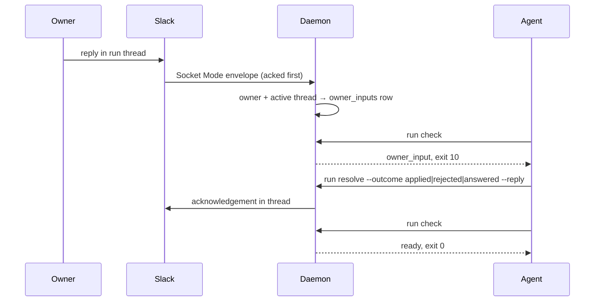

Task: `i-want-new-skill`

## Purpose

Agents had no way to report a run to Slack or to hear the run owner; this PR adds `tools/slack-coordinator/`, a Go daemon and CLI that post one Slack thread per run (root, status, completion) and gate every state-changing action on the owner's replies in that thread, plus the `slack-coordinator` skill that tells agents when to call it.

## Special things to note

- The CLI reads `config.yaml` and calls Slack with the bot token to resolve the channel before `run start` reaches the daemon (`internal/cli/run_start.go:43-62`); every other Slack call happens in the daemon. `run check`, `run event`, and `run finish` exit `11` when no daemon answers or a post fails; agents must pause, never bypass.
- `references/messages.md` marks `--work`, `--goal`, `--scope` as required, but `run start` does not enforce them (`internal/cli/run_start.go:80-82`, `internal/coordinator/start_run.go:47-56`); a run can start with an all-`None` root. A `chat.getPermalink` failure after a successful root post returns exit `2` with no `runs` row, so a retry with the same `--run-id` posts a second root (`start_run.go:77-80`).
- Live Slack, Socket Mode inbound, launchd/systemd restart, and Jira writes are not automated; tests inject `Health` and inbound events and use `httptest` fakes. The plan lists six deferred human trials under `.agents/tasks/i-want-new-skill/evidence/`; none has been run yet.

## Change outline

One new Go module, one new skill, and repository wiring:

```text
tools/slack-coordinator/
  cmd/slack-coordinator/        os.Exit(cli.Execute())
  internal/cli/                 setup · daemon start|stop|status|serve · service install|uninstall|status
                                run start|event|check|resolve|finish|disable-slack; exit codes 0/1/2/10/11/12
  internal/daemon/              flock singleton, Serve (SQLite, IPC, Socket Mode, scheduler), launchd/systemd Service
  internal/ipc/                 JSON-RPC 2.0 over Unix socket; ErrUnavailable -32000 → exit 11
  internal/coordinator/         StartRun, RecordWorkEvent, FinishRun, CheckBeforeWrite, ConsumeInbound,
                                ResolveOwnerInput, DisableSlackForRun, StatusScheduler, Jira backlink retry
  internal/db/                  modernc sqlite; tables runs, owner_inputs, jira_backlinks
  internal/slackapi/            Web API adapter (slack-go v0.29.0), SocketMode health + inbound
  internal/channel/             `Slack default channel:` directive, #name / C… resolution
  internal/jira/                PUT /rest/api/3/issue/{key} custom field
  slack-app-manifest.yaml       bot scopes and events for the person to paste
skills/delivery/slack-coordinator/   SKILL.md + references/{commands,channel-selection,messages}.md
docs/slack-coordinator.md · docs/testing.md · README.md · workflows/delivery.md · .changeset/slack-coordinator.md
scripts/validate.mjs EXPECTED_SKILL_COUNT 47 → 48 · package.json test:slack-coordinator · .claude-plugin/plugin.json
```

`run check` is the contract agents branch on; the daemon evaluates it in this order:

```text
run.check(run_id)
  GetRun                     → error (exit 2) when unknown
  slack_mode == disabled     → {"kind":"slack_disabled"}            exit 12
  socket_mode != connected   → {"kind":"unavailable","reason":…}    exit 11
  last_delivery_error set    → {"kind":"unavailable","reason":…}    exit 11
  oldest unhandled owner reply → {"kind":"owner_input","input":{…}} exit 10
  otherwise                  → {"kind":"ready"}                      exit 0
  every answer carries "run":{run_id,channel_id,permalink}
  no daemon: CLI prints {"kind":"unavailable","reason":"daemon unreachable: …"} exit 11
```

Owner steering flow:



Read `internal/coordinator/check.go` first; every other verb exists to feed or clear one of its branches.

## Human Review

### Review targets

- `internal/coordinator/check.go`: gate order and the `run` summary on every answer.
- `internal/cli/runtime.go` `daemonErr` and `internal/coordinator/handlers.go` `rpcError`: only `*DeliveryError` becomes `-32000`/exit `11`; a permalink failure after a successful root post is exit `2`.
- `internal/cli/run_start.go`: root fields not enforced although `references/messages.md` says required; the CLI holds the bot token for channel resolution.
- `internal/slackapi/socketmode.go`: `Connecting`, `ConnectionError`, `InvalidAuth`, `Disconnect` all read `disconnected`; `Hello` is dropped; `Inbound` buffers 50.
- `internal/daemon/service.go`: plist at `<home>/slack-coordinator.plist` (mirrors Safety Dance, not `~/Library/LaunchAgents`); systemd unit `com.marktripoli.slack-coordinator.service`.
- `internal/cli/setup.go`: an exported `JIRA_API_TOKEN` without the three Jira flags exits `2`.
- Plan and receipts: [05-plan-slack-agent-communication.md](.agents/tasks/i-want-new-skill/05-plan-slack-agent-communication.md), [14-implementation-slack-agent-communication.md](.agents/tasks/i-want-new-skill/14-implementation-slack-agent-communication.md).

### Verify

- [ ] `npm test` passes on the head commit (validate 48 skills, plugin check, Node tests, `test:safety-dance`, `test:slack-coordinator`).
- [ ] `cd tools/slack-coordinator && go test -race -count=1 ./...` passes; `GOOS=linux go build ./...` builds.
- [ ] `HOME=$(mktemp -d) node scripts/install.mjs portable --skill slack-coordinator --yes` installs `SKILL.md` and the three references.
- [ ] Decide whether `--work/--goal/--scope` become required flags or `references/messages.md` changes to `None`.

### Known limits

- A live WebSocket is never exercised; Socket Mode state and inbound envelopes are proven with injected values and a fake `apps.connections.open`.
- `run check` is a coordination gate, not a transaction around the external side effect.
- Windows is neither built nor tested; `service install` on an unsupported GOOS exits `2`.
- launchd `KeepAlive` restarts a daemon stopped with `daemon stop`; `service uninstall` stops supervision; start-at-login depends on the plist location.
- Delivery retry reposts `last_status` or an all-`None` status, never the root; root fields are not stored in `runs`.
