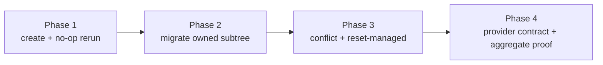

# Repository Onboarding Implementation Outline

Ship local repository metadata reconciliation before any provider mutation. Each phase extends the same standalone skill and proves one observable obligation against temporary repositories, while collection packaging and documentation stay synchronized with the first usable slice.

## Desired End State

- `/setup-repository` observes, validates, plans, applies, and verifies local `ai-utilities.json` changes in `reconcile` or explicit `reset-managed` mode.
- A first run writes only minimal metadata; an identical second run is byte-for-byte unchanged and plans no external operations.
- Reruns preserve user-owned `vcs` and `ticketing` choices plus unknown fields, and migrate only the versioned `onboarding` subtree.
- Invalid JSON, unsupported newer schemas, foreign name matches, and managed drift stop unsafe mutation with an exact conflict report.
- The installed collection exposes the skill across supported runtimes and documents how to invoke it without adding a delivery phase or Atomic node.

## Phase Checklist

- [ ] Phase 1: Installable first run and idempotent rerun
- [ ] Phase 2: Owned-subtree migration with foreign-state preservation
- [ ] Phase 3: Fail-closed conflicts and explicit managed reset
- [ ] Phase 4: Provider contract fixtures and release proof

## Execution DAG



The phases are sequential because each later fixture extends the reconciliation contract established by the prior phase. No phase depends on installer changes, workflow registration, Atomic execution, or live provider credentials.

---

## Phase 1: Installable first run and idempotent rerun

Create the smallest usable `/setup-repository` path: install the standalone skill, write minimal local metadata from explicit or unambiguous evidence, report unresolved choices, and make the identical rerun a verified no-op. This phase also adds the collection metadata required for that slice to pass repository checks and be discoverable.

**Depends on:** None.

### Change Outline

```diff
 skills/
+├── setup-repository/
+│   ├── SKILL.md                         # observe → validate → plan → apply → verify
+│   └── references/
+│       ├── repository-metadata.md       # schema v1 and field ownership
+│       ├── setup-receipt-template.md    # detected/written/skipped/conflict result
+│       └── setup-final-answer.md         # terminal rerun/failure handoff
 scripts/
+├── validate.mjs                         # 44 skills; terminal answer inventory
 .claude-plugin/
+├── plugin.json                          # generated standalone skill entry
 tests/
+├── install.test.mjs                     # selected install carries skill references
 evals/
+├── run.mjs                              # opt-in terminal repository-mutation grading
+├── scenarios/setup-repository-basic.mjs # first run followed by identical rerun
+└── fixtures/setup-repository-basic/     # repository evidence and expected metadata
 docs/
+├── getting-started.md                   # run setup before manual phases
+├── cheatsheet.md                        # invocation and canonical source location
+└── testing.md                           # standalone-skill validation/eval path
+README.md                                # canonical standalone skill discoverability
 .changeset/
+└── setup-repository.md                  # minor: new user-facing skill
```

`SKILL.md` accepts the current repository and one optional mode, defaulting to `reconcile`. It reads any existing file before planning, writes through parse-and-merge only when serialized content differs, rereads after a write, and never invokes a provider API in this release.

```text
observe local repository + ai-utilities.json
  → validate JSON, schema support, and non-secret fields
  → plan exact local diff
  → apply only when planned bytes differ
  → reread and compare with plan
  → print receipt; no next-skill fence
```

The eval runner gains a narrow opt-in phase kind for terminal skills that may change declared repository paths. Existing artifact-phase grading remains the default. The basic scenario runs `/setup-repository` twice in one temporary repository and compares the second run's file bytes and per-phase changed-path set with the first result.

Acceptance:

- WHEN `ai-utilities.json` is absent, the skill shall create schema-v1 `onboarding` state and only provider choices supported by explicit or unambiguous evidence.
- WHEN the resulting repository is reconciled again without changed inputs, the skill shall leave `ai-utilities.json` byte-for-byte unchanged and report zero external operations.
- IF a candidate value is ambiguous, THEN the skill shall report the unresolved choice without guessing or writing credentials.

### Validation

#### Automated Verification

- [ ] `node scripts/validate.mjs`
- [ ] `node scripts/sync-plugin.mjs --check`
- [ ] `node --test tests/install.test.mjs`
- [ ] `npm run evals -- setup-repository-basic --keep`

human-gated: false

---

## Phase 2: Owned-subtree migration with foreign-state preservation

Add supported schema and collection-revision migration while preserving every field outside the owned seam. The phase is independently observable as a rerun that changes only `onboarding` and reaches a stable no-op on its next execution.

**Depends on:** Phase 1.

### Change Outline

```diff
 skills/setup-repository/
 ├── SKILL.md
 └── references/
     └── repository-metadata.md               # migration table and ownership boundaries
 evals/
+├── scenarios/setup-repository-migration.mjs # old revision → current → no-op
+└── fixtures/setup-repository-migration/
+    ├── ai-utilities.json                    # user choices + unknown keys + old onboarding
+    └── expected-ai-utilities.json           # only onboarding differs
```

The metadata reference owns the supported migration table. A migration starts from the parsed document, preserves top-level user and unknown values, transforms only `onboarding`, and updates `appliedRevision` after the owned state reaches the current profile revision.

```diff
 {
   "vcs": { "platform": "github" },
   "ticketing": { "tool": "github-issues" },
   "custom": { "keep": true },
   "onboarding": {
-    "schemaVersion": 0,
-    "appliedRevision": 0
+    "schemaVersion": 1,
+    "profile": "default",
+    "appliedRevision": 1,
+    "providers": {}
   }
 }
```

Acceptance:

- WHEN metadata contains a supported older onboarding schema, the skill shall migrate only the `onboarding` subtree to the current schema and revision.
- WHEN metadata contains user-owned provider choices or unknown fields, the skill shall preserve their values and object structure through migration.
- WHEN the migrated repository is reconciled again, the skill shall produce no file diff.

### Validation

#### Automated Verification

- [ ] `node scripts/validate.mjs`
- [ ] `npm run evals -- setup-repository-migration --keep`

human-gated: false

---

## Phase 3: Fail-closed conflicts and explicit managed reset

Complete the local safety envelope. Default reconciliation stops before writes on invalid or unowned state; `reset-managed` replaces only proven onboarding-owned state and never widens authority to provider choices, unknown fields, or remote resources.

**Depends on:** Phase 2.

### Change Outline

```diff
 skills/setup-repository/
 ├── SKILL.md                               # conflict matrix and reset-managed branch
 └── references/
     ├── repository-metadata.md             # unsupported schema, drift, identity rules
     ├── setup-receipt-template.md          # partial/conflict/unsupported outcomes
     └── setup-final-answer.md               # exact rerun command and blocked reason
 evals/
+├── scenarios/setup-repository-safety.mjs  # no-write matrix + scoped reset
+└── fixtures/setup-repository-safety/
+    ├── invalid-json/
+    ├── newer-schema/
+    ├── foreign-name-match/
+    ├── managed-drift/
+    └── reset-managed/
```

```text
invalid JSON or schemaVersion > supported
  → conflict → zero writes

name match without onboarding.providers.<provider>.id
  → foreign resource → zero remote operations

recorded identity + current digest != lastAppliedDigest
  → drift → reconcile preserves state
  → reset-managed may reapply only that recorded identity
```

The safety scenario snapshots each fixture before invocation and permits only an expected `ai-utilities.json` change. Invalid JSON, newer schemas, foreign name matches, and default-mode drift must preserve the complete fixture. The reset fixture must preserve `vcs`, `ticketing`, unknown keys, and unrecorded resources while replacing only `onboarding` state proven owned.

Acceptance:

- IF JSON is invalid or `onboarding.schemaVersion` is newer than supported, THEN the skill shall stop before all writes and report the exact validation conflict.
- IF a remote name lacks a recorded provider-stable identifier, THEN the skill shall classify it as foreign and plan no mutation.
- IF recorded managed state differs from its last-applied digest in `reconcile`, THEN the skill shall report drift and preserve it.
- WHEN `reset-managed` is explicit, the skill shall rebuild only `onboarding` and state tied to recorded stable identities while preserving user and unknown fields.

### Validation

#### Automated Verification

- [ ] `node scripts/validate.mjs`
- [ ] `npm run evals -- setup-repository-safety --keep`

human-gated: false

---

## Phase 4: Provider contract fixtures and release proof

Freeze the future adapter boundary without implementing an adapter. Offline fixtures define the shared outcome vocabulary and ownership record, then aggregate repository checks prove the standalone skill remains portable and does not enter delivery or Atomic orchestration.

**Depends on:** Phase 3.

### Change Outline

```diff
 skills/setup-repository/references/
 └── repository-metadata.md                    # adapter seam; no generic label model
 tests/
+├── setup-repository-contract.test.mjs        # fixture completeness and forbidden upsert shape
+└── fixtures/setup-repository/
+    └── provider-outcomes.json                # create/update/no-op/conflict/unsupported
 docs/
 ├── getting-started.md
 ├── cheatsheet.md
 └── testing.md                                # final command inventory and evidence limits
```

```text
observe(context, priorOwnedState) -> providerSnapshot
plan(snapshot, priorOwnedState, profileRevision)
  -> create | update | no-op | conflict | unsupported
apply(plan)
  -> operations + { logicalKey, stableId, lastAppliedDigest }
```

The fixture keeps desired resource shapes provider-specific. Its shared fields stop at result category and ownership evidence; it contains no `upsertLabel`, provider-neutral label object, credentials, or live endpoint. Jira may return `unsupported`; GitHub and Linear remain future adapters with separate authenticated evidence.

No changes are made to `scripts/install.mjs`, `workflows/delivery.md`, `atomic/workflows/delivery.ts`, or delivery phase tables. Direct skill discovery already comes from `scripts/lib/layout.mjs`; runtime parity comes from build and plugin-sync checks.

Acceptance:

- WHEN an adapter fixture is evaluated, the contract shall classify it as exactly one of `create`, `update`, `no-op`, `conflict`, or `unsupported` and record stable identity only for owned applied resources.
- The first release shall perform zero Linear, Jira, or GitHub Issues API mutations and shall define no generic label-upsert operation.
- The aggregate repository and generated-runtime checks shall pass with 44 canonical skills and the synchronized plugin inventory.

### Validation

#### Automated Verification

- [ ] `node --test tests/setup-repository-contract.test.mjs`
- [ ] `npm test`
- [ ] `npm run build -- --runtime portable && node scripts/validate.mjs --root dist/portable`
- [ ] `npm run evals -- setup-repository-basic setup-repository-migration setup-repository-safety --keep`

human-gated: false

#### Deferred human evidence (recorded, not a gate)

- Authenticated provider behavior remains unclaimed until a later adapter records live provider-specific evidence.

---

## Open Questions

None.

## Human Review

### Review targets

- Phase 1 is a complete local walking skeleton: installation, first write, no-op rerun, docs, changeset, and behavior evidence land together.
- Phases 2 and 3 extend only local metadata ownership and safety; no slice adds provider API mutation.
- Phase 4 fixes a provider-specific adapter seam without a generic label object or `upsertLabel` contract.
- `scripts/install.mjs`, delivery workflow documentation, phase tables, and Atomic controller remain unchanged because the skill is independently discovered and invoked.

### Verify

- [ ] Each phase names one observable reconciliation obligation, its dependency, exact changed files, and runnable acceptance checks.
- [ ] The DAG orders create/no-op before migration, safety/reset, and future provider contract proof.
- [ ] Idempotency, migration preservation, invalid/newer-schema rejection, foreign identity, drift, and scoped reset all have temporary-repository fixtures.
- [ ] Canonical skill files, validation inventory, plugin runtime sync, install tests, live evals, changeset, and docs discoverability are included.
- [ ] The first release is local-only: no provider API mutation, installer ownership change, delivery phase, or Atomic node is planned.

### Known limits

- Live skill evals require OMP and a configured model; `npm test` remains credential-free offline evidence.
- Provider-contract fixtures prove only the outcome and ownership shapes, not authenticated Linear, Jira, or GitHub behavior.
- Loss of `ai-utilities.json` loses remote ownership records; matching remote names remain foreign until a separate adoption design is approved.
