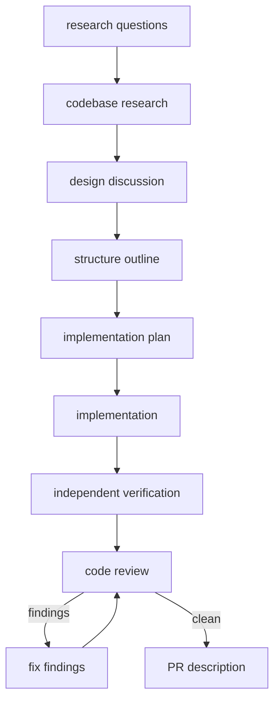

### Summary of change request

Delivery should use economical models by default, escalate to a stronger model through JEV only when the phase requires it, and select only from models available to the active runtime or account. The change covers the shared delivery workflow and model-selection boundary, not provider-specific billing or private SDK integration.

### Current State

- Delivery has an ordinary model and a reasoning model, with Luna-fast and Sol defaults.
- JEV chooses economy or reasoning for an allowlist of non-code phases; mutation, tool-oriented, and unknown phases use the ordinary model without JEV.
- Model identifiers are accepted as non-empty strings and passed directly to the native task runner.
- No available-model set or capability check exists in the workflow inputs, runtime adapters, or installer.

### Desired End State

- A delivery invocation can provide the model identifiers available to its active runtime or account.
- The ordinary economical model remains the default when it is available.
- JEV can escalate an eligible phase only to an available reasoning model; it cannot select an unavailable configured model.
- Fixed routing and existing callers remain compatible when no availability list is provided.
- The selection record explains configured candidates, available candidates, source, JEV probabilities, and the chosen model.
- Missing availability, invalid model names, unavailable reasoning candidates, and JEV failures have explicit, testable behavior rather than silently selecting a high-cost or unavailable model.

### What we're not doing

- No provider-private registry import, catalog scraping, account probing, billing lookup, or automatic discovery protocol.
- No model fallback after a native provider execution failure. Availability is caller-supplied configuration, not a claim that a provider accepted the request.
- No JEV routing for implementation, review-fix mutation, reproduction, app-driving, recording, or unknown stages.
- No changes to runtime installation destinations or worker generation.
- No new pricing model or model quality benchmark.

### Proposed End State Architecture

The caller owns the authoritative available-model list because the repository supports multiple runtimes and providers without a shared capability API. The router normalizes configured candidates, intersects them with availability, and then applies stage policy:

```text
workflow inputs
  ├─ model: economical candidate
  ├─ reasoning_model: escalation candidate
  └─ available_models: caller/runtime capability list
       │
       v
selectStageModel
  ├─ validate model strings and availability
  ├─ mutation/tool/unknown -> available economy candidate only
  └─ eligible non-code -> JEV(economy|reasoning over available candidates)
       │
       v
  selection record -> ctx.task({ model: selected.availableModel })
```

The default compatibility path treats the configured `model` and `reasoning_model` as the available candidates when `available_models` is omitted. An explicitly supplied empty list has no executable candidate and fails before a task starts. For an eligible phase with only the economy candidate available, JEV is not called because escalation is impossible; the economy candidate is selected by policy. For a non-code phase with both candidates available, JEV decides whether escalation is necessary.

### Design Questions

#### Should availability be discovered by this repository or supplied by the caller?

- Option A: Import each runtime/provider's private model registry. This could discover more names but couples the shared skill repository to provider internals and account-specific authentication.
- Option B: Probe every configured model before each stage. This observes real access but adds latency, provider side effects, and inconsistent semantics across runtimes.
- Option C: Accept an explicit available-model set at the delivery boundary. This keeps the shared layer provider-neutral and makes the selected set visible and testable, while requiring the runtime or caller to supply current capability information.

Recommendation: Option C. The research found no shared provider capability API, and the documentation already treats catalog membership as distinct from authenticated availability (`docs/model-routing.md:38-42`).

### Resolved Design Questions

#### Economical default

Use the ordinary `model` candidate as the default and keep its existing Luna-fast default. JEV may choose the stronger candidate only for eligible non-code phases and only when that candidate is present in the available set. This preserves the existing policy split in `atomic/lib/models.mjs:9-40,110-112`.

#### Missing availability input

Treat omission as backward-compatible implicit availability of the two configured candidates. Treat an explicit empty list as unavailable configuration and fail before execution. This preserves existing callers while making an explicit capability claim enforceable.

#### JEV failure and unavailable escalation

Keep eligible-phase JEV failures fail-closed. If the reasoning candidate is unavailable but the economy candidate is available, select economy by policy without calling JEV because there is no escalation decision to make. Never silently replace a missing economy candidate with the stronger model.

#### Record shape

Extend the existing selection record with normalized available candidates and the candidates offered to JEV. Preserve `source`, `confidence`, `probabilities`, and usage. Do not record secrets or provider responses.

### Patterns to follow

#### Typed choice validation and fail-closed routing

The router already validates exact JEV choice envelopes and probability maps before selecting a configured model (`atomic/lib/models.mjs:64-95`). Extend this boundary rather than parsing prose or adding a second selection protocol.

```js
if (routing === 'fixed') return fixedRecord(model);
if (CODE_WRITING_SKILLS.has(skill) || !JEV_ELIGIBLE_SKILLS.has(skill)) return policyRecord(model);
```

```js
const available = normalizeAvailableModels(options.availableModels, model, reasoning);
const candidates = available.has(reasoning) ? ['economy', 'reasoning'] : ['economy'];
```

#### Selection persistence

`runSkill` already saves the selected model, the model-selection record, and JEV usage beside each stage (`atomic/lib/controller.mjs:222-251`). Pass the new workflow input through this existing call and keep the record serializable.

#### Isolated model-router tests

`tests/atomic-model-routing.test.mjs:8-20` creates a temporary JEV helper and tests policy, service failure, malformed choices, and selected-model records without requiring a live provider. Add availability cases to that fixture style.

### Execution DAG

The task uses the `full` chain from `workflows/delivery.md` with `gates=none`: research questions, codebase research, design discussion, structure outline, detailed plan, implementation, independent verification, review/fix loop, and PR description. All transitions run autonomously; independent verification and clean review remain required before the PR description. No app-test phase is requested.



## Human Review

### Review targets

- The explicit caller-owned availability boundary and backward-compatible omission behavior.
- The economy-first policy, JEV escalation eligibility, fail-closed errors, and selection-record fields.
- The exclusion of provider-private discovery and native execution fallback.

### Verify

- [ ] Unit tests prove an unavailable reasoning model cannot be selected and an available reasoning model is selected only by JEV for eligible phases.
- [ ] Unit tests prove mutation and unknown phases use only the available economy candidate and fail when it is unavailable.
- [ ] Repository checks pass without requiring live provider credentials.

### Known limits

- The caller or runtime adapter must provide truthful availability; this design does not verify account access by making provider calls.
- Pi has no worker tool, so worker research roles were performed inline.
