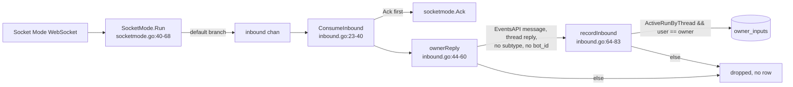
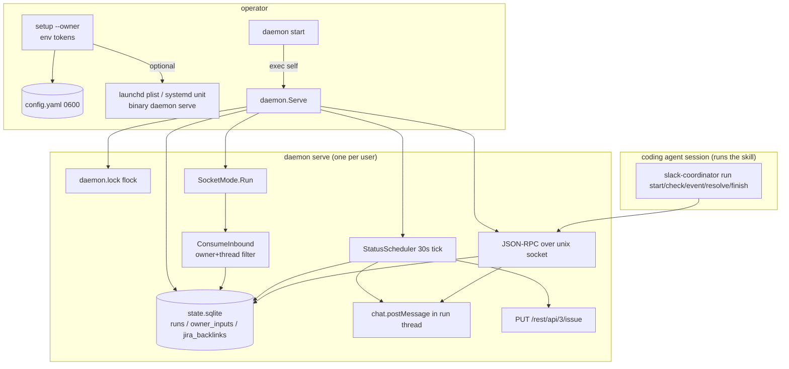

# Research: slack-coordinator baseline for the assistant-bot program

**Date**: 2026-09-22T15:24:56Z
**Git Commit**: 3dd7517992ed9e3250d84262c11d8e8db623fd41
**Branch**: epic-slack-assistant-bot-dms
**Repository**: skills

## Research Question

1. Owner model: where the owner is set, whether it can vary per run, and where non-owner input is dropped.
2. Inbound path: how Socket Mode events reach the coordinator, what the manifest subscribes to, and what a DM (`message.im`) would hit today.
3. Outbound path: how messages are posted and whether there is any way to send a DM or post outside a run thread.
4. Scheduling and persistence: what the StatusScheduler and Jira backlink retry loop do, the SQLite tables and migration pattern, and what a standing task (channel subscription, schedule, instruction, collected messages, results) would need.
5. Executor: how the daemon spawns processes today (daemon start child, service definitions), and how a headless coding agent could be invoked from the daemon (`omp`, `claude -p`, `codex exec` flags found on this machine or documented in the repo).
6. Onboarding: what `setup` does now, which tokens and scopes it validates, how Safety Dance or other tools in this repo onboard users, and what the wizard skill offers.
7. Skill packaging: how slack-coordinator `SKILL.md` and references are wired into `validate.mjs`, `install.mjs`, `sync-plugin`, docs, and the changeset.

## Research Methodology

This document records current behavior only. It does not recommend implementation work, refactors, optimizations, or future changes.

Sources: the Go module `tools/slack-coordinator/` at commit `3dd7517`, `skills/delivery/slack-coordinator/`, `docs/slack-coordinator.md`, the collection's `scripts/`, `.changeset/`, and `package.json`, the sibling module `tools/safety-dance/internal/agent/`, the installed `~/.agents/skills/wizard/` skill (not part of this repository), and `--help` output of the `omp`, `claude`, and `codex` binaries on this machine. Five analyzer/pattern-finder workers read the module; the load-bearing files (`inbound.go`, `slack-app-manifest.yaml`, the Safety Dance adapters) were re-read directly. Pointers under `tools/slack-coordinator/` are written relative to that module as `internal/...`, `cmd/...`, and `slack-app-manifest.yaml`; every other pointer is repository-root relative. Live Slack, launchd, and systemd behavior was not exercised; `docs/slack-coordinator.md:48` places that evidence under `.agents/tasks/i-want-new-skill/evidence/`, which was not read.

### Known limits

- Slack's server-side handling of an unsubscribed `message.im` event is inferred from the manifest; the repository contains no DM delivery evidence.
- The `wizard` skill is cited from its installed copy at `~/.agents/skills/wizard/`; it is not in this checkout.
- Questions 4 (standing-task fields) and 5 (headless invocation) are answered as current-state inventories: what exists and what has no counterpart. No design is proposed.

## Summary

The daemon is a per-user bridge between coding-agent sessions and one Slack thread per run. One owner id lives in `config.yaml` and is copied into each `runs` row at start; `run start --owner` replaces it for that run, and nothing changes it afterwards. Inbound Socket Mode envelopes are acked unconditionally and then pass a single predicate: Events API `message`, in a thread, no subtype, no `bot_id`, whose `(channel, thread_ts)` matches an active run and whose `user` equals that run's stored owner. Everything else, including any DM, is dropped without a row or a log line. The Slack app manifest asks only for `chat:write`, `channels:*`, `groups:*`, `users:read` and subscribes to `message.channels`/`message.groups`; no `im:*` scope or `message.im` event exists anywhere in the module. Outbound writes are `chat.postMessage` (root without `thread_ts`, everything else with it) and `chat.getPermalink`; the channel id must match `^[CG][A-Z0-9]{8,}$` or resolve as a `#name` through `conversations.list`, so no `D…` target can be produced and no `conversations.open`/`chat.update` call exists.

Persistence is one SQLite file with three tables. The StatusScheduler ticks every 30 s, reposting each active run's last status once its 1 h quiet interval lapses, retrying runs with `last_delivery_error`, and retrying `jira_backlinks` with `min(1h, 30s << attempts)` backoff. There is no version table: `schemaSQL` is `CREATE TABLE IF NOT EXISTS` and `migrationStatements` are `ALTER TABLE ... ADD COLUMN` with `duplicate column name` tolerated. Today no table holds a channel independent of a run, a recurring schedule, an instruction text, a non-owner message, or a completion payload.

The daemon spawns three things: itself (`daemon start` re-execs `<exe> daemon serve` with stdio to `daemon.log`), `git rev-parse --show-toplevel`, and `launchctl`/`systemctl` for service install. It never invokes a coding agent. The sibling `tools/safety-dance` module has adapters that run `claude -p --verbose --output-format stream-json` with the prompt on stdin, `codex exec [resume <id>]` with the prompt on stdin, and `pi --mode json --no-session`; this machine has `omp -p` (with `--mode json`, `--auto-approve`, `--max-time`), `claude -p` (`--output-format json|stream-json`, `--permission-mode`), and `codex exec` (`--json`, `-o`, `--sandbox`, `-C`).

`setup` is non-interactive: tokens from `SLACK_BOT_TOKEN`/`SLACK_APP_TOKEN`, owner from `--owner`, prefix validation (`xoxb-`, `xapp-`, `U|W`), `auth.test`, `apps.connections.open`, then `config.yaml` at mode 0600 and optionally a launchd/systemd service. No scope is inspected. The human steps in `docs/slack-coordinator.md` are creating the app from the manifest, installing it, creating the app-level token, and inviting the bot to channels. Safety Dance is the one other onboarding flow in the repo (a stdin-prompt `wizard` command with compensation on failure); the `wizard` skill generates a bash walkthrough script and is installed on this machine but not in this repository. The skill is packaged identically to `safety-dance`: two-key frontmatter, the shared line 6, three references, a `docs/<name>.md`, a `README.md` section, a row in `workflows/delivery.md`, a `.changeset` `minor` entry, and Go tests wired into `npm test` through `test:slack-coordinator`.

## Detailed Findings

### 1. One owner per run, defaulted from config and overridable at `run start`

The owner is a single Slack user id stored in `config.yaml` under `slack.owner_user_id` (`internal/config/config.go:16-22`). `Validate` requires the `U` or `W` prefix (`internal/config/config.go:82-83`), and `Load` calls `Validate`, so a config without an owner does not load (`internal/config/config.go:52`). `setup` sets it from the `--owner` flag; there is no prompt (`internal/cli/setup.go:19`, `internal/cli/setup.go:82`).

Each run copies an owner into its row. `run start --owner` defaults to the config value when empty (`internal/cli/run_start.go:67-69`, flag at `internal/cli/run_start.go:84`) and sends it as `StartRunInput.OwnerUserID` (`internal/coordinator/types.go:6-8`). The daemon refuses an empty owner (`internal/coordinator/start_run.go:50-51`) and inserts it into `runs.owner_user_id` (`internal/coordinator/start_run.go:81-91`; column at `internal/db/schema.go:4-14`). The owner is also rendered into the root message as `<@U…>` (`internal/coordinator/messages.go:20-33`). No `UPDATE` of `owner_user_id` exists in `internal/db/`, so the owner is fixed for the run's lifetime. The doc states the same rule (`docs/slack-coordinator.md:9`).

Non-owner and out-of-thread input is dropped in `recordInbound`:

```go
run, found, err := c.DB.ActiveRunByThread(ctx, msg.Channel, msg.ThreadTimeStamp)
...
if !found || msg.User != run.OwnerUserID {
    return nil
}
```

(`internal/coordinator/inbound.go:69-75`; `ActiveRunByThread` SQL `WHERE channel_id = ? AND thread_ts = ? AND lifecycle = 'active'` at `internal/db/owner_inputs.go:96-107`). Nothing is written or logged for a dropped message; the envelope was already acked (`internal/coordinator/inbound.go:32-34`).

Stored owner inputs are consumed by two IPC methods. `run check` returns the oldest unhandled input as a `owner_input` gate (`internal/coordinator/check.go:69-83`, SQL `internal/db/owner_inputs.go:51-63`), which the CLI maps to exit 10 (`internal/cli/exit.go:16`, `internal/cli/run_check.go:74-78`). `run resolve` requires the input to still be pending, posts the reply in the thread, then sets `handled_at`/`outcome` (`internal/coordinator/resolve.go:13-38`; SQL `internal/db/owner_inputs.go:82-93`). Ordering inside `CheckBeforeWrite` is: unknown run, `slack_disabled`, Socket Mode not connected, `last_delivery_error`, then pending input (`internal/coordinator/check.go:48-86`).

#### Testing patterns

- `internal/coordinator/inbound_test.go:28-97` drives nine envelopes (owner reply, redelivery, non-owner `U2`, owner top-level message, `bot_message`, unknown thread, interactive envelope, malformed data) and asserts all are acked and only owner thread replies are stored.
- `internal/cli/run_resolve_test.go:45-115` runs the same filter end to end through a daemon with injected inbound events, then exercises exit 10 and `run resolve`.
- `internal/db/db_test.go:173-251` covers `ActiveRunByThread`, `InsertOwnerInput` idempotence and FK, `OldestUnhandledInput`, `PendingOwnerInput`, `ResolveOwnerInput`.
- `internal/config/config_test.go:39-44` tests the missing app-token error; no test covers the owner-prefix branch at `internal/config/config.go:82-83`, and no test passes `run start --owner` explicitly (`internal/cli/run_start_test.go:167-209` exercises only the config default).

### 2. Socket Mode envelopes flow through one channel into one predicate; the manifest subscribes to channel and group messages only

The Slack client is built with the bot token plus `OptionAppLevelToken(cfg.AppToken)` (`internal/slackapi/client.go:21-31`). `NewSocketMode` wraps the SDK's `socketmode.New(api)` with a 50-slot `inbound` channel (`internal/slackapi/socketmode.go:30-34`). `Run` starts `client.RunContext(ctx)`, tracks `connected`/`disconnected` state from lifecycle events, ignores `hello`, and forwards every other envelope to `inbound` through the `default` branch (`internal/slackapi/socketmode.go:40-68`). `ProbeSocketMode` (used by `setup`) calls `StartSocketModeContext`, that is `apps.connections.open`, and discards the URL (`internal/slackapi/client.go:44-47`).



`ConsumeInbound` acks any envelope carrying a `Request` before filtering (`internal/coordinator/inbound.go:32-34`), so dropped envelopes are acked too. There is no `switch` on event type in the coordinator: `ownerReply` uses type assertions for `EventTypeEventsAPI` → `slackevents.EventsAPIEvent` → `*slackevents.MessageEvent`, then requires `ThreadTimeStamp != ""`, `SubType == ""`, `BotID == ""` (`internal/coordinator/inbound.go:44-60`). No handler exists for `app_mention`, reactions, slash commands, or interactive payloads. The daemon wires the socket's `Inbound()` channel and the socket itself as acker, or test-injected `Options.Inbound`/`Options.Acker` (`internal/daemon/daemon.go:150-176`).

The manifest declares bot scopes `chat:write`, `channels:history`, `channels:read`, `groups:history`, `groups:read`, `users:read` (`slack-app-manifest.yaml:13-20`), bot events `message.channels` and `message.groups` (`slack-app-manifest.yaml:22-25`), `interactivity.is_enabled: false`, `socket_mode_enabled: true`, `token_rotation_enabled: false` (`slack-app-manifest.yaml:26-30`). The app-level token is created by hand and exported as `SLACK_APP_TOKEN` (`slack-app-manifest.yaml:1-3`). No `im:history`, `im:read`, `im:write`, `mpim:*`, `message.im`, or `message.mpim` string appears in `tools/slack-coordinator/`, `docs/slack-coordinator.md`, or `skills/delivery/slack-coordinator/`.

What a `message.im` event would hit today:

| Step | Behavior today | Where |
|---|---|---|
| Slack delivery | Not subscribed; no `im:history` scope. Delivery is not expected. | `slack-app-manifest.yaml:13-25` |
| If an envelope arrived | Forwarded via the `default` branch and acked. | `internal/slackapi/socketmode.go:60-64`, `internal/coordinator/inbound.go:32-34` |
| Top-level DM | `ThreadTimeStamp == ""` → `ownerReply` returns nil. | `internal/coordinator/inbound.go:56-58` |
| Threaded DM | `ActiveRunByThread(D…, ts)` finds no run (runs hold only `C`/`G` ids) → dropped. | `internal/coordinator/inbound.go:69-75`, `internal/channel/reference.go:26` |
| Result | No row, no log, no reply. | `internal/coordinator/inbound.go:66-75` |

#### Testing patterns

- `internal/slackapi/socketmode_test.go:16-67` fakes `apps.connections.open`, asserts invalid auth ends `Run` with `disconnected` state and a closed `Inbound`, and that a recoverable error returns `context.Canceled` after cancel. No test pushes a real WebSocket envelope through the `default` forwarding branch.
- `internal/coordinator/inbound_test.go:28-109` covers the predicate and context cancellation.
- `internal/cli/run_check_test.go:28-32` injects `SocketModeHealth` connected/disconnected to drive the `unavailable` gate.

### 3. Every outbound message is `chat.postMessage` into a run's channel; no DM or out-of-thread path exists

The Slack surface used by the coordinator is the `Poster` interface with exactly `PostMessage` and `Permalink` (`internal/coordinator/start_run.go:15-18`). `PostMessage` sends `chat.postMessage` with `MsgOptionText`, `MsgOptionDisableLinkUnfurl`, and `MsgOptionTS(threadTS)` only when `threadTS != ""` (`internal/slackapi/client.go:51-58`); `Permalink` is `chat.getPermalink` (`internal/slackapi/client.go:61-63`). No `chat.update`, `UpdateMessage`, `conversations.open`, `OpenConversation`, or ephemeral post exists in `internal/slackapi/` or `internal/coordinator/`.

The root message is the only post without `thread_ts`: `StartRun` posts it to `in.ChannelID`, and the returned `ts` becomes `runs.thread_ts` (`internal/coordinator/start_run.go:73-91`). Every later post goes through `Coordinator.post`, which uses `run.ChannelID` and `run.ThreadTS` and records or clears `last_delivery_error` (`internal/coordinator/delivery.go:24-36`). Call sites: status (`internal/coordinator/record_event.go:37-41`), completion (`internal/coordinator/finish_run.go:25-29`), owner reply (`internal/coordinator/resolve.go:34-36`), scheduler repost and retry (`internal/coordinator/scheduler.go:56-68`). Status and completion skip the post when `run.SlackMode == db.SlackDisabled` (`internal/coordinator/record_event.go:37`, `internal/coordinator/finish_run.go:25`).

Destination channel ids come only from `channel.Resolve` at `run start` (`internal/cli/run_start.go:55-63`). An explicit id must match `^[CG][A-Z0-9]{8,}$` (`internal/channel/reference.go:26`); anything else is treated as a `#name` and looked up through `conversations.info`/`conversations.list`, which must find a non-archived channel the bot is a member of (`internal/channel/resolve.go:23-45`). `ListConversations` requests `public_channel, private_channel` only (`internal/slackapi/client.go:72-78`). The default channel is one `Slack default channel: #name` line in the repository root `AGENTS.md`, overridden by `--channel` (`internal/cli/run_start.go:93-118`, `skills/delivery/slack-coordinator/references/channel-selection.md:19`).

Message templates are fixed field lists: `RenderRoot` (Work, Goal, Scope, Owner, Links, Started at) at `internal/coordinator/messages.go:20-33`, `RenderStatus` (Current work, Completed since last update, Decisions, Blockers, Up next) at `internal/coordinator/messages.go:37-45`, `RenderCompletion` (Outcome, Completed work, Decisions, Unresolved items, Evidence, Links, Finished at) at `internal/coordinator/messages.go:50-60`; empty fields render `None` (`internal/coordinator/messages.go:63-68`). The `run resolve` reply is posted verbatim (`internal/coordinator/resolve.go:34`). Delivery failures become `*DeliveryError` (`internal/coordinator/delivery.go:11-19`), which IPC maps to `ErrUnavailable` (`internal/coordinator/handlers.go:84-90`) and the CLI to exit 11 (`internal/cli/exit.go:17`).

#### Testing patterns

- `internal/slackapi/client_test.go:79-119` asserts the `chat.postMessage` form (`channel`, `thread_ts`, `text`, `unfurl_links=false`) and `chat.getPermalink`; `internal/slackapi/client_test.go:121-130` asserts the root post omits `thread_ts`; `internal/slackapi/client_test.go:141-182` covers conversation lookups.
- `internal/coordinator/messages_test.go:21-108` holds golden renders including all-`None` variants.
- `internal/cli/run_start_test.go:167-209` (one root post, `*Owner:* <@U1>`), `internal/cli/run_start_test.go:242-282` (archived, non-member, not-found channels refused before posting).
- `internal/channel/resolve_test.go` and `internal/channel/directive_test.go` exist for resolution and the `AGENTS.md` directive.

### 4. Scheduling is a 30 s poll over SQLite due-columns; three tables, idempotent DDL, no version table

`daemon.Serve` opens the database, builds the `Coordinator`, and starts three loops under one `sync.WaitGroup`: `StatusScheduler.Run`, `ConsumeInbound`, and `socket.Run` (`internal/daemon/daemon.go:114-197`; scheduler start at `internal/daemon/daemon.go:167-168`). Defaults are `DefaultStatusInterval = time.Hour` and `DefaultSchedulerPeriod = 30 * time.Second` (`internal/daemon/daemon.go:104-109`); `--status-interval` is the only CLI knob and applies to `daemon start`/`serve` (`internal/cli/daemon.go:21-29`, rejection of `<= 0` at `internal/cli/daemon.go:157-158`). `SchedulerPeriod` has no flag; tests set it through `daemon.Options` (`internal/cli/run_check_test.go:33`).

**StatusScheduler.** `Tick` unions `DueStatusRuns(now)` and `RunsWithDeliveryError()`, dedupes by run id within the tick, calls `repostStatus` per run, then `retryBacklinks`, and returns `errors.Join` of failures (`internal/coordinator/scheduler.go:26-52`). `repostStatus` decodes `runs.last_status` JSON (or an all-`None` `WorkEvent`), posts `RenderStatus`, and stores the status again, which advances `next_status_due` by `Quiet` (`internal/coordinator/scheduler.go:56-68`, `internal/coordinator/record_event.go:45-53`, `internal/coordinator/start_run.go:37-42`). There is no in-memory queue: due-ness is re-derived from SQL each tick (`internal/db/status.go:46-67`, `internal/db/runs.go:107-128`), both filtered to `lifecycle = 'active' AND slack_mode = 'enabled'`. `Run` is a `time.Ticker` loop that logs `status scheduler tick failed` (`internal/coordinator/scheduler.go:71-84`).

**Jira backlink retry.** `StartRun` with `--jira-issue` inserts a `jira_backlinks` row due immediately and makes one attempt whose failure is only logged (`internal/coordinator/start_run.go:94-103`). Each tick, `retryBacklinks` selects `state = 'pending' AND next_attempt_at <= now` and calls `attemptBacklink` (`internal/coordinator/backlink.go:49-64`; SQL `internal/db/jira_backlinks.go:57-78`). Success marks `delivered`; failure bumps `attempts` and sets `next_attempt_at = now + backoff(attempts)` with `backoff(n) = min(1h, 30s << n)` and a cap after seven doublings (`internal/coordinator/backlink.go:17-45`, `internal/db/jira_backlinks.go:82-108`). There is no attempt limit and no `failed` state; Jira failures never touch the run's delivery state (`internal/coordinator/backlink.go:31-32`). The HTTP write is `PUT /rest/api/3/issue/{key}` with `{"fields":{<fieldID>: threadURL}}`, basic auth, 15 s timeout (`internal/jira/client.go:41-74`).

**SQLite.** The file is `<root>/state.sqlite` where root is `$SLACK_COORDINATOR_HOME` or `~/.slack-coordinator` (`internal/paths/paths.go:11-45`). `Open` uses `modernc.org/sqlite` with `journal_mode(wal)`, `foreign_keys(on)`, `busy_timeout(5000)`, `SetMaxOpenConns(1)`, executes `schemaSQL`, then each `migrationStatements` entry tolerating `duplicate column name`, and chmods the db/-wal/-shm files to 0600 (`internal/db/db.go:18-53`). Schema verbatim (`internal/db/schema.go:3-32`):

```sql
CREATE TABLE IF NOT EXISTS runs (
  run_id        TEXT PRIMARY KEY,
  owner_user_id TEXT NOT NULL,
  channel_id    TEXT NOT NULL,
  thread_ts     TEXT NOT NULL,
  permalink     TEXT NOT NULL,
  lifecycle     TEXT NOT NULL CHECK (lifecycle IN ('active','completed','failed','cancelled')),
  slack_mode    TEXT NOT NULL CHECK (slack_mode IN ('enabled','slack_disabled')) DEFAULT 'enabled',
  started_at    TEXT NOT NULL,
  finished_at   TEXT
);
CREATE TABLE IF NOT EXISTS owner_inputs (
  run_id      TEXT NOT NULL REFERENCES runs(run_id),
  message_ts  TEXT NOT NULL,
  text        TEXT NOT NULL,
  received_at TEXT NOT NULL,
  handled_at  TEXT,
  outcome     TEXT CHECK (outcome IN ('applied','rejected','answered')),
  PRIMARY KEY (run_id, message_ts)
);
CREATE TABLE IF NOT EXISTS jira_backlinks (
  run_id     TEXT PRIMARY KEY REFERENCES runs(run_id),
  issue_key  TEXT NOT NULL,
  thread_url TEXT NOT NULL,
  state      TEXT NOT NULL CHECK (state IN ('pending','delivered')) DEFAULT 'pending',
  attempts   INTEGER NOT NULL DEFAULT 0,
  last_error TEXT,
  next_attempt_at TEXT NOT NULL
);
```

Migrations are three `ALTER TABLE runs ADD COLUMN` statements: `next_status_due`, `last_status` (JSON of `WorkEvent`), `last_delivery_error` (`internal/db/schema.go:36-40`). No `CREATE INDEX` exists; the only indexes are the primary keys. All timestamps are RFC 3339 UTC text produced by `stamp` (`internal/coordinator/start_run.go:37`) and compared as strings (`internal/db/status.go:49`, `internal/db/jira_backlinks.go:60`). Under this pattern a new table is another `CREATE TABLE IF NOT EXISTS` in `schemaSQL` and a new column is another `ALTER TABLE` string in `migrationStatements`.

Every db function and its table: `InsertRun`, `GetRun`, `SetDeliveryError`, `DisableSlack`, `RunsWithDeliveryError` (`internal/db/runs.go:50-128`), `SetStatus`, `FinishRun`, `DueStatusRuns` (`internal/db/status.go:14-67`), `InsertOwnerInput`, `OldestUnhandledInput`, `PendingOwnerInput`, `ResolveOwnerInput`, `ActiveRunByThread` (`internal/db/owner_inputs.go:36-107`), `InsertBacklink`, `GetBacklink`, `DueBacklinks`, `MarkBacklinkDelivered`, `MarkBacklinkFailed` (`internal/db/jira_backlinks.go:36-108`).

**Where a standing task's fields would live today (current-state inventory).**

| Standing-task field | Present today | Where |
|---|---|---|
| Channel subscription | Only `runs.channel_id`, one per run; no channel row independent of a run | `internal/db/schema.go:7` |
| Schedule | Two single-instant columns: `runs.next_status_due`, `jira_backlinks.next_attempt_at`; interval length and tick period are process options, not persisted | `internal/db/schema.go:31`, `internal/db/schema.go:37`, `internal/daemon/daemon.go:86-109` |
| Instruction text | None. `Work`/`Goal`/`Scope`/`Links` are rendered into the root post and not stored; `runs.last_status` holds the last `WorkEvent` JSON | `internal/coordinator/types.go:6-19`, `internal/coordinator/start_run.go:65-73`, `internal/db/schema.go:38` |
| Collected messages | `owner_inputs` only: owner thread replies in active runs | `internal/db/schema.go:15-23`, `internal/coordinator/inbound.go:76-81` |
| Results | `runs.lifecycle`, `runs.finished_at`, `runs.last_delivery_error`, `jira_backlinks.state/attempts/last_error`; completion message content is posted and not stored | `internal/db/schema.go:10-13`, `internal/coordinator/finish_run.go:14-31` |

#### Testing patterns

- `internal/coordinator/scheduler_test.go:55-144`: repost after one quiet interval and not before, skipped after finish, post failure reported then retried. Fixtures: `fakePoster`, temp `state.sqlite`, fixed clock (`internal/coordinator/scheduler_test.go:13-46`).
- `internal/coordinator/backlink_test.go:81-178`: exact `PUT` body, pending-with-backoff timing at +30 s and +90 s, no Jira call without `--jira-issue`, refusal when Jira is unconfigured, `backoff` table.
- `internal/db/db_test.go:12-171`: runs round trip and CHECK constraints, 0600 file modes, `DueStatusRuns` filtering, `FinishRun` idempotence, delivery-error tracking. No db-level test covers `jira_backlinks` functions or `DisableSlack` directly; those run through `backlink_test.go` and `disable_test.go`.
- `internal/coordinator/check_test.go:19-171`, `internal/coordinator/finish_run_test.go:12-65`, `internal/coordinator/disable_test.go:13-84` cover gate ordering, one-way finish, and per-run Slack disable.

### 5. The daemon spawns only itself, `git`, and the service manager; headless-agent adapters exist in the sibling module and on this machine

**Process model.** `daemon start` loads config, returns early if `daemon.health` already answers, then re-executes the current binary:

```go
child := exec.Command(exe, "daemon", "serve", "--"+statusIntervalFlag, interval.String())
child.Stdout = logFile
child.Stderr = logFile
child.Env = os.Environ()
```

(`internal/cli/daemon.go:78-81`; log file opened append-only at 0600 at `internal/cli/daemon.go:69`). No `SysProcAttr`, `Dir`, or `Stdin` is set; the parent writes the child's pid, polls `health()` every 25 ms for 5 s, and kills the child on timeout (`internal/cli/daemon.go:85-108`). `serve` is a hidden subcommand (`internal/cli/daemon.go:26`) that installs `SIGINT`/`SIGTERM` handling and calls `daemon.Serve` (`internal/cli/daemon.go:144-165`). `Serve` takes an exclusive `flock` on `daemon.lock` (`internal/daemon/daemon.go:26-74`, `internal/daemon/lock_unix.go:11-17`), writes its own pid, binds the Unix socket under umask 0077 refusing a live listener (`internal/ipc/transport_unix.go:16-26`), and removes socket and pid on exit (`internal/daemon/daemon.go:127-130`, `internal/daemon/daemon.go:183-186`).

Service definitions carry the binary path and `SLACK_COORDINATOR_HOME`, never tokens. The launchd plist sets `ProgramArguments = [<binary>, daemon, serve]`, `RunAtLoad`, `KeepAlive`, and stdout/stderr to `daemon.log` (`internal/daemon/service.go:66-94`); the systemd user unit sets `ExecStart="<binary>" daemon serve`, `Restart=on-failure`, `WantedBy=default.target` (`internal/daemon/service.go:96-109`). Both contain the `SLACK_COORDINATOR_MANAGED` marker; `Install` refuses a foreign file, writes 0600, and runs `launchctl load -w` or `systemctl --user daemon-reload` + `enable --now` (`internal/daemon/service.go:161-203`); `Uninstall` mirrors it (`internal/daemon/service.go:207-239`). The service passes no `--status-interval`, so the supervised child uses the 1 h default (`internal/cli/daemon.go:28`).

**IPC.** Newline-delimited JSON-RPC 2.0 over `<root>/socket` (`internal/paths/paths.go:46`; server at `internal/ipc/server.go:108-166`). Methods: `run.start`, `run.event`, `run.check`, `run.resolve`, `run.finish`, `run.disable_slack`, `daemon.health`, `daemon.shutdown` (`internal/ipc/protocol.go:10-17`); `ErrUnavailable = -32000` maps to exit 11 (`internal/ipc/protocol.go:20-29`). The peer pid is read from the socket (`LOCAL_PEERPID` on darwin, `SO_PEERCRED` on linux) and bound to the request context (`internal/ipc/server.go:112-114`, `internal/ipc/peer_darwin.go:23`, `internal/ipc/peer_linux.go:23-25`); no handler reads it. Only the daemon opens SQLite (`internal/daemon/daemon.go:121`); every `run *`, `daemon status`, and `daemon stop` goes through `callDaemon`/`dialDaemon` (`internal/cli/runtime.go:35-56`), while `setup` talks to the Slack Web API directly (`internal/cli/setup.go:60-67`).

**All `exec.Command` sites in the module.** Three: the self re-exec above (`internal/cli/daemon.go:78`), `git rev-parse --show-toplevel` for the `AGENTS.md` directive (`internal/cli/runtime.go:77`), and `launchctl`/`systemctl` (`internal/cli/service.go:24`). The module invokes no coding agent and imports nothing from `tools/safety-dance` (`internal/daemon/daemon.go:17-23`).

**Headless agent invocation documented or implemented in the repository.** The sibling module has adapters that spawn agents with the prompt on stdin:

| Adapter | argv | Where |
|---|---|---|
| claude | `-p --verbose --output-format stream-json`, `--resume <id>` to continue; prompt via `cmd.Stdin` | `tools/safety-dance/internal/agent/claude.go:74-80`, `tools/safety-dance/internal/agent/claude.go:174-181`, `tools/safety-dance/internal/agent/claude.go:39-42` |
| codex | `exec [resume <id>]`, prompt via `cmd.Stdin`; `codex exec --json` emits `thread.started` with a `thread_id` | `tools/safety-dance/internal/agent/codex.go:93-97`, `tools/safety-dance/internal/agent/codex.go:187-196`, `tools/safety-dance/internal/agent/codex.go:32-35` |
| pi | `--mode json`, `--no-session` when no session; `--session <uuid>` reopens one | `tools/safety-dance/internal/agent/pi.go:196-199`, `tools/safety-dance/internal/agent/pi.go:31-32` |
| antigravity | `--print <prompt>`, optional `--json-schema` | `tools/safety-dance/internal/agent/antigravity.go:62-65` |

Repository prose that names headless flags: `CHANGELOG.md:222` (`omp -p --auto-approve --no-session --max-time=45m`) and `CHANGELOG.md:225` (`omp -p` blocks while stdin is an open pipe; run with stdin from `/dev/null`); `docs/testing.md:81` and `evals/run.mjs:2` (one `omp -p` session per phase); `.agents/tasks/herdr-plugin-delivery-flow/02-research-herdr-plugin.md:154-156` (`claude -p` with `--output-format text|json|stream-json` and `--resume`; `codex exec` with `--json` and `codex exec resume --last`; `omp -p` and `--mode rpc`). `docs/slack-coordinator.md`, `skills/delivery/slack-coordinator/`, and `tools/slack-coordinator/` contain none of these strings.

**Flags observed on this machine** (`--help` output, 2026-09-22; not repository evidence):

| Binary | Version | Headless flags observed |
|---|---|---|
| `omp` | 18.1.22 | `-p, --print`; `--mode text|json|rpc|rpc-ui`; `--auto-approve`; `--approval-mode always-ask|write|yolo`; `--max-time`; `--no-session`; `--session-dir`; `--cwd`; `--add-dir`; `--skills`/`--no-skills`; `--no-extensions`; `--system-prompt`/`--append-system-prompt`; `--model`; `--profile`; messages accept `@file` |
| `claude` | 2.1.258 | `-p, --print`; `--output-format text|json|stream-json`; `--input-format stream-json`; `--include-partial-messages`; `--json-schema`; `--permission-mode acceptEdits|auto|bypassPermissions|manual|dontAsk|plan`; `--dangerously-skip-permissions`; `--allowedTools`/`--disallowedTools`; `--add-dir`; `--append-system-prompt`; `--bare`; `--max-budget-usd`; `--model`; `-c`/`--resume` |
| `codex exec` | 0.155.1 | prompt as arg or stdin (`-`); `--json` (JSONL events); `-o, --output-last-message <FILE>`; `--output-schema`; `-s, --sandbox read-only|workspace-write|danger-full-access`; `--dangerously-bypass-approvals-and-sandbox`; `-C, --cd`; `--add-dir`; `--worktree`; `--ephemeral`; `--skip-git-repo-check`; `-m, --model`; `-c key=value`; `resume`/`fork` subcommands |

**How the skill expects an agent to drive the daemon.** The agent session runs the CLI, not the daemon: `run start` once, `run check` before every state-changing action (exit 0 proceed, 10 read and `run resolve`, 11 wait and retry, 12 continue without Slack), `run event` on phase changes, `run finish` once (`skills/delivery/slack-coordinator/references/commands.md:5-16`; exit table `skills/delivery/slack-coordinator/references/commands.md:20-29`; gate rule `skills/delivery/slack-coordinator/SKILL.md:14`). `setup`, `daemon *`, and `service *` are operator commands; an agent without a daemon reports exit 11 and waits (`skills/delivery/slack-coordinator/references/commands.md:83-93`).

#### Testing patterns

- `internal/daemon/daemon_test.go:9-27` singleton ownership; `internal/daemon/service_test.go:34-193` template contents per GOOS, install/uninstall commands, foreign-file refusal, activation-failure cleanup.
- `internal/ipc/ipc_test.go:12-54` round trip and unknown method; `internal/cli/service_test.go:36-124` service verbs, `daemon stop` under supervision, Windows exit 2.
- `internal/cli/run_start_test.go:121-155` starts `daemon.Serve` in-process with injected `SocketModeHealth`; `internal/cli/run_lifecycle_test.go:76-96` exit 11 after stop and `--status-interval` rejection.
- Not covered: the real `exec.Command(exe, "daemon", "serve", …)` fork and `waitForDaemon` against a spawned child, `authenticatedPeerPID`, `gitRoot`.

### 6. `setup` is a flag-and-env command that probes two Slack endpoints and writes plain YAML; Safety Dance is the repo's only interactive onboarding flow

**`slack-coordinator setup`** takes no arguments and no prompts (`internal/cli/setup.go:30`). Inputs: `SLACK_BOT_TOKEN`, `SLACK_APP_TOKEN` (`internal/cli/setup.go:32`), optional `JIRA_API_TOKEN` (`internal/cli/setup.go:37`), flags `--owner`, `--install-service`, `--jira-base-url`, `--jira-email`, `--jira-field-id` (`internal/cli/setup.go:82-86`), and `SLACK_COORDINATOR_HOME` for the root (`internal/paths/paths.go:11`). It never reads a repository `.env` (`internal/cli/setup.go:23-24`). Order:

1. Both Slack tokens present, else usage error (`internal/cli/setup.go:33-35`).
2. Jira settings all-or-none (`internal/cli/setup.go:38-43`).
3. `cfg.Validate()`: `xoxb-` prefix, `xapp-` prefix, `U|W` owner prefix, Jira `base_url` absolute http(s), `email`, `api_token`, `field_id` matching `^customfield_\d+$` (`internal/cli/setup.go:44-46`, `internal/config/config.go:75-89`, `internal/config/config.go:98-113`).
4. Resolve home; with `--install-service`, resolve the service definition before any Slack call so an unsupported platform exits 2 with no side effects (`internal/cli/setup.go:47-59`, `internal/daemon/service.go:24`).
5. `auth.test` with the bot token (`internal/cli/setup.go:60-64`, `internal/slackapi/client.go:38-40`).
6. `apps.connections.open` with the app token; URL discarded (`internal/cli/setup.go:65-67`, `internal/slackapi/client.go:42-47`).
7. `config.Save` to `<root>/config.yaml` with `MkdirAll 0700`, `WriteFile 0600`, `Chmod 0600` (`internal/cli/setup.go:68-70`, `internal/config/config.go:59-71`).
8. Print `authenticated as <user> in <team>; wrote <path>`; with `--install-service`, `svc.Install()` then `service installed at <path>` (`internal/cli/setup.go:71-78`).

No OAuth scope is inspected anywhere in the module: `auth.test`'s response is used only for `User` and `Team`. No `conversations.*` call happens in setup; those belong to `run start` (`internal/cli/run_start.go:59`). Every refusal above is exit 2 (`internal/cli/exit.go:15`, `internal/cli/exit.go:31-33`); `config.Save` and `svc.Install` errors are uncoded and become exit 1 (`internal/cli/exit.go:42-63`). There is no rollback: a failed `svc.Install` leaves `config.yaml` written (`internal/cli/setup.go:68-77`).

**Secrets at rest.** `config.yaml` holds `slack.bot_token`, `slack.app_token`, `slack.owner_user_id`, test-only `slack.api_url`, and optional `jira.{base_url,email,api_token,field_id}` (`internal/config/config.go:16-37`) in plain YAML; no keychain or secret store is used. The daemon never reads token env vars; `daemon serve`, `daemon start`, and `run start` reload through `config.Load` (`internal/cli/runtime.go:24-31`, `internal/cli/daemon.go:58`, `internal/cli/daemon.go:149`, `internal/cli/run_start.go:43`). Service files carry only `SLACK_COORDINATOR_HOME` (`internal/daemon/service.go:79-94`, `internal/daemon/service.go:102`).

**Human steps in the docs** (`docs/slack-coordinator.md:11-19`): create the app from `slack-app-manifest.yaml` via "Create New App > From an app manifest", install it for the bot token, create an app-level token with `connections:write` (`docs/slack-coordinator.md:13`); build the binary and put it on `PATH` (`docs/slack-coordinator.md:14`); export the two tokens and run `setup --owner <U…>`, optionally `--install-service`, or `daemon start` without a service (`docs/slack-coordinator.md:15`); invite the bot to each channel and add the `Slack default channel:` line to `AGENTS.md` (`docs/slack-coordinator.md:16`); optional Jira flags with `JIRA_API_TOKEN` (`docs/slack-coordinator.md:17`). The docs do not say how to find one's own Slack user id.

**Safety Dance.** `tools/safety-dance/` is a separate Go module, "a local Git gate and durable validation daemon" (`docs/safety-dance.md:3`), with skill `skills/delivery/safety-dance/` and `docs/safety-dance.md`. Its onboarding is `safety-dance init` and `safety-dance wizard` (`tools/safety-dance/docs/cli.md:3`, `tools/safety-dance/docs/cli.md:10`); bare `safety-dance` opens the wizard when unconfigured (`tools/safety-dance/docs/cli.md:12`, `tools/safety-dance/internal/cli/root.go:63-66`). The wizard prints one label per field (`upstream`, `gate`, `provider`, `commands`, then `install service (yes/no)`) and reads one stdin line each (`tools/safety-dance/internal/wizard/setup.go:12-26`, `tools/safety-dance/internal/wizard/setup.go:28-34`, `tools/safety-dance/internal/wizard/setup.go:49-85`); `Write` then `InstallService`, with `Compensate` and conditional `StopService` on failure (`tools/safety-dance/internal/wizard/setup.go:86-104`). The CLI `Write` ensures the `origin` remote, writes `.safety-dance.yaml` 0600, initializes the gate with rollback, and stores bootstrap policy; `Compensate` restores config, bootstrap, gate location, and the original remote (`tools/safety-dance/internal/cli/wizard.go:86-243`). It captures no third-party secrets; GitHub auth is delegated to `gh auth status` (`tools/safety-dance/internal/scm/scm.go:541-542`). No Safety Dance code touches Slack, and slack-coordinator imports none of it. Searches for `onboard` and `wizard` across `skills/`, `docs/`, `scripts/`, and `README.md` found no other onboarding component.

**The `wizard` skill** is not in this repository (no `skills/**/wizard/SKILL.md`). The installed copy at `~/.agents/skills/wizard/` (`SKILL.md`, `template.sh`, `agents/openai.yaml`) generates a bash script that walks a human through a manual procedure: opens each URL, says what to click and copy, captures values with `ask`/`ask_secret`, writes them with `write_env` (idempotent upsert into `.env`) or `set_secret`/`set_var` (`gh secret set`, recording `SKIPPED` when `gh` is missing), and prints a `finish` summary. Stages are numbered `Stage N/TOTAL`; re-runs prefill values already in `ENV_FILE` (`_existing`) but keep no stage checkpoint. The skill's process is: scope from `.env*`/README/CI, map each stage's click path, author by copying `template.sh` below the `STAGES` marker, then `bash -n`/`shellcheck` and hand off; the author does not run it end to end. It ships no `references/` directory.

#### Testing patterns

- `internal/cli/setup_test.go:13-45` partial Jira settings exit 2 before Slack is touched and no `config.yaml` is written; `internal/cli/service_test.go:112-124` `--install-service` on Windows exits 2 before writing config.
- `internal/config/config_test.go:10-73` save/load round trip at 0600, missing-file error names `setup`, missing app token, Jira block validation. Not covered: bot-token prefix and owner-prefix rejections, malformed YAML.
- `internal/slackapi/client_test.go:79-119` fakes `/auth.test` and `/apps.connections.open` (asserting `Authorization: Bearer xapp-1`). No test runs the full `setup` command against a fake Slack; the CLI fake at `internal/cli/run_start_test.go:69-116` serves no `auth.test`.
- `tools/safety-dance/internal/wizard/model_test.go:11-93` covers wizard defaults, cancellation, writer failure, and compensation order. No tests ship with the installed `wizard` skill.

### 7. The skill is packaged like `safety-dance`: two-key frontmatter, shared line 6, three references, and Go tests inside `npm test`

`skills/delivery/slack-coordinator/SKILL.md` has frontmatter `name`/`description` (`skills/delivery/slack-coordinator/SKILL.md:1-4`), the byte-exact shared sentence on line 6 (`skills/delivery/slack-coordinator/SKILL.md:6`), and four paragraphs: trust boundary (`skills/delivery/slack-coordinator/SKILL.md:10`), binary prerequisite with "scripts/install.mjs installs only this agent skill. Do not download or install a binary implicitly." (`skills/delivery/slack-coordinator/SKILL.md:12`), the check-before-write rule (`skills/delivery/slack-coordinator/SKILL.md:14`), and the references pointer (`skills/delivery/slack-coordinator/SKILL.md:16`). References are `commands.md` (93 lines), `messages.md` (48), `channel-selection.md` (23); there is no artifact template and no `*_answer.md`. The nearest structural sibling is `skills/delivery/safety-dance/SKILL.md:1-16`, which uses the same prerequisite sentence (`skills/delivery/safety-dance/SKILL.md:14`).

**validate.mjs.** Per skill: frontmatter keys exactly `name,description`, `name` equals the directory, kebab-case, ≤64 chars, description 1–1024 chars (`scripts/validate.mjs:302-315`); `lines[5] === LINE6` (`scripts/validate.mjs:317`, constant `scripts/validate.mjs:25-26`); each shared link appears once and exists (`scripts/validate.mjs:320-324`); every `references/<file>` mention exists on disk (`scripts/validate.mjs:326-333`); `EXPECTED_SKILL_COUNT = 48` (`scripts/validate.mjs:20`). Collection-wide: answer-template inventory (`scripts/validate.mjs:336-342`), handoff fences (`scripts/validate.mjs:355-425`), banned tokens (`scripts/validate.mjs:203-216`, `scripts/validate.mjs:496-512`), and every non-`agent-` delivery skill must appear in `workflows/delivery.md` (`scripts/validate.mjs:521-524`), satisfied by the row `| slack-coordinator | none | no | By hand; one Slack thread per run |` (`workflows/delivery.md:185`). `scripts/lib/validate-task-artifacts.mjs:80-94` scans `skills/delivery/**/*.md` for stale prose. No slack-coordinator- or `tools/`-specific check exists in `validate.mjs`; the only `tools/`-aware Node check is `scripts/check-safety-dance-identity.mjs:6`, scoped to `tools/safety-dance`.

**npm test and CI.** `package.json:20`: `node scripts/validate.mjs && node scripts/sync-plugin.mjs --check && node --test tests/*.test.mjs ... && npm run test:safety-dance && npm run test:slack-coordinator`. `package.json:22` defines `test:slack-coordinator` as `cd tools/slack-coordinator && go test -race ./... && go vet ./...` plus a temp-dir `go build` of `./cmd/slack-coordinator`. CI (`.github/workflows/tests.yml:21-25`) sets up Go from `tools/safety-dance/go.mod` and runs `npm test`; both modules declare `go 1.26.6` (`tools/slack-coordinator/go.mod:3`, `tools/safety-dance/go.mod:3`). No workflow names `tools/slack-coordinator`; `tools/slack-coordinator/Makefile:1-13` (`build`, `test`, `test-race`, `lint`) is invoked by neither `package.json` nor CI. `docs/testing.md:39-43` documents the gate.

**install.mjs and build.** The skill catalog is `scanSkills(skills/)` (`scripts/install.mjs:43`, `scripts/lib/layout.mjs:12-51`); selection by repeated `--skill` or `*`, with `--atomic` requiring all skills (`scripts/lib/install-plan.mjs:56-63`, `scripts/lib/install-plan.mjs:109`). Runtime installs copy each skill directory whole, references included, then insert `Runtime: <title>.` and the adapter's notes after line 6 (`scripts/lib/build.mjs:114-123`); portable installs copy canonically (`scripts/lib/install-apply.mjs:85-99`). Nothing in `scripts/` mentions `tools/`, Go, or a Makefile; the binary is built by hand (`docs/slack-coordinator.md:14`, `README.md:13`).

**sync-plugin, plugin manifests, docs.** `scripts/sync-plugin.mjs:28-40` generates `agents/<name>.md` only for `agent-*` skills and lists every non-worker skill in `.claude-plugin/plugin.json` (`scripts/sync-plugin.mjs:29-34`); slack-coordinator appears at `.claude-plugin/plugin.json:58`. `docs/cheatsheet.md` and `docs/getting-started.md` contain no slack-coordinator pointer; `README.md:11-13` has a `## Slack coordinator` section parallel to `## Safety Dance` (`README.md:7-9`); `docs/slack-coordinator.md:50-56` maps the skill, its three references, and `docs/testing.md`.

**Changeset.** `.changeset/README.md:3` requires one file per user-facing pull request with a semver bump; `minor` for a new skill (`.changeset/README.md:13`). `.changeset/slack-coordinator.md:1-5` reads `"@marktripoli/skills": minor` with body "Add the slack-coordinator daemon, CLI, and agent skill for one Slack thread per run with owner steering." `AGENTS.md:22-23` states the docs rule (workflow reference and quick-start pointers together) and the changeset rule.

#### Testing patterns

- `tests/install.test.mjs:39-288` covers install planning and apply (targets, `--atomic` partial refusal, per-target install/uninstall, Atomic isolation) with other skills as fixtures; no slack-coordinator case.
- `tests/task-artifacts-build.test.mjs:12-59` exercises `buildRuntime` for all runtimes and the portable path, and `plugin.json` listing.
- No direct unit tests of `scripts/validate.mjs` or `scripts/sync-plugin.mjs`; both run as the first two `npm test` steps (`package.json:20`).
- Go tests run through `package.json:22`.

## Code References

### Daemon and coordinator (exhaustive for `tools/slack-coordinator/internal/`)

- `internal/daemon/daemon.go:26-74` - `AcquireOwnership` flock singleton; `internal/daemon/daemon.go:86-109` - `Options` and defaults; `internal/daemon/daemon.go:114-197` - `Serve` wiring of DB, Socket Mode, IPC, three loops.
- `internal/daemon/service.go:55-133` - launchd/systemd templates and paths; `internal/daemon/service.go:135-239` - install/uninstall.
- `internal/daemon/lock_unix.go:11-17` - `flock` helpers.
- `internal/coordinator/inbound.go:23-83` - ack, `ownerReply`, `recordInbound`.
- `internal/coordinator/start_run.go:15-34` - `Poster`, `Coordinator`; `internal/coordinator/start_run.go:46-105` - `StartRun`.
- `internal/coordinator/delivery.go:11-36` - `DeliveryError`, `post`.
- `internal/coordinator/scheduler.go:14-84` - `StatusScheduler`.
- `internal/coordinator/backlink.go:13-64` - `BacklinkWriter`, backoff, retry.
- `internal/coordinator/check.go:12-86` - gate kinds and `CheckBeforeWrite`; `internal/coordinator/resolve.go:13-38`; `internal/coordinator/record_event.go:32-53`; `internal/coordinator/finish_run.go:14-31`; `internal/coordinator/disable.go`.
- `internal/coordinator/messages.go:20-81` - templates; `internal/coordinator/types.go:6-81` - wire types; `internal/coordinator/handlers.go:14-90` - IPC registration and `rpcError`.
- `internal/slackapi/client.go:15-78` - Slack client (`AuthTest`, `ProbeSocketMode`, `PostMessage`, `Permalink`, conversation lookups); `internal/slackapi/socketmode.go:14-83` - Socket Mode wrapper.
- `internal/channel/reference.go:26` - id pattern; `internal/channel/resolve.go:23-45` - resolution; `internal/channel/directive.go` - `AGENTS.md` directive.
- `internal/db/db.go:18-58` - open, pragmas, migrations; `internal/db/schema.go:3-40` - DDL; `internal/db/runs.go`, `internal/db/status.go`, `internal/db/owner_inputs.go`, `internal/db/jira_backlinks.go` - per-table functions.
- `internal/ipc/protocol.go:10-89`, `internal/ipc/server.go:108-190`, `internal/ipc/client.go:16-175`, `internal/ipc/transport_unix.go:16-26`, `internal/ipc/peer_darwin.go`, `internal/ipc/peer_linux.go`, `internal/ipc/peer_other_unix.go`, `internal/ipc/peer.go`.
- `internal/jira/client.go:28-74` - Jira `PUT`.
- `internal/paths/paths.go:11-61` - runtime root and file names.
- `internal/config/config.go:16-113` - config types, load/save, validation.
- `internal/cli/root.go:39` - command tree; `internal/cli/setup.go:14-88`; `internal/cli/daemon.go:23-165`; `internal/cli/service.go:18-116`; `internal/cli/run_start.go:21-118`; `internal/cli/run_check.go:52-86`; `internal/cli/run_resolve.go`; `internal/cli/run_event.go:39-42`; `internal/cli/run_finish.go`; `internal/cli/run_disable_slack.go:32-35`; `internal/cli/runtime.go:16-77`; `internal/cli/exit.go:11-64`.
- `cmd/slack-coordinator/main.go:9` - entry point.
- `slack-app-manifest.yaml:1-30` - Slack app manifest.

### Skill, docs, packaging (exhaustive for slack-coordinator; representative for scripts)

- `skills/delivery/slack-coordinator/SKILL.md:1-16`; `skills/delivery/slack-coordinator/references/commands.md:5-93`; `skills/delivery/slack-coordinator/references/messages.md:5-48`; `skills/delivery/slack-coordinator/references/channel-selection.md:19`.
- `docs/slack-coordinator.md:5-56` - trust model, setup, operating model, break glass, proof boundary, documentation map; `docs/testing.md:39-43`; `README.md:11-13`; `workflows/delivery.md:185`.
- `.changeset/slack-coordinator.md:1-5`; `.changeset/README.md:3`; `.changeset/README.md:13`.
- `scripts/validate.mjs:20`, `scripts/validate.mjs:298-334`, `scripts/validate.mjs:521-524`; `scripts/lib/build.mjs:114-123`; `scripts/install.mjs:43`; `scripts/lib/install-plan.mjs:56-63`; `scripts/lib/install-plan.mjs:109`; `scripts/sync-plugin.mjs:28-40`; `.claude-plugin/plugin.json:58`; `package.json:20-22`; `.github/workflows/tests.yml:21-25`; `tools/slack-coordinator/Makefile:1-13`.

### Sibling module and machine (representative)

- `tools/safety-dance/internal/agent/claude.go:39-42`, `tools/safety-dance/internal/agent/claude.go:74-80`, `tools/safety-dance/internal/agent/claude.go:174-181`; `tools/safety-dance/internal/agent/codex.go:32-35`, `tools/safety-dance/internal/agent/codex.go:93-97`, `tools/safety-dance/internal/agent/codex.go:187-196`; `tools/safety-dance/internal/agent/pi.go:196-199`; `tools/safety-dance/internal/agent/antigravity.go:62-65`.
- `tools/safety-dance/internal/wizard/setup.go:12-104`; `tools/safety-dance/internal/cli/wizard.go:86-243`; `tools/safety-dance/docs/cli.md:3-12`.
- `~/.agents/skills/wizard/SKILL.md`, `~/.agents/skills/wizard/template.sh` (installed, outside the repository).
- `CHANGELOG.md:222`, `CHANGELOG.md:225`; `.agents/tasks/herdr-plugin-delivery-flow/02-research-herdr-plugin.md:154-156`.

## Architecture Documentation



The daemon's only inputs are the config file, Socket Mode envelopes, and IPC calls from CLI processes on the same machine; its only outputs are Slack thread posts, Jira field writes, and SQLite rows. Runs are keyed by `run_id` chosen by the caller and located from Slack by `(channel_id, thread_ts)`. The coding agent is a peer process that the daemon never launches: the skill tells the agent which CLI verbs to run and when, and the daemon gates the agent's writes through `run check`. Cross-module reuse is by shape only: `tools/safety-dance` and `tools/slack-coordinator` are separate Go modules with no imports between them, and the collection's install, validate, and plugin tooling treats the skill directory like any other skill while leaving the Go binary to a manual `go build`.

## Open Questions

None.
