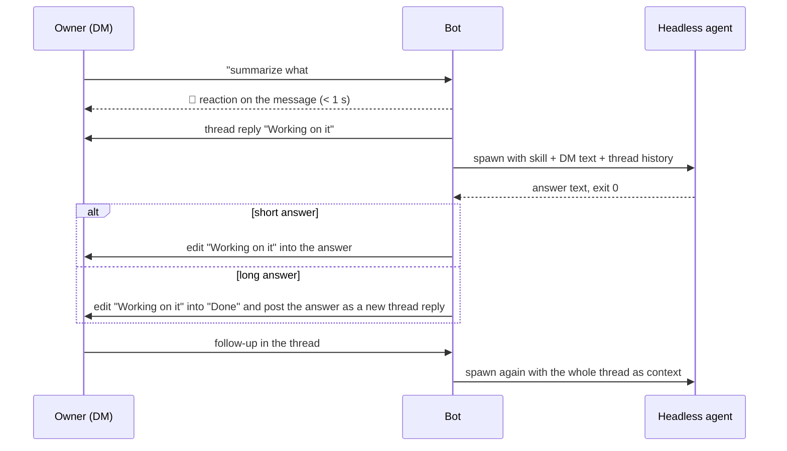

# PRD: Slack assistant bot with DMs, standing tasks, and onboarding

### Problem to Solve

The merged `slack-coordinator` bot is a status mirror for coding-agent runs, not an assistant its owner can talk to. It listens only inside the one channel thread a coding agent opened with `run start`, keeps only the owner's replies in that thread, and does nothing when nobody is running an agent. Its owner cannot message it directly, cannot give it a standing instruction, and cannot set it up without hand-building a Slack app.

The product is a per-person assistant: one Slack app and one daemon per owner, the daemon running as that person's OS user, and the configured owner the only human it obeys. A shared workspace bot with one admin and many members is not this product.

- What users see today: the bot posts a root message, status updates, and a completion message into one channel thread per run; the owner's thread replies become gates the agent must resolve ([research §1, §3](01-research-slack-coordinator-baseline.md#1-one-owner-per-run-defaulted-from-config-and-overridable-at-run-start)). A DM to the bot produces no reply and no record: the Slack app has no `im:*` scope or `message.im` subscription, and the inbound filter drops anything outside an active run thread ([research §2](01-research-slack-coordinator-baseline.md#2-socket-mode-envelopes-flow-through-one-channel-into-one-predicate-the-manifest-subscribes-to-channel-and-group-messages-only)).
- Where the workflow breaks down: the owner has nowhere to ask the bot for work that no coding-agent session initiated ("watch this channel and DM me a daily digest", "triage the feedback from this bug bash into issues"). Nothing in the daemon holds a channel subscription, a schedule, an instruction, collected messages, or a result independent of a run ([research §4](01-research-slack-coordinator-baseline.md#4-scheduling-is-a-30-s-poll-over-sqlite-due-columns-three-tables-idempotent-ddl-no-version-table)). Setup requires the user to create the app from a manifest in the Slack UI, install it, create an app-level token, export two env vars, and find their own Slack user id, which the docs do not explain ([research §6](01-research-slack-coordinator-baseline.md#6-setup-is-a-flag-and-env-command-that-probes-two-slack-endpoints-and-writes-plain-yaml-safety-dance-is-the-repos-only-interactive-onboarding-flow)).
- Why it matters: the requested product is a personal assistant owned and steered by exactly one person, reachable by DM, that acts on coding-agent runs, ad hoc requests, and standing channel-watching tasks alike ([task.md](task.md) items 1 to 4). Without DMs, standing tasks, and guided onboarding, each owner has to keep a coding-agent session open to get anything from the bot, and every new owner repeats the manual Slack app setup for their own app.

### Success Measures

- Post-launch state: an owner with a Slack workspace and no existing app can install the assistant, talk to it by DM, give it a standing channel-watching task, and keep using `run start` threads from coding agents, all from one machine they control.
- Primary signal: an end-to-end owner walkthrough on a fresh machine. Starting from `slack-coordinator onboard` with no app, config, or service present, the bot's first DM reply arrives in under 30 minutes wall clock, browser steps (app install click, app-level token) included.
- Same walkthrough, second half: a standing task created by DM ("watch `#<channel>`, DM me a digest") delivers its first digest at the scheduled time. The schedule may be set a few minutes ahead instead of a daily hour; the check is that the digest arrives at the scheduled minute and covers the messages posted to the channel in the window.
- Regression check inside the walkthrough: an existing coding-agent flow (`run start`, owner thread reply, `run check` exit 10, `run resolve`, `run finish`) behaves as documented in [docs/slack-coordinator.md](../../../docs/slack-coordinator.md) with the new app manifest and daemon.
- Evidence: one `evidence` artifact in this task directory recording wall-clock timestamps for each step, the Slack permalinks of the first DM reply and the first digest, and the run thread permalink. This is human evidence; it gates the program's final acceptance, not each child pull request. Child pull requests carry their own automated checks from Solution Details.

### Proposed Solution

Extend the per-person `slack-coordinator` daemon into the owner's assistant. Three decisions were recorded when the task was opened ([task.md](task.md), "Decisions recorded when the task was opened") and frame everything below:

- Substrate: the merged daemon, CLI, and skill stay; this scope lands as a program of epic children on top of them. The one-thread-per-run coding-agent flow keeps working unchanged.
- Brain: for each owner DM and each due standing task, the daemon spawns a headless coding agent (`omp -p`, `claude -p`, `codex exec`, or similar) with the skill and the collected messages as input. The daemon embeds no LLM client and needs no long-lived agent session to act.
- Onboarding: `slack-coordinator onboard` takes a Slack app configuration token, creates the app through `apps.manifest.create`, opens the install URL, prompts for the bot and app-level tokens, writes config, installs the service, and verifies with `auth.test` and a test DM. The install click and app-level token creation stay browser steps.

Decisions settled in this PRD:

- Owner DMs split into two paths. A small, prefix-triggered verb set is answered by the daemon itself, instantly and without an agent: managing standing tasks and asking the bot about itself. Every other owner DM goes to the headless agent, which is the only path that creates a standing task or does ad hoc work. Prefix triggering keeps plain prose from ever colliding with a verb.
- One owner, set once. `setup --owner` (and `onboard`, which resolves the id for the user) is the only place the owner is set; `run start --owner` is removed, so every run's owner is the configured owner. A non-owner who DMs the bot gets one fixed refusal naming the owner, then silence.
- A DM request is a thread. Each unprefixed owner DM starts a thread under itself where the bot acknowledges, reports, and answers; follow-ups typed in the thread continue the same agent conversation, a new top-level DM is a new request. Up to three requests run in parallel; more are queued and told so.
- A standing task is one instruction, one watch list of channels, one trigger (schedule, window end, or each message), and one delivery target. The owner asks for it in prose; the agent proposes the parsed task back; the owner confirms in the thread before anything is recorded. Each-message tasks are debounced and rate-floored, and a config-level cap bounds agent runs per hour across the whole daemon.
- The agent works inside one per-owner workspace directory with approvals disabled, never holds a Slack token, hands its result to the daemon to post, and is killed after a configurable time limit. The only widening is `agent.extra_dirs` in `config.yaml`, never settable from a DM.
- `onboard` is a resumable terminal walkthrough that creates the app from a configuration token, drives the two browser steps, resolves the owner, writes config, installs the service, and finishes only when the owner's reply to a test DM arrives. `onboard --existing` upgrades an installed app's manifest in place and runs the same verification.
- Retention is bounded and visible. Consumed collected messages live 7 days; run logs, results, and ended tasks live 30 days (or the last 20 runs per task); unconsumed messages are never purged; a daily purge enforces it and `!status` shows the footprint.
- The DM surface is read-only about coding-agent runs: `!runs` finds a thread; steering a run stays in that run's thread through the existing `run check` / `run resolve` gate.

### Alternative Solutions Considered

- Every owner DM goes to the agent, including "list my tasks" and "cancel that". One surface, but each trivial verb costs an agent spawn (seconds of latency, tokens), and task management would be only as reliable as the agent's reading of the message and would fail whenever no agent binary or model is reachable.
- DMs as a command-only surface with the agent reserved for scheduled standing tasks. Cheapest and fully deterministic, but it cannot take an impromptu request ([task.md](task.md) item 3).
- Steering coding-agent runs from the DM, either with a `!say <run-id> <text>` verb that posts into the run thread as owner input, or by letting the assistant agent interpret "tell the api run to stop" and post there. Convenient from a phone, but the text appears under the bot's name, a wrong id steers the wrong agent, and it adds a second control path beside the existing exit-10 gate.
- Running the agent inside a repository the owner names per DM or per task. Lets a phone message edit source on the owner's machine; replaced by a fixed workspace plus the config-only `agent.extra_dirs` widening.
- One-way onboarding verification (send a DM, ask the user on the terminal whether it arrived). Proves nothing about inbound events, the path that is broken today; replaced by the two-minute round trip.
- No retention bound, deleting the SQLite file by hand when it grows. Silently archives colleagues' messages indefinitely; replaced by the 7/30-day purge.

### Solution Details

Each obligation below is one behavior with an observable outcome. `bot` means the daemon acting through the owner's Slack app; `owner` means the configured owner user id; `DM` means the owner's direct-message conversation with the bot.

#### Owner DM verbs are answered by the daemon, never by an agent

A DM whose first token starts with `!` is a verb. Slack reserves `/` for slash commands, which this app does not use, and plain prose does not start with `!`, so the prefix never collides with a request meant for the agent. Task ids are short (`t3`, `t12`) so they are typeable from a phone.

| DM | Effect | Reply in the DM |
|---|---|---|
| `!help` | none | The verb table and one line: anything else sent here goes to the assistant |
| `!status` | none | Daemon uptime, Socket Mode connected or not, count of active runs, count of standing tasks by state, configured agent binary |
| `!tasks` | none | One line per standing task: id, state (`active`, `paused`), what it watches, schedule, next due time, last result time |
| `!show <id>` | none | The task's full instruction text and its recent results |
| `!runs` | none | One line per active coding-agent run: run id, channel, started at, thread permalink |
| `!pause <id>` | task stops collecting and running until resumed | Confirmation; next due cleared |
| `!resume <id>` | task resumes; next due recomputed from now | Confirmation with the next due time |
| `!cancel <id>` | task ends permanently; collected messages stay readable through `!show` for the retention window | Confirmation |

- WHEN the owner sends a DM whose first token starts with `!`, the bot shall reply in the DM from the table above without spawning an agent.
- IF the verb is unknown, or the DM is `!` alone, THEN the bot shall reply with the `!help` table and shall not forward the DM to an agent.
- IF `!show`, `!pause`, `!resume`, or `!cancel` names an id that does not exist, THEN the bot shall reply that the id is unknown and list the known ids.
- WHEN the owner sends `!pause <id>` for an active task, the bot shall record the task as `paused` and stop collecting channel messages and running the task until `!resume`.
- WHEN the owner sends `!resume <id>` for a paused task, the bot shall record the task as `active` and compute the next due time from the current time.
- WHEN the owner sends `!cancel <id>`, the bot shall record the task as `cancelled`, and `!tasks` shall no longer list it.
- WHEN `!runs` is sent, the bot shall list only runs whose lifecycle is `active`, each with its `chat.getPermalink` thread URL.

Deliberately not verbs: creating a task (`!add`, `!watch`) is the agent's job because it parses channel, schedule, and instruction from prose; `!run <text>` is unnecessary because unprefixed text already reaches the agent; `!edit` is replaced by `!cancel` and asking again.

#### Only the configured owner is obeyed; strangers get one refusal

The owner is `slack.owner_user_id` in config, written by `setup --owner` or by `onboard`. Nothing else sets or overrides it.

- The `run start` command shall not accept an `--owner` flag; every run's owner shall be the configured owner.
- WHEN the owner sends a DM, the bot shall treat it as a verb or as agent input per the sections above and below.
- WHEN a user other than the owner sends their first DM to the bot, the bot shall reply once in that DM: `This assistant only takes instructions from its owner, <@owner>.`
- WHILE a non-owner has already received the refusal, the bot shall acknowledge and drop their further DMs without replying or storing them.
- IF a message in a run thread or a watched channel comes from a non-owner, THEN the bot shall not treat it as an instruction; watched-channel messages are collected as data per the standing-task section.
- WHEN `onboard` sets the owner, it shall resolve the id from the owner's email (`users.lookupByEmail`) or a pasted `U…`/`W…` id and confirm the resolved display name back to the user before writing config, so a mistyped owner fails at onboarding, not at the first DM.

#### An unprefixed owner DM becomes a threaded request the agent answers

The DM's top level is the owner's list of requests. Each request's acknowledgment, progress, and answer live in the thread under it, so two overlapping requests never interleave and a follow-up has an anchor.

- WHEN the owner sends an unprefixed top-level DM, the bot shall add an eyes reaction to that message within one second and post `Working on it` as a reply in the thread under it.
- WHEN the agent run for a request finishes with exit code 0, the bot shall deliver its answer in that thread: by editing the `Working on it` reply when the answer fits Slack's edit-friendly length, otherwise by editing that reply to `Done` and posting the answer as a new thread reply.
- IF the agent run exits non-zero or is killed by its time limit, THEN the bot shall edit the `Working on it` reply to `Failed` and post one thread reply carrying the exit code (or `timed out after <limit>`) and the last lines of stderr.
- WHEN the owner replies inside a request thread, the bot shall run the agent again with the full thread as conversation context and answer in the same thread.
- WHILE an agent run is in progress for a thread, the bot shall queue a follow-up sent to that thread and pass it to the next run of that thread instead of starting a parallel run.
- WHILE three requests are already running, the bot shall still add the eyes reaction within one second, post `Queued behind <n> request(s)` as the thread ack instead of `Working on it`, start the request when a slot frees in arrival order, and edit that reply to `Working on it` when its run starts.
- IF the same DM event is redelivered by Slack, THEN the bot shall not start a second agent run for it.

#### A standing task watches channels and runs its instruction on a trigger

| Field | Values |
|---|---|
| Watch | one or more channels the bot has been invited to; the bot cannot read a channel it is not a member of |
| Trigger | `schedule`: daily at `HH:MM` in the owner's Slack timezone, or every N hours. `window end`: one shot at a stated time, then the task completes. `each message`: run as messages arrive, batched by a debounce |
| Instruction | the owner's prose, stored verbatim and handed to the agent with the collected messages |
| Deliver to | the owner's DM (default), or a channel thread the owner names |
| Debounce (`each message` only) | default 5 minutes; the owner may state another value and the agent applies it within the floor below |

Creation is a confirmed handshake inside a DM request thread, so the agent never records a task the owner did not mean:

1. Owner, top-level DM: "listen to all feedback in #bug-bash and triage each item as an issue".
2. Agent, in the thread: the parsed task ("Watch `#bug-bash`, each message (debounce 5 min), triage new items as issues, results to this DM. Confirm?").
3. Owner, in the thread: confirms, or corrects in prose and gets a new proposal.
4. Bot records the task, replies with its id (`t4`) and next due time (or "waiting for messages" for `each message`).

- WHEN the owner confirms a proposed task in its request thread, the bot shall record it, assign a short id, and reply with the id and its first due time; `!tasks` shall list it from then on.
- IF the owner does not confirm, or corrects the proposal, THEN the bot shall record nothing until a later proposal is confirmed.
- IF a proposed watch channel is one the bot is not a member of, THEN the proposal shall say so and name the channel to invite the bot to, and the task shall not be recorded until the owner confirms after the invite or drops the channel.
- WHILE a task is `active`, the bot shall collect every top-level message and thread reply posted in its watched channels, from any user, as data for the next run.
- WHEN a `schedule` task's due time arrives, the bot shall run the agent with the instruction and the messages collected since the previous run, deliver the result to the task's target, and compute the next due time.
- WHEN a `window end` task's time arrives, the bot shall run once over everything collected, deliver the result, and record the task as `completed`; `!tasks` shall stop listing it.
- WHEN an `each message` task receives a message, the bot shall start or extend a debounce window (default 5 minutes) and run the agent once over the batch when the window closes.
- IF an `each message` task's previous agent run started less than 10 minutes ago, THEN the bot shall hold the batch and merge it with any further messages until the 10-minute floor passes.
- The daemon shall enforce a configured cap on agent runs per hour across all tasks and DM requests, default 30 (`agent.max_runs_per_hour` in config), counted over a rolling hour.
- IF starting a task's run would exceed the hourly cap, THEN the bot shall log the skipped batch with the task id and message count, keep the batch, and include it in the task's next run; no collected message is dropped.
- WHEN a task run delivers to the owner's DM, the delivery shall be a new top-level DM from the bot whose first line names the task (`t4 · #bug-bash triage · 3 new items`), so results are found from a phone without opening `!show`.
- WHEN a task run exits non-zero or times out, the bot shall deliver a failure message to the task's target carrying the exit code and the last lines of stderr, keep the batch for the next run, and record the failure on the task so `!show` lists it.
- IF a task has failed three consecutive runs, THEN the bot shall record it as `paused`, tell the owner in the DM why, and wait for `!resume`.

#### The agent works in a boxed workspace, and the daemon does the talking

The agent is the brain but not the hands on Slack. It runs as the owner's OS user in `~/.slack-coordinator/workspace/` (under `SLACK_COORDINATOR_HOME` when set), with approvals disabled because nobody is present to answer them, and it returns its result to the daemon, which posts it. This keeps a DM typed from a phone from editing source on the owner's machine unless the owner opted in through config.

| Agent receives | Agent returns |
|---|---|
| The skill text (verbs, result format, task-proposal format) | Its answer or task result as text on stdout or in a result file |
| The DM text or the task instruction | For a proposed standing task: the structured proposal (watch, trigger, debounce, delivery) the daemon shows the owner |
| Collected messages as structured records: author, channel, ts, text, permalink | Exit code 0 on success, non-zero with stderr on failure |
| The DM thread history for follow-ups | |
| The task's own previous result for context, when one exists | |

- The daemon shall spawn each agent run with its working directory set to the per-owner workspace directory and with the agent's own approval prompts disabled for that directory, at the level `agent.approval` in `config.yaml` selects: `edits` (default; file edits inside the workspace, command approvals denied: `omp --approval-mode write`, `claude -p --permission-mode acceptEdits`, `codex exec --sandbox workspace-write`) or `full` (commands run without prompts: `omp --auto-approve`, `claude -p --permission-mode bypassPermissions`, `codex exec --sandbox workspace-write --approve-for-me`). `!status` shall name the level; no DM or agent output can change it.
- The daemon shall not pass `SLACK_BOT_TOKEN`, `SLACK_APP_TOKEN`, the Jira token, or the path to `config.yaml` into the agent's environment or arguments.
- WHEN an agent run produces its result, the daemon shall post it to Slack on the agent's behalf; the agent shall have no way to post, react, or read Slack directly.
- WHERE `agent.extra_dirs` lists directories in `config.yaml`, the daemon shall grant the agent read and write access to those directories in addition to the workspace; the key is absent by default and no DM or agent output can add to it. `agent.extra_dirs` and `agent.approval` are the only widenings of the boundary, and both are config-only.
- IF an agent run exceeds `agent.timeout` (default 10 minutes), THEN the daemon shall kill the run and report it as timed out per the DM and standing-task failure obligations.
- The daemon shall run at most one configured agent binary, chosen in `config.yaml` (`agent.command`), and `!status` shall name it; IF the binary is not on `PATH` at run time, THEN the request or task shall fail with a message naming the missing binary.
- WHEN a request or task run finishes, the daemon shall keep the run's stdout, stderr, exit code, and duration on disk under the workspace for `!show` and for the owner to inspect; retention follows the purge rule in the standing-task section.

#### `onboard` takes a fresh workspace to a verified assistant in one sitting

The only token Slack will not let the tool create is the app configuration token; everything else is created by the tool or reached through a URL it opens. Each step names itself, and a failure leaves earlier steps' results in place so a re-run resumes at the failed step.

1. Show the prerequisite: create an app configuration token in the browser (api.slack.com/apps, "Your App Configuration Tokens"); paste it.
2. Prompt for the app name, default `<owner first name>'s assistant`; create the app through `apps.manifest.create` from the assistant manifest (today's channel scopes and events plus `im:history`, `im:read`, `im:write`, `message.im`, `reactions:write`, `users:read.email`).
3. Open the install URL; the user clicks Install; paste the bot token from the page `onboard` names.
4. Open the app's Basic Information page; the user generates an app-level token with `connections:write`; paste it.
5. Prompt for the owner's email or `U…`/`W…` id; resolve it; show the display name; ask to confirm.
6. Write `config.yaml` at mode 0600; install and start the service (launchd or systemd). `--no-service` runs the daemon in the foreground instead.
7. Verify: `auth.test`, `apps.connections.open`, then the bot DMs the owner `Reply to this message to finish setup` and waits up to two minutes for the reply.
8. Print next steps: invite the bot to the channels it should watch; DM it `!help`.

- WHEN `onboard` runs with no `config.yaml` present, it shall walk steps 1 to 8 in order, prompting on the terminal and opening browser URLs for steps 3 and 4.
- WHEN the owner's reply to the setup DM arrives within two minutes, `onboard` shall print the owner's display name and the app name and exit 0.
- IF no reply arrives within two minutes, THEN `onboard` shall exit non-zero with a hint naming the most likely causes in order: the app was not reinstalled after the scope change, the `message.im` event subscription is missing, the owner id is wrong; and shall leave config and service in place for a re-run.
- IF a step fails (a Slack API error, a rejected token prefix, an unresolvable owner), THEN `onboard` shall name the step and the cause and exit non-zero without undoing earlier steps.
- WHEN `onboard` runs with a `config.yaml` already present and no `--existing`, it shall offer repair (re-verify, reinstall the service, replace one token) and shall not create a second app.
- WHEN `onboard --existing` runs, it shall prompt for the app configuration token, update the current app's manifest through `apps.manifest.update`, tell the user to reinstall the app to grant the new scopes and paste the new bot token if it changed, then run step 7.
- WHEN `onboard --existing` writes config, it shall preserve every existing key and write only the keys that changed.
- IF the owner's email resolves to no user, or the pasted id is not a user in the workspace, THEN `onboard` shall say so and re-prompt instead of writing config.
- The `setup` command shall keep working as the non-interactive path for users who already hold both tokens and their id; `onboard` and `setup` shall write the same `config.yaml` shape.

#### What the assistant stores is purged on a fixed, visible schedule

Collected channel messages are other people's words on the owner's disk, so the bot keeps them only as long as a task needs them and tells the owner how much it holds.

| Data | Kept for |
|---|---|
| Collected messages already fed to a run | 7 days after the run |
| Collected messages not yet fed to a run (waiting on schedule, debounce, floor, or cap) | Never purged, whatever their age |
| Run logs (stdout, stderr, exit code, duration) and task results | 30 days, or the last 20 runs per task, whichever keeps more |
| Cancelled and completed tasks, with their data | 30 days after ending, listable through `!show` until then |
| DM request threads' stored history | 30 days after the last message in the thread |

- The daemon shall run a purge once a day that deletes data past the bounds above; `retention.days` in `config.yaml` (default 30) scales the 30-day bounds, and the 7-day bound is `retention.consumed_days` (default 7).
- WHILE a collected message has not been fed to any run, the purge shall not delete it.
- WHEN the owner sends `!status`, the reply shall include the number of stored messages, the number of stored runs, and the size on disk of the state database and workspace logs.
- WHEN a task is cancelled or completed, `!show <id>` shall keep answering for 30 days and then reply that the id is unknown.

### Out of Scope

- Steering a coding-agent run from the DM; steering stays in the run thread (see Alternative Solutions Considered).
- "Other things" beyond DMs, standing tasks, and run visibility: calendar, email, tickets, or any non-Slack source as an input; none is named for this version.
- Other chat transports (Discord, Teams, Matrix, SMS).
- Shared or multi-owner bots: one Slack app, one daemon, one owner. A second person needs their own app and daemon.
- The daemon embedding an LLM client or holding model API keys; the headless coding agent is the only brain.
- Creating the app configuration token or clicking Install on the owner's behalf; Slack keeps those in the browser.
- Slash commands, interactive Block Kit components, and Slack workflows; the DM surface is plain messages, reactions, and threads.
- Editing a standing task in place; the owner cancels and asks again.
- Watching channels the bot has not been invited to, or private conversations between other users.

## Human Review

### Review targets

- The per-person model in Problem to Solve and the removal of `run start --owner`: every existing coding-agent flow that passed `--owner` must switch to the configured owner.
- The `!` verb set and its fallback: whether `!help` on an unknown verb is the right behavior for a typo in an otherwise prose message that happens to start with `!`.
- The each-message constraints (5-minute debounce, 10-minute per-task floor, 30 runs per hour global cap, roll-forward on cap) against the live bug-bash triage case: whether a 10-minute floor is acceptable latency for triage.
- The agent trust boundary: auto-approve inside `~/.slack-coordinator/workspace/`, `agent.extra_dirs` as the only widening, agent never holding Slack tokens.
- The retention numbers (7 days consumed, 30 days logs and ended tasks, never for unconsumed) against workspace policy on storing colleagues' messages.
- The onboarding step order and the two-minute round-trip verification with its timeout hint order.

### Verify

- [ ] Confirm with a workspace admin that a member-level app configuration token can call `apps.manifest.create` and `apps.manifest.update` in the target workspace; some workspaces restrict app creation to admins, which would turn step 2 of `onboard` into a browser step.
- [ ] Confirm `users:read.email` is acceptable in the manifest; without it `onboard` can only accept a pasted `U…` id.
- [ ] Confirm the 10-minute per-task floor and 5-minute default debounce are acceptable latency for live bug-bash triage; if not, name the numbers before the TDD fixes the scheduler contract.
- [ ] Confirm the walkthrough evidence artifact (under 30 minutes to first DM reply, digest at the scheduled minute, run-thread regression) is the program's final acceptance gate and is not required per child pull request.

### Known limits

- Slack's handling of `apps.manifest.create` with a member-level configuration token, and its rate limits on `chat.update` used for the `Working on it` edit, are taken from Slack's documentation, not exercised in this repository.
- "Slack's edit-friendly length" for the short-answer edit is left as a number for the TDD to fix from Slack's `chat.update` text limits.
- The default agent binary, its exact flags per binary, and how the daemon distinguishes a task proposal from a plain answer in agent output are TDD decisions; this PRD fixes only what the agent receives, returns, and may touch.
- Migration of existing `slack-coordinator` users is covered only by `onboard --existing`; existing SQLite state carries over unchanged because no existing table is altered by this scope.
