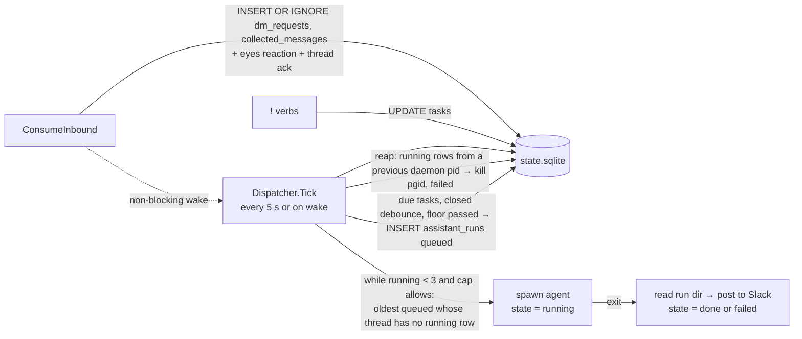
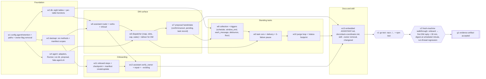

# TDD: Slack assistant bot with DMs, standing tasks, and onboarding

Builds the behavior fixed in [02-prd-slack-assistant-bot-dms.md](02-prd-slack-assistant-bot-dms.md) on the merged `slack-coordinator` daemon described in [01-research-slack-coordinator-baseline.md](01-research-slack-coordinator-baseline.md).

### System Design

#### The agent talks to the daemon through files in a per-run directory; the daemon talks to Slack

Today the daemon spawns only itself, `git rev-parse`, and the service manager, and no coding agent output reaches it (research §5). Target: every DM request run and standing-task run gets one directory under the owner's workspace; the daemon writes the inputs there, spawns the configured binary with that directory as its working directory, and reads the outputs back. Result and proposal are files with fixed names, so no per-binary output parser exists: the adapters differ only in argv (working directory, approval mode, time limit).

```text
~/.slack-coordinator/workspace/                      (SLACK_COORDINATOR_HOME honoured; mode 0700)
└── runs/<run-id>/                                   created 0700 by the daemon per run
    ├── prompt.md        daemon writes: assistant skill text, the request or instruction,
    │                    the thread history for follow-ups, the previous task result, and
    │                    "collected messages are in messages.jsonl"
    ├── messages.jsonl   daemon writes: one {author, channel, ts, text, permalink} per line
    ├── result.md        agent writes: the answer or task result
    ├── proposal.json    agent writes only when proposing a standing task
    ├── stdout.log       daemon captures
    ├── stderr.log       daemon captures
    └── meta.json        daemon writes after exit: exit code, duration, timed_out, result_source
```

Spawn: `<agent.command> <adapter flags> "Read prompt.md in the current directory and follow it"`, `cmd.Dir = <run dir>`, stdin from `/dev/null` (`omp -p` blocks on an open stdin pipe, `CHANGELOG.md:225`), stdout and stderr to the two log files, environment scrubbed of `SLACK_BOT_TOKEN`, `SLACK_APP_TOKEN`, `JIRA_API_TOKEN`, and `SLACK_COORDINATOR_HOME`. Adapters run the binary in plain text output mode so stdout is the assistant's final text and nothing else needs parsing.

Reading the outputs after exit, in order:

1. Exit non-zero or killed by `agent.timeout`: `Failed` per the PRD, with the exit code or `timed out after <limit>` and the last 20 lines of `stderr.log`.
2. `proposal.json` present: the proposal path (validated against the schema in Type Definitions; a malformed file is a `Failed` naming the schema error). `result.md`, when also present, is posted as the proposal's prose.
3. `result.md` present: its text is the answer; `meta.json.result_source = "result.md"`.
4. Neither present and exit 0: the trimmed `stdout.log` is the answer, `result_source = "stdout"`, and the daemon logs `run <id>: result.md missing, answered from stdout`. Empty stdout is a `Failed` with cause `agent wrote no result`.

The run directory is created and removed only by the daemon: the daily purge removes it with the run's row under the retention rule (Configuration). The agent may write anything inside its run directory and the workspace; it never deletes a run directory, and the skill text says so. `agent.extra_dirs` widens the agent's write access through the adapter's add-dir flag (`omp --add-dir`, `claude --add-dir`, `codex --add-dir`), never through the run directory.

Rejected: parsing each binary's JSON stream (`omp --mode json`, `claude --output-format json`, `codex exec --json`) with a fenced `task-proposal` block for detection, because it needs three parsers against moving CLI formats and text heuristics for the proposal; and an agent-side CLI (`slack-coordinator assistant result`) over IPC, because it hands the agent a path into the token-holding daemon and needs peer checks to stop one run claiming another's result.

#### Every run is a SQLite row; one Dispatcher tick is the only path that spawns

Today due-ness is re-derived from SQL every 30 s by `StatusScheduler.Tick` and nothing is queued in memory (research §4). The assistant reuses that shape: the inbound handler and the `!` verbs only insert or update rows; a `Dispatcher` loop owns every spawn, the three-slot limit, FIFO order, per-thread serialization, debounce, the 10-minute floor, and the rolling-hour cap. `StatusScheduler` keeps its own 30 s tick and is not changed.



Tick order, every `Options.DispatcherPeriod` (default 5 s, test-injectable like `SchedulerPeriod`) and additionally when the wake channel fires:

1. Reap: every `assistant_runs` row in `running` whose `daemon_pid` is not this process (the daemon restarted mid-run) is an orphan whether or not its agent is still alive: the tick sends `SIGKILL` to the recorded `pgid`, marks the row `failed` with cause `daemon restarted`, posts the `Failed` reply to its DM thread, and leaves its task batch unconsumed. No agent keeps running with nobody to deliver its result.
2. Enqueue task runs: for each `active` task, `trigger = schedule` or `window_end` with `due_at <= now`, or `trigger = each_message` with a closed debounce window and `last_run_started_at + 10 min <= now`, insert one `queued` row and bind the unconsumed collected messages to it. A task with a `queued` or `running` row is skipped.
3. Spawn: while `running < 3`, pick the oldest `queued` row whose DM thread (for `kind = dm`) has no `running` row. If spawning it would exceed `agent.max_runs_per_hour` (count of rows with `started_at` in the last hour), log `cap reached: run <id> held (task <tid>, <n> messages)` and stop; otherwise create the run directory, spawn with `SysProcAttr{Setpgid: true}`, record `pid`, `pgid`, `daemon_pid`, and `started_at`, and for a queued DM edit the ack to `Working on it`. `agent.timeout` and daemon shutdown kill the process group (`syscall.Kill(-pgid, SIGKILL)`), so an agent's own children (shells, subagents) die with it.

The wake channel is `chan struct{}` with capacity 1; the inbound handler does `select { case wake <- struct{}{}: default: }` after its insert, so a DM request spawns within milliseconds while the tick stays the only code that spawns. Redelivered Slack events are absorbed by `INSERT OR IGNORE` on `(channel, ts)` primary keys, so a duplicate envelope never creates a second run. `Queued behind <n>` is the count of `queued` rows ahead at insert time.

Rejected: an in-memory dispatcher (semaphore channel, per-thread mutex, `time.AfterFunc` debounce) with SQLite as a journal, because it makes two sources of truth and restart replay reconstructs timers; and a hybrid that uses rows for tasks and memory for DMs, because it is two mechanisms for one problem.

#### The daemon records a proposed task on a fixed confirm word; corrections go back to the agent

A DM run that ends with `proposal.json` does not record a task. The daemon renders the proposal into the request thread and stores it as the thread's pending proposal (`dm_requests.pending_proposal`, JSON). The next owner reply in that thread is routed by the daemon without an agent:

```text
reply := lower(trim(text)); strip trailing . ! ,
if pending_proposal == NULL             → ordinary follow-up run
if reply ∈ CONFIRM                      → INSERT tasks from pending_proposal; clear it;
                                          reply "Recorded as t4 · next due 2026-09-23 09:00 CEST"
                                          (or "Recorded as t4 · waiting for messages"); no spawn
if reply ∈ CANCEL                       → clear pending_proposal;
                                          reply "Dropped the proposal."; no spawn
else                                    → queue a DM run; prompt.md carries the pending proposal
                                          and this reply; a new proposal.json replaces the pending
                                          one, a plain result.md clears it
CONFIRM = {yes, y, confirm, confirmed, ok, okay, go, do it, 👍, :+1:}
CANCEL  = {no, n, cancel, never mind, nevermind, forget it, drop it}
```

The rendered proposal always ends with `Reply yes to record this task, no to drop it, or tell me what to change.`, so the contract is visible where it applies. Both sets are constants in the coordinator, not config.

Rejected: letting the agent decide by writing `confirmed: true`, because each confirm costs a spawn and recording depends on the agent's reading of "ok"; and a reaction-based confirm, because it adds `reactions:read` and `reaction_added` to the manifest and still needs a rule for typed replies.

#### `onboard` verifies through the running daemon and checkpoints every pasted value except the configuration token

Today `setup` is a flag-and-env command that probes `auth.test` and `apps.connections.open` and writes `config.yaml` (research §6); nothing exercises inbound delivery. `onboard` is a terminal walkthrough over the same `config.Save`, `daemon.Install`, and `daemon start` code, plus three Slack calls the module does not make today: `apps.manifest.create` / `apps.manifest.update` with the configuration token, `users.lookupByEmail`, and `conversations.open` for the DM channel.

```mermaid
sequenceDiagram
  participant U as User (terminal + browser)
  participant O as onboard
  participant S as Slack Web API
  participant D as daemon (service or daemon start)
  U->>O: configuration token
  O->>S: apps.manifest.create(manifest)
  S-->>O: app_id, oauth install URL
  O->>U: opens install URL, prompts bot token
  O->>U: opens Basic Information, prompts app-level token
  U->>O: owner email or id
  O->>S: users.lookupByEmail / users.info
  O->>U: "Owner: Mark Tripoli (U0…). Correct? [Y/n]"
  O->>O: config.Save (0600); service Install or daemon start
  O->>D: IPC assistant.verify_owner
  D->>S: conversations.open(owner) + chat.postMessage "Reply to this message to finish setup"
  U->>S: replies in the DM
  S-->>D: message.im over Socket Mode
  D-->>O: {ok, display_name} within 120 s, else {timeout}
  O->>U: next steps, exit 0 (or hint list, exit non-zero)
```

Verification is the IPC method `assistant.verify_owner`: the daemon posts the setup DM, records its `ts`, and blocks the call until `ConsumeInbound` records a top-level DM from the owner with a later `ts`, or 120 s pass. The IPC client for this one method uses a 130 s deadline instead of the default. The reply is not treated as a request (no eyes reaction, no agent run). The same method backs repair mode (`onboard` with an existing `config.yaml`, no `--existing`).

`--no-service` runs the existing `daemon start` (detached re-exec, research §5) instead of `daemon.Install`, then verifies the same way; the closing lines say the daemon runs until logout or reboot.

Checkpoint: `<root>/onboard.json`, mode 0600, holding `step` (last completed step index), `app_id`, `app_name`, `bot_token`, `app_token`, `owner_user_id`, `owner_display_name`, `service_installed`. The app configuration token is prompted on every run that needs it and never written, because Slack expires it after 12 hours and it can create and delete apps. A re-run reads the checkpoint and resumes at `step + 1`; passing verification deletes the file. `onboard --existing` reads `app_id` from the checkpoint or prompts for it, calls `apps.manifest.update`, and resumes from the reinstall prompt.

Rejected: a second Socket Mode connection owned by `onboard`, because it proves Slack delivery without the daemon's filter, service, or owner match; and polling `conversations.history`, because it proves nothing about the event subscription, the first item in the timeout hint list.

#### One inbound router replaces the owner-thread predicate; the Slack surface grows by six methods

Today `ownerReply` keeps only owner thread replies inside active run threads (research §2, `internal/coordinator/inbound.go:44-83`). Target: `ConsumeInbound` still acks first, then routes every `message` event by conversation type and thread state. Existing run-thread behavior is one row of the table and is unchanged.

| Conversation | Thread state | Sender | Action |
|---|---|---|---|
| `D…` (DM) | top level, text starts with `!` | owner | verb handler; reply in the DM; no row |
| `D…` | top level, other text | owner | `INSERT OR IGNORE dm_requests`; `reactions.add eyes`; thread ack (`Working on it` or `Queued behind <n>`); wake dispatcher |
| `D…` | reply under a `dm_requests` root | owner | pending-proposal routing (above); else `INSERT OR IGNORE dm_followups`; wake |
| `D…` | reply under the verify DM | owner | resolves `assistant.verify_owner`; nothing stored |
| `D…` | any | non-owner, first time | `INSERT OR IGNORE refused_users(user_id)`; post the fixed refusal |
| `D…` | any | non-owner, already refused | drop |
| `C…`/`G…` | reply in an `active` run thread | owner | `INSERT OR IGNORE owner_inputs` (today's behavior) |
| `C…`/`G…` | any, channel watched by an `active` task | anyone | `INSERT OR IGNORE collected_messages` bound to each watching task; `each_message` tasks extend their debounce window |
| anything else | | | drop |

Bot messages (`bot_id != ""`) and messages with a `subtype` are dropped before routing except `subtype = ""` on all rows above; the bot's own posts therefore never become collected messages or requests. A channel may match both a run thread and a watched task; both rows are written.

Slack methods added to `slackapi.Client` beside `PostMessage` and `Permalink`: `UpdateMessage` (`chat.update`) for the ack edits, `AddReaction` (`reactions.add`), `OpenConversation` (`conversations.open`, DM channel id for the owner), `LookupUserByEmail` (`users.lookupByEmail`) and `UserInfo` (`users.info`, display name and `tz` for schedule parsing), `ManifestCreate` / `ManifestUpdate` (`apps.manifest.create` / `apps.manifest.update`, configuration token). The manifest adds scopes `im:history`, `im:read`, `im:write`, `reactions:write`, `users:read.email` and event `message.im`.

Answer delivery: an answer of at most 4,000 characters is written into the `Working on it` reply with `chat.update`; a longer one edits that reply to `Done` and posts the answer as thread replies split at line boundaries into chunks of at most 4,000 characters. 4,000 is Slack's documented recommended `text` length; the hard limit is 40,000 (Known limits).

#### The configured owner is the only owner; retention is one daily purge over rows and run directories

`run start --owner` is deleted from `internal/cli/run_start.go`; `StartRunInput.OwnerUserID` is removed and `StartRun` copies `cfg.Slack.OwnerUserID` into `runs.owner_user_id`. Every existing caller in the skill and docs passes no owner today, so the only change for coding agents is that the flag is rejected as unknown.

The purge is a fourth loop in `daemon.Serve`, ticking daily (first tick at startup + 1 min), applying in one transaction: `collected_messages` with `consumed_run_id` set and `consumed_at < now - retention.consumed_days`; `assistant_runs` older than `retention.days` unless within the newest 20 for their task; `tasks` in `cancelled` or `completed` with `ended_at < now - retention.days` and their remaining rows; `dm_requests`/`dm_followups` whose last message is older than `retention.days`; `refused_users` untouched. After the transaction it removes `workspace/runs/<id>/` for every deleted run and for every directory with no row. A `collected_messages` row with `consumed_run_id IS NULL` is never selected, whatever its age. `!status` reports `COUNT(*)` of messages and runs plus `du` of `state.sqlite*` and `workspace/runs`.

### Program Design

#### Two new packages beside `coordinator`; the agent package never imports Slack

`internal/coordinator` stays the run-thread module and keeps its tests and the exit-10 gate. `internal/agent` owns process spawning and the run directory and imports nothing from `slackapi`, so the trust boundary (no token near the agent) is a package edge. `internal/assistant` owns the owner surface and imports `db`, `slackapi`, `agent`, and `coordinator`; nothing imports `assistant` except `daemon`. `internal/onboard` holds the walkthrough so its steps are tested against a fake Slack without cobra.

```text
tools/slack-coordinator/internal/
├── agent/                        spawn and run directory; no Slack imports
│   ├── adapter.go              + Adapter per binary (argv only), Lookup(command)
│   ├── run.go                  + Runner.Run: Setpgid, timeout, log capture, meta.json
│   ├── rundir.go               + Create (0700) / Read outputs / Remove
│   ├── proposal.go             + Proposal schema and Validate
│   └── testdata/fake-agent.sh  + writes result.md or proposal.json per env var
├── assistant/                    owner surface
│   ├── router.go               + Route(evt): the inbound table; calls coord.RecordOwnerInput
│   ├── verbs.go                + the eight ! verbs
│   ├── requests.go             + dm_requests, follow-ups, pending proposal, CONFIRM/CANCEL
│   ├── tasks.go                + task rows, triggers, debounce, floor, next due
│   ├── dispatcher.go           + Tick: reap, enqueue, spawn; wake channel
│   ├── deliver.go              + answer edit or chunk, task delivery, Failed replies
│   ├── prompt.go               + prompt.md rendering; embedded assistant skill text
│   ├── purge.go                + daily purge and !status footprint
│   └── verify.go               + assistant.verify_owner
├── onboard/
│   ├── onboard.go              + Run(ctx, deps, flags): step loop and resume
│   ├── steps.go                + one func per step
│   ├── checkpoint.go           + onboard.json load/save (0600)
│   └── manifest.go             + assistant manifest constant, apps.manifest.create/update
├── coordinator/
│   ├── inbound.go              ~ ConsumeInbound removed; RecordOwnerInput(ctx, msg) exported
│   ├── types.go                ~ StartRunInput.OwnerUserID removed
│   └── start_run.go            ~ owner copied from Coordinator.OwnerUserID
├── db/
│   ├── schema.go               ~ eight CREATE TABLE IF NOT EXISTS added to schemaSQL
│   ├── tasks.go                + collected_messages.go + dm_requests.go + assistant_runs.go + purge.go
├── slackapi/
│   └── client.go               ~ UpdateMessage, AddReaction, OpenConversation, LookupUserByEmail, UserInfo, ManifestCreate, ManifestUpdate
├── config/
│   └── config.go               ~ Agent and Retention sections with defaults
├── daemon/
│   └── daemon.go               ~ wires assistant.Service; two more loops (dispatcher, purge)
└── cli/
    ├── onboard.go              + cobra command → onboard.Run
    └── run_start.go            ~ --owner flag deleted
```

Import direction: `daemon → assistant → {coordinator, agent, slackapi, db}`; `agent → {paths}` only. `coordinator` is unchanged for every caller of `run start/check/resolve/finish`.

Rejected: growing `coordinator` to hold the process supervisor and the owner surface (one struct, one nine-envelope test fixture for everything); and merging `agent` into `assistant`, which would let a Slack-holding package spawn subprocesses and reduce the trust boundary to a convention.

#### Adapters differ only in argv; `agent.approval` picks edits-only or full, default edits-only

`internal/agent` holds one adapter per supported binary. Each contributes argv from a fixed table and names where the final assistant text lands; `Runner.Run` is shared. Flags come from `omp --help` (v18.1.22), `claude --help` (2.1.258), and `codex exec --help` (0.155.1) on the machine that ran this TDD session (2026-09-22); stdin handling follows `tools/safety-dance/internal/agent/claude.go:74-80` and `codex.go:94-97`, which pass the prompt through `cmd.Stdin`, replaced here by a positional instruction and `/dev/null` because `omp -p` blocks on an open stdin pipe (`CHANGELOG.md:225`).

```go
// internal/agent/adapter.go
type Adapter interface {
    Command() string                      // binary name for exec.LookPath and !status
    Args(spec RunSpec) []string           // argv after the binary
    FinalTextPath(runDir string) string   // file read as the stdout fallback
}

type RunSpec struct {
    RunDir    string
    Approval  string        // "edits" | "full", from config
    ExtraDirs []string      // config agent.extra_dirs
    Timeout   time.Duration // config agent.timeout
}

const instruction = "Read prompt.md in the current directory and follow it."
```

| Adapter | `edits` argv | `full` argv (differences only) | Final text |
|---|---|---|---|
| `omp` | `-p --cwd <RunDir> --approval-mode write --no-session --max-time <Timeout> [--add-dir D]... <instruction>` | `--auto-approve` instead of `--approval-mode write` | `stdout.log` |
| `claude` | `-p --output-format text --permission-mode acceptEdits --no-session-persistence [--add-dir D]... <instruction>`, `cmd.Dir = RunDir` | `--permission-mode bypassPermissions` | `stdout.log` |
| `codex` | `exec -C <RunDir> --skip-git-repo-check -s workspace-write --ephemeral [--add-dir D]... -o last-message.md <instruction>` | adds `--approve-for-me` | `last-message.md` (stdout carries progress lines) |

`agent.command` is the adapter name; any other value fails config validation with the three names. The daemon kills the process group at `Timeout` for every adapter; `omp --max-time` is a second guard inside the agent. No adapter resumes a session: follow-ups re-run with the thread history in `prompt.md`, so `--no-session`, `--no-session-persistence`, and `--ephemeral` keep the owner's session stores clean.

Approval level: `edits` lets the agent write files under the run directory, the workspace, and `extra_dirs`; command approvals are denied by the binary in non-interactive mode, so a bug-bash triage run produces drafted issues in `result.md`. `full` lets the agent run commands (`gh issue create`); the skill text in `prompt.md` states the level so the agent drafts at `edits` and acts at `full`. `!status` prints `agent: codex (approval: edits)`. Only `config.yaml` sets it. Under `full`, codex keeps its `workspace-write` sandbox; omp and claude enforce the workspace by instruction only (Known limits). The PRD's trust-boundary section is amended to name `agent.approval` beside `agent.extra_dirs`.

```text
Runner.Run(ctx, spec)                              internal/agent/run.go
  rundir.Create(spec.RunDir, 0700)                 prompt.md and messages.jsonl already written by caller
  exec.LookPath(adapter.Command())                 missing → ErrBinaryMissing{name}
  cmd := exec.Command(bin, adapter.Args(spec)...)
  cmd.Dir = spec.RunDir; cmd.Stdin = /dev/null
  cmd.Stdout/Stderr = stdout.log / stderr.log (0600)
  cmd.Env = scrub(os.Environ())                    drop SLACK_BOT_TOKEN, SLACK_APP_TOKEN, JIRA_API_TOKEN, SLACK_COORDINATOR_HOME
  cmd.SysProcAttr = &syscall.SysProcAttr{Setpgid: true}
  cmd.Start(); onStarted(pid, pgid)                caller records pid/pgid/daemon_pid on the row
  select { cmd.Wait | ctx.Done | time.After(spec.Timeout) }
    timeout or ctx → syscall.Kill(-pgid, SIGKILL); TimedOut = true
  rundir.ReadOutputs(spec.RunDir, adapter.FinalTextPath)   → proposal, result, fallback text, source
  write meta.json{exit_code, duration, timed_out, result_source}
  return RunOutcome
```

Rejected: edits-only everywhere (no path to created issues), and full auto-approve everywhere (the PRD's boundary gone on two of three binaries by default).

#### The assistant skill text is embedded in the binary; the agent parses prose, the daemon validates shape

`internal/assistant/skill/ASSISTANT.md` is the only copy of the text the headless agent reads, included with `//go:embed` and rendered into `prompt.md` by `assistant/prompt.go`. It carries the result contract (`result.md`, `proposal.json`), the approval level, the proposal schema, and the rules (never delete the run directory, never touch Slack, draft at `edits`). It is not an installable skill: no human or coding agent invokes it, so `validate.mjs`'s skill count and line-6 rules do not apply. `docs/slack-coordinator.md` links to the file in the module. The existing `skills/delivery/slack-coordinator` skill for coding agents changes only by losing `--owner` and gaining the onboarding pointer.

```text
prompt.md (assistant/prompt.go)
  # Assistant run <run-id>                       kind: dm request | task t4; approval: edits | full
  <embedded ASSISTANT.md>
  ## Request | ## Instruction                    the DM text, or tasks.instruction verbatim
  ## Thread so far                               dm_messages in order (owner: / bot:), follow-ups only
  ## Pending proposal                            the JSON the owner is correcting, if any
  ## Previous result                             last done run's result.md for this task, if any
  ## Collected messages                          "N messages in messages.jsonl (author, channel, ts, text, permalink)"
```

Schedule parsing stays in the agent: prose becomes a structured `trigger`. The daemon validates the shape (Type Definitions), resolves `#name` to a channel id and checks membership through the existing `channel.Resolve` (`internal/channel/resolve.go:23-45`), fills `trigger.tz` from `users.info` for the owner when the agent omitted it, computes `due_at`, and renders `summary` plus the confirm sentence into the request thread. A proposal naming a channel the bot is not in is still shown, with the membership warning the PRD requires, and cannot be confirmed until a re-proposal passes.

Rejected: an installable `slack-assistant` skill the daemon locates at run time (behavior depends on an install step onboarding does not perform); and an embedded copy plus a repository copy with a drift test (a second file with no reader).

#### One `assistant.Service` owns the three loops; process semantics are tested once in `agent`

```text
assistant.Service{DB, Slack SlackSurface, Coord *coordinator.Coordinator, Runner agent.Runner,
                  Agent config.Agent, Retention config.Retention, Owner string,
                  Now func() time.Time, wake chan struct{}}

daemon.Serve (after coordinator.Register)
  svc := assistant.New(rt.DB, rt.Slack, coord, agent.NewRunner(adapter, p.Workspace()), cfg, time.Now)
  svc.Register(rt.Server)                          assistant.verify_owner
  background.Go(svc.ConsumeInbound(ctx, inbound, acker))   replaces coord.ConsumeInbound
  background.Go(svc.RunDispatcher(ctx, dispatcherPeriod))
  background.Go(svc.RunPurge(ctx))

Service.route(ctx, evt)                            router.go   (table in System Design)
  ack first (unchanged)
  D… + owner  → verb | newRequest | followup | verifyReply
  D… + other  → refuseOnce
  C…/G…       → coord.RecordOwnerInput(ctx, msg) ; collectForTasks(ctx, msg)
Service.Tick(ctx)                                  dispatcher.go
  reapOrphans → enqueueDueTasks → spawnQueued
    spawnQueued: writeInputs(runDir) → Runner.Start(ctx, spec) → row running (pid, pgid, daemon_pid)
                 → go func(){ svc.deliver(ctx, run, handle.Wait()) }()
Service.deliver(ctx, run, outcome)                 deliver.go
  dm:   ProposalErr → Failed(schema error) ; Proposal → renderProposal + pending_proposal
        Result ≤ 4000 → UpdateMessage(ack) ; longer → UpdateMessage(ack,"Done") + chunk replies
        exit≠0 | TimedOut → UpdateMessage(ack,"Failed") + one reply (code | "timed out after", stderr tail)
  task: deliver_to dm → top-level DM "t4 · #bug-bash triage · 3 new items\n…" ; channel → thread reply
        success → task_messages.run_id set, last_result_at, consecutive_failures = 0
        failure → consecutive_failures++ ; batch stays unconsumed ; == 3 → state paused + DM why
```

```go
// internal/agent/run.go
type Runner interface{ Start(ctx context.Context, spec RunSpec) (*Handle, error) }
type Handle struct{ Pid, Pgid int; Wait func() RunOutcome; Kill func() }
```

`deliver` runs in one goroutine per finished run while the tick keeps running. Every SQLite write from `deliver` goes through the same `*sql.DB` the tick uses (`SetMaxOpenConns(1)` and `busy_timeout(5000)` already serialize it, `internal/db/db.go:18-53`), each write is one short statement or one transaction that holds no Slack call inside it, and the tick never holds a transaction across a Slack call either: `spawnQueued` commits the `running` row before `Runner.Start`, and `deliver` posts first, then records. Concurrent deliveries therefore wait at most one statement on each other and cannot deadlock the dispatcher.

Tests by layer: `assistant/*_test.go` inject a `fakeRunner` that records `RunSpec`s and returns scripted `RunOutcome`s, a fixed clock, and a `fakePoster`, in the style of `scheduler_test.go:13-46`, and drive envelopes like `inbound_test.go:28-97`; dispatcher rules (three slots, per-thread serialization, cap, debounce, floor, orphan reap) are table tests over rows. `agent/run_test.go` spawns `testdata/fake-agent.sh` and asserts `Setpgid`, group kill on timeout (the script forks a sleeping child that must die too), environment scrub, `meta.json`, and the stdout fallback. One `cli` test runs a DM end to end through `daemon.Serve` with `Options.Inbound` and the fake script.

Rejected: the fake script at every layer (process spawn and real time in every dispatcher test), and the interface fake alone (kill path and token scrub untested).

### Type Definitions

#### Schema: eight tables added to `schemaSQL`; messages stored once, consumed per task

Same pattern as today (`internal/db/schema.go:3-40`): `CREATE TABLE IF NOT EXISTS`, RFC 3339 UTC text timestamps compared as strings, primary keys as the only indexes. No existing table changes.

```sql
CREATE TABLE IF NOT EXISTS tasks (
  task_id              INTEGER PRIMARY KEY AUTOINCREMENT,            -- rendered t<id>
  state                TEXT NOT NULL CHECK (state IN ('active','paused','completed','cancelled')),
  instruction          TEXT NOT NULL,
  trigger              TEXT NOT NULL CHECK (trigger IN ('schedule','window_end','each_message')),
  schedule             TEXT,          -- JSON {"daily":"09:00","tz":"Europe/Berlin"} | {"every_hours":6} | {"at":"<RFC3339>"}
  debounce_seconds     INTEGER,       -- each_message only, default 300
  deliver_to           TEXT NOT NULL, -- JSON {"dm":true} | {"channel_id":"C…","thread_ts":"…"}
  request_root_ts      TEXT NOT NULL, -- DM thread that confirmed it
  created_at           TEXT NOT NULL,
  due_at               TEXT,          -- schedule/window_end: next due; each_message: debounce window close
  last_run_started_at  TEXT,
  last_result_at       TEXT,
  consecutive_failures INTEGER NOT NULL DEFAULT 0,
  ended_at             TEXT
);
CREATE TABLE IF NOT EXISTS task_channels (
  task_id    INTEGER NOT NULL REFERENCES tasks(task_id),
  channel_id TEXT NOT NULL,
  PRIMARY KEY (task_id, channel_id)
);
CREATE TABLE IF NOT EXISTS collected_messages (
  channel_id  TEXT NOT NULL, ts TEXT NOT NULL, thread_ts TEXT,
  user_id     TEXT NOT NULL, text TEXT NOT NULL, permalink TEXT NOT NULL, received_at TEXT NOT NULL,
  PRIMARY KEY (channel_id, ts)
);
CREATE TABLE IF NOT EXISTS task_messages (                        -- which task saw which message, consumed by which run
  task_id    INTEGER NOT NULL REFERENCES tasks(task_id),
  channel_id TEXT NOT NULL, ts TEXT NOT NULL,
  run_id     TEXT REFERENCES assistant_runs(run_id),              -- NULL = unconsumed, never purged
  PRIMARY KEY (task_id, channel_id, ts),
  FOREIGN KEY (channel_id, ts) REFERENCES collected_messages(channel_id, ts)
);
CREATE TABLE IF NOT EXISTS dm_requests (
  root_ts TEXT PRIMARY KEY, channel_id TEXT NOT NULL, received_at TEXT NOT NULL,
  ack_ts TEXT, pending_proposal TEXT, last_message_at TEXT NOT NULL
);
CREATE TABLE IF NOT EXISTS dm_messages (                          -- thread history handed to follow-up runs
  root_ts TEXT NOT NULL REFERENCES dm_requests(root_ts), ts TEXT NOT NULL,
  author  TEXT NOT NULL CHECK (author IN ('owner','bot')), text TEXT NOT NULL,
  run_id  TEXT,                                                   -- owner message: the run that consumed it (NULL = pending follow-up)
  PRIMARY KEY (root_ts, ts)
);
CREATE TABLE IF NOT EXISTS assistant_runs (
  run_id TEXT PRIMARY KEY, kind TEXT NOT NULL CHECK (kind IN ('dm','task')),
  root_ts TEXT, task_id INTEGER,
  state TEXT NOT NULL CHECK (state IN ('queued','running','done','failed')),
  queued_at TEXT NOT NULL, started_at TEXT, finished_at TEXT,
  pid INTEGER, pgid INTEGER, daemon_pid INTEGER,
  exit_code INTEGER, timed_out INTEGER NOT NULL DEFAULT 0, result_source TEXT, failure TEXT
);
CREATE TABLE IF NOT EXISTS refused_users (user_id TEXT PRIMARY KEY, refused_at TEXT NOT NULL);
```

Purge rule for a message: a `collected_messages` row is deleted when no `task_messages` row for it has `run_id IS NULL` and every consuming run's `finished_at` is older than `retention.consumed_days`. `!status` counts each message once. A follow-up is pending while `dm_messages.run_id IS NULL` for an owner-authored row; the next run of that thread claims all pending rows.

Rejected: one `collected_messages` row per (task, message), because a message watched by two tasks is stored twice and its retention is evaluated per copy.

#### Proposal file and run outcome

```go
// internal/agent/proposal.go
type Proposal struct {
    Watch       []string   `json:"watch"`        // channel ids or "#name"
    Trigger     Trigger    `json:"trigger"`
    Instruction string     `json:"instruction"`
    DeliverTo   DeliverTo  `json:"deliver_to"`
    Summary     string     `json:"summary"`      // one line the owner confirms
}
type Trigger struct {
    Kind            string `json:"kind"`                       // schedule | window_end | each_message
    Daily           string `json:"daily,omitempty"`            // "HH:MM", with TZ
    TZ              string `json:"tz,omitempty"`               // IANA; daemon fills from users.info when empty
    EveryHours      int    `json:"every_hours,omitempty"`
    At              string `json:"at,omitempty"`               // RFC 3339, window_end
    DebounceSeconds int    `json:"debounce_seconds,omitempty"` // each_message; default 300
}
type DeliverTo struct {
    DM        bool   `json:"dm,omitempty"`
    ChannelID string `json:"channel_id,omitempty"`
    ThreadTS  string `json:"thread_ts,omitempty"`
}
func (p Proposal) Validate() error // exactly one trigger form; Watch non-empty; Instruction non-empty; DM xor channel

// internal/agent/run.go
type RunOutcome struct {
    ExitCode     int
    TimedOut     bool
    Duration     time.Duration
    Proposal     *Proposal   // proposal.json present and valid
    ProposalErr  error       // present but invalid
    Result       string      // result.md, or fallback text
    ResultSource string      // "result.md" | "stdout" | ""
    StderrTail   string      // last 20 lines
}
```

### Configuration

`config.yaml` gains two optional sections beside `slack` and `jira`; `setup` and `onboard` write the same shape, and `config.Load` fills defaults so an existing file without them keeps loading.

```yaml
slack:
  bot_token: xoxb-…
  app_token: xapp-…
  owner_user_id: U0…
agent:
  command: codex              # omp | claude | codex; required for DMs and tasks; absent = assistant surface off
  approval: edits             # edits | full
  timeout: 10m
  max_runs_per_hour: 30
  extra_dirs: []              # absolute paths; never settable from a DM
retention:
  days: 30
  consumed_days: 7
```

`Validate` rejects an unknown `agent.command`, `approval` outside the two values, `timeout <= 0`, `max_runs_per_hour <= 0`, and relative or missing `extra_dirs`. With `agent` absent the daemon answers verbs and refuses requests with `No agent is configured; set agent.command in config.yaml`, so the run-thread flow keeps working on an unchanged install.

Paths (`internal/paths`): `Workspace()` = `<root>/workspace`, `RunDir(id)` = `<root>/workspace/runs/<id>`, `OnboardCheckpoint()` = `<root>/onboard.json`. The workspace is created 0700 on first use.

Daemon options: `Options.DispatcherPeriod` (default 5 s) beside `SchedulerPeriod`; no CLI flag. The purge loop runs at startup + 1 min and then every 24 h.

Service files are unchanged: they carry the binary path and `SLACK_COORDINATOR_HOME` only (`internal/daemon/service.go:66-109`), and the agent's environment is scrubbed of that variable so it cannot find `config.yaml`.

Manifest: `slack-app-manifest.yaml` adds `im:history`, `im:read`, `im:write`, `reactions:write`, `users:read.email` and event `message.im`; `internal/onboard/manifest.go` embeds the same file, so the repository manifest and the one `apps.manifest.create` sends are one artifact. Existing installs run `onboard --existing` to apply it.

Schema: eight new tables through `schemaSQL`; no `migrationStatements` entry and no change to `runs`, `owner_inputs`, or `jira_backlinks`, so existing state carries over.

### Error Handling

| Failure | Where caught | Owner-visible effect | Recovery |
|---|---|---|---|
| Agent binary not on `PATH` | `Runner.Start`, `exec.LookPath` | DM: `Failed`, `agent binary "codex" not found on PATH`; task: same in its delivery target | fix `PATH` for the service or `agent.command`; `!status` names the binary |
| Agent exit non-zero | `deliver` | `Failed` + exit code + last 20 stderr lines | owner re-asks; task batch kept |
| Agent timeout | `Runner`, group kill | `Failed`, `timed out after 10m` | same |
| `proposal.json` malformed | `Proposal.Validate` | `Failed`, schema error text | owner re-asks |
| `result.md` missing, exit 0 | `rundir.ReadOutputs` | answer from stdout; daemon log line | none needed |
| `result.md` missing, stdout empty | same | `Failed`, `agent wrote no result` | owner re-asks |
| Daemon restarted mid-run | `reapOrphans` | `Failed`, `daemon restarted`; group killed | owner re-asks; task batch kept |
| Hourly cap reached | `spawnQueued` | none; log line with task id and count | next tick under the cap |
| Three consecutive task failures | `deliver` | task `paused`, DM naming the task and last error | `!resume <id>` |
| Slack post fails (`chat.update`, `reactions.add`, `chat.postMessage`) | `deliver`, `route` | logged; ack left as is; result kept in run dir for `!show` | next delivery attempt is the next run; no retry loop for assistant posts |
| Non-owner DM | `route` | one refusal, then silence | none |
| Unknown verb, unknown task id | `verbs` | `!help` table; `unknown id, known: t3 t4` | none |
| Watched channel the bot is not in | proposal render | warning in the proposal; not confirmable | owner invites the bot, re-asks |
| `onboard` Slack API error, bad token prefix, unresolvable owner | the failing step | step name and cause; exit non-zero; checkpoint kept | re-run resumes at the step |
| `onboard` verification timeout | `assistant.verify_owner` | hint list: reinstall after scope change, `message.im` subscription, owner id | re-run repair mode |
| Config token expired (Slack error `invalid_auth` on `apps.manifest.*`) | manifest step | `configuration token rejected; create a new one at api.slack.com/apps` | paste a new token |
| Purge deletes rows but a run directory removal fails | `RunPurge` | logged; directory retried next day | none |

Assistant posts are not retried by a scheduler loop: a lost `chat.update` leaves `Working on it` on an answered request, and the answer stays readable through `!show`. This is the one place the assistant is weaker than the run-thread path, whose `last_delivery_error` retry exists because coding agents block on it; recorded as a Known limit.

### What We're Not Doing

- No session resume across agent runs; follow-ups re-send the thread in `prompt.md`.
- No structured-output flags (`--json-schema`, `--output-schema`); the proposal is a file.
- No filesystem sandbox of our own for `omp` and `claude` under `agent.approval: full`.
- No retry loop for assistant Slack posts.
- No new installable skill; the embedded `ASSISTANT.md` is the only agent-facing text.
- No `schemaSQL` version table; the existing idempotent DDL pattern continues.
- No Block Kit, slash commands, or interactivity; the manifest keeps `interactivity.is_enabled: false`.

### Local Patterns

- Tick loop deriving due-ness from SQL with a fixed clock in tests: `internal/coordinator/scheduler.go:26-52`, fixtures at `internal/coordinator/scheduler_test.go:13-46` (`fakePoster`, temp `state.sqlite`, fixed `Now`). The dispatcher and purge loops copy this shape.
- Injected inbound envelopes and ack-first handling: `internal/coordinator/inbound.go:23-40`, nine-envelope fixture at `internal/coordinator/inbound_test.go:28-97`. The router's tests extend the fixture with DM, non-owner, and watched-channel envelopes.
- Idempotent DDL and tolerated `ALTER TABLE`: `internal/db/db.go:18-53`, `internal/db/schema.go:3-40`. New tables go into `schemaSQL`.
- RFC 3339 UTC `stamp` and string comparison of timestamps: `internal/coordinator/start_run.go:37`, `internal/db/status.go:49`.
- Slack client methods with fake-server tests asserting form fields: `internal/slackapi/client.go:51-63`, `internal/slackapi/client_test.go:79-119`. The six new methods follow the same test style.
- Daemon option injection for tests (`SocketModeHealth`, `Inbound`, `Acker`, `SchedulerPeriod`): `internal/daemon/daemon.go:86-102`, used at `internal/cli/run_check_test.go:28-33`.
- Detached self re-exec and health wait: `internal/cli/daemon.go:78-108`; `--no-service` reuses it.
- Config save at 0600 and validation with prefix checks: `internal/config/config.go:59-71`, `internal/config/config.go:75-89`.
- Service install refusing foreign files: `internal/daemon/service.go:161-203`.
- Exit-code mapping for CLI refusals: `internal/cli/exit.go:11-64`; `onboard` step failures use the same `exit 2` for user-fixable causes.
- Stdin-prompt wizard with compensation on failure in the sibling module: `tools/safety-dance/internal/wizard/setup.go:12-104`, tests at `tools/safety-dance/internal/wizard/model_test.go:11-93`. `onboard` copies the one-label-one-line prompting and adds the checkpoint instead of compensation.
- Headless adapter spawn with `cmd.Dir` and captured stderr: `tools/safety-dance/internal/agent/claude.go:74-92`, `tools/safety-dance/internal/agent/codex.go:93-114`.

### Engineering Work Breakdown

Four tracks. Foundation lands first because every other track needs the schema, config, Slack methods, and the agent runner. DM and standing-task tracks are independent of each other after foundation; onboarding is independent of both after the Slack methods exist. Each work item is one epic child pull request candidate; `create-epic-plan` may merge or split them.



Critical path: w1 -> w2 -> w5 -> w6 -> w7 -> w8 -> w9 -> w10 -> w13 -> v1 -> v2 -> g1

| Item | Depends on | Can run in parallel with | Proof it is done |
|---|---|---|---|
| w1 config + paths + owner-flag removal | - | - | `slack-coordinator run start --owner U1 …` exits 2 with unknown flag; `config.Load` of a file without `agent:` succeeds with defaults; `go test ./internal/config ./internal/cli` |
| w2 db tables and functions | w1 | w3, w4 | `db.Open` on an existing `state.sqlite` from `main` succeeds and `sqlite3 .tables` lists the eight new tables beside the three old ones; `go test ./internal/db` |
| w3 slackapi methods + manifest | w1 | w2, w4 | `client_test.go` asserts each of `chat.update`, `reactions.add`, `conversations.open`, `users.lookupByEmail`, `users.info`, `apps.manifest.create/update` request forms; manifest YAML lists the five scopes and `message.im` |
| w4 agent runner | w1 | w2, w3 | `go test ./internal/agent`: fake script's sleeping child is dead after timeout kill; env of the child lacks the four variables; `result_source` is `stdout` when `result.md` is missing |
| w5 router, verbs, refusal | w2, w3 | w8, w11 | injected `!help`, `!tasks`, unknown verb, non-owner DM twice: replies match the PRD table; second non-owner DM produces no post |
| w6 dispatcher + DM delivery | w4, w5 | w8 | table tests: 4 requests → 3 running + `Queued behind 1`; follow-up during a run coalesces; orphan row from another `daemon_pid` is killed and `Failed`; answer of 4,001 chars → `Done` + 2 replies |
| w7 proposal handshake | w6 | w8 | `proposal.json` → thread shows summary + confirm sentence; `yes` records `t1` with `due_at`; `no` clears; `every 2 hours instead` spawns a run with the pending proposal in `prompt.md` |
| w8 collection + triggers | w2, w7 | w6, w11 | fixed-clock tests: channel message in a watched channel → `collected_messages` + `task_messages`; each_message window closes at +5 min; second batch held until +10 min floor; 31st run in the hour held and logged |
| w9 task runs + delivery + pause | w6, w8 | w11 | delivery DM's first line is `t1 · #chan · N new items`; three scripted failures → `paused` and a DM; batch stays with `run_id IS NULL` |
| w10 purge + footprint | w9 | w11 | consumed message at +8 days deleted, unconsumed at +100 days kept; run dir removed with its row; `!status` reports counts and bytes |
| w11 onboard steps + checkpoint + manifest | w3 | w5..w10 | against a fake Slack: step 2 failure leaves `onboard.json` with `step: 1`; re-run resumes at step 2; configuration token absent from `onboard.json` and `config.yaml` |
| w12 verify_owner + repair + --existing | w5, w11 | w8..w10 | fake inbound owner DM after the setup post → `onboard` exits 0 and prints display name; no reply → exit non-zero with the three-item hint list in order |
| w13 docs, embedded skill, changeset | w7, w10, w12 | - | `node scripts/validate.mjs` passes with `EXPECTED_SKILL_COUNT` unchanged; `docs/slack-coordinator.md` has an `onboard` section and no `--owner`; `.changeset/` entry present |
| v1 automated checks | w13 | - | `npm test` exit 0 (includes `go test -race ./... && go vet ./...`) |
| v2 fresh-machine walkthrough | v1 | - | wall-clock timestamps and three permalinks recorded per PRD Success Measures |
| g1 evidence accepted | v2 | - | `evidence` artifact in this task directory reviewed by the owner |

### Execution DAG

`task.md` records `workflow: program` and `gates: none`; no `execution-plan` artifact exists in this task directory, so the chain is the fixed `program` sequence from `workflows/delivery.md`: Research (done, `01-research-…`) → create-prd (done, `02-prd-…`) → create-tdd (this artifact) → create-epic-plan → start-epic-delivery → ready children. With `gates: none`, no Atomic human prompt pauses the chain; in manual mode, running the next command records approval of this TDD. `create-epic-plan` turns the work items above into child tasks with `depends_on`; `start-epic-delivery` opens each child's worktree from `epic-slack-assistant-bot-dms` and its first wave is the Foundation track. Each child runs its own delivery chain (verify-implementation, review loop, describe-pr) and merges into the epic branch. v2 and g1 run once, after the last child merges, as the program's final acceptance, not per child.

## Human Review

### Review targets

- The daemon/agent file contract (`proposal.json`, `result.md`, stdout fallback) and the run-directory ownership rule: the agent writes inside it, only the purge removes it.
- `agent.approval` default `edits` and the enforcement gap under `full` for `omp` and `claude`; whether the PRD amendment naming `agent.approval` is acceptable.
- Dispatcher invariants: tick is the only spawner, wake channel is an accelerator, orphan reap by `daemon_pid`, process-group kill, no transaction across a Slack call.
- `CONFIRM`/`CANCEL` word sets as the only daemon-side proposal decisions.
- `assistant.verify_owner` as a 120 s blocking IPC call and `--no-service` mapping to `daemon start`.
- Eight-table schema with the `task_messages` junction and the purge predicate.
- No retry loop for assistant Slack posts (Error Handling).

### Verify

- [ ] Confirm Slack's `chat.update` and `chat.postMessage` limits: 4,000 characters is taken from Slack's recommendation and 40,000 from its hard limit; if the current documentation differs, the threshold in System Design and `deliver.go` changes.
- [ ] Confirm `codex exec -o <file>` writes the final assistant message when the run ends by `SIGKILL` of the group (expected: no file, fallback to `Failed`), and that `codex exec` without `--json` prints progress to stdout rather than only the final message; if it prints only the final message, `FinalTextPath` for codex becomes `stdout.log`.
- [ ] Confirm `omp --approval-mode write` denies command execution in `-p` mode rather than prompting and hanging; if it hangs, the `edits` row for omp needs `--no-tools`-style narrowing or omp is `full`-only.
- [ ] Confirm `claude -p --permission-mode acceptEdits` denies (not hangs on) a Bash tool call with no TTY.
- [ ] Confirm a member-level app configuration token can call `apps.manifest.create` in the target workspace (carried from the PRD; if not, `onboard` step 2 becomes a browser step and `onboard.json` gains `app_id` from a paste).

### Known limits

- Under `agent.approval: full`, `omp` and `claude` confine the agent to the workspace by instruction only; `codex` keeps its `workspace-write` sandbox. The PRD's "phone DM cannot edit source" holds by default (`edits`) and for codex under `full`.
- Assistant Slack posts (`chat.update`, `reactions.add`, task deliveries) are not retried; a lost post leaves the ack stale and the result readable through `!show`.
- Adapter flags were checked against `omp` 18.1.22, `claude` 2.1.258, and `codex` 0.155.1 on one machine on 2026-09-22; other versions may rename them, and `Adapter.Args` is the one place to change.
- Slack limits (4,000 / 40,000 characters), `apps.manifest.*` behavior with member tokens, and `chat.update` rate limits are taken from documentation, not exercised in this repository.
- Schedule parsing quality ("daily at 9", "every other hour") depends on the agent; the daemon validates shape only, so a mis-parsed proposal is caught by the owner at confirm time, not by code.
