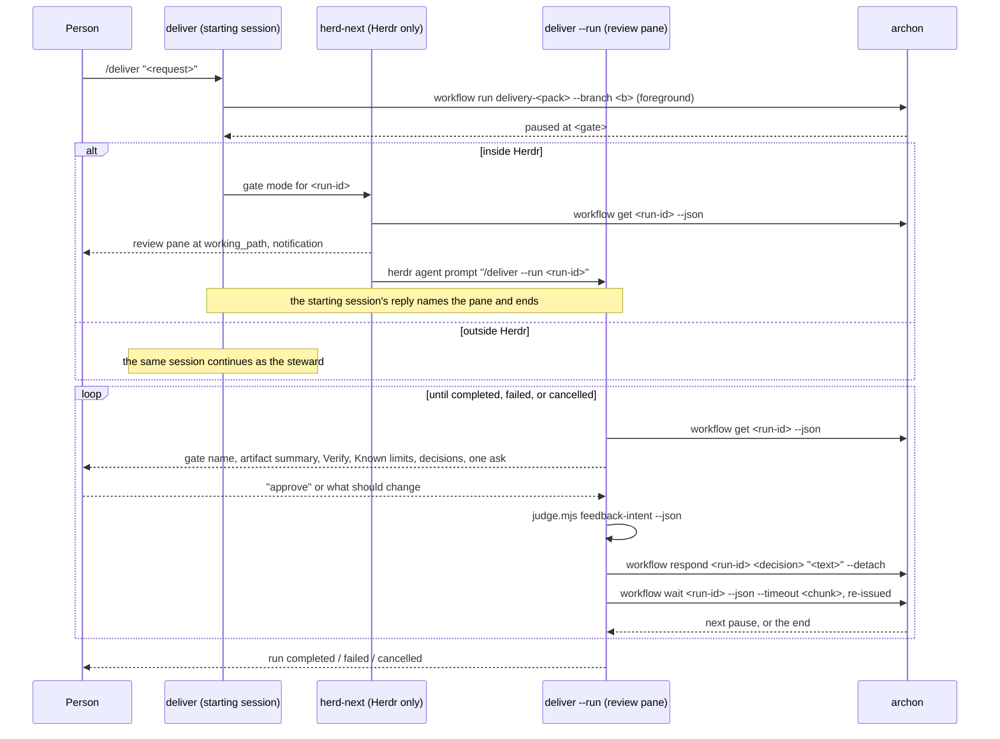

### Summary of change request

A person steering an Archon delivery run never types an `archon` command; they talk to an agent that runs every command for them. Three places break that today, and a steward loop that stays with a run from its first pause to its end fixes all three.

### Current State

- At a gate the person is told to type the decision themselves. `herd-next`'s Archon gate mode opens a review pane with the artifact read staged, then prints `archon workflow respond <run-id> approve` and `archon workflow respond <run-id> reject "<what should change>"` for the person to run from any pane (`herd_next_gate_answer.md:5`).
- `deliver` starts the run, waits for its first pause, and ends by naming three more commands for the person: `approve`, `reject`, `wait` (`deliver_archon_answer.md:14`). Its reply is terminal by design (`deliver/SKILL.md:46`).
- Nothing watches for the second pause. `herd-next`'s reply states the watch ended at this pause and a later gate needs `/herd-next --run <run-id>` again. The person polls or discovers the next pause by accident.
- The person decides from a pane that shows them the artifact but never summarizes it: the staged line is a read request, and the artifact's summary, Verify list, and Known limits are whatever the pane agent chooses to say.

### Desired End State

- Starting a run with `/deliver` leaves the person in conversation with an agent that has already read the gated artifact and asked for a decision in prose. No `archon` command appears in any reply as something to run.
- The person answers in plain language: `approve`, or a sentence describing what should change. The steward maps that to a decision id and calls `archon workflow respond` itself.
- After each decision the steward stays with the run: it announces the next pause the same way, or the run's completion, failure, or abandonment. The person is never the one polling.
- `/deliver --run <run-id>` attaches to a run that is already running or paused and steers it from there. That is the re-entry path when a session or pane dies mid-run, and the command `herd-next` submits into the review pane.
- Inside Herdr the conversation happens in the review pane `herd-next` opens at the run's `working_path`; outside Herdr it happens in the session that ran `/deliver`. The behavior the person sees is the same in both.
- Every answer template in the collection that today names an `archon` command for a person to type instead tells them what to say.

### What we're not doing

- No new skill. The loop lives in `skills/delivery/deliver/SKILL.md` and nowhere else, so `EXPECTED_SKILL_COUNT`, `.claude-plugin/plugin.json`, `README.md`, `docs/getting-started.md`, and `workflows/delivery.md`'s phase table are untouched except for the deliver row's wording.
- The by-hand handoff fence (`/<skill> @<file>`) is unchanged. The Stop hook and `herd-next`'s handoff mode keep staging it without submitting, so "running the next command records approval" stays true.
- No change to the pack YAML, the gate nodes, or where a pause happens. The steward is a client of `archon workflow get/respond/wait` and nothing else.
- No new Archon CLI surface, no daemon, no background process of our own. The only detached process is Archon's own continuation child, which `respond --detach` already supports.
- No change to `judge.mjs`. `feedback-intent` is used as it is.
- No change to the initial `archon workflow run` call. It stays foreground, because Archon refuses `--detach` on a fresh launch of an interactive pack (`deliver/SKILL.md:43`, `herd-next/SKILL.md:86`).

### Proposed End State Architecture

One owner for the pause loop, in one file. `deliver` starts the run and then continues as the steward in the same session; inside Herdr it instead opens the review pane through `herd-next` and submits `/deliver --run <run-id>` into it, which enters the same steward loop in that pane. `herd-next` keeps pane mechanics only.



The loop is turn-driven, not a single blocking call. Each iteration is one agent turn that ends with a question; the person's reply starts the next turn, which responds and then polls in bounded chunks until the run pauses again. That matters for the skill text: the steward never tries to read the person's answer from inside a bash loop, and no single shell call is held for the length of a phase.

Files the change touches:

```text
skills/delivery/
├── deliver/
│   ├── SKILL.md                              # step 1 gains the --run attach mode; step 4 continues
│   │                                         # as the steward; the loop, the mapping, the ended states
│   └── references/
│       ├── deliver_archon_answer.md          # line 14 loses approve/reject/wait; ends with the ask
│       │                                     # (outside Herdr) or the pane pointer (inside Herdr)
│       ├── deliver_gate_answer.md            # new, terminal: a pause announced, a decision asked
│       └── deliver_ended_answer.md           # new, terminal: completed, failed, cancelled, not-paused
├── herd-next/
│   ├── SKILL.md                              # gate mode: get, notify, open the pane, submit
│   │                                         # /deliver --run <id>; the wait and respond blocks go
│   └── references/herd_next_gate_answer.md   # line 5 loses the respond commands
└── start-epic-delivery/
    └── references/epic_delivery_final_answer.md  # children: manual tells the person what to ask for
scripts/validate.mjs                          # two TERMINAL_ANSWER entries; skill count unchanged
shared/CONVENTIONS.md                         # the ask sentence, stated once
workflows/delivery.md                         # the deliver row; the stage-not-submit rule narrowed
```

What the person reads changes shape, not length:

```diff
-Decide from any pane once you have read it: `archon workflow respond <run-id> approve`,
-or `archon workflow respond <run-id> reject "<what should change>"`. Rejecting reopens
-the gate after the iterate skill revises the artifact. This watch ended at this pause;
-a later gate in the same run needs `/herd-next --run <run-id>` again.
+Answer in that pane: say `approve`, or say what should change. The agent there resolves
+the gate and stays with the run, announcing the next pause or the run's end.
```

Steward turn, in pseudocode:

```text
run   = archon workflow get <run-id> --json
state = .status, .working_path, .metadata.approval.{nodeId,message,decisions[].id,resolved}

when state is not paused-with-empty-resolved:
  completed | failed | cancelled -> print deliver_ended_answer.md, stop
  running                        -> wait in chunks (below), then re-read

read the gated artifact at <working_path>/<task dir from message>
inside Herdr: herdr notification show "Gate: <slug>/<phase>" --body <message> --sound request
print deliver_gate_answer.md: gate name, artifact summary, its Verify list, its Known limits,
  the decision ids, one ask
end the turn

on the person's next message:
  decision = map(message, decisions[])
  archon workflow respond <run-id> <decision> "<their words>" --detach   # returns at once
  wait in chunks:
    archon workflow wait <run-id> --json --timeout 600
    re-issue while the run is still running; a chunk that expires is not a failure
  until status is paused, completed, failed, or cancelled
  loop
```

### Resolved Design Questions

#### The loop lives in `deliver`, not in a new skill

Decided in review. `skills/delivery/deliver/SKILL.md` is the one file that holds the steward loop: the paused-state read, the announcement, the reply mapping, the respond call, the bounded wait, and the ended states. Its two new reply templates live under `deliver/references/` and are registered as `TERMINAL_ANSWER`. Because no skill directory is added, `EXPECTED_SKILL_COUNT` (`validate.mjs:20`), `.claude-plugin/plugin.json`, `README.md`'s utilities row, `docs/getting-started.md`, and `workflows/delivery.md`'s phase table are unchanged except the deliver row's wording, which gains the steward loop and the `--run` mode.

Alternatives not chosen: a new `steward-run` skill, which bought one more registered surface and five mechanical registrations for a loop that only `deliver` and a pane running `deliver` ever enter; a second mode inside `herd-next`, which would put stewardship that must work outside Herdr inside a skill guarded on `HERDR_ENV`; and duplicating the loop in both skills, which is two copies of the decision mapping. The name `steward-run` is dropped everywhere; "the steward" stays as the name of the role `deliver` plays after the run starts.

#### `/deliver --run <run-id>` attaches to an existing run

Decided in review. Step 1 of `deliver` splits on the argument: `--run <run-id>` (or a bare run id) skips routing entirely and enters the steward loop against that run, whatever its status. The loop's first act is the `get` read, so an attach to a `paused` run announces immediately and an attach to a `running` run waits in chunks first. This is both the command `herd-next` submits into the review pane and the way a person re-enters a run whose watcher was lost.

Alternative not chosen: a separate re-entry command. `deliver`'s existing contract is already "start or continue this delivery"; one entry point keeps the loop in one file.

#### The steward owns the loop, not the person

Decided in the request. The steward stays with a run until it completes, fails, or is cancelled: it reads `archon workflow get <run-id> --json` at each pause (`status`, `working_path`, `metadata.approval.nodeId`, `.message`, `.decisions[].id`, `.resolved`), raises `herdr notification show` when inside Herdr, presents the artifact's summary, Verify list, and Known limits in prose, takes the person's plain answer, maps it to `archon workflow respond` itself, and continues.

Alternative not chosen: a person-driven loop where each pause needs a fresh `/herd-next --run <id>`. That is today's behavior and is what the task exists to remove.

#### The review pane inside Herdr is the one `herd-next` gate mode already opens

Decided in the request. Inside Herdr the steward runs in the review pane at the run's `working_path`; outside Herdr it runs in the session that started the run. No second pane, no pane per gate: later pauses in the same run are announced in the same pane, because the working path does not change within a run.

Consequence for `herd-next`: its gate mode loses both the blocking `archon workflow wait` (`herd-next/SKILL.md:86-90`) and the reported `respond` command (`:119-125`). It reads `get` once for `working_path`, `status`, `nodeId`, and `message`, which is what the pane's cwd, label, and notification need; waiting belongs to the pane's steward from that point on. A run that is not yet paused is no longer a skipped reply: the pane opens labelled `<slug>/run`, the notification is skipped because there is no gate to name, and the steward in the pane announces the pause when it arrives.

#### `deliver` hands to the steward instead of printing commands

Decided in the request. `deliver/SKILL.md:46` ("The reply is terminal: the run is already going, so no skill command follows") stays true in letter: the reply still carries no handoff fence. What changes is that `deliver` does not stop working at that reply; outside Herdr it continues as the steward in the same session, and inside Herdr it opens the pane that will.

#### `deliver_archon_answer.md` carries the first announcement

Decided by recommendation. The routing reply keeps its lines (pack, confidence, gates, run id, branch, worktree, pauses ahead) and its last line is filled one of two ways: outside Herdr it is the steward's ask, so the starting session is already asking, which is what acceptance (b) requires; inside Herdr it is the pane pointer, because the ask belongs to the pane. Every later pause uses `deliver_gate_answer.md`. The ask sentence is stated once in `shared/CONVENTIONS.md` and quoted by both templates, so the two cannot drift.

Alternatives not chosen: concatenating the routing lines and the gate template as one reply, which no existing skill does; and printing routing only and announcing on the next turn, which acceptance (b) rules out because the person's first reply would land before any question was asked.

#### `herd-next` submits the attach command rather than staging it

Decided by recommendation, and confirmed: `herdr agent prompt "$name" "<text>"` without `--wait` returns on submission, so the gate mode does not block for the length of the run.

```bash
herdr agent prompt "$name" "/deliver --run $run_id"
```

The stage-not-submit rule exists so that "running the next command records approval" stays true; starting a steward records no approval, so the rule does not reach this line. The same change narrows the rule's wording in `herd-next/SKILL.md:70` and in `workflows/delivery.md` to "a command that records approval is staged, never submitted", so the boundary is stated rather than implied.

Alternative not chosen: staging with `send-text` and leaving the person to press Enter, which preserves the old wording verbatim but leaves acceptance (a) half met, since the pane would be silent until they act.

#### `respond --detach`, then `wait --timeout` re-issued in bounded chunks

Decided in review, overriding the foreground recommendation. The steward never holds one shell call for the length of a phase:

```bash
archon workflow respond "$run_id" "$decision" "$text" --detach
while :; do
  archon workflow wait "$run_id" --json --timeout 600 || true
  status=$(archon workflow get "$run_id" --json | jq -r '.status')
  case "$status" in paused|completed|failed|cancelled) break ;; esac
done
```

The reason is the failure mode this design's Known limits already describe: an agent shell call held for an hour is exactly the lost-watcher case, and it is also the case every runtime's process supervision handles worst. Bounded chunks fail small. A chunk that expires is not an error; the loop re-reads and re-issues. `--detach` is accepted here because Archon refuses it only on a fresh launch of an interactive pack, not on a decision that continues one (`workflows/delivery.md:146`). The 600 second chunk is a starting value the plan may tune; what the design fixes is that the chunk is bounded and the loop re-issues.

Alternative not chosen: a foreground `respond` with the shell timeout raised past an hour, which is one command per turn and the same wall clock, but concentrates the whole phase into a single call that nothing can resume.

#### `judge.mjs feedback-intent` reads the reply, with the JSON fields

Decided in the request for the helper, by recommendation for the branching. No new judgment command and no change to `judge.mjs`. A reply that is exactly one word matching an id in `decisions[]` is taken as that id without calling the helper. Otherwise the helper is called with `--json` and the object is branched on: `intent: proceed` maps to `approve`; `intent: revise` with `suggested: revise` maps to `reject` with the person's words; `suggested: unclear`, or a `suggested` of `proceed` or `stop` that fell below the bar, maps to one clarifying question that names the available ids. That branch exists because the bare-word output clamps anything under 0.9 confidence to `revise` (`judge.mjs:436-437`), which would silently reject the gate when the person asked a question about the artifact.

`intent: stop` has no decision id. The steward maps it to `archon workflow abandon <run-id>` after one explicit confirmation, and never on the first statement. Ids a pack declares beyond `approve` and `reject` are listed in the ask, and a reply that matches none of them gets the clarifying question rather than a guess.

Helper unavailable (no `node`, exit 3, any nonzero exit): fall back to the steward's own reading of the reply and say once in the reply that judgments were skipped, per the conventions' Typed judgments rule.

Alternatives not chosen: calling the helper bare and treating `revise` as reject always, which rejects a gate because the person asked what phase 3 does; and calling the helper for every reply including one-word `approve`, which spends a judgment on the common case.

#### Two new terminal templates, both under `deliver/references`

Decided by recommendation, and forced in shape by `validate.mjs`: every file ending in `answer.md` under a skill directory is discovered (`validate.mjs:322-327`) and must appear in `ANSWER_INVENTORY`, and a `TERMINAL_ANSWER` entry appears in no other table and is forbidden from `FENCE_ARTIFACT` (`validate.mjs:381`). Each carries zero fences, zero `Next action:`, and zero `Open a new session in `.

- `deliver_gate_answer.md`: the pause announced and the decision asked.
- `deliver_ended_answer.md`: a `<reason>` slot covering completed, failed, cancelled, and "no paused gate found".

Alternatives not chosen: one file per outcome, as `review-code` and `test-app` split theirs, when the ended states differ only in the reason line; and a third file for the clarifying question, which is one sentence and needs no template.

#### The sweep covers the two human-directed surfaces plus `start-epic-delivery`

Decided by recommendation. Acceptance (d) is `grep -rn 'archon workflow' skills/*/references skills/*/SKILL.md` showing no line that tells a person to run a command. Eleven lines match today; research classified nine as the acting agent's own command or descriptive context. Revised: `herd_next_gate_answer.md:5` and `deliver_archon_answer.md:14`. Also revised, one sentence of reply wording and no behavior change: `start-epic-delivery`'s reply, so a `children: manual` epic tells the person to ask the agent to start a child. That is the one remaining place where a printed command is the person's only path forward, which is this task's defect in another skill.

Left as they are: `deliver_archon_answer.md:7`, the started command printed in past tense as the run's provenance, and `start-epic-delivery/SKILL.md:34`'s `{child_start_command}`, which is the record of what would run. Removing the provenance line would cost the person the record of what was actually started, and it instructs no one to type anything.

### Patterns to follow

#### Reading a paused run, and the field names to use

`herd-next`'s gate mode already does this read; `deliver` takes it over unchanged. `skills/delivery/herd-next/SKILL.md:94-101`

```bash
run=$(archon workflow get "$run_id" --json)
status=$(jq -r '.status' <<<"$run")
cwd=$(jq -r '.working_path' <<<"$run")
node=$(jq -r '.metadata.approval.nodeId // empty' <<<"$run")
msg=$(jq -r '.metadata.approval.message // empty' <<<"$run")
decisions=$(jq -r '.metadata.approval.decisions[].id' <<<"$run")
resolved=$(jq -r '.metadata.approval.resolved // empty' <<<"$run")
```

A gate is live only when `status` is `paused` and `resolved` is empty. No JSON schema for these fields is documented anywhere in `docs/` or `workflows/`; the names come from this skill, so acceptance (f)'s recorded JSON is the only proof they are right.

#### Calling the typed-judgment helper with a guard

Every existing call site guards `node`, ignores a nonzero exit, and clamps the output. `.archon/workflows/delivery/gate-phase/delivery-gate-phase.yaml:76`

```bash
intent=$(node "$judge" feedback-intent - <<<"$text" || true)
case "$intent" in revise|proceed|stop) ;; *) intent=revise ;; esac
```

Target shape for the steward, which needs the fields the bare word hides:

```bash
a=$(node "$judge" feedback-intent --json - <<<"$reply") || a=''
intent=$(jq -r '.intent // "revise"' <<<"${a:-{\}}")
suggested=$(jq -r '.suggested // "unclear"' <<<"${a:-{\}}")
```

#### Registering the new answer templates

`scripts/validate.mjs:36-95`. Terminal entries take the sentinel and appear in no other table. `deliver` already has one, so the two new lines sit beside it and `EXPECTED_SKILL_COUNT` does not move.

```js
"deliver/references/deliver_archon_answer.md": TERMINAL_ANSWER,
```

```js
"deliver/references/deliver_ended_answer.md": TERMINAL_ANSWER,
"deliver/references/deliver_gate_answer.md": TERMINAL_ANSWER,
```

#### Forcing a real paused run for acceptance (f)

`delivery-start`'s `confirm` node pauses under `when: "$route.output.confirm == 'true'"`, and `route` sets that from the routing judgment's confidence. Force the unconfident path, not a particular `gates` value: run the scratch start with no `TYPESAFE_API_KEY` and no explicit `--input workflow=`, so an unanswering helper drives `workflow=full; confident=false` (`.archon/workflows/delivery/start/delivery-start.yaml:80`). An explicit `--input workflow=<pack>` never confirms.

Do not lean on `gates` being non-`none`. This branch ands the two conditions (`:129`, `if [ "$confident" = false ] && [ "$gates" != none ]`), but the sibling branch `confirm-when-unsure` drops the `gates` term (`:130`, `if [ "$confident" = false ]`), so an unsure pack confirms whatever the gates are. An unsure request pauses on both branches; a `gates`-dependent setup only reads correctly on one.

#### Scratch repository with a bare remote

`tests/wave.test.mjs:54-73,139-174`: `fs.mkdtempSync` plus `git init -q -b main` for the checkout, a second `mkdtemp` plus `git init -q --bare` for the remote, `git remote add origin <path>`, and a fixed `GIT_ENV` with `GIT_CONFIG_GLOBAL=/dev/null`. Archon needs the remote because it cuts the run's worktree from the remote's base branch.

#### The confirm-gate fixture, as the dry-run counterpart

`.archon/workflows/delivery/start/fixtures/confirm-lean.stubs.yaml:1-14` stubs `route` output with `confirm: "true"` and asserts `resolved-text-contains` on the gate's message. It proves the pause exists without a live agent; it does not exercise `respond`, which is why acceptance (f) needs the real run.

## Human Review

### Review targets

- The turn-driven loop in Proposed End State Architecture: one turn per decision, the person's reply starting the next turn, and the respond-then-poll shape inside that turn.
- The file list in Proposed End State Architecture. It is the plan's scope, including `start-epic-delivery`'s reply wording and the narrowed stage-not-submit rule in `workflows/delivery.md`.
- The two shapes of `deliver_archon_answer.md`'s last line (the ask outside Herdr, the pane pointer inside it) and the ask sentence moving into `shared/CONVENTIONS.md`.
- `herd-next`'s gate mode losing its `wait` block and no longer printing a skipped reply for a run that is running rather than paused.

### Verify

- [ ] Confirm `archon workflow respond <run-id> <decision> "<text>" --detach` is accepted on a paused interactive run and returns before the next pause, against a real run rather than only `workflows/delivery.md:146`.
- [ ] Confirm what `archon workflow wait <run-id> --json --timeout <seconds>` does when the chunk expires: exit code and output, so the loop can tell an expiry from a failure.
- [ ] Confirm the six `metadata.approval` field names against one real paused run's JSON, since no document declares them.
- [ ] Confirm the scratch `delivery-start` run pauses at `confirm` with an unsure request, no `TYPESAFE_API_KEY`, and no `--input workflow=`, on this branch and with the sibling branch's condition in mind.
- [ ] `npm test` passes with the two new `ANSWER_INVENTORY` entries and an unchanged `EXPECTED_SKILL_COUNT`.

### Known limits

- No field-level JSON schema exists for `archon workflow get --json` in `docs/getting-started.md`, `docs/cheatsheet.md`, or `workflows/delivery.md`. The steward reads the same six fields `herd-next` reads today; acceptance (f)'s recorded JSON is the only confirmation.
- The initial `archon workflow run` in `deliver` step 4 is still one foreground call held for the first phase, because Archon refuses `--detach` on a fresh launch of an interactive pack. That one call keeps the exposure the bounded respond loop removes from every later phase.
- A session or pane that dies still loses the watcher, and the run keeps going. Recovery is `/deliver --run <run-id>`; nothing in this design detects the loss on its own.
- `wait --timeout`'s expiry behavior is stated from `workflows/delivery.md:146` alone, which says it "gives up earlier" without naming an exit code.
- Multiple concurrent runs are out of scope. The steward takes one run id and watches one run.
