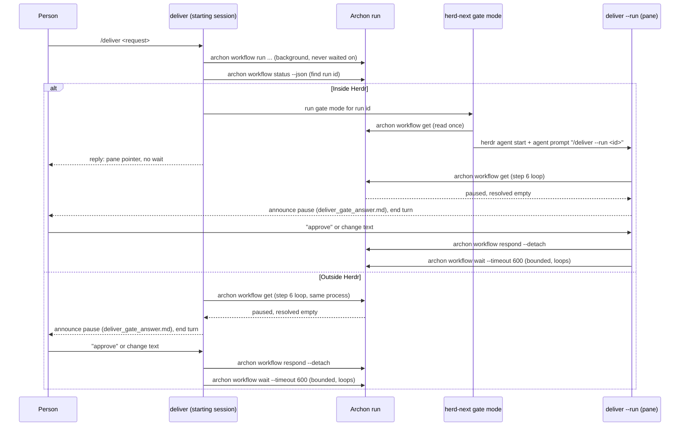

# Research: Steward loop status after implementation phases 05-09

**Date**: 2026-09-18T14:55:47Z
**Git Commit**: 820ca75
**Branch**: herdr-plugin-delivery-flow
**Repository**: skills

## Research Question

1. For each of the five implementation receipts (05-09) in `.agents/tasks/steer-every-archon-gate/`, what does the receipt record as done or verified, and which of task.md's acceptance items (a)-(f) does it map to?
2. In `skills/delivery/deliver/SKILL.md` step 4's Herdr and outside-Herdr branches and step 6, what does the skill do today to hand off to the steward, and what distinguishes the two branches?
3. In `skills/delivery/herd-next/SKILL.md`'s Archon gate mode, what does the skill do to open a review pane and hand off to `deliver`, and what does it assume about the run's `working_path` and the directory a later steward command runs from?
4. What automated test coverage exists in `tests/` for the steward loop against a paused Archon run, and does any existing test exercise a live Herdr review pane, or only the CLI-level `wait`, `get`, and `respond` calls?
5. What does `archon workflow get` return when run from a directory outside the run's own worktree, and where, if anywhere, do `deliver/SKILL.md` or `herd-next/SKILL.md` state or omit an assumption about the working directory a steward command runs from?
6. Does any skill, script, or test in this repository reference `archon workflow cleanup` or otherwise handle worktrees left behind by abandoned Archon runs?

## Research Methodology

Sources examined: the five implementation receipts `05`-`09` in this task directory (read in full); `skills/delivery/deliver/SKILL.md` and `skills/delivery/herd-next/SKILL.md` (steps 1, 4, 6, and the Archon gate mode section, read directly and cross-checked with `sed -n`); all eight files under `tests/` plus `tests/lib/typesafe-stub.mjs`; `docs/cheatsheet.md` and `docs/getting-started.md` for the documented `archon workflow` subcommand surface; `workflows/delivery.md` and `shared/CONVENTIONS.md` for the worktree-lifecycle convention; and `task.md`. Two `agent-codebase-locator` workers and one `agent-codebase-analyzer` worker ran in parallel; every `path:line` claim they returned was re-verified against the repository with `grep -n`/`sed -n` before use.

### Known limits

- `judge.mjs` requires `TYPESAFE_API_KEY`, unset in this environment (`node` is present at `/opt/homebrew/bin/node`, the key is not). The `route-question`, `rerank`, `cite`, and `coverage` helper calls were all skipped for this reason, matching the prior research-questions pass's own recorded limit. Worker routing followed the research-questions document's own tags; evidence order below follows this document's reading of which findings answer each question most directly; every `path:line` claim was checked by hand against the cited lines before being kept.

## Summary

Phases 1-4 (receipts 05-08) landed the prose and code that removes person-directed `archon` commands and installs the steward loop in `deliver` step 6 and the pane hand-off in `herd-next`'s Archon gate mode; each phase re-ran `node scripts/validate.mjs` and `npm test` (64/64 passing throughout, satisfying acceptance (e) at every phase) and phase 3 is the first to run the full acceptance-(d) grep and get zero person-directed `archon workflow` lines. Phase 5 (receipt 09) proved three Archon CLI facts the loop depends on against live scratch runs and recorded a paused-run's JSON plus a `respond --detach` call, satisfying acceptance (f)'s literal instruction to record that evidence, but explicitly leaves acceptance (a), (b), and (c) — the agent-behavior proof that a review pane or a steered session actually announces pauses and resolves them — as deferred, because that needs a live Herdr workspace and an end-to-end steered run rather than a command whose output can be captured. `deliver` step 4 hands off differently by branch: inside Herdr it delegates stewardship to a fresh `deliver --run <run-id>` invocation opened in a `herd-next`-managed pane and stops; outside Herdr the same process falls through into step 6 and stewards the run itself. `herd-next`'s Archon gate mode is pane mechanics only — it reads the run once, opens a pane at the run's `working_path`, and submits the attach command without waiting. No file under `tests/` references `archon workflow wait`, `get`, or `respond`, or any Herdr pane primitive; the steward loop and its Herdr integration have no automated test coverage. Neither `deliver/SKILL.md` nor `herd-next/SKILL.md` states the working directory a steward's `archon workflow get` call must run from; the one concrete data point is receipt 09's own observation that the command returns `null` fields when run outside the run's own worktree. `archon workflow cleanup` does not exist as a documented or invoked command anywhere in this repository; the only real, documented mechanism for an abandoned run is `archon workflow abandon <run-id>`, which ends the run but leaves its worktree on disk with nothing in the repository reclaiming it.

## Detailed Findings

### 1. Receipts 05-09 each map to a distinct slice of acceptance items (a)-(f), and (a), (b), (c) are still open

| Receipt | Phase | What it records | Acceptance items touched |
|---|---|---|---|
| `05-implementation-steer-every-archon-gate.md` | 1: reply templates and registration | Two new terminal templates (`deliver_gate_answer.md`, `deliver_ended_answer.md`) registered in `ANSWER_INVENTORY`; the byte-exact ask sentence stated once in `shared/CONVENTIONS.md`; every person-directed `archon workflow` command stripped from four existing reply templates (`05:19-25`). | Contributes to (d) but does not check it in full: its own grep runs only over `skills/*/*/references` (`05:36-38`), not `skills/*/SKILL.md`. `node scripts/validate.mjs` and `npm test` pass, 64/64 (`05:28-34`), an early instance of (e). Its own Deferred Human Evidence line states "(a), (b), and (c) inside and outside Herdr are recorded in Phase 5" (`05:50`) — i.e., not addressed here. |
| `06-implementation-steer-every-archon-gate.md` | 2: `deliver` becomes the steward | `deliver/SKILL.md` gains the `--run <run-id>` attach branch, the non-blocking run-start in step 4, the Herdr/outside-Herdr reply split, and the full step 6 steward loop (`06:19-26`). | Implements the code path (a)/(b)/(c) depend on, but proves none of them: "Nothing here proves the loop runs" (`06:87`). `npm test` 64/64 and `validate.mjs` pass (`06:31-37`), (e) again. Its own grep over `deliver/SKILL.md` alone is not the collection-wide (d) check; the receipt states acceptance (d) "was not run here; `herd-next/SKILL.md` still fails it by design at this point" (`06:89`). |
| `07-implementation-steer-every-archon-gate.md` | 3: `herd-next`'s gate mode shrinks to pane mechanics | Deletes the blocking `archon workflow wait` and the reported `archon workflow respond` block from `herd-next/SKILL.md`; the pane now submits `/deliver --run <run-id>` via `herdr agent prompt` (`07:19-24`). | First receipt to run the collection-wide acceptance-(d) grep (`skills/*/references skills/*/SKILL.md skills/*/*/references skills/*/*/SKILL.md`) and pass: 14 hits, all reviewed as agent-run commands or past-tense provenance, none addressed to a person (`07:39-41`). `npm test` 64/64 (`07:31-33`), (e) again. Acceptance (a), (b), (c) explicitly still deferred to Phase 5 (`07:45`). |
| `08-implementation-steer-every-archon-gate.md` | 4: the delivery document matches the skills | `workflows/delivery.md`'s `deliver` and `herd-next` rows rewritten to describe the steward loop and the pane hand-off; the by-hand stage-not-submit paragraph narrowed to match `herd-next/SKILL.md:70` (`08:19-22`). | Documentation only; no acceptance item is independently checked beyond re-running `validate.mjs` and `npm test` (pass, (e) again) and one narrow grep for the shared sentence (`08:24-35`). The receipt states plainly: "No skill, pack, or script changed in this phase, so no behavior is proved by it" (`08:60`). |
| `09-implementation-steer-every-archon-gate.md` | 5: prove the loop against a real paused run | Two scratch repositories with bare remotes; a forced pause at `confirm` in a `delivery-start` run; three CLI facts recorded from live runs (`metadata.approval` field shape, `wait --timeout` exit codes, `respond --detach` behavior) (`09:18-105`). | Re-runs and passes acceptance (d) (14 hits, same conclusion) and (e) (64/64) (`09:129-131,121-123`). Acceptance (f) asks to "prove (c) against a real paused run... and record the observed JSON and the respond call in the verification and receipt artifacts" (task.md:13); receipt 09 does record exactly that — Fact 1's paused-gate JSON and Fact 3's `respond --detach` transcript (`09:25-46,87-105`), under its own "Automated Verification" section (`09:107-127`). Acceptance (a), (b), and (c) are explicitly listed as deferred: "Not executed; needs a live Herdr workspace" and "needs a live delivery run steered end to end by a session following step 6" (`09:135-137`), because they are agent-behavior acceptance, not a command whose output can be captured (`09:137`). |

Two open items receipt 09 flags in its own "Known limits" and neither closed there: `archon workflow get` returning `null` fields outside the run's own worktree, with nothing in `deliver/SKILL.md` step 6 stating that constraint (`09:161`); and Archon's own worktrees for abandoned runs remaining on disk under `~/.archon/workspaces/T/tmp.*`, with `archon workflow cleanup` not run "because this task's own live run shares that tree" (`09:162`). These are this document's questions 5 and 6, findings 3 and 4 below.

#### Testing patterns

Every receipt's own verification is `node scripts/validate.mjs` and `npm test` (64 tests, 3 suites, 0 failures throughout 05-09); receipt 07 is the first to add the collection-wide `archon workflow` grep, and receipt 09 re-runs it. No receipt runs a test file against the steward loop itself; see finding 3 below.

### 2. `deliver` step 4 delegates stewardship inside Herdr and performs it directly outside Herdr; both paths converge on step 6

`deliver/SKILL.md` step 4 ("With Archon") computes the branch, dispatches `archon workflow run … --branch <branch> …` as a long-running background process it never waits on, and reads the run id by matching `working_path` against the branch's worktree in `archon workflow status --json` (`skills/delivery/deliver/SKILL.md:41-49`). It then branches on `HERDR_ENV`:

- **Inside Herdr** (`HERDR_ENV` is `1`): "run `herd-next`'s Archon gate mode for this run id at once, without waiting for a pause; it opens the review pane at the run's `working_path` and submits `/deliver --run <run-id>` into it. Reply with `references/deliver_archon_answer.md`, its run line reading `is running`… and stop. The pane's steward owns every pause from here." (`skills/delivery/deliver/SKILL.md:54`). This invocation of `deliver` never enters step 6; the sentence "The pane's steward owns every pause from here" identifies a different, freshly-started `deliver` invocation (running inside the pane `herd-next` opens) as the actual steward.
- **Outside Herdr**: "go to step 6 now. The run is `running`, so the loop's running-run branch waits in bounded chunks for the first pause… Step 6's loop resumes on the user's answer." (`skills/delivery/deliver/SKILL.md:55`). Here the same process that started the run falls straight through into step 6 and stewards it.

Both branches end with "the reply carries no command fence: the run is already going, so no skill command follows" (`skills/delivery/deliver/SKILL.md:56`).

Step 6, "Steward the run", is the loop itself: read `archon workflow get "$run_id" --json` and extract `status`, `working_path` (as `cwd`), `metadata.approval.nodeId`, `.message`, `.decisions[].id`, and `.resolved` (`skills/delivery/deliver/SKILL.md:69-77`); a gate is live only when `status` is `paused` and `resolved` is empty, terminal statuses (`completed`, `failed`, `cancelled`) print `references/deliver_ended_answer.md` and stop, and `running` or `paused` with a non-empty `resolved` is the running-run branch that waits in bounded `wait --timeout 600` chunks and re-reads (`skills/delivery/deliver/SKILL.md:79`, `:104-109`). On a live gate the loop announces the pause (raising a Herdr notification first when applicable), prints `references/deliver_gate_answer.md`, and ends the turn at the ask; the person's reply is mapped to a decision id through `judge.mjs feedback-intent` with a clarifying-question fallback, then resolved with `archon workflow respond "$run_id" "$decision" "$text" --detach` (`skills/delivery/deliver/SKILL.md:81-104`), after which the loop returns to the state read (`:112`).

#### Testing patterns

None. No test file references step 4 or step 6 of `deliver/SKILL.md`; see finding 3.

### 3. `herd-next`'s Archon gate mode reads the run once, opens a pane at the run's own worktree, and submits without waiting

The section reads the run's state with the identical shape `deliver` step 6 uses — `run=$(archon workflow get "$run_id" --json)` then five `jq` extractions for `status`, `cwd` (`working_path`), `node`, `msg`, `decisions`, `resolved` (`skills/delivery/herd-next/SKILL.md:91-98`) — and states plainly that it does not itself wait: "Read the run once. This pane is never held: the steward in the review pane does the waiting." (`skills/delivery/herd-next/SKILL.md:86`). A live gate is `status: paused` with `resolved` empty, using the same "absent while the gate waits, appears once answered" reading `deliver` uses (`skills/delivery/herd-next/SKILL.md:100`). A terminal status prints the skipped reply and stops; `running`, or `paused` with a non-empty `resolved`, still opens the pane with `$phase` set to `run` and no notification (`skills/delivery/herd-next/SKILL.md:100`).

`$cwd` (`.working_path`) is used twice, both to locate the *pane*, not to constrain where the `archon workflow get` call itself runs: it resolves `$artifact`/`$slug` (the run's own task directory, "never the caller's, because `$cwd` is the run's `working_path`, a different checkout from `$PWD` whenever the caller is not already inside it", `skills/delivery/herd-next/SKILL.md:102`), and it substitutes for `$PWD` everywhere steps 4-6's pane-opening logic runs, "because the review pane lives in the run's worktree, not the caller's" (`skills/delivery/herd-next/SKILL.md:104`). The hand-off itself is four commands — notify (guarded on a live gate existing), start the agent, rename the pane, and submit the attach prompt:

```bash
[ -n "$node" ] && herdr notification show "Gate: $slug/$phase" --body "$msg" --sound request
herdr agent start "$name" --kind "$kind" --pane "$pane"
herdr pane rename "$pane" "$slug/$phase gate"
herdr agent prompt "$name" "/deliver --run $run_id"
```

(`skills/delivery/herd-next/SKILL.md:106-111`)

"`agent prompt` without `--wait` returns on submission, so the gate mode does not block for the length of the run. The pane's `deliver` reads the gated artifact, announces the pause, and resolves every decision itself…" (`skills/delivery/herd-next/SKILL.md:115`) — the pane's freshly-submitted `deliver --run <run-id>` is the actual steward; `herd-next`'s own gate-mode invocation exits after submission.

#### Testing patterns

None. No test references `herd-next`'s Archon gate mode, `herdr agent prompt`, or `herdr notification show`; see finding 3.

### 4. No automated test exercises the steward loop or a Herdr review pane

`tests/` holds eight `*.test.mjs` files plus a shared stub, none of which reference `archon workflow wait`, `archon workflow get`, `archon workflow respond`, `deliver/SKILL.md` step 6, `herd-next`'s Archon gate mode, `working_path`, `ANSWER_INVENTORY`, or the word "steward" in any form (confirmed with both `rg` and `grep -r`, case-insensitive). `herdr` does not appear anywhere in `tests/`.

| File | What it actually tests |
|---|---|
| `tests/build-packs.test.mjs` | `scripts/build-packs.mjs`'s prompt-to-bash conversion and OMP-flavor pack generation. |
| `tests/commits.test.mjs` | `scripts/check-commits.mjs` and `.githooks/commit-msg` subject-line lint rules. |
| `tests/dispatch.test.mjs` | The `route`/`resolve`/`confirm` bash bodies inside `delivery-start.yaml`, run standalone under `/bin/bash`; no `wait`/`get`/`respond` loop. |
| `tests/install.test.mjs` | `scripts/install.mjs` plan/apply/detect and skill-tree building; one spot spawns `archon workflow list --json` to confirm installed packs are visible. |
| `tests/judge.test.mjs` | `judge.mjs` CLI subcommands including `feedback-intent`, against a stubbed TypeSafe API — exercised standalone, never from a gate-pause context or wired to a `respond` call. |
| `tests/metrics.test.mjs` | `scripts/metrics.mjs` reading Archon's sqlite event log; asserts gate wait time and gate decision counts as after-the-fact telemetry, not the live loop. |
| `tests/packs.test.mjs` | The largest suite: pack YAML generation plus, when a local `archon` binary is on `PATH`, real dry-run/live `archon workflow run/list/test` checks of every pack flavor, including gate pause/resume via the internal dry-run harness (not a literal `archon workflow respond` shell call). |
| `tests/wave.test.mjs` | The `delivery-wave` block's bash bodies building `archon workflow run` command strings for child/epic launches, against a fake `archon` binary. |
| `tests/lib/typesafe-stub.mjs` | Shared in-process TypeSafe/judge API stub used by the `build-packs`, `dispatch`, `judge`, and `packs` suites; not itself a test file. |

The nearest coverage to a paused gate is `tests/packs.test.mjs:516-523` (a dry-run trace asserting `outcome: "paused"` at a named gate node) and `tests/packs.test.mjs:661-684` (a gated outline run halts, then a detached `reject`/`approve` through the test harness resumes it) — both exercise Archon's own pause/resume mechanics, not the steward's read/announce/respond reaction to one.

#### Testing patterns

Covered above; the summary line is that the steward loop's CLI surface and its Herdr integration have no test file anywhere in `tests/` today.

### 5. Neither SKILL.md states the working directory a steward's `archon workflow get` call must run from; the one confirmed data point is receipt 09's own live-run observation

`grep -n` over both files' `archon workflow get "$run_id" --json` lines (`skills/delivery/deliver/SKILL.md:70`, `skills/delivery/herd-next/SKILL.md:91`) shows no preceding `cd` and no accompanying prose stating a required working directory; `$cwd` in both files is only ever an *output* of that call (assigned from `.working_path`), never a precondition for making it. The closest textual neighbors are about a different command or a different purpose entirely: `deliver/SKILL.md:45` ("Run it from the project root…") describes where to dispatch `archon workflow run`, the start command, not `archon workflow get`; `herd-next/SKILL.md:102` and `:104` use `$cwd` to resolve the artifact path and as the pane's `--cwd`, i.e. where the *review pane* opens, not where the shell invoking `archon workflow get` sits.

The one concrete data point in this task's own history is receipt 09's Known limits: "`archon workflow get` returns `null` fields when run from a directory outside the run's codebase; every capture above was run from the scratch repository root. Nothing in `deliver/SKILL.md` step 6 states that constraint, and a steward attaching with `--run` from an unrelated directory would read `null` and misbranch." (`.agents/tasks/steer-every-archon-gate/09-implementation-steer-every-archon-gate.md:161`). This is an observation from that phase's own live-run testing, not a documented contract of the `archon` CLI; `docs/cheatsheet.md` and `docs/getting-started.md` describe `archon workflow get <run-id> --json` (`docs/cheatsheet.md:47`, `docs/getting-started.md:60`) without stating a working-directory requirement either.

#### Testing patterns

None automated; the `null`-fields behavior is recorded only as a prose observation in receipt 09, not asserted by any test.

### 6. `archon workflow cleanup` is not a real command anywhere in this repository; abandoned-run worktrees have no automated teardown

The literal phrase `archon workflow cleanup` appears exactly once in the tracked repository, and it is a receipt line stating the command was *not* run: "Archon's own worktrees for the abandoned runs remain under `~/.archon/workspaces/T/tmp.*`. `archon workflow cleanup` was not run because this task's own live run shares that tree." (`.agents/tasks/steer-every-archon-gate/09-implementation-steer-every-archon-gate.md:162`). It also appears twice in this task's own untracked research-questions file as the question being asked, not a finding (`.agents/tasks/steer-every-archon-gate/10-research-questions-steer-every-archon-gate.md:20,40`).

`cleanup` is absent from both places in this repository that enumerate the `archon workflow` subcommand surface: `docs/cheatsheet.md:43-48` and `docs/getting-started.md:35-65` list `run`, `approve`, `reject`, `wait`, `get`, `abandon`, `cancel`, `resume`, `runs`, `status`, `list`, and `test` — no `cleanup`. No script under `scripts/*.mjs`, no `.archon/workflows/**/*.yaml` pack body, and no `tests/*.test.mjs` file references `cleanup` in connection with Archon runs; the one unrelated `cleanup` hit in the skills tree is a bash function that closes a Herdr pane/tab on exit (`skills/delivery/herd-next/references/stop_hook.sh:26,34-35`), not Archon worktree teardown.

The mechanism this repository does document and use for a dead run is `archon workflow abandon <run-id>`, which "marks a run cancelled without stopping host work" (`workflows/delivery.md:151`; also `docs/getting-started.md:65`, `docs/cheatsheet.md:48`) and is written into the steward's stop-intent path as `archon workflow abandon "$run_id" || true` (`.agents/tasks/steer-every-archon-gate/06-implementation-steer-every-archon-gate.md:41`, design intent at `03-design-discussion-steer-every-archon-gate.md:205`). Nothing in the repository states or automates reclaiming the run's worktree directory after `abandon`; `shared/CONVENTIONS.md:47` documents worktree removal only for the by-hand task-worktree convention under `~/.agents/worktrees/` ("removed by the user with `git worktree remove <path>` once the pull request merges"), a different mechanism from Archon's own run worktrees under `~/.archon/workspaces/`. Receipt 09 records its own scratch runs being abandoned and their scratch *repositories* removed by hand (`09:23`), not through any script.

#### Testing patterns

None. No test references `cleanup` in connection with Archon runs or worktrees.

## Code References

### Steward loop implementation

- `skills/delivery/deliver/SKILL.md:14-16` - step 1's `--run <run-id>` attach branch, skipping to step 6.
- `skills/delivery/deliver/SKILL.md:41-56` - step 4, run dispatch and the Herdr/outside-Herdr reply split.
- `skills/delivery/deliver/SKILL.md:65-112` - step 6, the full steward loop (state read, live-gate condition, announce, respond, bounded wait).
- `skills/delivery/deliver/SKILL.md:122-123` - the no-command-for-a-person and one-run-per-steward rules.
- `skills/delivery/herd-next/SKILL.md:76-117` - the Archon gate mode section in full: run discovery, state read, pane open, hand-off.
- `skills/delivery/herd-next/SKILL.md:70` - the stage-not-submit boundary the gate mode's own submit line relies on.

### Reply templates

- `skills/delivery/deliver/references/deliver_gate_answer.md` - pause announcement template (new in phase 1).
- `skills/delivery/deliver/references/deliver_ended_answer.md` - end-of-run template (new in phase 1).
- `skills/delivery/deliver/references/deliver_archon_answer.md` - the run-just-started reply, run line and pane pointer.
- `skills/delivery/herd-next/references/herd_next_gate_answer.md` - the pane reply.
- `shared/CONVENTIONS.md:92-101` - the `## Archon gate ask` section stating the byte-exact ask sentence.

### Task receipts (exhaustive for this task)

- `.agents/tasks/steer-every-archon-gate/05-implementation-steer-every-archon-gate.md` - phase 1.
- `.agents/tasks/steer-every-archon-gate/06-implementation-steer-every-archon-gate.md` - phase 2.
- `.agents/tasks/steer-every-archon-gate/07-implementation-steer-every-archon-gate.md` - phase 3.
- `.agents/tasks/steer-every-archon-gate/08-implementation-steer-every-archon-gate.md` - phase 4.
- `.agents/tasks/steer-every-archon-gate/09-implementation-steer-every-archon-gate.md` - phase 5, including the two open items at `:161-162`.
- `.agents/tasks/steer-every-archon-gate/task.md:13` - the acceptance items (a)-(f) all receipts are checked against.

### Tests (exhaustive listing of `tests/`)

- `tests/build-packs.test.mjs`, `tests/commits.test.mjs`, `tests/dispatch.test.mjs`, `tests/install.test.mjs`, `tests/judge.test.mjs`, `tests/metrics.test.mjs`, `tests/packs.test.mjs`, `tests/wave.test.mjs`, `tests/lib/typesafe-stub.mjs` - see finding 4's table for what each covers; none exercises the steward loop or a Herdr pane.

### Archon CLI surface and worktree lifecycle (representative)

- `docs/cheatsheet.md:43-48` - the documented `archon workflow` subcommand list (`run`, `approve`, `reject`, `wait`, `get`, `abandon`).
- `docs/getting-started.md:35-65` - the same surface with `resume`, `runs`, `status`, `cancel` added; no `cleanup`.
- `workflows/delivery.md:151` - `archon workflow abandon` documented.
- `shared/CONVENTIONS.md:47` - the by-hand task-worktree removal convention (a different mechanism from Archon's run worktrees).

## Architecture Documentation



The two branches share one steward loop body (`deliver/SKILL.md` step 6) and one state-read shape (`run=$(archon workflow get "$run_id" --json)` plus the same five `jq` extractions), duplicated verbatim in `herd-next`'s Archon gate mode for its own one-time read. The Herdr branch's only structural difference is that the loop runs inside a second `deliver` process, submitted into a pane `herd-next` opens at the run's `working_path`; `herd-next` itself never loops. No file in the repository states which working directory that second process's `archon workflow get` calls run from; `herd-next` opens the pane at `$cwd` (`working_path`) for pane-mechanics reasons (`herd-next/SKILL.md:104`), which as a side effect places the second `deliver` process in the run's own worktree, but this is not stated in either skill as the reason a steward's `get` calls need that directory.

## Open Questions

None.
