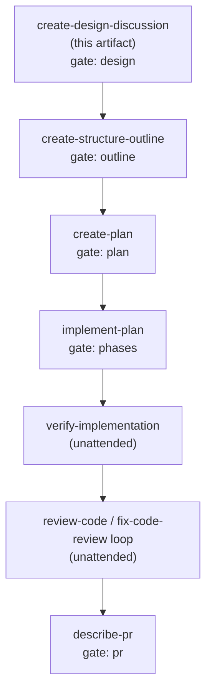

### Summary of change request

Future work delivered through these skills is not sliced granularly enough, so issues and pull requests come out large and hard to review. This change strengthens the delivery skills themselves so future work is cut into granular, reviewable, testable merge requests that stack and deliver quickly and autonomously — using `rmorison/engineering-standards` as inspiration, not a dependency to adopt wholesale. This is one change, not an ongoing program.

### Current State

- An author running the delivery skills today gets granularity decided in one place (`shared/SLICING.md`: one unit = one pull request, four decidable tests, a symptom→split table), but only `create-epic-plan` and `create-structure-outline` actually run those four tests. `create-epic-plan` cuts an epic into one independently mergeable child per behavior; `create-structure-outline` sizes sequential phases inside one task.
- `create-plan` inherits phase boundaries from the outline and never re-checks them against the slicing tests, so an oversized outline phase reaches implementation unre-sized.
- `create-prd` uses only SLICING's one-obligation rule; `start-epic-delivery` re-validates the `slice` field but links no guide.
- There is no size signal at slicing time. The only line-oriented number lives in `review-code` (`~100/~300/~1000`) and fires after the pull request already exists, when splitting is expensive.
- Stacking is expressed structurally: `depends_on` → dependency waves, each child branch off the epic `base`, feature flags for in-flight paths, later waves merged only after their dependencies' pull requests merge. There is no stacked-diff tooling and no numeric PR-size target like the inspiration repo's 200–400 lines.
- `SLICING.md` names its followers as `create-epic-plan`, `start-epic-delivery`, `create-structure-outline`, and `create-prd` — but the actual link lives in `create-epic-plan`, `create-structure-outline`, and `create-prd`, and omits the skill that most needs it (`create-plan`). The stated follower list and the linked reality disagree.

### Desired End State

- An author cutting future work with these skills gets granularity enforced at every phase that decides a mergeable boundary, not just at epic and outline time. An oversized unit is caught and split before implementation, not flagged after the pull request opens.
- `shared/SLICING.md` remains the single definition of "one unit = one pull request"; every skill that fixes a mergeable boundary points at it, and the guide's stated follower list matches the skills that actually link it.
- Authors get an early, advisory size signal at slicing time (so a candidate likely to blow past a reviewable diff is split up front), while the behavioral four tests stay the binding gate.
- Stacking future work stays fast and autonomous: granular children that build in parallel against a shared contract, ordered by minimal `depends_on` waves off the epic branch, flag-guarded where a merge would otherwise expose an incomplete path.

### What we're not doing

- Not adopting Fibonacci story points, a `points-` label scheme, or team-scale estimation ceremony as the sizing unit; the one-day / four-tests vocabulary stays.
- Not building or requiring stacked-diff tooling (e.g. a stacking CLI); stacking stays dependency waves plus per-child branches.
- Not adding a milestone/initiative tier above epics, and not rewriting issue creation onto the GitHub native sub-issue API; textual linking stays, with native sub-issues recorded only as a possible later enhancement.
- Not changing `review-code`'s post-hoc size heuristic away from being a reviewer signal.
- Not touching the compound-engineering plugin assumptions from the inspiration repo (plan Implementation Units as a separate tracker, AI-review-substitutes-for-approval); those are external inspiration, not adoptable here.

### Proposed End State Architecture

The collection already separates *where granularity is decided* (`SLICING.md`) from *where it is materialized* (`start-epic-delivery`). Keep that seam. Close the two gaps the research surfaced — `create-plan` skips the guide, and the guide's follower list is wrong — and add one advisory sizing input, without introducing a second sizing vocabulary.

```
                 shared/SLICING.md   (single definition: 1 unit = 1 PR, four tests, split table)
                        │  followed by (link + run the four tests)
      ┌─────────────────┼───────────────────────┬─────────────────────┐
      ▼                 ▼                         ▼                     ▼
create-epic-plan   create-structure-outline   create-plan          create-prd
 (children =        (phases = sequential        (NEW: re-size        (one-obligation
  separate PRs,      steps in one PR,            each phase           acceptance rule
  four tests +       four tests)                 against four         only)
  size signal)                                   tests before
      │                                          implementation)
      ▼
start-epic-delivery  ── materializes children → task dirs, depends_on → waves, issues,
                        per-child branch off epic base  (re-validates slice; now cites SLICING)
```

Sizing signal (advisory, added to the four tests as a pre-check, not a fifth gate):

```diff
  ## Four tests
  A candidate unit passes all four, or it gets split.
  1. One obligation. ...
  2. One vertical slice. ...
  3. One day. ...
  4. Safe to merge alone. ...
+
+ ## Size signal (advisory)
+ Before running the four tests, estimate the unit's likely changed lines
+ (generated code and lockfiles excluded). A candidate that would change
+ roughly more than 200-400 lines is a signal to look for a split now,
+ using the table below. The four tests remain the only binding gate; this
+ signal only surfaces oversize early, when a split is cheap, instead of at
+ review time.
```

`create-epic-plan` also carries an explicit instruction to prefer parallel children that share a fixed contract over `depends_on` edges, so a shared shape is never recorded as a dependency and fewer waves are needed.

### Resolved Design Questions

#### Numeric PR-size signal at slicing time — Option A (advisory pre-check in `SLICING.md`)

Add a size-signal note to `shared/SLICING.md` as a pre-check ahead of the four tests: a candidate unit that would change roughly more than 200-400 lines (generated code and lockfiles excluded) is a signal to look for a split before the four tests run. The four behavioral tests stay the only binding gate; the signal only surfaces oversize early, when a split is cheap, instead of at review time.

Rationale: imports the inspiration repo's usefully concrete number as guidance while preserving the collection's behavioral, text-decidable gate; directly attacks "not granular enough … larger pull requests" at the moment splitting is cheap. Rejected: Option B (hard numeric gate) — line counts are hard to predict pre-implementation and conflict with the collection's "reviewer effort, not lines" stance; Option C (no new signal) — leaves the reported gap where oversize is caught only after the PR exists.

#### Make `create-plan` a SLICING follower — Option A (lightweight per-phase re-check)

`create-plan` links `SLICING.md` and runs a lightweight per-phase re-check of the four tests, splitting a failing phase by its symptom before writing implementation steps. Not a full re-derivation of the outline.

Rationale: the single highest-leverage fix for large merge requests, because `create-plan` is the last artifact before code is written; closes the researched gap where an oversized outline phase reaches implementation unchecked. Rejected: Option B (keep inheritance) — outline phases and plan phases are 1:1 and nothing re-checks them, so a wrong outline boundary propagates straight to implementation.

#### Correct SLICING's stated follower list — Option A (align list to reality plus the new follower)

`shared/SLICING.md` lists exactly the skills that link and run the guide — `create-epic-plan`, `create-structure-outline`, `create-plan`, and `create-prd` — and separately describes `start-epic-delivery` as re-validating slices materialized there without re-sizing, rather than listing it as a follower.

Rationale: the guide should name only the skills that actually run its tests, and describe materialization-time re-validation separately, so the document stops overstating its own reach. Rejected: Option B (add a real SLICING link to `start-epic-delivery`) — it only materializes an already-sized plan, so re-sizing there duplicates `create-epic-plan`'s gate.

#### Stacking mechanism for fast autonomous delivery — Option A plus C made concrete

Document dependency waves off the epic branch as the stacking model: `depends_on` → waves, per-child branch off the epic `base`, flag-guarded incomplete paths, later waves merge after prerequisites. Add an explicit instruction in `create-epic-plan` to prefer parallel children sharing a fixed contract over `depends_on` edges, so a shared shape is never recorded as a dependency and fewer waves are needed.

Rationale: the existing structural model already delivers stacked, independently mergeable children; the leverage is making it explicit and minimizing `depends_on` edges, not adding stacking tooling. Rejected: Option B (stacked-diff tool/workflow) — adds tooling and per-child rebase burden and fights the "safe to merge alone" invariant.

#### Sizing vocabulary — Option A (keep the one-day / four-tests vocabulary)

Keep the one-day, four-tests vocabulary; do not add Fibonacci story points or a `points-` label scheme.

Rationale: the four tests are text-decidable and tool-checkable via `judge.mjs size-children`, with no estimation ceremony, consistent across every skill. Rejected: Option B (add story points) — a second sizing vocabulary that adds calibration and ceremony the collection deliberately avoids without improving the decidable outcome.

#### GitHub native sub-issue linking — Option A (keep textual linking)

Keep the textual `Depends on: #n` / `Epic:` issue-body linking. Record native GitHub sub-issues as a possible later enhancement, outside this change.

Rationale: textual linking already works wherever `gh` is authenticated and degrades cleanly to a `### Known limits` note otherwise; native linking is presentation, not granularity, and would expand surface area beyond this one-change scope. Rejected for now: Option B (adopt native sub-issues) — adds an API dependency and a failure mode when the feature or permission is absent, a materialization-layer change beyond the granularity focus of this task.

### Patterns to follow

#### Link and run the four tests, the way `create-structure-outline` already does

`create-plan` should follow the same "link the guide, size against the four tests, split by the symptom" shape the outline skill uses. — `skills/delivery/create-structure-outline/SKILL.md:21`

```
Size each phase against the slicing guide's four tests ... split a failing phase by its symptom ...
```

```
# create-plan, new step before expanding phases into edits:
Re-size each outline phase against shared/SLICING.md's four tests; split a failing
phase by the symptom's named split before writing its implementation steps.
```

#### Emergent child count, sized then split — the `create-epic-plan` gate to mirror

`create-epic-plan` already sizes every candidate against all four tests and re-runs them after a split; the size signal slots in as a pre-check ahead of that gate. — `skills/delivery/create-epic-plan/SKILL.md:27`

```
Size every candidate against the slicing guide's four tests ... split each failing
candidate using the split its symptom names ... re-run the tests ...
```

#### Structural stacking already in place, with minimized dependencies

Ordering as `depends_on` → waves, per-child branch off the epic `base`; keep as the stacking model, and add an instruction in `create-epic-plan` to prefer parallel children sharing a fixed contract over `depends_on` edges. — `skills/delivery/start-epic-delivery/SKILL.md:26`, `skills/delivery/create-epic-plan/SKILL.md`

```
Wave 1 is every child with no dependencies. Wave N+1 is every child whose
dependencies are all in waves 1 to N.
```

```
# create-epic-plan, when deciding child ordering:
Prefer parallel children that share a fixed contract over a depends_on edge;
a shared shape is not a dependency, so do not record it as one.
```

### Execution DAG

`task.md` sets `workflow: full` and `gates: all`, and no `NN-execution-plan-<slug>.md` exists in the task directory, so this is the fixed `full` chain from `workflows/delivery.md`. Research and design discussion are complete; the phases ahead are structure outline, plan, implementation, verification, review loop, and pull-request description. With `gates: all`, every artifact edge and the implementation edge pause for human approval; verification and the review/fix loop run unattended between the plan gate and the pull-request gate.



## Human Review

### Review targets

- The six now-resolved Design Questions, especially the concrete 200-400-line advisory size signal, making `create-plan` a SLICING follower, the corrected follower list, and the `create-epic-plan` shared-contract instruction that keeps a shared shape from being recorded as a `depends_on` dependency.
- The scope boundary in "What we're not doing" — native sub-issues, story points, stacked-diff tooling, and a milestone tier stay excluded from this one change.

### Verify

- [ ] Resolved decisions reflect the orchestrator's choices for all six questions before `create-structure-outline` runs.
- [ ] Scope boundary confirmed: this is one change to the skills, not a multi-phase program.

### Known limits

- The inspiration repo's compound-engineering conventions (plan Implementation Units as a separate tracker, AI-review substituting for approval) were read as inspiration only and are not evaluated here; a later phase wanting them must treat them as external plugin behavior.
- No child research workers were started; the newest research artifact (`03-research-issue-granularity.md`) and the sources digest were sufficient to fix direction. The exact size-signal number (200-400 changed lines, generated code and lockfiles excluded) was set by the orchestrator's decision rather than derived.
