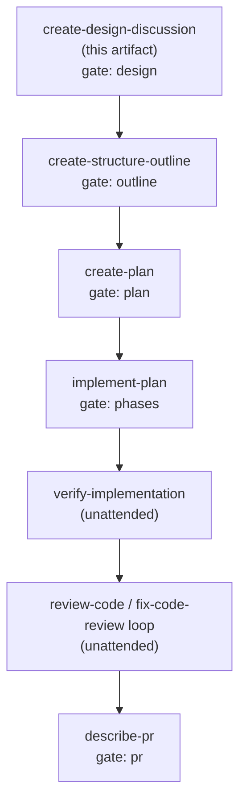

### Summary of change request

Future work delivered through these skills is not sliced granularly enough, so issues and pull requests come out large and hard to review. This change strengthens the delivery skills themselves so future work is cut into granular, reviewable, testable merge requests that stack and deliver quickly and autonomously — using `rmorison/engineering-standards` as inspiration, not a dependency to adopt wholesale. This is one change, not an ongoing program.

### Current State

- An author running the delivery skills today gets granularity decided in one place (`shared/SLICING.md`: one unit = one pull request, four decidable tests, a symptom→split table), but only `create-epic-plan` and `create-structure-outline` actually run those four tests. `create-epic-plan` cuts an epic into one independently mergeable child per behavior; `create-structure-outline` sizes sequential phases inside one task.
- `create-plan` inherits phase boundaries from the outline and never re-checks them against the slicing tests, so an oversized outline phase reaches implementation unre-sized.
- `create-prd` uses only SLICING's one-obligation rule; `start-epic-delivery` re-validates the `slice` field but links no guide.
- There is no size signal at slicing time. The only line-oriented number lives in `review-code` (`~100/~300/~1000`) and fires after the pull request already exists, when splitting is expensive.
- Stacking is expressed structurally: `depends_on` → dependency waves, each child branch off the epic `base`, feature flags for in-flight paths, later waves merged only after their dependencies' pull requests merge. There is no stacked-diff tooling and no numeric PR-size target like the inspiration repo's 200–400 lines.
- `SLICING.md` names its followers as `create-epic-plan`, `start-epic-delivery`, `create-structure-outline`, and `create-prd` — but the actual link lives in `create-epic-plan`, `create-structure-outline`, and `create-prd`, and omits the skill that most needs it (`create-plan`). The stated follower list and the linked reality disagree.

### Desired End State

- An author cutting future work with these skills gets granularity enforced at every phase that decides a mergeable boundary, not just at epic and outline time. An oversized unit is caught and split before implementation, not flagged after the pull request opens.
- `shared/SLICING.md` remains the single definition of "one unit = one pull request"; every skill that fixes a mergeable boundary points at it, and the guide's stated follower list matches the skills that actually link it.
- Authors get an early, advisory size signal at slicing time (so a candidate likely to blow past a reviewable diff is split up front), while the behavioral four tests stay the binding gate.
- Stacking future work stays fast and autonomous: granular children that build in parallel against a shared contract, ordered by minimal `depends_on` waves off the epic branch, flag-guarded where a merge would otherwise expose an incomplete path.

### What we're not doing

- Not adopting Fibonacci story points, a `points-` label scheme, or team-scale estimation ceremony as the sizing unit (kept as an open question, with a recommendation to reject).
- Not building or requiring stacked-diff tooling (e.g. a stacking CLI); stacking stays dependency waves plus per-child branches.
- Not adding a milestone/initiative tier above epics, and not rewriting issue creation onto the GitHub native sub-issue API by default (native linking kept as an open question).
- Not changing `review-code`'s post-hoc size heuristic away from being a reviewer signal.
- Not touching the compound-engineering plugin assumptions from the inspiration repo (plan Implementation Units as a separate tracker, AI-review-substitutes-for-approval); those are external inspiration, not adoptable here.

### Proposed End State Architecture

The collection already separates *where granularity is decided* (`SLICING.md`) from *where it is materialized* (`start-epic-delivery`). Keep that seam. Close the two gaps the research surfaced — `create-plan` skips the guide, and the guide's follower list is wrong — and add one advisory sizing input, without introducing a second sizing vocabulary.

```
                 shared/SLICING.md   (single definition: 1 unit = 1 PR, four tests, split table)
                        │  followed by (link + run the four tests)
      ┌─────────────────┼───────────────────────┬─────────────────────┐
      ▼                 ▼                         ▼                     ▼
create-epic-plan   create-structure-outline   create-plan          create-prd
 (children =        (phases = sequential        (NEW: re-size        (one-obligation
  separate PRs,      steps in one PR,            each phase           acceptance rule
  four tests +       four tests)                 against four         only)
  size signal)                                   tests before
      │                                          implementation)
      ▼
start-epic-delivery  ── materializes children → task dirs, depends_on → waves, issues,
                        per-child branch off epic base  (re-validates slice; now cites SLICING)
```

Sizing signal (advisory, added to the four tests as a pre-check, not a fifth gate):

```diff
  ## Four tests
  A candidate unit passes all four, or it gets split.
  1. One obligation. ...
  2. One vertical slice. ...
  3. One day. ...
  4. Safe to merge alone. ...
+
+ ## Size signal (advisory)
+ Before running the four tests, estimate the unit's likely changed lines
+ (excluding generated code). A candidate expected to land well past a
+ one-sitting review (order of a few hundred changed lines) is a prompt to
+ look for a split now, using the table below. The four tests remain the
+ binding decision; this signal only surfaces oversize early, when a split
+ is cheap, instead of at review time.
```

### Design Questions

#### Numeric PR-size signal at slicing time

Should the collection add a line-oriented size signal (inspired by the repo's 200–400 line target) to the point where units are sliced, and if so, how binding?

- Option A — Advisory pre-check in `SLICING.md`: add a "size signal" note (order-of-magnitude changed lines, generated code excluded) that prompts an early split but leaves the four behavioral tests as the only gate. Low risk; keeps decidable-from-text tests binding; gives authors the early signal they lack today.
- Option B — Hard numeric gate: a candidate over N changed lines must split. Objective, but line counts are hard to predict pre-implementation and punish legitimately cohesive changes; conflicts with the collection's deliberate "reviewer effort, not lines" stance.
- Option C — No new signal; keep only `review-code`'s post-hoc heuristic. Cheapest, but leaves the exact gap the task reports: oversize is caught after the PR exists.

Recommendation: Option A. It imports the inspiration repo's usefully concrete number as guidance while preserving the collection's behavioral, text-decidable gate; it directly attacks "not granular enough … larger pull requests" at the moment splitting is cheap.

#### Make `create-plan` a SLICING follower

Should `create-plan` re-size each phase against the four tests, or keep inheriting outline phase boundaries unchecked?

- Option A — Add a re-size step: `create-plan` links `SLICING.md` and re-runs the four tests per phase, splitting a failing phase before writing implementation steps. Closes the researched gap where an oversized outline phase reaches implementation unchecked; small, local change.
- Option B — Keep inheritance: rely on `create-structure-outline` having sized phases already. Less duplication, but the research shows outline phases and plan phases are 1:1 and nothing re-checks them; a wrong outline boundary propagates straight to implementation.

Recommendation: Option A, as a lightweight re-check (not a full re-derivation). It is the single highest-leverage fix for large merge requests, because `create-plan` is the last artifact before code is written.

#### Correct SLICING's stated follower list

`SLICING.md:3` names followers that don't match the skills that actually link it (names `start-epic-delivery`, omits `create-plan`). How to reconcile?

- Option A — Align stated list to reality plus the new follower: list exactly the skills that link and run the guide (`create-epic-plan`, `create-structure-outline`, `create-plan`, `create-prd`), and give `start-epic-delivery` an explicit "re-validates slices materialized here, does not re-size" note rather than listing it as a follower.
- Option B — Make reality match the current list: also add a real SLICING link to `start-epic-delivery`. But `start-epic-delivery` only materializes an already-sized plan; re-sizing there duplicates `create-epic-plan`'s gate.

Recommendation: Option A. The guide should name only the skills that actually run its tests, and describe materialization-time re-validation separately, so the document stops overstating its own reach.

#### Stacking mechanism for fast autonomous delivery

The task asks that granular MRs "stack up and deliver quickly." Keep today's structural stacking, or add an explicit stacked-diff mechanism?

- Option A — Keep and document dependency-waves-off-epic-branch: `depends_on` → waves, per-child branch off the epic `base`, flag-guarded incomplete paths, later waves merge after prerequisites. Already implemented end-to-end by `create-epic-plan` + `start-epic-delivery`; the change is only to make the stacking model explicit in the guide/skills.
- Option B — Introduce a stacked-diff tool/workflow (rebasing chains, a stacking CLI). More "stack-like," but adds tooling and per-child rebase burden, and fights the collection's "safe to merge alone" invariant (each unit is additive/flagged, so it needs no ancestor to be reviewable).
- Option C — Reduce dependencies further: bias `create-epic-plan` toward parallel children sharing a fixed contract (a shared shape is not a dependency), so fewer waves are needed at all.

Recommendation: Option A plus the spirit of C. The existing structural model already delivers stacked, independently mergeable children; the leverage is making it explicit and minimizing `depends_on` edges, not adding stacking tooling.

#### Sizing vocabulary: keep the one-day test or add story points

Should sizing adopt the inspiration repo's Fibonacci story points (2-8 points, break down >13), or keep the current "one day, decidable from text" test?

- Option A — Keep the one-day / four-tests vocabulary. Text-decidable, tool-checkable via `judge.mjs size-children`, no estimation ceremony; consistent across every skill.
- Option B — Add story points alongside. Familiar and granular, but points are estimation ceremony the collection deliberately avoids, need calibration, and duplicate the one-day test's intent for autonomous single-author-plus-AI work.

Recommendation: Option A (reject points). Points add a second sizing vocabulary without improving the decidable outcome the four tests already give.

#### GitHub native sub-issue linking

The inspiration repo uses GitHub's native sub-issue feature for parent-child linking and progress. Should `start-epic-delivery` adopt it, or keep the current textual `Depends on: #n` / `Epic:` issue bodies?

- Option A — Keep textual linking. Already works wherever `gh` is authenticated, degrades cleanly to a `### Known limits` note otherwise; no new API surface.
- Option B — Adopt native sub-issues. Nicer parent/child rollup in the GitHub UI, but adds an API dependency, a failure mode when the feature or permission is absent, and a materialization-layer change beyond the granularity focus of this task.

Recommendation: Option A for this change; record Option B as a possible later enhancement. Native linking is presentation, not granularity, and expands surface area beyond the task's one-change scope.

### Resolved Design Questions

None yet. All questions above remain open pending user decision.

### Patterns to follow

#### Link and run the four tests, the way `create-structure-outline` already does

`create-plan` should follow the same "link the guide, size against the four tests, split by the symptom" shape the outline skill uses. — `skills/delivery/create-structure-outline/SKILL.md:21`

```
Size each phase against the slicing guide's four tests ... split a failing phase by its symptom ...
```

```
# create-plan, new step before expanding phases into edits:
Re-size each outline phase against shared/SLICING.md's four tests; split a failing
phase by the symptom's named split before writing its implementation steps.
```

#### Emergent child count, sized then split — the `create-epic-plan` gate to mirror

`create-epic-plan` already sizes every candidate against all four tests and re-runs them after a split; the size signal slots in as a pre-check ahead of that gate. — `skills/delivery/create-epic-plan/SKILL.md:27`

```
Size every candidate against the slicing guide's four tests ... split each failing
candidate using the split its symptom names ... re-run the tests ...
```

#### Structural stacking already in place

Ordering as `depends_on` → waves, per-child branch off the epic `base`; keep as the stacking model. — `skills/delivery/start-epic-delivery/SKILL.md:26`

```
Wave 1 is every child with no dependencies. Wave N+1 is every child whose
dependencies are all in waves 1 to N.
```

### Execution DAG

`task.md` sets `workflow: full` and `gates: all`, and no `NN-execution-plan-<slug>.md` exists in the task directory, so this is the fixed `full` chain from `workflows/delivery.md`. Research and design discussion are complete; the phases ahead are structure outline, plan, implementation, verification, review loop, and pull-request description. With `gates: all`, every artifact edge and the implementation edge pause for human approval; verification and the review/fix loop run unattended between the plan gate and the pull-request gate.



## Human Review

### Review targets

- The six Design Questions, especially the recommendations for the numeric size signal (advisory vs hard gate), making `create-plan` a SLICING follower, and rejecting story points.
- The proposed scope boundary in "What we're not doing" — confirm native sub-issues, story points, stacked-diff tooling, and a milestone tier are correctly excluded from this one change.
- Whether "advisory size signal" should carry a concrete number (e.g. a few hundred changed lines) in the guide, or stay order-of-magnitude.

### Verify

- [ ] User has chosen an option for each of the six Design Questions (or confirmed the recommendations) before `create-structure-outline` runs.
- [ ] Scope boundary confirmed: this is one change to the skills, not a multi-phase program.

### Known limits

- The inspiration repo's compound-engineering conventions (plan Implementation Units as a separate tracker, AI-review substituting for approval) were read as inspiration only and are not evaluated here; a later phase wanting them must treat them as external plugin behavior.
- No child research workers were started; the newest research artifact (`03-research-issue-granularity.md`) and the sources digest were sufficient to fix direction. Design questions with numeric thresholds (exact size-signal number) are deliberately left for user decision rather than derived.
