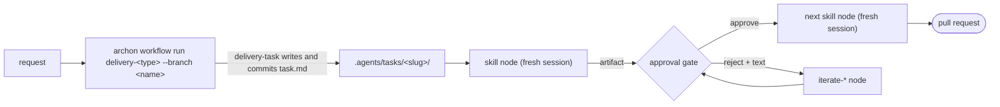

# skills

Portable agent skills: one directory per skill, one `SKILL.md`, loadable by any skill-aware coding agent (Claude Code, Codex, Oh My Pi, Pi). Needs a file system, git, and the agent's own tools.

Most skills form a delivery workflow that takes a task from request to merged pull request in fresh-context phases with human gates. [Archon](https://archon.diy) workflow packs under `.archon/workflows/` drive the chain; the skills also run by hand. The rest are utilities and the child-worker roles the phases delegate to.

New here: [docs/getting-started.md](docs/getting-started.md), then [docs/context-management.md](docs/context-management.md).

## Requirements

- Archon 0.10 or later: `curl -fsSL https://archon.diy/install | bash`.
- One agent Archon runs as a provider: Claude Code, Codex, or Pi. Oh My Pi users run the `-omp` pack flavor, which needs `omp` on `PATH`.
- Node 20.12+ for the installer and the checks.

## Install

In a terminal, the installer opens a multi-select menu with detected agent harnesses preselected, then offers every skill or a searchable skill picker. It shows the resulting file plan and asks before writing. A full install adds runtime-adapted skills and worker definitions, a portable skills copy in `~/.agents/skills/` (the packs' `skills_dir` default), and the Archon packs in `~/.archon/workflows/`: the native `delivery/` flavor for Claude Code, Codex, or Pi, the `delivery-omp/` flavor for Oh My Pi, or both. With `--project`, packs go in the current repository but still read the `~/.agents/skills` copy. Install prunes the other managed flavor and retired paths.

```sh
npx github:MarkTripoli/skills
```

| Flag or argument | Effect |
|---|---|
| `oh-my-pi pi`, `all`, `portable` | Pick targets; `portable` writes the plain `~/.agents/skills/` copy and the native packs |
| `--skill <name>`, `-s <name>` | Install one skill; repeat the flag for more. Selecting fewer than all skills skips the Archon packs because their workflows require the complete collection |
| `--project` | Install into the current repository; packs still read `~/.agents/skills` |
| `--dry-run`, `--yes` | Preview only; or skip both menus and confirmation, using detected targets and every skill when unspecified |
| `--uninstall` | Remove what it wrote for the named targets (Codex config block is marker-tracked); a named runtime keeps the packs and the shared `~/.agents/skills/` copy they read |

| Runtime | Skills | Workers |
|---|---|---|
| Claude Code | `~/.claude/skills/` | `~/.claude/agents/` |
| Codex | `~/.agents/skills/` | `~/.codex/agents/` + block in `~/.codex/config.toml` |
| Oh My Pi | `~/.omp/agent/skills/` | `~/.omp/agent/agents/` |
| Pi | `~/.pi/agent/skills/` | none (phases do worker roles inline) |

Alternatives, pick one:

- Claude Code plugin (managed, updates on release; manifest `.claude-plugin/plugin.json`):

  ```
  /plugin marketplace add MarkTripoli/skills
  /plugin install marktripoli-skills@marktripoli
  ```

- [skills.sh](https://skills.sh/MarkTripoli/skills): `npx skills@latest add MarkTripoli/skills`. Skill files only; no workers or packs.
- Pinned version: `npx github:MarkTripoli/skills#v<version>`.
- From a checkout: `node scripts/install.mjs`, or `npm run build -- --runtime <claude-code|codex|oh-my-pi|pi>` writes `dist/<runtime>/` (layout per adapter in [runtimes/](runtimes/)). Packs: copy `.archon/workflows/delivery/` (and `delivery-omp/`) into `~/.archon/workflows/` or a project's `.archon/workflows/`.

## How the workflow runs



- A task is `.agents/tasks/<slug>/task.md` plus numbered artifacts, committed on the run's branch (`docs(task): open <slug>`, then `docs(task): <phase> artifacts` after each phase; joins stage only that run's task directory). Contract: [shared/CONVENTIONS.md](shared/CONVENTIONS.md); prose rules: [shared/WRITING.md](shared/WRITING.md); sizing and acceptance-criteria rules: [shared/SLICING.md](shared/SLICING.md).
- Packs (`delivery-full`, `delivery-lean`, `delivery-prd`, `delivery-oneshot`, `delivery-adaptive`, `delivery-bugfix`, `delivery-epic`, `delivery-resolve-reviews`), blocks, gates, verification, review loop, and phase table: [workflows/delivery.md](workflows/delivery.md). The epic pack researches before its plan; the bugfix chain is `reproduce-bug`, `fix-bug`, verification, review, then `describe-pr`. Every implementing pack re-runs the repository's checks and the task's acceptance items in a fresh session before the review ([docs/verification.md](docs/verification.md)).
- Every AI node is `context: fresh`: it reads only `task.md` and the artifacts it selects and writes one artifact. Disk artifacts are the only memory between nodes.
- Start a run with `archon workflow run delivery-start --branch <name> "<request>"` and let the request pick the pack and the gates (hands-off wording runs unattended after at most one pack confirmation; "review the plan first" keeps the planning gates), or name a pack yourself: `archon workflow run delivery-<type> --branch <name> "<request>"`. It exits at each gate; `archon workflow approve <run-id> --detach` continues, `archon workflow reject <run-id> --detach "<text>"` runs the matching `iterate-*` skill with that text and gates again, `archon workflow wait <run-id>` blocks until the next decision. The web UI and chat adapters offer the same two decisions. `--input gates=none` runs unattended; `--input gates=plan,pr` keeps only those pauses.
- Two flavors: native (`prompt:` nodes; Claude Code, Codex, Pi) and `-omp` (generated; every prompt runs `omp -p --auto-approve --no-session --max-time=45m`).

## Skills

Delivery skills live in `skills/delivery/`; `show-me` is standalone in `skills/show-me/`. Each `SKILL.md` carries its own description.

| Group | Skills |
|---|---|
| Research | `gather-sources`, `create-research-questions`, `create-research`, and `iterate-*` for questions and research |
| Design | `create-design-discussion`, `create-prd`, `create-tdd`, and `iterate-*` for each |
| Planning | `create-structure-outline`, `create-plan`, `create-epic-plan`, `start-epic-delivery`, and `iterate-*` for outline and plan |
| Implementation | `implement-plan`, `implement-outline`, `iterate-implementation`, `reproduce-bug`, `fix-bug` |
| Review | `review-code`, `fix-code-review` |
| Pull request | `describe-pr`, `resolve-pr-reviews`, `record-evidence` (video proof, by hand) |
| Utilities | `ci-commit`, `review-artifact-comments`, `show-me`, `herd-next` (Herdr pane handoff) |
| Workers | `agent-codebase-locator`, `agent-codebase-analyzer`, `agent-codebase-pattern-finder`, `agent-web-search-researcher`, `agent-implementer`, `agent-outline-implementer`, `agent-implementation-reviewer` |

## Develop

- `npm test`: validates the skills and the packs (`scripts/validate.mjs`, plugin manifest check, `node --test tests/`). `node scripts/build-packs.mjs` regenerates the OMP flavor; `--check` fails when it is stale. `archon workflow test delivery` runs every pack's `fixtures/*.stubs.yaml` without an agent ([docs/testing.md](docs/testing.md)).
- Commit subjects follow the Commits section of [shared/CONVENTIONS.md](shared/CONVENTIONS.md). `npm install` sets `core.hooksPath` to `.githooks/`; the `Commits` workflow runs `node scripts/check-commits.mjs <base>..<head> --title <pr title>` on every pull request. Write reverts as `revert: <description>`.
- Releases: [changesets](https://github.com/changesets/changesets) and [Semantic Versioning](https://semver.org/). A user-visible change adds a file under `.changeset/` (`npm run changeset`; see [.changeset/README.md](.changeset/README.md)). The `Release` workflow opens a `chore: version skills` pull request; merging it tags `v<version>` and publishes the GitHub release.
- Adding a skill: `skills/<group>/<name>/SKILL.md` (or `skills/<name>/` for standalone) with frontmatter `name` equal to the directory and `description`; link the two shared documents on line 6 like existing skills; templates under `references/`; add a row to the phase table in `workflows/delivery.md`; add a node to a pack under `.archon/workflows/delivery/` when a pack should run it, then `node scripts/build-packs.mjs`; run `npm test`. Names stay unique across groups because installs flatten into one directory.

## Docs

- [docs/cheatsheet.md](docs/cheatsheet.md): one page of commands: install, pick a pack, steer, gates, where files land, epics, skills by hand.
- [docs/getting-started.md](docs/getting-started.md): setup, first run with `--branch`, the steering loop, gates, artifacts, bugfix, epics, running skills by hand.
- [docs/context-management.md](docs/context-management.md): phase model, fresh contexts, recognizing a degraded context.
- [docs/testing.md](docs/testing.md): validation, pack fixtures, unit tests, what stays manual.
- [docs/observability.md](docs/observability.md): optional Archon metrics, push targets, serving, and Grafana provisioning.
- [docs/model-routing.md](docs/model-routing.md): the tier each phase runs on, binding tiers to models, and rebinding per request.
- [workflows/delivery.md](workflows/delivery.md), [shared/CONVENTIONS.md](shared/CONVENTIONS.md), [shared/WRITING.md](shared/WRITING.md), [shared/SLICING.md](shared/SLICING.md), [runtimes/](runtimes/).

## License

MIT. See [LICENSE](LICENSE).
