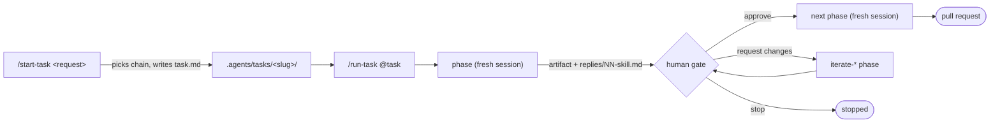

# skills

Portable agent skills: one directory per skill, one `SKILL.md`, loadable by any skill-aware coding agent (Claude Code, Codex, Oh My Pi, Pi). Needs a file system, git, and the agent's own tools.

Most skills form a delivery workflow that takes a task from request to merged pull request in fresh-context phases with human gates. The rest are utilities and the child-worker roles the phases delegate to.

New here: [docs/getting-started.md](docs/getting-started.md), then [docs/context-management.md](docs/context-management.md).

## Install

Detects the agents on your `PATH`, shows what it will write, asks, then installs skills, worker definitions, and the `/run-task` extension where the runtime has one. Node 20+.

```sh
npx github:MarkTripoli/skills
```

| Flag or argument | Effect |
|---|---|
| `oh-my-pi pi`, `all`, `portable` | Pick targets; `portable` writes a plain `~/.agents/skills/` copy |
| `--project` | Install into the current repository instead of `~` |
| `--dry-run`, `--yes` | Preview only; skip the confirmation |
| `--uninstall` | Remove exactly what it wrote (Codex config block is marker-tracked) |

| Runtime | Skills | Workers | Extension |
|---|---|---|---|
| Claude Code | `~/.claude/skills/` | `~/.claude/agents/` | none yet |
| Codex | `~/.agents/skills/` | `~/.codex/agents/` + block in `~/.codex/config.toml` | none yet |
| Oh My Pi | `~/.omp/agent/skills/` | `~/.omp/agent/agents/` | `~/.omp/agent/extensions/run-task/` |
| Pi | `~/.pi/agent/skills/` | none (phases do worker roles inline) | `~/.pi/agent/extensions/run-task/` |

Alternatives, pick one:

- Claude Code plugin (managed, updates on release; manifest `.claude-plugin/plugin.json`):

  ```
  /plugin marketplace add MarkTripoli/skills
  /plugin install marktripoli-skills@marktripoli
  ```

- [skills.sh](https://skills.sh/MarkTripoli/skills): `npx skills@latest add MarkTripoli/skills`. Skill files only; no workers or extensions, so `/run-task` falls back to its subagent and manual backends.
- Pinned version: `npx github:MarkTripoli/skills#v<version>`.
- From a checkout: `node scripts/install.mjs`, or `npm run build -- --runtime <claude-code|codex|oh-my-pi|pi>` writes `dist/<runtime>/` (layout per adapter in [runtimes/](runtimes/)).

## How the workflow runs



- A task is `.agents/tasks/<slug>/task.md` plus numbered artifacts. Contract: [shared/CONVENTIONS.md](shared/CONVENTIONS.md); prose rules: [shared/WRITING.md](shared/WRITING.md).
- Chains (`full`, `lean`, `prd`, `oneshot`), phase table, gates, and review loop: [workflows/delivery.md](workflows/delivery.md). `/start-task <request>` picks the chain (asks at most three questions) and hands off to `/run-task`.
- Each phase runs in a fresh context, reads only `task.md` and the artifacts it selects, and ends with one fenced command naming the next phase. Disk artifacts are the only memory between phases.
- `/run-task @.agents/tasks/<slug>` runs phases in order, relays each final reply, stops at gates. Backends: [Herdr](https://github.com/herdr) pane (`HERDR_ENV=1` and `herdr` installed), the runtime's subagent tool, or manual (prints the prompt for a new session). `--status` reports where a task stands.
- On Oh My Pi and Pi, the `run-task` extension opens a new TUI session per phase, waits for the reply file, logs context usage to `replies/phases.jsonl`, and shows an approve / request-changes / stop dialog at gates. The orchestrator is code and spends no tokens. Install per [runtimes/oh-my-pi.md](runtimes/oh-my-pi.md) or [runtimes/pi.md](runtimes/pi.md).

## Skills

Delivery skills live in `skills/delivery/`; `show-me` is standalone in `skills/show-me/`. Each `SKILL.md` carries its own description.

| Group | Skills |
|---|---|
| Entry and orchestration | `start-task`, `run-task` |
| Research | `create-research-questions`, `create-research`, and `iterate-*` for each |
| Design | `create-design-discussion`, `create-prd`, `create-tdd`, and `iterate-*` for each |
| Planning | `create-structure-outline`, `create-plan`, `create-epic-plan`, `start-epic-delivery`, and `iterate-*` for outline and plan |
| Implementation | `setup-worktree`, `implement-plan`, `implement-outline`, `iterate-implementation` |
| Review | `review-code`, `fix-code-review`, `review-loop` (optional bounded loop) |
| Pull request | `describe-pr`, `resolve-pr-reviews`, `record-evidence` (optional video proof) |
| Utilities | `configure-workspaces`, `ci-commit`, `review-artifact-comments`, `show-me` |
| Workers | `agent-codebase-locator`, `agent-codebase-analyzer`, `agent-codebase-pattern-finder`, `agent-web-search-researcher`, `agent-implementer`, `agent-outline-implementer`, `agent-implementation-reviewer` |

## Develop

- `npm test`: validates the collection, checks the plugin manifest, runs the token-free simulation of every chain. `npm run eval -- --driver <omp|claude|codex>` measures real agents against the same contract ([docs/testing.md](docs/testing.md)).
- Commit subjects follow the Commits section of [shared/CONVENTIONS.md](shared/CONVENTIONS.md). `npm install` sets `core.hooksPath` to `.githooks/`; the `Commits` workflow runs `node scripts/check-commits.mjs <base>..<head> --title <pr title>` on every pull request. Write reverts as `revert: <description>`.
- Releases: [changesets](https://github.com/changesets/changesets) and [Semantic Versioning](https://semver.org/). A user-visible change adds a file under `.changeset/` (`npm run changeset`; see [.changeset/README.md](.changeset/README.md)). The `Release` workflow opens a `chore: version skills` pull request; merging it tags `v<version>` and publishes the GitHub release.
- Adding a skill: `skills/<group>/<name>/SKILL.md` (or `skills/<name>/` for standalone) with frontmatter `name` equal to the directory and `description`; link the two shared documents on line 6 like existing skills; templates under `references/`; add a row to the owning `workflows/` document; run `npm test`. Names stay unique across groups because installs flatten into one directory.

## Docs

- [docs/getting-started.md](docs/getting-started.md): first task by hand and with `/run-task`, gates, feedback, worktrees, epics.
- [docs/context-management.md](docs/context-management.md): phase model, fresh contexts per runtime, recognizing a degraded context.
- [docs/testing.md](docs/testing.md): validation, simulation, eval harness.
- [workflows/delivery.md](workflows/delivery.md), [shared/CONVENTIONS.md](shared/CONVENTIONS.md), [shared/WRITING.md](shared/WRITING.md), [runtimes/](runtimes/).

## License

MIT. See [LICENSE](LICENSE).
