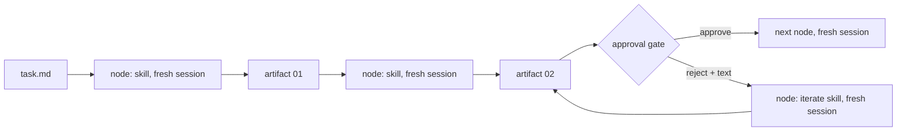

# Context management

The skills in this collection use one fresh session per phase and artifacts as memory between sessions. This guide explains how optional Atomic orchestration provides that boundary, how to do the same by hand, and how to recognize a degraded session.

## Why phases, not one long session

A coding agent that plans, researches, designs, implements, and writes a pull request in one conversation carries every file it read and every dead end it explored into every later decision. Three things happen as the window fills:

1. Quality drops. The model starts contradicting its own earlier decisions, dropping constraints you stated, and re-reading files it already read. This begins well before the hard limit; treat the second half of any window as unreliable for design or implementation work.
2. Compaction loses the specifics. Every runtime compacts or summarizes when the window fills. Summaries keep the story and lose the file paths, exact checks, and known limits that the next step depends on.
3. Cost and latency grow with every turn, because the whole window is re-sent.

The workflow avoids all three by making the unit of work a phase that fits in one window and by making the artifact on disk, not the conversation, the memory between phases.

## The model

- **Unit**: one phase, one skill, one fresh session. It reads `task.md` and the artifacts it selects, does its work, writes one artifact, prints a reply, and stops.
- **Memory**: the task directory `.agents/tasks/<slug>/`, committed on the branch (`docs(task): open <slug>`, then `docs(task): <phase> artifacts` after each phase). Artifacts carry `type` and `summary` frontmatter; a later phase reads the full text only of the artifacts it selects and `summary` from the rest.
- **Transition**: under Atomic, the controller selects the next skill from the request and saved artifacts. By hand, the handoff fence at the end of a reply names the next phase and asks you to open a new session.
- **Gate**: a native Atomic human prompt asks you to review an artifact before continuing. Feedback runs the matching revision skill in a fresh stage. By hand, running the next fenced command records approval.

The contract is [shared/CONVENTIONS.md](../shared/CONVENTIONS.md), particularly "Phase isolation and context budget". Controller inputs and gate policy are in [workflows/delivery.md](../workflows/delivery.md).

### What one phase is allowed to read

In this order, and nothing else: `task.md`; the primary artifacts it selects, completely; only `summary` from other artifacts; repository files through child workers where the skill provides them; and directly only the files it must edit or cite. A skill that needs to know how the codebase works asks a worker and receives a bounded report with `path:line` pointers. It never pastes the worker's message into an artifact or its reply.

### Child workers inside a phase

Research and implementation phases delegate to worker roles (`agent-codebase-locator`, `agent-implementer`, and so on). Each worker runs in its own context: it gets the assignment text, reads what it needs, and returns one structured message. The phase verifies the claims it uses against the repository and keeps only the facts. Workers never write into the task directory; the parent phase applies what they report. This keeps the phase's own window small even when the codebase exploration is large.

Worker isolation depends on the install. The portable tree names no subagent mechanism, so a phase performs worker roles inline and says so in its reply; its window then holds the exploration too. Runtime builds insert the runtime's worker mechanism and generate worker definitions. The optional Atomic controller uses portable skills with its native stage tools; changing `skills_dir` does not turn Atomic into a different agent harness.

## Fresh context per phase

Under Atomic every skill stage explicitly uses `context: "fresh"`. A revision, implementation phase, verification pass, or review is a new stage, not a continuation of the previous stage's conversation. Feedback reaches the revision through its prompt and saved artifacts. The controller's small decision state is distinct from agent conversation memory.

By hand, the fresh context is a new session you open yourself:

| Runtime | New session | See context usage | Compaction | Subagents |
|---|---|---|---|---|
| Claude Code | `/clear` | `/context` | `/compact`; automatic near the limit | `Task` tool; a subagent cannot talk to you |
| Codex | `/new` | `/status` (or `/statusline` for a live footer) | `/compact`; automatic near the limit | multi-agent spawn tool; agents cannot talk to you |
| Oh My Pi | `/new` (or `/clear` to reset in place) | footer shows context % | `/compact`; automatic near the limit | `task` tool; a subagent cannot talk to you |
| Pi | `/new` | footer shows context % | `/compact`; automatic near the limit | none built in; phases perform worker roles inline |

Do not use compaction as the way to move between phases. A compacted session keeps a summary; the next phase needs the artifact. When a phase is done, start a new session and run the fenced command.

Runtime install notes: [runtimes/claude-code.md](../runtimes/claude-code.md), [runtimes/codex.md](../runtimes/codex.md), [runtimes/oh-my-pi.md](../runtimes/oh-my-pi.md), [runtimes/pi.md](../runtimes/pi.md).

## Recognizing a degraded context

You are in a degraded context when the agent:

- re-reads a file it read earlier in the same session,
- contradicts the artifact it wrote or a decision recorded in `task.md`,
- drops a constraint you stated, or asks a question you already answered,
- loses track of which numbered step it is on, or starts a phase over,
- produces replies that summarize instead of citing `path:line`,
- or when the runtime reports usage past half the window and the phase is not finished.

The skills watch for the same signs from the inside. On the first one, a phase is required to save its artifact as it stands, print the reply with the handoff fence, and stop. An interactive phase run by hand saves after every accepted change and suggests a new session after about ten rounds of feedback.

What to do:

1. Stop giving new instructions in that session.
2. Make sure the artifact is saved. If the phase has not printed its reply, say: "Save the artifact in its current state and print the final answer from the template."
3. Open a new session.
4. Run the next command, or `/iterate-<phase> @<artifact file>` with the feedback you still have. For Atomic runs, inspect `/workflow status <run-id>` and use native `/workflow resume <run-id>` when saved durable progress is available; resuming a retained stage is not a substitute for the fresh boundary between different skills.

Never fix a degraded phase with `/compact`. The artifact survives a new session; a compaction summary does not preserve what the next phase needs.

## For skill authors

A new skill that joins a workflow keeps the guarantees above by following the conventions:

- Read only `task.md` and selected artifacts; delegate codebase exploration to workers; never paste worker output.
- Save the artifact before printing the reply; a handoff ends with `Next action:`, `Open a new session in {run_location}, then run:`, and one command fence. A terminal reply ends with its state and has no fence.
- Stop on the first sign of degradation and hand off from the saved file.
- Keep orchestration contracts in the Atomic workflow's stage prompts and helpers, not in ordinary skill files. Preserve the human reply template and artifact-first behavior for standalone use.

`npm test` checks the reply shape, the next-action label, the new-session instruction, the shared links, and the banned tokens for every skill in the collection.
