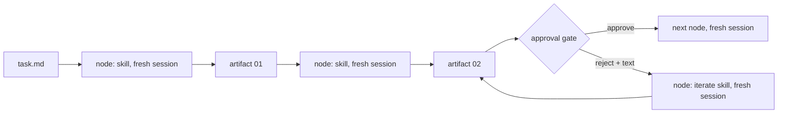

# Context management

Run each step in a new session. Its saved task document, called an **artifact**, carries facts to the next step. Atomic does this for you; when running skills by hand, open the new session yourself.

## Why phases, not one long session

Long conversations can make an agent miss rules, contradict decisions, or repeat work. Automatic summaries can lose exact paths and checks. These are risks, not guarantees about every model.

Keep each step small enough for one session. Save its results in a document rather than relying on chat history.

## The model

- **Phase:** one skill in one fresh session. It reads `task.md` and selected artifacts, does its work, saves one artifact, prints its reply, and stops.
- **Artifact:** a saved Markdown document under `<task-root>/<slug>/`, where `<task-root>` is configured by repository instructions and defaults to `.agents/tasks`. It carries `type` and `summary` frontmatter. A later phase reads selected artifacts in full and `summary` from the others.
- **Transition:** Atomic chooses the next skill from the request and saved artifacts. A manual handoff names the next skill in its command fence and asks for a new session.
- **Gate:** Atomic's native prompt asks a person to review an artifact. Feedback starts the matching revision skill in a fresh stage. Running the next manual command records approval.

See [shared/CONVENTIONS.md](../shared/CONVENTIONS.md), especially "Phase isolation and context budget", and [workflows/delivery.md](../workflows/delivery.md) for controller inputs and gates.

### What one phase is allowed to read

A phase reads, in order:

1. `task.md`.
2. Its selected primary artifacts, completely.
3. Only `summary` from other artifacts.
4. Repository files through child workers when the skill provides them.
5. Directly, only files it must edit or cite.

When a skill needs to explore code, a worker returns a focused report with `path:line` references. The parent checks the facts it uses rather than copying the report.

### Child workers inside a phase

Research and implementation phases may use roles such as `agent-codebase-locator` and `agent-implementer`. Each worker receives the assignment, reads what it needs, and returns one structured message. The phase verifies any claim it uses. Workers do not write task artifacts; the parent applies their report.

Portable installs run worker roles in the same session and say so in the reply. Agent-specific installs add that agent's worker tools and definitions. Changing `skills_dir` does not change which agent runs Atomic's steps.

## Fresh context per phase

Atomic uses `context: "fresh"` for each skill run, including revisions, implementation, verification, and review. New sessions receive feedback through their prompt and saved documents, not the previous conversation.

By hand, open a new session yourself:

| Runtime | New session | See context usage | Compaction | Subagents |
|---|---|---|---|---|
| Claude Code | `/clear` | `/context` | `/compact`; automatic near the limit | `Task` tool; a subagent cannot talk to you |
| Codex | `/new` | `/status` (or `/statusline` for a live footer) | `/compact`; automatic near the limit | multi-agent spawn tool; agents cannot talk to you |
| Oh My Pi | `/new` (or `/clear` to reset in place) | footer shows context % | `/compact`; automatic near the limit | `task` tool; a subagent cannot talk to you |
| Pi | `/new` | footer shows context % | `/compact`; automatic near the limit | none built in; phases perform worker roles inline |

Do not use compaction to move between phases. It keeps a summary; the next phase needs the artifact. Start a new session and run the fenced command when a phase ends.

Runtime notes: [Claude Code](../runtimes/claude-code.md), [Codex](../runtimes/codex.md), [Oh My Pi](../runtimes/oh-my-pi.md), [Pi](../runtimes/pi.md).

## Recognizing a degraded context

The collection treats these as warning signs that a session is losing track:

- rereads a file from the same session;
- contradicts `task.md` or its artifact;
- drops a stated constraint or repeats an answered question;
- loses its numbered step or starts a phase over;
- summarizes instead of citing `path:line`; or
- reports usage past half the window before the phase is complete.

The skills use the same signs. On the first sign, save the artifact as it stands, print the handoff fence, and stop. An interactive phase saves after each accepted change and suggests a new session after about ten feedback rounds.

1. Stop giving new instructions in that session.
2. Confirm the artifact is saved. If the reply is not printed, say: `Save the artifact in its current state and print the final answer from the template.`
3. Open a new session.
4. Run the next command, or `/iterate-<phase> @<artifact file>` with the remaining feedback. For Atomic, inspect `/workflow status <run-id>` and use `/workflow resume <run-id>` only when saved durable progress exists. Resuming a retained stage does not replace a fresh boundary between skills.

Never repair a degraded phase with `/compact`.

## For skill authors

- Read only `task.md` and selected artifacts; use workers for codebase exploration.
- Save the artifact before printing the reply. A handoff ends with `Next action:`, `Open a new session in {run_location}, then run:`, and one command fence. A terminal reply has no fence.
- Stop on the first degradation sign and hand off from the saved file.
- Keep controller contracts in Atomic stage prompts and helpers, not ordinary skills. Preserve the standalone human reply and artifact-first behavior.

`npm test` checks reply shape, next-action labels, new-session instructions, shared links, and banned tokens for every skill.
