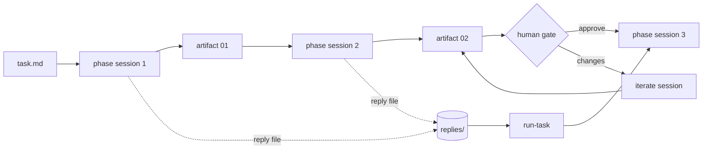

# Context management

The skills in this collection assume one thing about the agent running them: its context window is finite, and its judgment degrades long before the window is full. Everything in the workflow design follows from that. This guide explains the model, how to get a fresh context on each runtime without modifying the runtime, how to recognize a degraded session, and what a runtime plugin adds on top (Oh My Pi has one).

## Why phases, not one long session

A coding agent that plans, researches, designs, implements, and writes a pull request in one conversation carries every file it read and every dead end it explored into every later decision. Three things happen as the window fills:

1. Quality drops. The model starts contradicting its own earlier decisions, dropping constraints you stated, and re-reading files it already read. This begins well before the hard limit; treat the second half of any window as unreliable for design or implementation work.
2. Compaction loses the specifics. Every runtime compacts or summarizes when the window fills. Summaries keep the story and lose the file paths, exact checks, and known limits that the next step depends on.
3. Cost and latency grow with every turn, because the whole window is re-sent.

The workflow avoids all three by making the unit of work a phase that fits comfortably in one window and by making the artifact on disk, not the conversation, the memory between phases.

## The model

- **Unit**: one phase, one skill, one fresh session. It reads `task.md` and the artifacts it selects, does its work, writes one artifact, prints a reply, and stops.
- **Memory**: the task directory `.agents/tasks/<slug>/`. Artifacts carry `type` and `summary` frontmatter; a later phase reads the full text only of the artifacts it selects and `summary` from the rest.
- **Transition**: the handoff fence at the end of every reply, one command naming the next phase. The sentence before it tells you to run it in a new session.
- **Signal**: the reply file `replies/NN-<skill>.md`, written by the phase when the prompt names one. Its existence means the phase finished; its fence is the next command. This is how `/run-task` knows where the task stands without reading any artifact.
- **Gate**: a phase whose artifact you review before the chain continues. Approval is recorded by running the next command; changes go through the matching `iterate-*` skill.

The contract for all of this is [shared/CONVENTIONS.md](../shared/CONVENTIONS.md), in particular the sections "Phase isolation and context budget", "Reply files", and "Execution backends".

### What one phase is allowed to read

In this order, and nothing else: `task.md`; the primary artifacts it selects, completely; only `summary` from other artifacts; repository files through child workers where the skill provides them; and directly only the files it must edit or cite. A skill that needs to know how the codebase works asks a worker and receives a bounded report with `path:line` pointers. It never pastes the worker's message into an artifact or its reply.

### Child workers inside a phase

Research and implementation phases delegate to worker roles (`agent-codebase-locator`, `agent-implementer`, and so on). Each worker runs in its own context: it gets the assignment text, reads what it needs, and returns one structured message. The phase verifies the claims it uses against the repository and keeps only the facts. Workers never write into the task directory; the parent phase applies what they report. This keeps the phase's own window small even when the codebase exploration is large.

Worker isolation depends on the install. The portable tree names no subagent mechanism, so a phase performs worker roles inline and says so in its reply; its window then holds the exploration too. The runtime builds (`npm run build -- --runtime <id>`) insert the runtime's worker call into every skill and generate the worker definitions, which is what gives phases the small window described above. Build for your runtime when you want that isolation.

## Getting a fresh context on each runtime

Nothing here requires changing the runtime. Skills are Markdown files the runtime already loads; fresh contexts come from features every runtime already has. Oh My Pi additionally has an extension that does the new-session-by-hand row for you (last row, and [below](#oh-my-pi-specifics)); it is optional.

| Way | Isolation | Can ask you questions | You can watch it | Needs |
|---|---|---|---|---|
| New session by hand | complete | yes | yes | nothing |
| `/run-task`, subagent backend | complete | no | no | the runtime's subagent tool |
| `/run-task`, Herdr backend | complete | yes | yes, in its pane | Herdr running, skills built for the runtime |
| `/run-task`, manual backend | complete | yes | yes | nothing; it prints the prompt for you to paste |
| `/run-task`, Oh My Pi extension | complete | yes | yes, it is your session | the extension installed |

Interactive phases (every `iterate-*` skill, `create-prd`, `create-tdd`, `review-artifact-comments`) need you in the loop for the whole phase, so they never run in a subagent. `/run-task` puts them in a Herdr pane when it can and otherwise runs them inline in its own session, tells you so, and afterwards asks you to continue from a new session. With the Oh My Pi extension every phase runs in a new session of your own TUI, so an interactive phase simply asks you there.

### Runtime cheat sheet

| Runtime | New session | See context usage | Compaction | Subagents |
|---|---|---|---|---|
| Claude Code | `/clear` | `/context` | `/compact`; automatic near the limit | `Task` tool; a subagent cannot talk to you |
| Codex | `/new` | `/status` (or `/statusline` for a live footer) | `/compact`; automatic near the limit | multi-agent spawn tool; agents cannot talk to you |
| Oh My Pi | `/new` (or `/clear` to reset in place) | footer shows context % | `/compact`; automatic near the limit | `task` tool; a subagent cannot talk to you |

Do not use compaction as the way to move between phases. A compacted session keeps a summary; the next phase needs the artifact. When a phase is done, start a new session and run the fenced command, or let `/run-task` do it.

### Claude Code specifics

- Skills install as `~/.claude/skills/<name>/SKILL.md` (or `<repo>/.claude/skills/`). Workers install as `~/.claude/agents/agent-<role>.md` and are called with the `Task` tool.
- A `Task` subagent starts with an empty context and only your prompt. `/run-task` gives it the path of the installed `SKILL.md` to read, so the phase runs identically whether the subagent can invoke skills by name or not.
- `/clear` between phases is the whole manual workflow. `/context` shows how much of the window a phase used; a phase that ends above roughly half the window is a sign that the task should be split or that the skill read too much.
- Nothing needs a hook or a settings change. A Claude Code plugin (skills, agents, and a `SessionStart` hook) could later automate the new session and the status report the way the Oh My Pi extension does; see [What a runtime plugin adds](#what-a-runtime-plugin-adds).

### Codex specifics

- Skills install as `~/.agents/skills/<name>/SKILL.md` with an `agents/openai.yaml` sidecar per skill; invoke them as `$name`. Workers are custom agents under `~/.codex/agents/`.
- `/new` between phases. `/status` before you start a long interactive phase tells you how much room the session has.

### Oh My Pi specifics

- Skills install as `~/.agents/skills/<name>/SKILL.md`. Workers install as `~/.omp/agent/agents/agent-<role>.md` (or `<repo>/.omp/agents/`) and are called with the `task` tool.
- `/new` between phases. Herdr integration uses the `omp` agent kind.
- The `run-task` extension (`runtimes/oh-my-pi/run-task/`, install per [runtimes/oh-my-pi.md](../runtimes/oh-my-pi.md)) replaces the by-hand `/new` and paste: `/run-task @<task dir>` opens a new session per phase, sends the phase prompt, waits for the reply file, records the session's context usage in `replies/phases.jsonl`, and stops at gates with an approve, request-changes, other-command, or stop dialog. The orchestrator is code, so it holds no context at all; the `/run-task` skill remains the portable fallback.

## Recognizing a degraded context

You are in a degraded context (the "dumb zone") when the agent:

- re-reads a file it read earlier in the same session,
- contradicts the artifact it wrote or a decision recorded in `task.md`,
- drops a constraint you stated, or asks a question you already answered,
- loses track of which numbered step it is on, or starts a phase over,
- produces replies that summarize instead of citing `path:line`,
- or when the runtime reports usage past half the window and the phase is not finished.

The skills watch for the same signs from the inside. On the first one, a phase is required to save its artifact as it stands, print the reply with the handoff fence, and stop. An interactive phase saves after every accepted change and suggests a new session after about ten rounds of feedback.

What to do:

1. Stop giving new instructions in that session.
2. Make sure the artifact is saved. If the phase has not printed its reply, say: "Save the artifact in its current state and print the final answer from the template."
3. Open a new session.
4. Run `/run-task @<task dir> --status` to see where the task stands, then either the next command or `/iterate-<phase> @<artifact file>` with the feedback you still have.

Never fix a degraded phase with `/compact`. The artifact survives a new session; a compaction summary does not preserve what the next phase needs.

## Keeping the orchestrator small

`/run-task` holds one relayed reply per phase and nothing else: it reads `task.md` frontmatter, the newest reply file, and the workflow table; it never opens an artifact or another skill. Even so, its session grows a little with every phase and a lot when an interactive phase runs inline. It therefore tells you to continue from a new session after any inline phase and after roughly fifteen relayed replies. Doing so costs nothing: the reply files are its memory, and `/run-task @<task dir>` in a new session picks up exactly where it stopped.

## What a runtime plugin adds

The portable layer is the contract: task directories, artifacts, reply files, handoff fences. A plugin for a specific runtime reads that same state and removes the manual steps without changing how the skills work. The Oh My Pi extension in `runtimes/oh-my-pi/run-task/` does this today:

- **Automatic fresh sessions**: each phase runs in a new session with the same prompt `/run-task` would give a subagent, so the by-hand workflow becomes one command.
- **Context meter per phase**: `replies/phases.jsonl` records the tokens and percentage of the window each phase session used, with its model, duration, and session file; a phase that ends above roughly half the window is the same warning sign as before, now measured.
- **Gates as dialogs**: the gate reply stays in the phase session; a dialog offers approve, request changes (runs the `iterate-*` skill with your feedback), run another command (`/review-code`, `/record-evidence`), or stop. Running `/run-task` again after a stop records the approval, as with the skill.
- **Status derived from files**: `/run-task` alone lists the tasks under `.agents/tasks/` with their next command and gate state; `/run-task @<task dir> --status` prints the same report the skill prints; the `task_status` tool gives it to the model.

A Claude Code or Codex plugin would add the same four things from the same `workflow.mjs`; until one exists, those runtimes use the `/run-task` skill with its Herdr, subagent, and manual backends. None of this becomes a requirement: a project that only has the skill files installed keeps working with the by-hand workflow described in [Getting started](getting-started.md).

## For skill authors

A new skill that joins a workflow keeps the guarantees above by following the conventions:

- Read only `task.md` and selected artifacts; delegate codebase exploration to workers; never paste worker output.
- Save the artifact before printing the reply; the reply ends with the fresh-session sentence and one command fence.
- Write the reply file when the prompt names one.
- Stop on the first sign of degradation and hand off from the saved file.

`npm test` checks the reply shape, the fresh-session sentence, the shared links, and the banned tokens for every skill in the collection.
