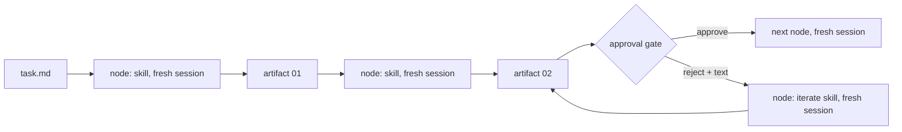

# Context management

Run each step in a new session. Its saved task document, called an **artifact**, carries facts to the next step. Open the new session yourself.

## Why phases, not one long session

Long conversations can make an agent miss rules, contradict decisions, or repeat work. Automatic summaries can lose exact paths and checks. These are risks, not guarantees about every model.

Keep each step small enough for one session. Save its results in a document rather than relying on chat history.

## The model

```mermaid
flowchart LR
  T[task.md] --> P1[node: skill, fresh session]
  P1 --> A1[artifact 01]
  A1 --> P2[node: skill, fresh session]
  P2 --> A2[artifact 02]
  A2 --> G{approval gate}
  G -- approve --> P3[next node, fresh session]
  G -- reject + text --> I[node: iterate skill, fresh session]
  I --> A2
```

- **Phase:** one skill in one fresh session. It reads `task.md` and selected artifacts, does its work, saves one artifact, prints its reply, and stops.
- **Artifact:** a digest-validated immutable Markdown iteration under `<task-root>/<slug>/artifacts/<kind>/<variant>/`. It carries `type` and `summary` frontmatter. A later phase reads selected artifacts in full and `summary` from the others.
- **Transition:** A manual handoff names the next skill in its command fence and asks for a new session.
- **Gate:** A person reviews an artifact. Feedback goes to the matching `iterate-*` skill in a fresh session. Running the next manual command records approval.

See [shared/CONVENTIONS.md](../shared/CONVENTIONS.md), especially "Phase isolation and context budget", and [workflows/delivery.md](../workflows/delivery.md) for workflow choices.

### What one phase is allowed to read

A phase reads, in order:

1. `task.md`.
2. Its selected primary artifacts, completely.
3. Only `summary` from other artifacts.
4. Repository files through child workers when the skill provides them.
5. Directly, only files it must edit or cite.

When a skill needs to explore code, a worker returns a focused report with `path:line` references. The parent checks the facts it uses rather than copying the report.

### Child workers inside a phase

Research and implementation phases may use roles such as `agent-codebase-locator` and `agent-implementer`. Each worker receives the assignment, reads what it needs, and returns one structured message. The phase verifies any claim it uses. Workers do not write task artifacts; the parent applies their report.

Portable installs perform worker roles in the same session and say so in the reply; that is **not** a fresh worker boundary. Agent-specific installs may expose delegated workers.

## Fresh context per phase

Run each skill in a fresh session, including revisions, implementation, verification, and review. New sessions receive feedback through their prompt and saved documents, not the previous conversation. Open a new session yourself:

| Runtime | New session | See context usage | Compaction | Subagents |
|---|---|---|---|---|
| Claude Code | `/clear` | `/context` | `/compact` is not a new phase | `Task` tool; a subagent cannot talk directly to you |
| Codex | `/new` | `/status` (or `/statusline` for a live footer) | `/compact` is not a new phase | multi-agent spawn tool; agents cannot talk directly to you |
| Oh My Pi | `/new` (or `/clear` to reset in place) | footer shows context % | `/compact` is not a new phase | `task` tool; a subagent cannot talk directly to you |
| Pi | `/new` | footer shows context % | `/compact` is not a new phase | none built in; phases perform worker roles inline |

Do not use compaction to move between phases. It keeps a summary; the next phase needs the artifact. Start a new session and run the fenced command when a phase ends.

Runtime notes: [Claude Code](../runtimes/claude-code.md), [Codex](../runtimes/codex.md), [Oh My Pi](../runtimes/oh-my-pi.md), [Pi](../runtimes/pi.md).

## Recognizing a degraded context

The collection treats these as warning signs that a session is losing track:

- rereads a file from the same session;
- contradicts `task.md` or its artifact;
- drops a stated constraint or repeats an answered question;
- loses its numbered step or starts a phase over;
- summarizes instead of citing `path:line`; or
- reports measured usage at the configured context threshold before the phase is complete.

On the first sign, persist the current artifact and next incomplete action. Phases print the fresh-session handoff and stop. Interactive phases save after each accepted change. These collection rules complement host auto-compaction; they do not claim to configure or trigger a host compaction API.

1. Stop giving new instructions in that session.
2. Confirm the artifact is saved. If the reply is not printed, say: `Save the artifact in its current state and print the final answer from the template.`
3. Open a new session.
4. Run the next command, or `/iterate-<phase> @<artifact file>` with the remaining feedback.

Compaction is not a replacement for a verified checkpoint and a fresh phase boundary.

## For skill authors

- Read only `task.md` and selected artifacts; use workers for codebase exploration.
- Save the artifact before printing the reply. A handoff ends with `Next action:`, `Open a new session in {run_location}, then run:`, and one command fence. A terminal reply has no fence.
- Stop on the first degradation sign and hand off from the saved file.
- Keep executable delivery prerequisites in the shared contract used by delivery skills. Ordinary skills call its guard at delivery boundaries while retaining their standalone human reply and artifact-first behavior.

`npm test` checks reply shape, next-action labels, new-session instructions, shared links, and banned tokens for every skill.
