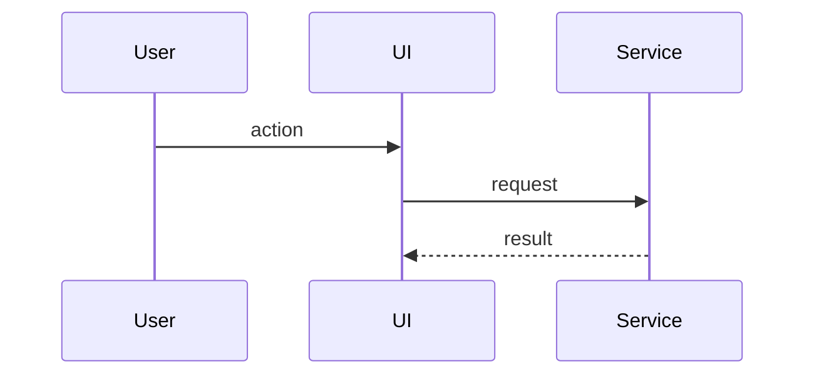

# [TDD Title]

### System Design

[Cross-component architecture: services, endpoints, schemas, queues, stores, external systems, and the delta from current behavior. Use takeaway-style subheadings and place diagrams or contracts next to the prose they support.]

#### [System takeaway title]

[Current behavior, target behavior, and boundary decision.]



### Program Design

[In-code structure: modules, call paths, component trees, dependency seams, internal signatures, pseudocode, and tests. Keep it selective; exhaustive task lists belong in the outline or plan.]

#### [Program takeaway title]

[Code-shape decision and rationale.]

```text
entrypoint
  validateInput
  applyChange
  reportResult
```

### Type Definitions

[Interfaces, schemas, message shapes, component props, command inputs, or returned values that define the implementation boundary.]

### Configuration

[Settings, environment variables, feature flags, migrations, generated files, or setup changes needed for the design.]

### Error Handling

[Expected failure modes, validation errors, retries, rollback behavior, empty states, and user-visible recovery paths.]

### What We're Not Doing

[Intentional technical non-goals. Omit this section when there are none.]

### Local Patterns

[Relevant repository examples, cited with paths and compact excerpts.]

## Human Review

### Review targets

- [System and program design boundaries the human should inspect.]

### Verify

- [ ] [Exact architecture, failure-path, or implementation-readiness check.]

### Known limits

- [Known limit, or `None.`]
