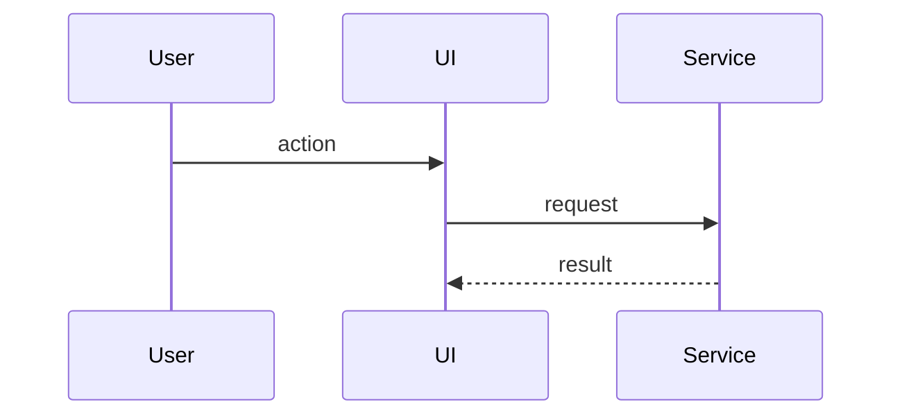
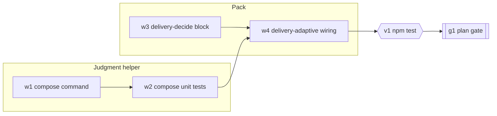
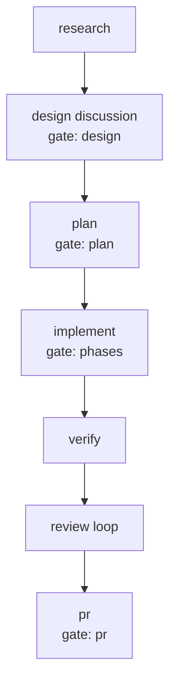

# [TDD Title]

### System Design

[Cross-component architecture: services, endpoints, schemas, queues, stores, external systems, and the delta from current behavior. Use takeaway-style subheadings and place diagrams or contracts next to the prose they support.]

#### [System takeaway title]

[Current behavior, target behavior, and boundary decision.]



### Program Design

[In-code structure: modules, call paths, component trees, dependency seams, internal signatures, pseudocode, and tests. Keep it selective; exhaustive task lists belong in the outline or plan.]

#### [Program takeaway title]

[Code-shape decision and rationale.]

```text
entrypoint
  validateInput
  applyChange
  reportResult
```

### Type Definitions

[Interfaces, schemas, message shapes, component props, command inputs, or returned values that define the implementation boundary.]

### Configuration

[Settings, environment variables, feature flags, migrations, generated files, or setup changes needed for the design.]

### Error Handling

[Expected failure modes, validation errors, retries, rollback behavior, empty states, and user-visible recovery paths.]

### What We're Not Doing

[Intentional technical non-goals. Omit this section when there are none.]

### Local Patterns

[Relevant repository examples, cited with paths and compact excerpts.]

### Engineering Work Breakdown

[The work as planned: stable work-item ids, a `subgraph` per independent track, verification points and human gates as nodes of their own, one `Critical path:` line naming the item ids in order, and a table whose proof column names an observable command, request, state, or review decision, never "code written".]



Critical path: w1 -> w2 -> w4 -> v1 -> g1

| Item | Depends on | Can run in parallel with | Proof it is done |
|---|---|---|---|
| w1 compose command | - | w3 | `node judge.mjs compose --json .agents/tasks/<slug>` prints eight phases with probabilities |
| w2 compose unit tests | w1 | w3 | `npm test` passes the new `compose` cases with the stub and with no key |
| w3 delivery-decide block | - | w1 | the extracted bash body runs under real bash and prints the fallback JSON |
| w4 delivery-adaptive wiring | w2, w3 | - | `node scripts/build-packs.mjs --check` is clean and the four fixtures reach their expected node lists |
| v1 npm test | w4 | - | the full suite passes on the branch |
| g1 plan gate | v1 | - | the reviewer approves the plan gate |

### Execution DAG

[How this work will be executed: the phases ahead, which pause for approval, what runs unattended, and what verification and review follow. When the task directory holds an execution-plan artifact (`NN-execution-plan-<slug>.md`), embed its Mermaid flowchart here and name the phases it dropped with their probabilities. When it does not, describe the fixed chain of `task.md`'s `workflow` value from the phases and gate set in workflows/delivery.md, with no flowchart and no probabilities.]



## Human Review

### Review targets

- [System and program design boundaries the human should inspect.]

### Verify

- [ ] [Exact architecture, failure-path, or implementation-readiness check.]

### Known limits

- [Known limit, or `None.`]
