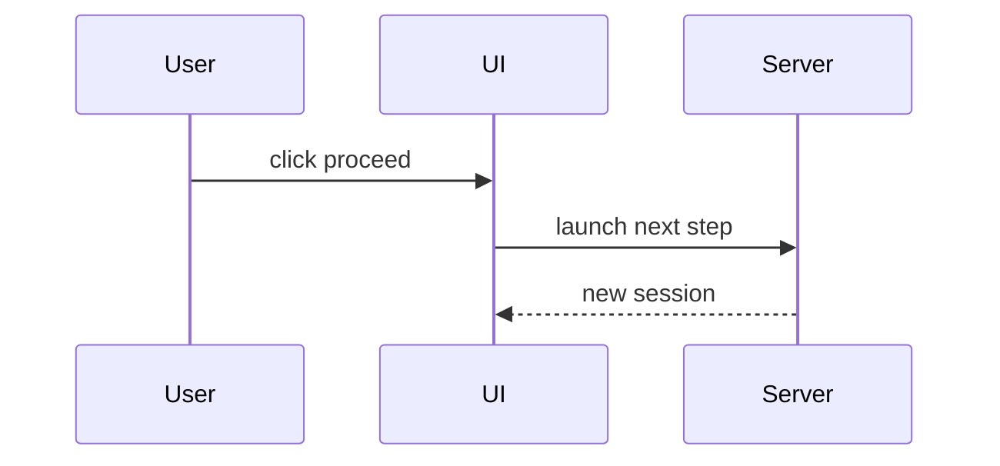

Use the smallest visual form that helps a reviewer understand the change.

## Pseudocode

```text
on(request)
  validate input
  load current state
  write the new record
  publish the update
```

## Call Tree

```text
submit
  createTask
    saveArtifact
    launchWorker
  navigateToTask
```

## Component Tree

```tsx
<TaskPage>
  useTask()
  <TaskToolbar />
  <ArtifactPanel />
```

## File Tree

```text
src/
  tasks/        owns task state
  artifacts/    owns saved documents
  ui/           renders controls
```

## Flow Diagram



## Diffs

Use `diff` when the point is what changed inside an existing shape.

```diff
 saveTask
+  saveInitialArtifact
   launchSession
```

Keep only the files, calls, props, states, and boundaries needed to review the PR.
