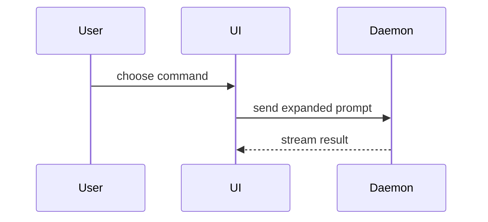

Read the [writing guide](https://github.com/MarkTripoli/skills/blob/main/shared/WRITING.md) and the [collection conventions](https://github.com/MarkTripoli/skills/blob/main/shared/CONVENTIONS.md) before drafting, revising, or replying; a checkout of the collection has both under `shared/`.

Help the user understand the current topic of conversation visually. Skip the preamble and keep prose brief. Pick the smallest view that makes the key point clear.

- Show logic or an algorithm as pseudocode:

```text
on(save)
  if content is unchanged
    return cached result
  write new content
  return fresh result
```

- Show runtime control flow as a call tree:

```text
submitForm
  createSession
    persistPrompt
    launchAgent
  navigateToSession
```

- Show UI structure as a component tree, including state and module boundaries that matter:

```tsx
<SessionPage> (apps/example/src/routes/session.tsx)
  useSessionEvents()
  <SessionToolbar>
    <RunSkillButton> (packages/ui)
```

- Show file responsibility or a broad refactor as a shallow file tree:

```text
src/
├── commands/       # parses user actions
├── sessions/       # owns session state
└── transport/      # sends API requests
```

- Show component interaction, control flow, or data flow with Mermaid:



- Use `diff` when the point is what changes and the surrounding shape already exists:

```diff
 <SessionPage>
   useSessionEvents()
   <SessionToolbar>
+    <RunSkillButton />
   <SessionTimeline>
+    <SkillResultCard />
```

- Show the whole block when most of it is new, when omitted context would hide ownership or order, or when the user needs a copyable target shape:

```ts
function expandSkill(command: string): string {
  const skillName = command.slice(1)
  return `use the ${skillName} skill`
}
```

- For a visual UI, layout, state comparison, or concept too dense for Mermaid, write one focused HTML file with an inline SVG or CSS diagram. Use a slide deck only when the user asks for one. Match the product's colors, type, spacing, and components; use real labels and data; support desktop and mobile. Save it as `show-me-{description}.html` in the task directory, or in the current directory when there is no task directory. Then open it for the user with the platform opener (`xdg-open` on Linux, `open` on macOS, `start` on Windows); if no opener works, give the file path.

## Placement

Place each visual next to the short text it supports. Keep only the calls, files, props, states, and boundaries needed to answer the user's current question or the options to resolve the current discussion point.

## Final response

If you saved an HTML file, reply with `references/show_me_final_answer.md`, filling `{artifact_link}` with a relative Markdown link to it. Otherwise answer with the visual and no next-step command.
